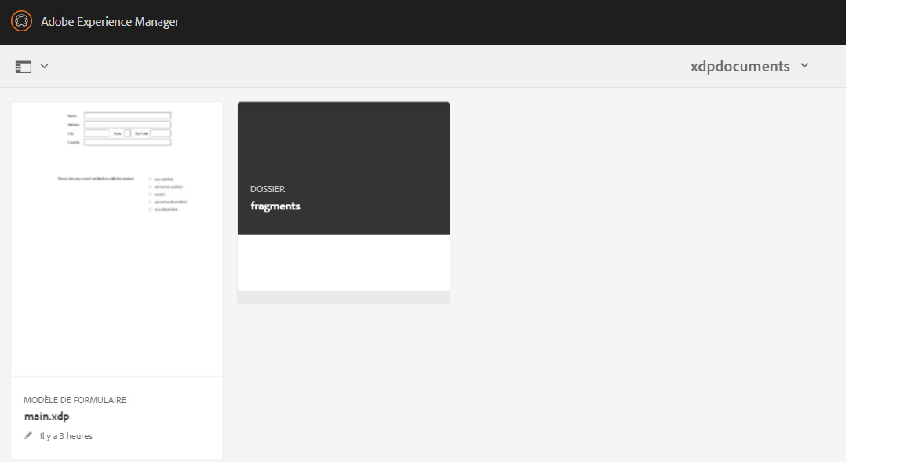

# Génération d’un document pdf avec des fragments à l’aide d’un script ECMA{#developing-with-output-and-forms-services-in-aem-forms}


Dans cet article, nous allons utiliser le service output pour générer des fichiers pdf à l’aide de fragments xdp. Le xdp principal et les fragments résident dans le référentiel crx. Il est important d’imiter la structure de dossiers du système de fichiers dans AEM. Par exemple, si vous utilisez un fragment dans le dossier fragments de votre xdp, vous devez créer un dossier appelé **fragments** sous votre dossier de base dans AEM. Le dossier de base contient votre modèle xdp de base. Par exemple, si votre système de fichiers contient la structure suivante :
* c:\xdptemplates - This will contain your base xdp template
* c:\xdptemplates\fragments - This folder will contain fragments and the main template will reference the fragment as shown below
   .
* Le dossier xdpdocuments contient votre modèle de base et les fragments contenus dans **fragments** folder

Vous pouvez créer la structure requise à l’aide du [Interface utilisateur des formulaires et des documents](http://localhost:4502/aem/forms.html/content/dam/formsanddocuments)

Voici la structure de dossiers de l’exemple xdp qui utilise 2 fragments.



* Service Output : en règle générale, ce service est utilisé pour fusionner des données XML avec un modèle xdp ou un pdf pour générer un pdf aplati. Pour plus d’informations, reportez-vous à la section [javadoc](https://helpx.adobe.com/experience-manager/6-5/forms/javadocs/index.html?com/adobe/fd/output/api/OutputService.html) pour le service Output. Dans cet exemple, nous utilisons des fragments résidant dans le référentiel crx.


Le script ECMA suivant a été utilisé pour générer le PDF. Notez l’utilisation de ResourceResolver et ResourceResolverHelper dans le code. ResourceReolver est nécessaire, car ce code s’exécute en dehors de tout contexte utilisateur.

```java
var inputMap = processorContext.getInputMap();
var itr = inputMap.entrySet().iterator();
var entry = inputMap.entrySet().iterator().next();
var xmlData = inputMap.get(entry.getKey());
log.info("Got XML Data File");

var resourceResolverHelper = sling.getService(Packages.com.adobe.granite.resourceresolverhelper.ResourceResolverHelper);
var aemDemoListings = sling.getService(Packages.com.mergeandfuse.getserviceuserresolver.GetResolver);
log.info("Got service resolver");
var resourceResolver = aemDemoListings.getFormsServiceResolver();
//The ResourceResolverHelper execute's the following code within the context of the resourceResolver 
resourceResolverHelper.callWith(resourceResolver, {call: function()
       {
             //var statement = new Packages.com.adobe.aemfd.docmanager.Document("/content/dam/formsanddocuments/xdpdocuments/main.xdp",resourceResolver);
               var outputService = sling.getService(Packages.com.adobe.fd.output.api.OutputService);
            var pdfOutputOptions = new Packages.com.adobe.fd.output.api.PDFOutputOptions();
            pdfOutputOptions.setContentRoot("crx:///content/dam/formsanddocuments/xdpdocuments");
            pdfOutputOptions.setAcrobatVersion(Packages.com.adobe.fd.output.api.AcrobatVersion.Acrobat_11);
            var dataMergedDocument = outputService.generatePDFOutput("main.xdp",xmlData,pdfOutputOptions);
               //var dataMergedDocument = outputService.generatePDFOutput(statement,xmlData,pdfOutputOptions);
            processorContext.setResult("mergeddocument.pdf",dataMergedDocument);
            log.info("Generated the pdf document with fragments");
      }

 });
```

**Test de l’exemple de package sur votre système**
* [Déploiement du lot DevelopingWithServiceUSer](assets/DevelopingWithServiceUser.jar)
* Ajouter l’entrée **DevelopingWithServiceUser.core:getformsresourceresolver=fd-service** dans la modification du service user mapper, comme illustré dans la capture d’écran ci-dessous.
   
* [Télécharger et importer les exemples de fichiers xdp et de scripts ECMA](assets/watched-folder-fragments-ecma.zip).
Cela crée une structure de dossiers de contrôle dans votre dossier c:/fragmentsandoutputservice .

* [Extraire le fichier de données d’exemple](assets/usingFragmentsSampleData.zip) et placez-le dans le dossier install de votre dossier de contrôle(c:\fragmentsandoutputservice\install)

* Vérifiez le dossier des résultats de la configuration du dossier de contrôle pour le fichier pdf généré.
