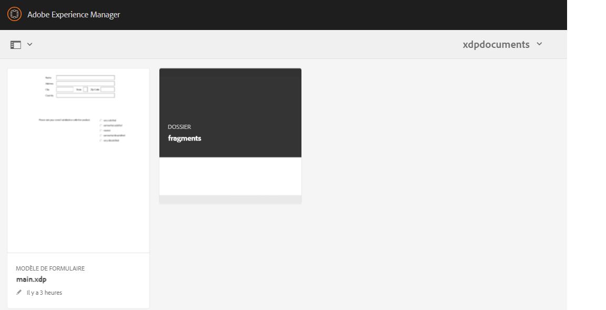
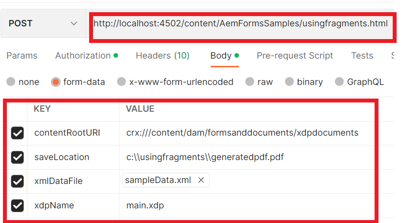

# Générer des documents PDF à l’aide de fragments{#developing-with-output-and-forms-services-in-aem-forms}


Dans cet article, nous allons utiliser le service Output pour générer des fichiers PDF à l’aide de fragments xdp. Le xdp principal et les fragments résident dans le référentiel crx. Il est important d’imiter la structure de dossiers du système de fichiers dans AEM. Par exemple, si vous utilisez un fragment dans le dossier de fragments de votre xdp, vous devez créer un dossier appelé **fragments** sous votre dossier de base dans AEM. Le dossier de base contient votre modèle xdp de base. Par exemple, si votre système de fichiers contient la structure suivante :
* c:\xdptemplates : contient votre modèle xdp de base.
* c:\xdptemplates\fragments : contient des fragments. Le modèle principal fait référence au fragment comme illustré ci-dessous.
  .
* Le dossier xdpdocuments contient votre modèle de base et les fragments du dossier **fragments**.

Vous pouvez créer la structure requise à l’aide de l’[interface utilisateur des formulaires et des documents](http://localhost:4502/aem/forms.html/content/dam/formsanddocuments).

Voici la structure de dossiers de l’exemple d’xdp qui utilise 2 fragments.
.


* Service Output : en règle générale, ce service est utilisé pour fusionner des données XML avec un modèle xdp ou un PDF, afin de générer un PDF aplati. Pour plus d’informations, reportez-vous au [javadoc](https://helpx.adobe.com/experience-manager/6-5/forms/javadocs/index.html?com/adobe/fd/output/api/OutputService.html) pour le service Output. Dans cet exemple, nous utilisons des fragments résidant dans le référentiel crx.


Le code suivant a été utilisé pour inclure des fragments dans le fichier PDF.

```java
System.out.println("I am in using fragments POST.jsp");
// contentRootURI is the base folder. All fragments are relative to this folder
String contentRootURI = request.getParameter("contentRootURI");
String xdpName = request.getParameter("xdpName");
javax.servlet.http.Part xmlDataPart = request.getPart("xmlDataFile");
System.out.println("Got xml file");
String filePath = request.getParameter("saveLocation");
java.io.InputStream xmlIS = xmlDataPart.getInputStream();
com.adobe.aemfd.docmanager.Document xmlDocument = new com.adobe.aemfd.docmanager.Document(xmlIS);
com.adobe.fd.output.api.OutputService outputService = sling.getService(com.adobe.fd.output.api.OutputService.class);

if (outputService == null) {
  System.out.println("The output service is  null.....");
} else {
  System.out.println("The output service is  not null.....");

}
com.adobe.fd.output.api.PDFOutputOptions pdfOptions = new com.adobe.fd.output.api.PDFOutputOptions();
pdfOptions.setAcrobatVersion(com.adobe.fd.output.api.AcrobatVersion.Acrobat_11);

pdfOptions.setContentRoot(contentRootURI);

com.adobe.aemfd.docmanager.Document generatedDocument = outputService.generatePDFOutput(xdpName, xmlDocument, pdfOptions);
generatedDocument.copyToFile(new java.io.File(filePath));
out.println("Document genreated and saved to " + filePath);
```

**Pour tester l’exemple de package sur votre système :**

* [Téléchargez et importez les exemples de fichiers xdp dans AEM.](assets/xdp-templates-fragments.zip)
* [Téléchargez et installez le package à l’aide du gestionnaire de packages AEM.](assets/using-fragments-assets.zip)
* [Les exemples xdp et fragments peuvent être téléchargés ici.](assets/xdptemplates.zip)

**Après avoir installé le package, vous devrez placer sur la liste autorisée les URL suivantes dans le filtre Adobe CSRF Granite.**

1. Suivez les étapes mentionnées ci-dessous pour placer sur la liste autorisée les chemins mentionnés ci-dessus.
1. [Se connecter à configMgr](http://localhost:4502/system/console/configMgr).
1. Recherchez un filtre CSRF Adobe Granite.
1. Ajoutez le chemin suivant dans les sections exclues et enregistrez.
1. /content/AemFormsSamples/usingfragments

Il existe plusieurs façons de tester l’exemple de code. La plus rapide et la plus simple est d’utiliser l’application Postman. Postman vous permet d’envoyer des requêtes POST à votre serveur. Installez l’application Postman sur votre système.
Lancez l’application et saisissez l’URL suivante pour tester l’API d’export des données.

Assurez-vous de sélectionner POST dans la liste déroulante.
http://localhost:4502/content/AemFormsSamples/usingfragments.html.
Spécifiez Autorisation comme authentification de base. Indiquez le nom d’utilisateur ou d’utilisatrice et le mot de passe du serveur AEM.
Accédez à l’onglet Corps et spécifiez les paramètres de requête comme illustré dans l’image ci-dessous.

Cliquez ensuite sur le bouton Envoyer.

[Vous pouvez importer cette collection Postman pour tester l’API.](assets/usingfragments.postman_collection.json)
