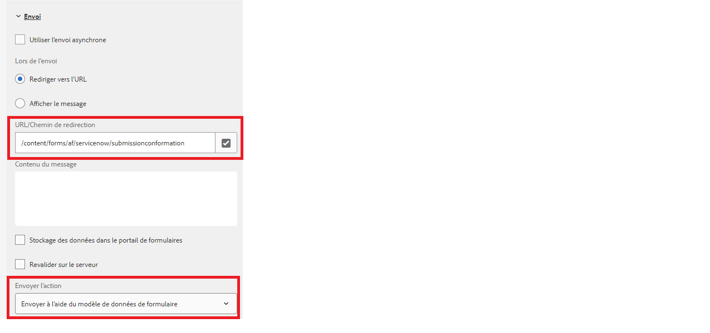

# Personnaliser la page de remerciement

Lorsque vous envoyez un formulaire adaptatif à un point d’entrée REST, vous souhaitez afficher un message de confirmation informant l’utilisateur ou l’utilisatrice que le formulaire a été envoyé. La réponse POST contient des détails sur l’envoi, tels que l’ID d’envoi et un message de confirmation, qui inclut l’ID d’envoi contribuant à une meilleure expérience utilisateur. Cette réponse peut être affichée dans la page de remerciement configurée avec votre formulaire adaptatif.

La capture d’écran suivante montre qu’un formulaire est en cours d’envoi à l’aide de l’action d’envoi de modèle de données de formulaire avec une page de remerciement configurée.



Le POST d’un modèle de données de formulaire renvoie toujours un objet JSON dans la réponse. Ce code JSON est disponible dans l’URL de la page de remerciement sous la forme d’un paramètre de requête appelé _fdmSubmitResult_. Vous pouvez analyser ce paramètre de requête et afficher les éléments JSON dans la page de remerciement.
L’exemple de code suivant analyse la réponse JSON pour extraire la valeur du champ de nombre. Le fichier XML approprié est alors créé et transmis dans la slingRequest pour remplir le formulaire. Ce code est généralement écrit dans le fichier jsp du composant de page associé au modèle de formulaire adaptatif.

```java
if(request.getParameter("fdmSubmitResult")!=null)
{
    String fdmSubmitResult =  request.getParameter("fdmSubmitResult");
    String status = request.getParameter("status");
    com.google.gson.JsonObject jsonObject = com.google.gson.JsonParser.parseString(fdmSubmitResult).getAsJsonObject();
    String caseNumber = jsonObject.get("result").getAsJsonObject().get("number").getAsString();
    slingRequest.setAttribute("data","<afData><afUnboundData><data><caseNumber>"+caseNumber+"</caseNumber><status>"+status+"</status></data></afUnboundData></afData>");
}
```

Il est recommandé de baser votre page de remerciement sur un nouveau modèle de formulaire adaptatif qui vous permet d’écrire le code personnalisé pour extraire la réponse des paramètres de requête.

## Tester la solution

Créez un formulaire adaptatif et configurez-le pour envoyer le formulaire à l’aide de l’action d’envoi de modèle de données de formulaire.
[Déployer l’exemple de modèle de formulaire adaptatif](assets/thank-you-page-template.zip)
Créez un formulaire de remerciement basé sur ce modèle.
Associez la page de remerciement au formulaire principal.
Modifiez le code jsp dans le fichier [createXml.jsp](http://localhost:4502/apps/thank-you-page-template/component/page/thankyoupage/createxml.jsp) pour créer le XML nécessaire pour préremplir le formulaire adaptatif.
Prévisualisez et envoyez votre formulaire adaptatif.
La page de remerciement doit s’afficher et être préremplie avec les données spécifiées dans le code XML.
