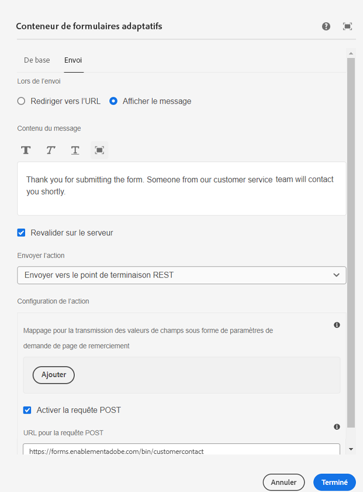

# Afficher le message de remerciement configuré

Un message de remerciement, affiché lors de l’envoi du formulaire, est une façon attentionnée d’exprimer votre reconnaissance à l’utilisateur ou l’utilisatrice qui a rempli et envoyé un formulaire. Il confirme que l’envoi a bien fonctionné et que vous appréciez ce geste. Le message de remerciement est configuré à l’aide de l’onglet d’envoi du conteneur de guide du formulaire adaptatif.



Le message de remerciement configuré est accessible dans le gestionnaire d’événements onSuccess du super-composant AdaptiveForm.
Le code permettant d’associer l’événement onSuccess et le code du gestionnaire d’événements onSuccess sont répertoriés ci-dessous.

```javascript
<AdaptiveForm mappings={extendMappings} onSubmitSuccess={onSuccess} formJson={selectedForm}/>
```

```javascript
const onSuccess=(action) =>{
        let body = action.payload?.body;
        debugger;
        setThankYouMessage(body.thankYouMessage.replace(/<(.|\n)*?>/g, ''));
        console.log("Thank you message "+body.thankYouMessage.replace(/<(.|\n)*?>/g, ''));

      }
```

Le code complet du composant de la fonction Contact est indiqué ci-dessous.

```javascript
import Form from './components/Form';
import PlainText from './components/plainText';
import TextField from './components/TextField';
import Button from './components/Button';
import { useState,useEffect } from "react";
import { AdaptiveForm } from "@aemforms/af-react-renderer";
export default function Contact(){
  
    const [selectedForm, setForm] = useState("");
    const [thankYouMessage, setThankYouMessage] = useState("");
    const [formSubmitted, setFormSubmitted] = useState(false);
  
    const extendMappings = {
        'plain-text' : PlainText,
        'text-input' : TextField,
        'button' : Button,
        'form': Form
      };
     const onSuccess=(action) =>{
        let body = action.payload?.body;
        debugger;
        setFormSubmitted(true);
        setThankYouMessage(body.thankYouMessage.replace(/<(.|\n)*?>/g, ''));
        // Remove any html tags in the thank you message
        console.log("Thank you message "+body.thankYouMessage.replace(/<(.|\n)*?>/g, ''));

      }
      
      const getForm = async () => {
        
        const resp = await fetch('/adobe/forms/af/L2NvbnRlbnQvZm9ybXMvYWYvY29udGFjdHVz');
        // Get the form id manually using the listform api
        let formJSON = await resp.json();
        setForm(formJSON.afModelDefinition)
      }
      useEffect( ()=>{
        getForm()
        

    },[]);
    
    return(
        
        <div>
           {!formSubmitted ?
            (
                <div>
                    <h1>Get in touch with us!!!!</h1>
                    <AdaptiveForm mappings={extendMappings} onSubmitSuccess={onSuccess} formJson={selectedForm}/>
                </div>
            ) :
            (
                <div>
                    <div>{thankYouMessage}</div>
                </div>
            )}
        </div>
      
          
        
    )
}
```

Le code ci-dessus utilise des composants HTML natifs qui sont mappés aux composants du formulaire adaptatif. Par exemple, le composant de formulaire adaptatif de saisie de texte est mappé au composant TextField. Les composants natifs utilisés dans l’article [peuvent être téléchargés ici](./assets/native-components.zip).
