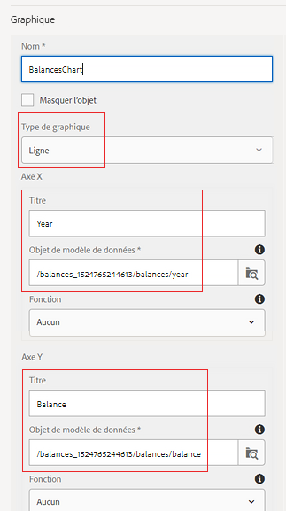

# Configuration d’un graphique en courbes pour votre premier document de communication interactif

Dans cette partie, nous allons ajouter un graphique en courbes au panneau de progression du compte.

Connectez-vous à AEM Forms et accédez à Adobe Experience Manager > Forms > Forms &amp; Documents.

Ouvrez le dossier 401KStatement.

Ouvrez le 401KStatement en mode d&#39;édition.

AEM Forms 6.4 a rendu très simple l&#39;affichage de données à l&#39;aide de différents types de graphiques. Nous allons utiliser un graphique linéaire pour afficher les soldes par année.

Appuyez sur la zone de cible **Progrès du compte** située à droite et cliquez sur l&#39;icône &quot;+&quot; pour afficher la boîte de dialogue Insérer le composant.

Sélectionnez Graphique pour insérer le composant de graphique.

Configurez le composant de graphique en fonction des paramètres de la capture d’écran ci-dessous et enregistrez vos paramètres en cliquant sur l’icône représentant une coche bleue.

Assurez-vous de sélectionner l’élément de modèle de données de formulaire approprié sur les axes x et y.

**Paramètres de graphique en courbes dans AEM Forms 6.4**

**Paramètres de graphique en courbes dans AEM Forms 6.5**

