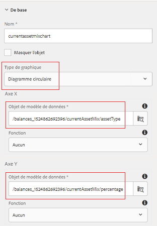
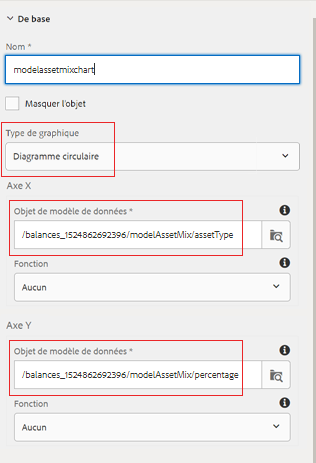

# Configuration du panneau Mix d’investissement

Dans cette partie, nous allons ajouter des diagrammes circulaires pour afficher le mélange actuel et le modèle d&#39;investissement.

* Connectez-vous à AEM Forms et accédez à Adobe Experience Manager > Forms > Forms &amp; Documents.

* Ouvrez le dossier 401KStatement.

* Ouvrez le 401KStatement en mode d&#39;édition.

* Nous ajouterons 2 diagrammes circulaires pour représenter la combinaison actuelle et modèle d&#39;investissement du titulaire de compte.

## Mélange d&#39;actifs actuel {#current-asset-mix}

* Appuyez sur le panneau &quot;CurrentAssetMix&quot; sur le côté droit et sélectionnez l’icône &quot;+&quot; et insérez le composant de texte. Remplacez le texte par défaut par &quot;Current Asset Mix&quot;.

* Appuyez sur le panneau &quot;CurrentAssetMix&quot;, sélectionnez l’icône &quot;+&quot; et insérez le composant de graphique. Appuyez sur le nouveau composant de graphique inséré et cliquez sur l&#39;icône &quot;clé à molette&quot; pour ouvrir la feuille de propriétés de configuration du graphique.

* Définissez les propriétés comme illustré dans l’image ci-dessous. Assurez-vous que le type de graphique est Diagramme circulaire.

* Veuillez noter que l&#39;objet de modèle de données est lié aux axes X et Y. Vous devez sélectionner l’élément racine du modèle de données de formulaire, puis approfondir l’analyse pour sélectionner l’élément approprié.

* 

## Mélange de ressources de modèle {#model-asset-mix}

* Appuyez sur le panneau &quot;RecomendedAssetMix&quot; sur le côté droit et sélectionnez l&#39;icône &quot;+&quot; et insérez le composant de texte. Remplacez le texte par défaut par &quot;Modèle Asset Mix&quot;.

* Appuyez sur le panneau &quot;RecomendedAssetMix&quot; et sélectionnez l&#39;icône &quot;+&quot; et insérez le composant de graphique. Appuyez sur le nouveau composant de graphique inséré et cliquez sur l&#39;icône &quot;clé à molette&quot; pour ouvrir la feuille de propriétés de configuration du graphique.

* Définissez les propriétés comme illustré dans l’image ci-dessous. Assurez-vous que le type de graphique est Diagramme circulaire.

* Veuillez noter que l&#39;objet de modèle de données est lié aux axes X et Y. Vous devez sélectionner l’élément racine du modèle de données de formulaire, puis approfondir l’analyse pour sélectionner l’élément approprié.

* 

