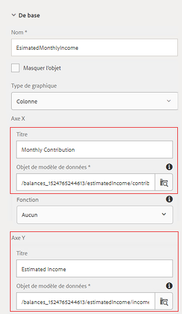

# Configuration du panneau Outlook de retraite{#configuring-retirement-outlook-panel}

* Voici la partie 10 d&#39;un didacticiel en plusieurs étapes pour créer votre premier document de communications interactives. Dans cette partie, nous allons configurer le panneau Perspectives de retraite en ajoutant des composants de texte et de graphique.

* Connectez-vous à AEM Forms et accédez à Adobe Experience Manager > Forms > Forms &amp; Documents.

* Ouvrez le dossier 401KStatement.

* Ouvrez le document 401KStatement en mode d’édition.

**Configuration de la zone de cible du panneau gauche**

* Appuyez sur la zone de cible LeftPanel sur la droite et cliquez sur l’icône &quot;+&quot; pour ouvrir la boîte de dialogue d’insertion de composant.

* Insérez le composant Texte.

* Appuyez délicatement sur le nouveau composant de texte ajouté pour afficher la barre d’outils des composants.

* Sélectionnez l&#39;icône représentant un crayon pour modifier le texte par défaut.

* Remplacez le texte par défaut par &quot;**Votre perspective de revenu de retraite&quot;**

**Configuration de la zone de cible du panneau droit**

* Appuyez sur la zone de cible du panneau de droite sur la droite et cliquez sur l’icône &quot;+&quot; pour ouvrir la boîte de dialogue d’insertion du composant.

* Insérez le composant Texte.

* Appuyez doucement sur le nouveau composant de texte ajouté pour afficher la barre d’outils des composants.

* Sélectionnez l&#39;icône représentant un crayon pour modifier le texte par défaut.

* Remplacez le texte par défaut par &quot;**Estimation du revenu mensuel de retraite&quot;**

## Fragment de Document de l&#39;évolution du revenu de retraite Ajouté {#add-retirement-income-outlook-document-fragment}

* Cliquez sur l’icône Ressources et appliquez le filtre pour afficher les ressources de type &quot;Document Fragments&quot;. Faites glisser un fragment de document RetirementIncomeOutlook sur la zone cible du panneau de gauche.

* Vous pouvez faire référence [à cette page](https://helpx.adobe.com/experience-manager/kt/forms/using/interactive-communication-web-channel-aem-forms/9.html) lors de l’ajout d’un fragment de document dans les zones de contenu.

## Graphique du revenu mensuel estimé à Ajouter {#adding-estimated-monthly-income-chart}

* Cliquez sur la zone de cible du panneau de droite sur la droite. Cliquez sur l&#39;icône &quot;+&quot; pour insérer le composant de graphique. Nous utiliserons un graphique à colonnes pour afficher le revenu mensuel estimé. Appuyez délicatement sur le composant de graphique nouvellement inséré. Sélectionnez l&#39;icône &quot;clé à molette&quot; pour ouvrir la feuille de propriétés de configuration.Configurez le graphique avec les propriétés suivantes, comme le montre la capture d&#39;écran ci-dessous.

**AEM Forms 6.4 - Configuration du graphique à colonnes des revenus mensuels estimés**

**AEM Forms 6.5 - Configuration du graphique à colonnes des revenus mensuels estimés**

