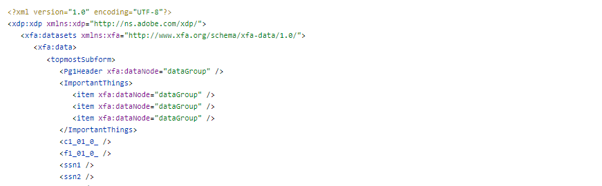

# Présentation

La première étape consiste à créer un schéma basé sur les données qui seront utilisées pour remplir le formulaire adaptatif.

## XFA repose sur un schéma

Utilisez le schéma pour créer votre formulaire adaptatif.

## XFA ne repose pas sur un schéma

* Ouvrez le fichier XDP dans AEM Forms Designer.
* Cliquez sur Fichier | Propriétés du formulaire | Aperçu.
* Cliquez sur Générer les données d’aperçu.
* Cliquez sur Générer.
* Fournissez un nom de fichier pertinent, tel que `form-data.xml`.

Vous pouvez utiliser n’importe quel outil en ligne gratuit pour [générer le XSD](https://www.freeformatter.com/xsd-generator.html) à partir des données xml générées à l’étape précédente.

Créez un formulaire adaptatif basé sur le schéma de l’étape précédente.

>[!NOTE]
>Il est toujours recommandé d’examiner les données générées lors de l’envoi du formulaire adaptatif. Vous aurez ainsi une bonne idée du format XML des données qui doivent être fusionnées au formulaire adaptatif.

Données envoyées d’un formulaire adaptatif

Données exportées du PDF

À partir des données exportées, vous devez extraire le nœud **_topmostSubform_** avec les espaces de noms appropriés conservés pour fusionner les données avec le formulaire adaptatif.

## Étapes suivantes

[Créer un service OSGi](./create-osgi-service.md)
