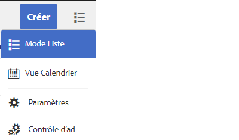

# Boîte de réception AEM

AEM boîte de réception regroupe les notifications et les tâches provenant de divers composants d’AEM, y compris les workflows Forms. Lorsqu’un processus Forms contenant une étape Affecter une tâche est déclenché, l’application associée est répertoriée comme une tâche dans la boîte de réception de la personne désignée.

L’interface utilisateur de la boîte de réception fournit la liste et les vues de calendrier pour afficher les tâches. Vous pouvez également configurer les paramètres d’affichage. Vous pouvez filtrer les tâches en fonction de divers paramètres.

Vous pouvez personnaliser une boîte de réception de Experience Manager pour modifier le titre par défaut d’une colonne, réorganiser la position d’une colonne et afficher des colonnes supplémentaires en fonction des données d’un workflow.

>[!NOTE]
>
>Vous devez être membre des administrateurs ou des administrateurs de workflow pour personnaliser les colonnes de la boîte de réception.

## Personnalisation des colonnes

[Lancer AEM boîte de réception](http://localhost:4502/aem/inbox)
Ouvrez le contrôle d’administration en cliquant sur le _Mode Liste_ puis en sélectionnant _Contrôle d’administration_ comme illustré dans la capture d’écran ci-dessous

Dans l’interface utilisateur de personnalisation des colonnes, vous pouvez effectuer les opérations suivantes :

* Supprimer des colonnes
* Réorganiser les colonnes
* Renommer les colonnes

## Personnalisation de l’identité graphique

Dans la personnalisation de la marque, vous pouvez effectuer les opérations suivantes :

* Ajout du logo de votre organisation
* Personnaliser le texte d’en-tête
* Personnalisation du lien d’aide
* Masquer les options de navigation

