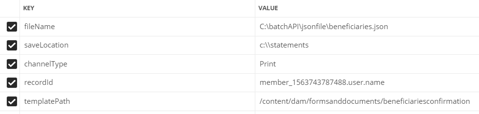

# API de lot

Vous pouvez utiliser l’API de traitement par lots pour produire plusieurs communications interactives à partir d’un modèle. Le modèle est une communication interactive sans données. L’API de traitement par lots combine les données avec un modèle pour produire une communication interactive. L&#39;API est utile pour la production de masse de communications interactives. Par exemple, factures de téléphone, relevés de carte de crédit pour plusieurs clients.

[En savoir plus sur l’API de génération de lot](https://docs.adobe.com/content/help/en/experience-manager-65/forms/interactive-communications/generate-multiple-interactive-communication-using-batch-api.html)

Cet article fournit des exemples de ressources pour générer des documents de communications interactives à l’aide de l’API de lot.

## Génération de lot à l’aide du dossier de contrôle

* Importez le [modèle de communication interactive](assets/Beneficiaries-confirmation.zip) dans votre serveur AEM Forms.
* Importez la configuration du dossier de contrôle . Vous créez ainsi un dossier intitulé `batchAPI` dans votre lecteur C.

**Si vous exécutez AEM Forms sur un système d’exploitation non Windows, suivez les 3 étapes mentionnées ci-dessous :**

1. [Ouvrir le dossier de contrôle](http://localhost:4502/libs/fd/core/WatchfolderUI/content/UI.html)
2. Sélectionnez BatchAPIWatchedFolder et cliquez sur Modifier.
3. Modifiez le chemin pour qu’il corresponde à votre système d’exploitation.

* Téléchargez et extrayez le contenu du [fichier zip](assets/jsonfile.zip). Le fichier zip contient le dossier `jsonfile` qui contient le fichier `beneficiaries.json`. Ce fichier a les données pour générer 3 documents.

* Déposez le dossier `jsonfile` dans le dossier input de votre dossier de contrôle.
* Une fois que le dossier est sélectionné pour traitement, vérifiez le dossier de résultats de votre dossier de contrôle. 3 fichiers PDF devraient être générés

## Génération de lot à l’aide de requêtes REST

Vous pouvez appeler l’[API par lot](https://helpx.adobe.com/fr/experience-manager/6-5/forms/javadocs/index.html) par le biais de requêtes REST. Vous pouvez exposer les points de fin REST pour que d’autres applications appellent l’API pour générer des documents.
Les exemples de ressources fournis exposent le point de terminaison REST pour la génération de documents de communication interactive. La servlet accepte les paramètres suivants :

* fileName : emplacement du fichier de données sur le système de fichiers.
* templatePath - Chemin d’accès au modèle IC
* saveLocation - Emplacement pour enregistrer les documents générés sur le système de fichiers
* channelType - Impression, Web ou les deux
* recordId - chemin d’accès JSON à l’élément pour définir le nom d’une communication interactive

La capture d&#39;écran suivante montre les paramètres et leurs valeurs.

## Déployer des exemples de ressources sur votre serveur

* Importez [ICTemplate](assets/ICTemplate.zip) à l&#39;aide de [gestionnaire de package](http://localhost:4502/crx/packmgr/index.jsp).
* Importer [Gestionnaire d’envoi personnalisé](assets/BatchAPICustomSubmit.zip) à l’aide de [gestionnaire de package](http://localhost:4502/crx/packmgr/index.jsp)
* Importez [Formulaire adaptatif](assets/BatchGenerationAPIAF.zip) à l’aide de l’[interface Forms et Document](http://localhost:4502/aem/forms.html/content/dam/formsanddocuments)
* Déployez et début [Groupe OSGI personnalisé](assets/batchgenerationapi.batchgenerationapi.core-1.0-SNAPSHOT.jar) à l’aide de [la console Web Felix](http://localhost:4502/system/console/bundles)
* [Déclencher la génération de lots en envoyant le formulaire](http://localhost:4502/content/dam/formsanddocuments/batchgenerationapi/jcr:content?wcmmode=disabled)
