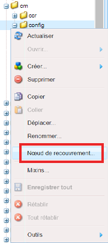
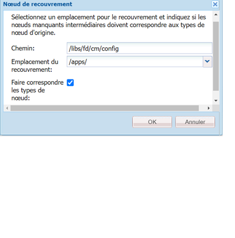
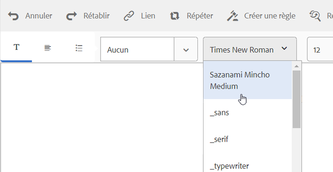

# Personnalisation de l’éditeur de texte{#customize-text-editor}

## Présentation {#overview}

Vous pouvez personnaliser l’éditeur de texte utilisé pour créer des fragments de document afin d’ajouter davantage de polices et de tailles de police. Ces polices comprennent des polices anglaises et non anglaises, comme les polices japonaises.

Vous pouvez personnaliser pour modifier les paramètres de police suivants :

* Famille et taille de police
* Propriétés telles que la hauteur et l’interlettrage
* Valeurs par défaut de la famille et de la taille de police, de la hauteur, de l’interlettrage et du format de date
* Retraits de puces

Pour ce faire, vous devez :

1. [Personnaliser des polices en modifiant le fichier tbxeditor-config.xml dans CRX](#customizefonts)
1. [Ajouter des polices personnalisées sur l’ordinateur client](#addcustomfonts)

## Personnaliser des polices en modifiant le fichier tbxeditor-config.xml dans CRX {#customizefonts}

Pour personnaliser les polices en modifiant le fichier tbxeditor-config.xml, procédez comme suit :

1. Accédez à `https://'[server]:[port]'/[ContextPath]/crx/de` et connectez-vous en tant qu’administrateur.
1. Créez un dossier appelé config dans le dossier des applications dont le chemin ou la structure sont semblables au dossier de configuration (situé dans libs/fd/cm/config) en suivant les étapes ci-dessous :

   1. Faites un clic droit sur le dossier des éléments à l’emplacement suivant puis sélectionnez **Nœud de recouvrement** : 

      `/libs/fd/cm/config`

      

   1. Assurez-vous que la boîte de dialogue du nœud de recouvrement possède les valeurs suivantes :

      **Chemin d’accès :** /libs/fd/cm/config

      **Emplacement :** /apps/

      **Faire correspondre les types de nœud :** sélectionné

      

   1. Cliquez sur **OK**. La structure du dossier est créée dans le dossier des applications.

   1. Cliquez sur **Enregistrer tout**.

1. Créez une copie du fichier tbxeditor-config.xml dans le dossier de configuration que vous venez de créer, en procédant comme suit :

   1. Cliquez avec le bouton droit sur le fichier tbxeditor-config.xml dans libs/fd/cm/config et sélectionnez **Copier**.
   1. Cliquez avec le bouton droit sur le dossier suivant et sélectionnez **Coller**.

      `apps/fd/cm/config`

   1. Par défaut, le nom du fichier collé est : `copy of tbxeditor-config.xml.`Renommer le fichier en `tbxeditor-config.xml` et cliquez sur **Enregistrer tout**.

1. Ouvrez le fichier tbxeditor-config.xml dans apps/fd/cm/config, puis effectuez les modifications requises.

   1. Cliquez deux fois sur le fichier tbxeditor-config.xml dans apps/fd/cm/config. Le fichier s’ouvre.

      ```xml
      <editorConfig>
         <bulletIndent>0.25in</bulletIndent>
      
         <defaultDateFormat>DD-MM-YYYY</defaultDateFormat>
      
         <fonts>
            <default>Times New Roman</default>
            <font>_sans</font>
            <font>_serif</font>
            <font>_typewriter</font>
            <font>Arial</font>
            <font>Courier</font>
            <font>Courier New</font>
            <font>Geneva</font>
            <font>Georgia</font>
            <font>Helvetica</font>
            <font>Tahoma</font>
            <font>Times New Roman</font>
            <font>Times</font>
            <font>Verdana</font>
         </fonts>
      
         <fontSizes>
            <default>12</default>
            <fontSize>8</fontSize>
            <fontSize>9</fontSize>
            <fontSize>10</fontSize>
            <fontSize>11</fontSize>
            <fontSize>12</fontSize>
            <fontSize>14</fontSize>
            <fontSize>16</fontSize>
            <fontSize>18</fontSize>
            <fontSize>20</fontSize>
            <fontSize>22</fontSize>
            <fontSize>24</fontSize>
            <fontSize>26</fontSize>
            <fontSize>28</fontSize>
            <fontSize>36</fontSize>
            <fontSize>48</fontSize>
            <fontSize>72</fontSize>
         </fontSizes>
      
         <lineHeights>
            <default>2</default>     
            <lineHeight>2</lineHeight>
            <lineHeight>3</lineHeight>
            <lineHeight>4</lineHeight>
            <lineHeight>5</lineHeight>
            <lineHeight>6</lineHeight>
            <lineHeight>7</lineHeight>
            <lineHeight>8</lineHeight>
            <lineHeight>9</lineHeight>
            <lineHeight>10</lineHeight>
            <lineHeight>11</lineHeight>
            <lineHeight>12</lineHeight>
            <lineHeight>13</lineHeight>
            <lineHeight>14</lineHeight>
            <lineHeight>15</lineHeight>
            <lineHeight>16</lineHeight>
         </lineHeights>
      
         <letterSpacings>
            <default>0</default>
            <letterSpacing>0</letterSpacing>
            <letterSpacing>1</letterSpacing>
            <letterSpacing>2</letterSpacing>
            <letterSpacing>3</letterSpacing>
            <letterSpacing>4</letterSpacing>
            <letterSpacing>5</letterSpacing>
            <letterSpacing>6</letterSpacing>
            <letterSpacing>7</letterSpacing>
            <letterSpacing>8</letterSpacing>
            <letterSpacing>9</letterSpacing>
            <letterSpacing>10</letterSpacing>
            <letterSpacing>11</letterSpacing>
            <letterSpacing>12</letterSpacing>
            <letterSpacing>13</letterSpacing>
            <letterSpacing>14</letterSpacing>
            <letterSpacing>15</letterSpacing>
            <letterSpacing>16</letterSpacing>
         </letterSpacings>
      </editorConfig>
      ```

   1. Effectuez les modifications nécessaires dans le fichier pour modifier les éléments suivants dans les paramètres de la police : 

      * Ajouter ou supprimer la famille et la taille de police
      * Propriétés telles que la hauteur et l’interlettrage
      * Valeurs par défaut de la famille et de la taille de police, de la hauteur, de l’interlettrage et du format de date
      * Retraits de puces

      Par exemple, pour ajouter une police japonaise appelée Sazanami Mincho Medium, vous devez effectuer la saisie suivante dans le fichier XML : `<font>Sazanami Mincho Medium</font>`. Cette police doit également être installée sur l’ordinateur client utilisé pour accéder à et travailler avec la personnalisation de la police. Pour plus d’informations, reportez-vous à la section [Ajouter des polices personnalisées sur l’ordinateur client](#addcustomfonts).

      Vous pouvez également modifier les valeurs par défaut de divers aspects du texte et, en supprimant les entrées, supprimer les polices de l’éditeur de texte.

   1. Cliquez sur **Enregistrer tout**.

## Ajouter des polices personnalisées sur l’ordinateur client {#addcustomfonts}

Lorsque vous accédez à une police dans l’éditeur de texte des communications interactives, elle doit être présente sur l’ordinateur client que vous utilisez pour accéder à la communication interactive. Pour pouvoir utiliser une police personnalisée dans l’éditeur de texte, vous devez d’abord l’installer sur l’ordinateur client.

Pour plus d’informations sur l’installation des polices, consultez les articles suivants :

* [Installation et désinstallation de polices sous Windows](https://windows.microsoft.com/fr-fr/windows-vista/install-or-uninstall-fonts)
* [Principes de base sur Mac : livre des polices](https://support.apple.com/fr-fr/HT201749)

## Accéder à la personnalisation des polices {#access-font-customizations}

Après avoir modifié les polices dans le fichier tbxeditor-config.xml dans CRX et installé les polices requises sur l’ordinateur client utilisé pour accéder à AEM Forms, les modifications apparaissent dans l’éditeur de texte.

Par exemple, la police Sazanami Mincho Medium ajoutée lors de la procédure [Personnaliser des polices en modifiant le fichier tbxeditor-config.xml dans CRX](#customizefonts) apparaît dans l’interface utilisateur de l’éditeur de texte comme dans la capture d’écran suivante :



>[!NOTE]
>
>Pour afficher du texte en japonais, vous devez d’abord le saisir avec des caractères japonais. L’application d’une police japonaise personnalisée formate uniquement le texte d’une certaine manière. L’application d’une police japonaise personnalisée ne remplace pas les caractères anglais ou autres par des caractères japonais.
