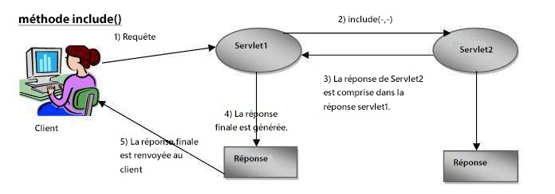
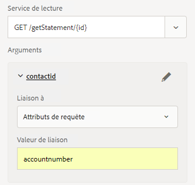

# Diffusion de courriel du Document de Canal Web

Une fois que vous avez défini et testé votre document de communication interactif de canal Web, vous avez besoin d’un mécanisme de diffusion pour fournir le document de canal Web au destinataire.

Dans cet article, nous considérons le courriel comme un mécanisme de diffusion pour le document de canal Web. Le destinataire obtient un lien vers le document de canal Web par courriel.En cliquant sur le lien, l&#39;utilisateur est invité à s&#39;authentifier et le document de canal Web est renseigné avec les données propres à l&#39;utilisateur connecté.

Examinons le fragment de code suivant. Ce code fait partie de GET.jsp qui est déclenché lorsque l’utilisateur clique sur le lien dans le courrier électronique pour vue au document du canal Web. Nous obtenons l&#39;utilisateur connecté à l&#39;aide de jackrabbit UserManager. Une fois que l’utilisateur est connecté, nous obtenons la valeur de la propriété accountNumber associée au profil de l’utilisateur.

Ensuite, nous associons la valeur accountNumber à une clé nommée accountnumber dans le mappage. La clé **accountnumber** est définie dans le module de données de formulaire comme attribut de requête. La valeur de cet attribut est transmise en tant que paramètre d’entrée à la méthode de service de lecture Modal de données de formulaire.

Ligne 7 : Nous envoyons la demande reçue à une autre servlet, en fonction du type de ressource identifié par l&#39;URL du Document de communication interactive. La réponse renvoyée par cette seconde servlet est incluse dans la réponse de la première servlet.

```java
org.apache.jackrabbit.api.security.user.UserManager um = ((org.apache.jackrabbit.api.JackrabbitSession) session).getUserManager();
org.apache.jackrabbit.api.security.user.Authorizable loggedinUser = um.getAuthorizable(session.getUserID());
String accountNumber = loggedinUser.getProperty("profile/accountNumber")[0].getString();
map.put("accountnumber",accountNumber);
slingRequest.setAttribute("paramMap",map);
CustomParameterRequest wrapperRequest = new CustomParameterRequest(slingRequest,"GET");
wrapperRequest.getRequestDispatcher("/content/forms/af/401kstatement/irastatement/channels/web.html").include(wrapperRequest, response);
```



Représentation visuelle du code de ligne 7



Attribut de demande défini pour le service de lecture du module de données de formulaire


[Exemple de package](assets/webchanneldelivery.zip) AEM.
