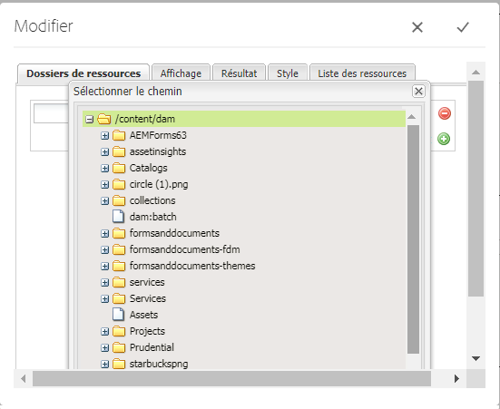
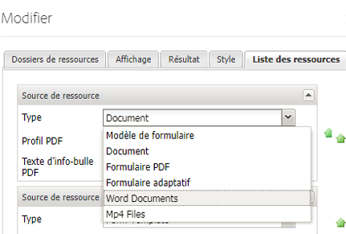

# Enregistrement des types de ressources personnalisés {#registering-custom-asset-types}

Activation des types de fichier personnalisés pour la mise en vente dans AEMForms Portal

>[!NOTE]
>
>Assurez-vous d&#39;avoir AEM 6.3 avec SP1 et l&#39;Ajoute AEM Forms correspondante sur installé. Cette fonctionnalité fonctionne uniquement avec AEM Forms 6.3 SP1 et versions ultérieures.

## Spécifier le chemin de base {#specify-base-path}

Le chemin de base est le chemin de référentiel de niveau supérieur qui comprend tous les actifs qu’un utilisateur peut souhaiter liste dans le composant search &amp; lister. Si vous le souhaitez, l’utilisateur peut également configurer des emplacements spécifiques dans le chemin de base à partir de la boîte de dialogue de modification des composants, de sorte que la recherche soit déclenchée à des emplacements spécifiques plutôt que de rechercher tous les noeuds dans le chemin de base. Par défaut, le chemin de base est utilisé comme critère de chemin de recherche pour récupérer les ressources, sauf si l’utilisateur configure un ensemble de chemins spécifiques à partir de cet emplacement. Il est important d&#39;avoir une valeur optimale de ce chemin pour effectuer une recherche performante. La valeur par défaut du chemin de base reste **_/content/dam/formsanddocuments_**, car toutes les ressources AEM Forms résident dans **_/content/dam/formsanddocuments._**

Procédure de configuration du chemin de base

1. Connexion à crx
1. Accédez à **/libs/fd/fp/extensions/querybuilder/basepath**

1. Cliquez sur &quot;Noeud d’incrustation&quot; dans la barre d’outils.
1. Assurez-vous que l’emplacement de l’incrustation est &quot;/apps/&quot;
1. Cliquez sur OK
1. Cliquez sur Enregistrer
1. Accédez à la nouvelle structure créée à l’adresse **/apps/fd/fp/extensions/querybuilder/basepath**

1. Remplacez la valeur de la propriété path par **&quot;/content/dam&quot;**.
1. Cliquez sur Enregistrer

En spécifiant la propriété path sur **&quot;/content/dam&quot;**, vous définissez fondamentalement le chemin de base sur /content/dam. Vous pouvez le vérifier en ouvrant le composant Search and Lister.

## Enregistrer les types de ressource personnalisés {#register-custom-asset-types}

Nous avons ajouté un nouvel onglet (Liste des ressources) dans le composant de recherche et de liste. Cet onglet vous permet de liste des types de fichier prêts à l&#39;emploi et des types de fichier supplémentaires que vous configurez. Par défaut, les types de ressource suivants sont répertoriés

1. Formulaires adaptatifs
1. Modèles de formulaire
1. Formulaires PDF
1. Document(PDF statiques)

**Procédure d’enregistrement du type de ressource personnalisé**

1. Créez un noeud d’incrustation de **/libs/fd/fp/extensions/querybuilder/assettypes**

1. Définir l’emplacement de l’incrustation sur &quot;/apps&quot;
1. Accédez à la nouvelle structure créée dans **/apps/fd/fp/extensions/querybuilder/assettypes **

1. Sous cet emplacement, créez un noeud &#39;nt:unstructured&#39; pour le type à enregistrer, nommez le noeud **mp4files. Ajouter les deux propriétés suivantes à ce noeud mp4files**

   1. Ajoutez la propriété jcr:title pour spécifier le nom d’affichage du type de ressource. Définissez la valeur de jcr:title sur &quot;Fichiers Mp4&quot;.
   1. Ajoutez la propriété &quot;type&quot; et définissez sa valeur sur &quot;videos&quot;. Il s’agit de la valeur que nous utilisons dans notre modèle pour liste des fichiers de type vidéos. Enregistrez vos modifications.

1. Créez un noeud de type &quot;nt:unstructured&quot; sous mp4files. Nommer ce noeud &quot;critères de recherche&quot;
1. Ajoutez un ou plusieurs filtres sous critères de recherche. Supposons que l’utilisateur souhaite disposer d’un filtre de recherche pour liste des fichiers mp4Files dont le type MIME est &quot;video/mp4&quot;. Vous pouvez le faire ici.
1. Créez un noeud de type &quot;nt:unstructured&quot; sous les critères de recherche de noeud. Nommer ce noeud &quot;filetypes&quot;
1. Ajouter les 2 propriétés suivantes à ce noeud &quot;filetypes&quot;

   1. name: ./jcr:content/metadata/dc:format
   1. value: vidéo/mp4

1. Cela signifie que les fichiers dont la propriété dc:format est égale à video/mp4 sont considérés comme un type de fichier &quot;Vidéos Mp4&quot;. Vous pouvez utiliser toute propriété répertoriée sur le noeud &quot;jcr:content/metadata&quot; pour les critères de recherche.

1. **Veillez à enregistrer votre travail.**

Après avoir exécuté les étapes ci-dessus, le nouveau type de ressource (Fichiers Mp4) s’affiche en début dans la liste déroulante des types de ressource du composant Search and Lister, comme illustré ci-dessous.

[Si vous rencontrez des problèmes pour que cela fonctionne, vous pouvez importer le package suivant.](assets/assettypeskt1.zip) Deux types de fichier personnalisés sont définis pour le package. Fichiers Mp4 et documents Word. Nous vous conseillons de jeter un oeil à **/apps/fd/fp/extensions/querybuilder/assettypes**

[Installez le package](assets/customportalpage.zip) customeportal. Ce package contient un exemple de page de portail. Cette page sera utilisée dans la partie 2 de ce tutoriel.

