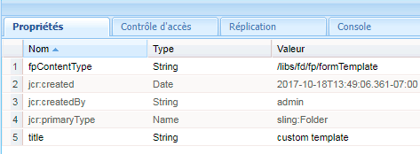
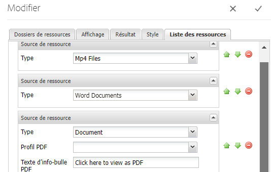

# Liste des types de ressources personnalisés en AEM Forms {#listing-custom-asset-types-in-aem-forms}

## Création d&#39;un modèle personnalisé {#creating-custom-template}


Aux fins de cet article, nous allons créer un modèle personnalisé pour afficher les types de ressource personnalisés et les types de ressource prêtes à l&#39;emploi sur la même page. Pour créer un modèle personnalisé, suivez les instructions ci-dessous.

1. Créez un sling : sous /apps. Nommez-le &quot;composant myportal&quot;.
1. Ajoutez une propriété « fpContentType ». Définissez sa valeur sur &quot;**/libs/fd/ fp/formTemplate&quot;.**
1. Ajoutez une propriété &quot;title&quot; et définissez sa valeur sur &quot;modèle personnalisé&quot;. Nom affiché dans la liste déroulante du composant Search and Lister
1. Créez un &quot;template.html&quot; sous ce dossier. Ce fichier contiendra le code à mettre en forme et affichera les différents types de fichier.



Le code suivant liste les différents types de ressources à l’aide du composant search and lister. Nous créons des éléments html distincts pour chaque type de ressource, comme indiqué par la balise data-type = &quot;videos&quot;. Pour le type de fichier &quot;vidéos&quot;, nous utilisons l’élément &lt;video> pour lire la vidéo en ligne. Pour le type de fichier &quot;documents Word&quot;, nous utilisons un marqueur html différent.

```html
<div class="__FP_boxes-container __FP_single-color">
   <div  data-repeatable="true">
     <div class = "__FP_boxes-thumbnail" style="float:left;margin-right:20px;" data-type = "videos">
   <video width="400" controls>
       <source src="${path}" type="video/mp4">
    </video>
         <h3 class="__FP_single-color" title="${name}" tabindex="0">${name}</h3>
     </div>
     <div class="__FP_boxes-thumbnail" style="float:left;margin-right:20px;" data-type = "worddocuments">
       <a href="/assetdetails.html${path}" target="_blank">
           
          </a>
          <h3 class="__FP_single-color" title="${name}" tabindex="0">${name}</h3>
     </div>
  <div class="__FP_boxes-thumbnail" style="float:left;margin-right:20px;" data-type = "xfaForm">
       <a href="/assetdetails.html${path}" target="_blank">
           
          </a>
          <h3 class="__FP_single-color" title="${name}" tabindex="0">${name}</h3>
                <a href="{formUrl}"></a><p>

     </div>
  <div class="__FP_boxes-thumbnail" style="float:left;margin-right:20px;" data-type = "printForm">
       <a href="/assetdetails.html${path}" target="_blank">
           
          </a>
          <h3 class="__FP_single-color" title="${name}" tabindex="0">${name}</h3>
                <a href="{pdfUrl}"></a><p>
     </div>
   </div>
</div>
```

>[!NOTE]
>
>Ligne 11 - Veuillez modifier l&#39;image src pour pointer vers une image de votre choix dans DAM.
>
>Pour liste du Forms adaptatif dans ce modèle, créez une nouvelle balise div et définissez son attribut de type de données sur &quot;guide&quot;. Vous pouvez copier et coller la balise div dont data-type=&quot;printForm&quot; et définir le type de données de la balise div récemment copiée sur &quot;guide&quot;.

## Configurer le composant Search And Lister {#configure-search-and-lister-component}

Une fois que nous avons défini le modèle personnalisé, nous devons maintenant associer ce modèle personnalisé au composant Search and Lister. Pointez votre navigateur [sur cette URL ](http://localhost:4502/editor.html/content/AemForms/CustomPortal.html).

Passez en mode Création et configurez le système de paragraphes pour inclure le composant Search And Lister dans le groupe de composants autorisés. Le composant Search and Lister fait partie du groupe Document Services.

Passez en mode d&#39;édition et ajoutez le composant Search and Lister à ParSys.

Ouvrez les propriétés de configuration du composant Search and Lister. Assurez-vous que l’onglet &quot;Dossiers de ressources&quot; est sélectionné. Sélectionnez les dossiers à partir desquels vous souhaitez liste les fichiers dans le composant de recherche et de liste. Aux fins du présent article, j&#39;ai choisi

* /content/dam/VideosAndWordDocuments
* /content/dam/formsanddocuments/assettypes


Appuyez sur l’onglet &quot;Affichage&quot;. Ici, vous choisissez le modèle pour lequel afficher les ressources dans le composant de recherche et de liste.

Sélectionnez &quot;modèle personnalisé&quot; dans la liste déroulante, comme illustré ci-dessous.


Configurez les types de ressources que vous souhaitez liste dans Portal. Pour configurer les types de l’onglet des ressources sur &quot;Liste des ressources&quot; et les types de ressources. Dans cet exemple, nous avons configuré les types de ressources suivants

1. Fichiers MP4
1. Documents de mots
1. Document (type de ressource prête à l&#39;emploi)
1. Modèle de formulaire (type de ressource prête à l’emploi)

La capture d’écran suivante montre les types de fichier configurés pour la mise en vente



Maintenant que vous avez configuré votre composant Search and Lister Portal, il est temps de voir la liste en action. Pointez votre navigateur [sur cette URL ](http://localhost:4502/content/AemForms/CustomPortal.html?wcmmode=disabled). Les résultats doivent ressembler à l’image illustrée ci-dessous.

>[!NOTE]
>
>Si votre portail répertorie les types de ressource personnalisés sur un serveur de publication, veillez à accorder l’autorisation &quot;lecture&quot; à l’utilisateur &quot;fd-service&quot; au noeud **/apps/fd/fp/extensions/querybuilder**.


[ressourcesVeuillez télécharger et installer ce package à l&#39;aide du gestionnaire de packages.](assets/customassettypekt1.zip) Il contient des exemples de documents mp4, de mots et de fichiers xdp qui seront utilisés comme types de ressource pour la liste à l’aide du composant search and lister.
