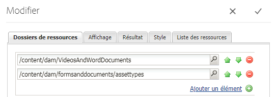

# Liste des types de ressources personnalisés dans AEM Forms {#listing-custom-asset-types-in-aem-forms}

## Création d’un modèle personnalisé {#creating-custom-template}


Pour les besoins de cet article, nous allons créer un modèle personnalisé pour afficher les types de ressources personnalisés et les types de ressources prêts à l’emploi sur la même page. Pour créer un modèle personnalisé, suivez les instructions suivantes :

1. Créez un sling : sous /apps. Nommez-le &quot;myportalcomponent&quot;
1. Ajoutez une propriété « fpContentType ». Définissez sa valeur sur &quot;**/libs/fd/ fp/formTemplate&quot;.**
1. Ajoutez une propriété &quot;title&quot; et définissez sa valeur sur &quot;modèle personnalisé&quot;. Il s’agit du nom qui s’affiche dans la liste déroulante du composant Search and Lister.
1. Créez un &quot;template.html&quot; sous ce dossier. Ce fichier contient le code à mettre en forme et affiche les différents types de ressources.


Le code suivant répertorie les différents types de ressources à l’aide du composant de recherche et de liste. Nous créons des éléments HTML distincts pour chaque type de ressource, comme illustré par la balise data-type = &quot;videos&quot;. Pour le type de ressource &quot;vidéos&quot;, nous utilisons l’élément &lt;video> pour lire la vidéo en ligne. Pour le type de ressource &quot;documents de mots&quot;, nous utilisons un marquage HTML différent.

```html
<div class="__FP_boxes-container __FP_single-color">
   <div  data-repeatable="true">
     <div class = "__FP_boxes-thumbnail" style="float:left;margin-right:20px;" data-type = "videos">
   <video width="400" controls>
       <source src="${path}" type="video/mp4">
    </video>
         <h3 class="__FP_single-color" title="${name}" tabindex="0">${name}</h3>
     </div>
     <div class="__FP_boxes-thumbnail" style="float:left;margin-right:20px;" data-type = "worddocuments">
       <a href="/assetdetails.html${path}" target="_blank">
           
          </a>
          <h3 class="__FP_single-color" title="${name}" tabindex="0">${name}</h3>
     </div>
  <div class="__FP_boxes-thumbnail" style="float:left;margin-right:20px;" data-type = "xfaForm">
       <a href="/assetdetails.html${path}" target="_blank">
           
          </a>
          <h3 class="__FP_single-color" title="${name}" tabindex="0">${name}</h3>
                <a href="{formUrl}"></a><p>

     </div>
  <div class="__FP_boxes-thumbnail" style="float:left;margin-right:20px;" data-type = "printForm">
       <a href="/assetdetails.html${path}" target="_blank">
           
          </a>
          <h3 class="__FP_single-color" title="${name}" tabindex="0">${name}</h3>
                <a href="{pdfUrl}"></a><p>
     </div>
   </div>
</div>
```

>[!NOTE]
>
>Ligne 11 - Modifiez l’image src pour qu’elle pointe vers une image de votre choix dans la gestion des ressources numériques.
>
>Pour répertorier le Forms adaptatif dans ce modèle, créez une balise div et définissez son attribut data-type sur &quot;guide&quot;. Vous pouvez copier et coller la balise div dont data-type=&quot;printForm&quot; et définir le type de données de la balise div nouvellement copiée sur &quot;guide&quot;.

## Configuration Du Composant Search And Lister {#configure-search-and-lister-component}

Une fois le modèle personnalisé défini, nous devons l’associer au composant &quot;Search and Lister&quot;. Pointez votre navigateur [vers cette URL ](http://localhost:4502/editor.html/content/AemForms/CustomPortal.html).

Passez en mode Conception et configurez le système de paragraphes pour inclure le composant Search And Lister dans le groupe de composants autorisés. Le composant Search and Lister fait partie du groupe Document Services.

Passez en mode d’édition et ajoutez le composant Search and Lister à ParSys.

Ouvrez les propriétés de configuration du composant &quot;Search and Lister&quot;. Assurez-vous que l’onglet &quot;Dossiers de ressources&quot; est sélectionné. Sélectionnez les dossiers à partir desquels vous souhaitez répertorier les ressources dans le composant de recherche et de liste. Pour les besoins du présent article, j’ai sélectionné

* /content/dam/VideosAndWordDocuments
* /content/dam/formsanddocuments/assettypes



Appuyez sur l’onglet &quot;Affichage&quot;. Vous choisirez ici le modèle dont vous souhaitez afficher les ressources dans le composant Recherche et énumérateur.

Sélectionnez &quot;modèle personnalisé&quot; dans la liste déroulante, comme illustré ci-dessous.


Configurez les types de ressources que vous souhaitez répertorier dans le portail. Pour configurer les types de l’onglet de la ressource sur la &quot;Liste des ressources&quot; et les types de ressources, procédez comme suit : Dans cet exemple, nous avons configuré les types de ressources suivants :

1. Fichiers MP4
1. Documents Word
1. Document (type de ressource prêt à l’emploi)
1. Modèle de formulaire (type de ressource prêt à l’emploi)

La capture d’écran suivante montre les types de ressources configurés pour être répertoriés


Maintenant que vous avez configuré votre composant Search and Lister Portal, il est temps de voir la liste en action. Pointez votre navigateur [vers cette URL ](http://localhost:4502/content/AemForms/CustomPortal.html?wcmmode=disabled). Les résultats doivent ressembler à l’image illustrée ci-dessous.

>[!NOTE]
>
>Si votre portail répertorie les types de ressources personnalisés sur un serveur de publication, veillez à accorder l’autorisation &quot;lecture&quot; à l’utilisateur &quot;fd-service&quot; sur le noeud **/apps/fd/fp/extensions/querybuilder**


[assettypesVeuillez télécharger et installer ce package à l’aide du gestionnaire de packages.](assets/customassettypekt1.zip) Il contient des exemples de documents mp4 et Word et de fichiers xdp qui seront utilisés comme types de ressources à répertorier à l’aide du composant search and lister.
