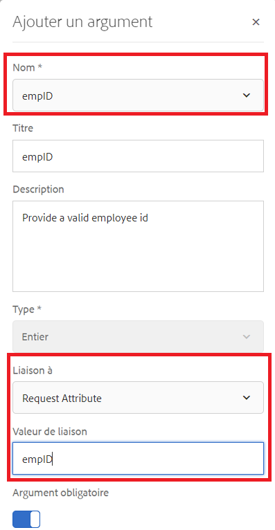
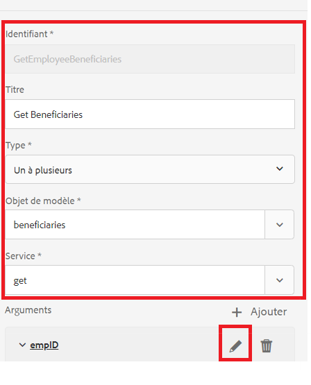
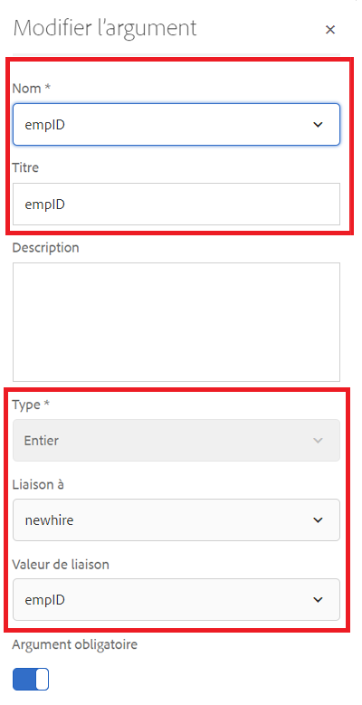
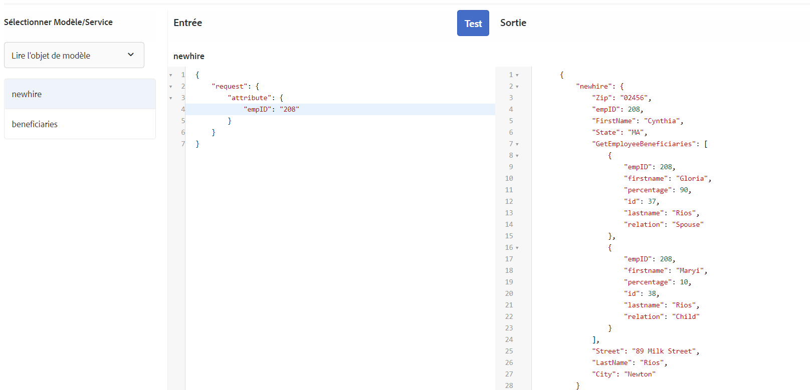

# Configuration du modèle de données de formulaire

## Source de données en pool de la connexion Apache Sling

La première étape de la création d&#39;un modèle de données de formulaire soutenu par RDBMS est de configurer la source de données en pool de connexion Apache Sling. Pour configurer la source de données, procédez comme suit :

* Pointez votre navigateur sur [configMgr](http://localhost:4502/system/console/configMgr).
* Recherchez **Apache Sling Connection Pooled DataSource**
* Ajoutez une nouvelle entrée et fournissez les valeurs comme le montre la capture d’écran.
* 
* Enregistrez vos modifications

>[!NOTE]
>L’URI de connexion JDBC, le nom d’utilisateur et le mot de passe changeront en fonction de la configuration de votre base de données MySQL.

## Création d’un modèle de données de formulaire

* Pointez votre navigateur sur [Intégrations de données](http://localhost:4502/aem/forms.html/content/dam/formsanddocuments-fdm).
* Cliquez sur _Créer_->_Modèle de données de formulaire_
* Attribuer un nom et un titre significatifs au modèle de données de formulaire tel que **Employé**
* Cliquez sur _Suivant_
* Sélectionnez la source de données créée dans la section précédente (forums).
* Cliquez sur _Créer_->Modifier pour ouvrir le modèle de données de formulaire nouvellement créé en mode d’édition.
* Développez le noeud _forums_ pour afficher le schéma employé. Développez le noeud employee pour afficher les 2 tables

## Ajouter des entités à votre modèle

* Assurez-vous que le noeud employee est développé.
* Sélectionnez les entités bénéficiaires et bénéficiaires et cliquez sur _Ajouter sélection_

## Ajouter le service de lecture à l&#39;entité propriétaire

* Sélectionner une entité entière
* Cliquez sur _Modifier les propriétés_
* Sélectionnez obtenir à partir de la liste déroulante Service de lecture
* Cliquez sur l’icône + pour ajouter un paramètre au service d’obtention.
* Spécifiez les valeurs telles qu’elles apparaissent dans la capture d’écran.
* 
>[!NOTE]
> Le service get attend une valeur mappée à la colonne empID de l&#39;entité newhire. Il existe plusieurs façons de transmettre cette valeur et dans ce didacticiel, empID sera transmis par le paramètre de requête appelé empID.
* Cliquez sur _Terminé_ pour enregistrer les arguments du service get.
* Cliquez sur _Terminé_ pour enregistrer les modifications apportées au modèle de données de formulaire.

## Association d&#39;Ajoute entre 2 entités

Les associations définies entre les entités de base de données ne sont pas créées automatiquement dans le modèle de données de formulaire. Les associations entre entités doivent être définies à l’aide de l’éditeur de modèle de données de formulaire. Chaque entité peut avoir un ou plusieurs bénéficiaires, nous devons définir une association de type &quot;un à plusieurs&quot; entre les entités bénéficiaires et les entités bénéficiaires.
Les étapes suivantes vous guideront tout au long du processus de création de l’association de type &quot;un à plusieurs&quot;.

* Sélectionnez l&#39;entité entière et cliquez sur _Ajouter l&#39;association_
* Fournissez un titre et un identifiant significatifs à l’association et aux autres propriétés, comme illustré dans la capture d’écran ci-dessous.
   

* Cliquez sur l&#39;icône _modifier_ sous la section Arguments.

* Spécifiez les valeurs comme indiqué dans cette capture d’écran.
* 
* **Nous relions les deux entités à l&#39;aide de la colonne empID des bénéficiaires et des entités de réseau.**
* Cliquez sur _Terminé_ pour enregistrer vos modifications.

## Tester votre modèle de données de formulaire

Notre modèle de données de formulaire dispose désormais du service **_get_** qui accepte empID et renvoie les détails du newhire et de ses bénéficiaires. Pour tester le service get, suivez les étapes ci-dessous.

* Sélectionner une entité entière
* Cliquez sur _Objet de modèle de test_
* Fournissez un empID valide et cliquez sur _Test_
* Vous devriez obtenir les résultats comme le montre la capture d&#39;écran ci-dessous.
* 
