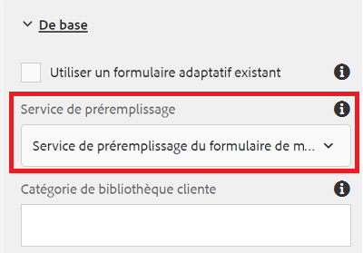

# Créer un formulaire adaptatif

Jusqu&#39;à présent, nous avons créé les éléments suivants :

* Base de données avec 2 tables : `newhire` et `beneficiaries`
* Source de données en pool de connexion Apache Sling configurée
* Modèle de données de formulaire basé sur RDBMS

L’étape suivante consiste à créer et à configurer un formulaire adaptatif pour utiliser le modèle de données de formulaire.  Pour obtenir le début principal, vous pouvez [télécharger et importer](assets/fdm-demo-af.zip) un exemple de formulaire. L’exemple de formulaire comporte une section qui affiche les détails de l’employé et une autre section destinée aux bénéficiaires de l’employé liste.

## Associer un formulaire au modèle de données de formulaire

L’exemple de formulaire fourni avec ce cours n’est associé à aucun modèle de données de formulaire. Pour configurer le formulaire de manière à utiliser le modèle de données de formulaire, procédez comme suit :

* Sélectionner le formulaire FDMDemo
* Cliquez sur _Propriétés_->_Modèle de formulaire_.
* Sélectionnez Modèle de données de formulaire dans la liste déroulante
* Recherchez et sélectionnez votre modèle de données de formulaire créé dans la leçon précédente.
* Cliquez sur _Enregistrer et fermer_

## Configurer le service de préremplissage

La première étape consiste à associer le service de préremplissage au formulaire. Pour associer le service de préremplissage, suivez les étapes mentionnées ci-dessous.

* Sélectionnez le formulaire `FDMDemo`
* Cliquez sur _Modifier_ pour ouvrir le formulaire en mode d’édition.
* Sélectionnez Conteneur de formulaire dans la hiérarchie de contenu, puis cliquez sur l’icône en forme de clé à molette pour ouvrir sa feuille de propriétés.
* Sélectionnez _Service de préremplissage du modèle de données de formulaire_ dans la liste déroulante Service de préremplissage.
* Cliquez sur bleu pour enregistrer vos modifications.

* 

## Configurer les détails de l&#39;employé

L’étape suivante consiste à lier les champs de texte du formulaire adaptatif aux éléments du modèle de données de formulaire. Vous devez ouvrir la feuille de propriétés des champs suivants et définir son bindRef comme illustré ci-dessous.

| Nom du champ | Lier la référence |
|------------|--------------------|
| Prénom | /newhire/FirstName |
| Nom de famille | /newhire/lastName |

>[!NOTE]
>
>N’hésitez pas à ajouter des champs de texte supplémentaires et à les lier aux éléments de modèle de données de formulaire appropriés.

## Configurer la table des bénéficiaires

L&#39;étape suivante consiste à présenter les bénéficiaires de l&#39;employé sous forme de tableaux. L’exemple de formulaire fourni comporte un tableau de 4 colonnes et d’une seule rangée. Nous devons configurer la table pour qu&#39;elle s&#39;agrandisse en fonction du nombre de bénéficiaires.

* Ouvrez le formulaire en mode de modification.
* Développer le panneau racine->Vos bénéficiaires->Tableau
* Sélectionnez Rangée1 et cliquez sur l’icône de clé à molette pour ouvrir sa feuille de propriétés.
* Définir la référence de liaison sur **/newhire/GetEmployeeBénéficiaries**
* Définissez les paramètres de répétition - Nombre minimum sur 1 et Nombre maximum sur 5.
* Votre configuration de ligne1 doit ressembler à la capture d’écran ci-dessous.
   
* Cliquez sur la flèche bleue pour enregistrer vos modifications.

## Liaison de cellules de rangée

Enfin, nous devons lier les cellules de ligne aux éléments de modèle de données de formulaire.

* Développer le panneau racine->Vos bénéficiaires->Tableau->Ligne1
* Définir la référence de liaison de chaque cellule de ligne comme indiqué dans le tableau ci-dessous

| Cellule de rangée | Référence de liaison |
|------------|----------------------------------------------|
| Prénom | /newhire/GetEmployeeBénéficiaries/nom de famille |
| Nom | /newhire/GetEmployeeBénéficiaries/nom de famille |
| Relation | /newhire/GetEmployeeBénéficiaries/relation |
| Pourcentage | /newhire/GetEmployeeBénéficiaries/pourcentage |

* Cliquez sur la flèche bleue pour enregistrer vos modifications.

## Testez votre formulaire

Nous devons maintenant ouvrir le formulaire avec empID approprié dans l’URL. Les 2 liens suivants renseigneront les formulaires avec des informations de la base de données
[Formulaire avec empID=207](http://localhost:4502/content/dam/formsanddocuments/fdmdemo/jcr:content?wcmmode=disabled&amp;empID=207)
[Formulaire avec empID=208](http://localhost:4502/content/dam/formsanddocuments/fdmdemo/jcr:content?wcmmode=disabled&amp;empID=208)

## Résolution des incidents

Mon formulaire est vide et ne contient aucune donnée

* Assurez-vous que le modèle de données de formulaire renvoie les résultats corrects.
* Le formulaire est associé au modèle de données de formulaire correct.
* Vérifier les liaisons de champ
* Consultez le fichier journal stdout. empID doit être écrit dans le fichier.Si cette valeur n&#39;est pas visible, votre formulaire peut ne pas utiliser le modèle personnalisé fourni.

Le tableau n&#39;est pas renseigné

* Vérification de la liaison Row1
* Assurez-vous que les paramètres de répétition pour Row1 sont définis correctement (Min =1 et Max = 5 ou plus).

