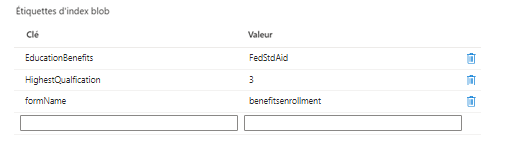

# Créer un envoi personnalisé

Un gestionnaire d’envoi personnalisé a été écrit pour gérer l’envoi du formulaire. À un niveau élevé, le gestionnaire d’envoi personnalisé effectue les opérations suivantes :

* Extrait le nom du formulaire envoyé.
* Extrait les données envoyées. Les données envoyées d’un formulaire basé sur des composants principaux sont toujours au format JSON.
* Extrait et stocke les pièces jointes de formulaire dans le portail Azure. Met à jour les données json envoyées avec l’URL de la pièce jointe.
* Crée des balises d’index blob : recherche la liste des champs pouvant faire l’objet d’une recherche pour le formulaire et sa valeur correspondante à partir des données envoyées.
* Associe les balises d’index blob aux données envoyées et les stocke dans le portail Azure.

La capture d’écran suivante vous montre les balises d’index de blob dans le portail Azure.

Le code d’envoi personnalisé se trouve dans **_StoreFormDataWithBlobIndexTagsInAzure_** et le code de stockage et de récupération des données d’Azure figure dans le composant **_SaveAndFetchFromAzure_**.

## Étapes suivantes

[Créer une interface de requête](./part3.md)
