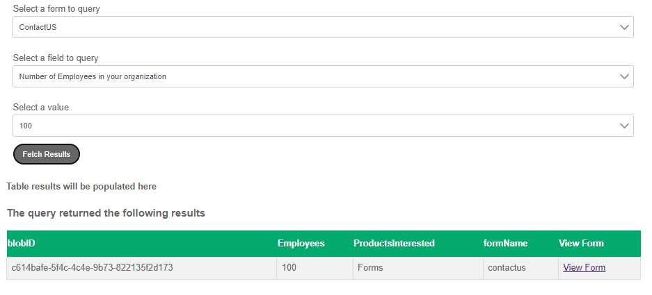

# Créer une interface de requête

Une interface de requête simple a été créée pour permettre à l’« administrateur ou administratrice » de saisir des critères de recherche afin de récupérer des envois de formulaire spécifiques. Les résultats s’affichent alors dans un format tabulaire simple, avec la possibilité d’afficher un envoi de formulaire particulier.

Les listes déroulantes de cette interface sont des listes déroulantes en cascade. Les options disponibles dans la liste déroulante changent en fonction des sélections effectuées dans la liste déroulante précédente.

Les listes déroulantes sont renseignées à l’aide de sources de données RESTful.

Les résultats de la recherche s’affichent dans un composant personnalisé appelé « SearchResults ». Lorsque la personne clique sur le bouton d’affichage, le formulaire est prérempli avec les données envoyées et les pièces jointes.

## Étapes suivantes

[Écrire le service de préremplissage](./part4.md)
