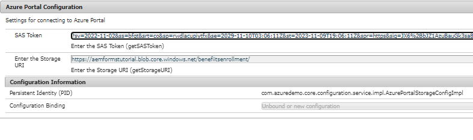

# Déployer l’exemple sur le serveur local

Pour que ce cas d’utilisation fonctionne sur votre serveur local, suivez les étapes ci-dessous. Il est supposé que votre instance d’AEM s’exécute sur localhost, port 4502.

* [Installez le package](assets/azuredemo.all-1.0.0-SNAPSHOT.zip) à l’aide du gestionnaire de modules.

* Fournissez les informations d’identification du portail Azure à l’aide de configMgr OSGi.
  
Assurez-vous que l’URI de stockage se termine par une barre oblique et que le jeton SAS commence par un ?.
* Accédez à [AzureDemo](http://localhost:4502/libs/fd/fdm/gui/components/admin/fdmcloudservice/fdm.html/conf/azuredemo).

* Modifiez les paramètres d’authentification des trois sources de données suivantes pour qu’elles correspondent à votre environnement.
  

* Prévisualiser et soumettre le [formulaire ContactUs](http://localhost:4502/content/dam/formsanddocuments/azureportal/contactus/jcr:content?wcmmode=disabled)

* [Interroger l’envoi de votre formulaire](http://localhost:4502/content/dam/formsanddocuments/azureportal/queryformsubmissions/jcr:content?wcmmode=disabled)
