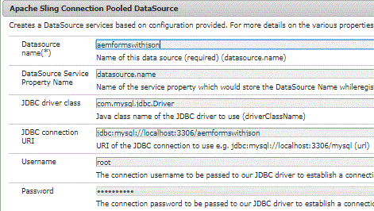

# Stockage des données envoyées dans la base de données


>[!NOTE]
>
>Il est recommandé d’utiliser MySQL 8 comme base de données, car il prend en charge le type de données JSON. Vous devez également installer le pilote approprié pour MySQL DB. J’ai utilisé le pilote disponible à cet emplacement https://mvnrepository.com/artifact/mysql/mysql-connector-java/8.0.12

Pour stocker les données envoyées dans la base de données, nous allons écrire un servlet afin d’extraire les données liées, le nom du formulaire et le magasin. Le code complet pour gérer l’envoi du formulaire et stocker afBoundData dans la base de données est indiqué ci-dessous.

Nous avons créé un envoi personnalisé pour gérer l’envoi du formulaire. Dans le fichier post.POST.jsp de cet envoi personnalisé, nous transférons la demande à notre servlet.

Pour en savoir plus sur les requêtes d’envoi personnalisées, lisez cet [article](https://helpx.adobe.com/experience-manager/kt/forms/using/custom-submit-aem-forms-article.html)

com.adobe.aemds.guide.utils.GuideSubmitUtils.setForwardPath(slingRequest,&quot;/bin/storeafsubmission&quot;,null,null);

```java
package com.aemforms.json.core.servlets;

import java.sql.Connection;
import java.sql.PreparedStatement;
import java.sql.SQLException;

import javax.servlet.Servlet;
import javax.servlet.ServletException;
import javax.sql.DataSource;

import org.apache.sling.api.SlingHttpServletRequest;
import org.apache.sling.api.SlingHttpServletResponse;
import org.apache.sling.api.servlets.SlingAllMethodsServlet;
import org.json.JSONException;
import org.json.JSONObject;
import org.osgi.service.component.annotations.Component;
import org.osgi.service.component.annotations.Reference;
import org.slf4j.Logger;
import org.slf4j.LoggerFactory;

@Component(service = Servlet.class, property = {

"sling.servlet.methods=get", "sling.servlet.methods=post",

"sling.servlet.paths=/bin/storeafsubmission"

})
public class HandleAdaptiveFormSubmission extends SlingAllMethodsServlet {
 private static final Logger log = LoggerFactory.getLogger(HandleAdaptiveFormSubmission.class);
 private static final long serialVersionUID = 1L;
 @Reference(target = "(&(objectclass=javax.sql.DataSource)(datasource.name=aemformswithjson))")
 private DataSource dataSource;

 protected void doPost(SlingHttpServletRequest request, SlingHttpServletResponse response) throws ServletException {
  JSONObject afSubmittedData;
  try {
   afSubmittedData = new JSONObject(request.getParameter("jcr:data"));
   // we will only store the data bound to schema
   JSONObject dataToStore = afSubmittedData.getJSONObject("afData").getJSONObject("afBoundData")
     .getJSONObject("data");
   String formName = afSubmittedData.getJSONObject("afData").getJSONObject("afSubmissionInfo")
     .getString("afPath");
   log.debug("The form name is " + formName);
   insertData(dataToStore, formName);

  } catch (JSONException e) {
   // TODO Auto-generated catch block
   e.printStackTrace();
  }

 }

 public void insertData(org.json.JSONObject jsonData, String formName) {
  log.debug("The json object I got to insert was " + jsonData.toString());
  String insertTableSQL = "INSERT INTO aemformswithjson.formsubmissions(formdata,formname) VALUES(?,?)";
  log.debug("The query is " + insertTableSQL);
  Connection c = getConnection();
  PreparedStatement pstmt = null;
  try {
   pstmt = null;
   pstmt = c.prepareStatement(insertTableSQL);
   pstmt.setString(1, jsonData.toString());
   pstmt.setString(2, formName);
   log.debug("Executing the insert statment  " + pstmt.executeUpdate());
   c.commit();
  } catch (SQLException e) {

   log.error("Getting errors", e);
  } finally {
   if (pstmt != null) {
    try {
     pstmt.close();
    } catch (SQLException e) {
     // TODO Auto-generated catch block
     e.printStackTrace();
    }
   }
   if (c != null) {
    try {
     c.close();
    } catch (SQLException e) {
     // TODO Auto-generated catch block
     e.printStackTrace();
    }
   }
  }
 }

 public Connection getConnection() {
  log.debug("Getting Connection ");
  Connection con = null;
  try {

   con = dataSource.getConnection();
   log.debug("got connection");
   return con;
  } catch (Exception e) {
   log.error("not able to get connection ", e);
  }
  return null;
 }

}
```



Pour que cela fonctionne, procédez comme suit :

* [Télécharger et décompresser le fichier zip](assets/aemformswithjson.zip)
* Créez AdaptiveForm Avec Le Schéma JSON. Vous pouvez utiliser le schéma JSON fourni dans le cadre des ressources de cet article. Assurez-vous que l’action d’envoi du formulaire est correctement configurée. L’action Envoyer doit être configurée sur &quot;CustomSubmitHelpx&quot;.
* Créez un schéma dans votre instance MySQL en important le fichier schema.sql à l’aide de l’outil MySQL Workbench. Le fichier schema.sql vous est également fourni dans le cadre de ces ressources de tutoriel.
* Configuration de Apache Sling Connection Pooled DataSource à partir de la console web Felix
* Veillez à nommer votre nom de source de données &quot;aemformswithjson&quot;. Il s’agit du nom utilisé par l’exemple de lot OSGi qui vous est fourni.
* Reportez-vous à l’image ci-dessus pour connaître les propriétés. Cela suppose que vous allez utiliser MySQL comme base de données.
* Déployez le ou les lots OSGi fournis dans le cadre des ressources de cet article.
* Prévisualisez le formulaire et envoyez-le.
* Les données JSON seront stockées dans la base de données qui a été créée lorsque vous avez importé le fichier &quot;schema.sql&quot;.
