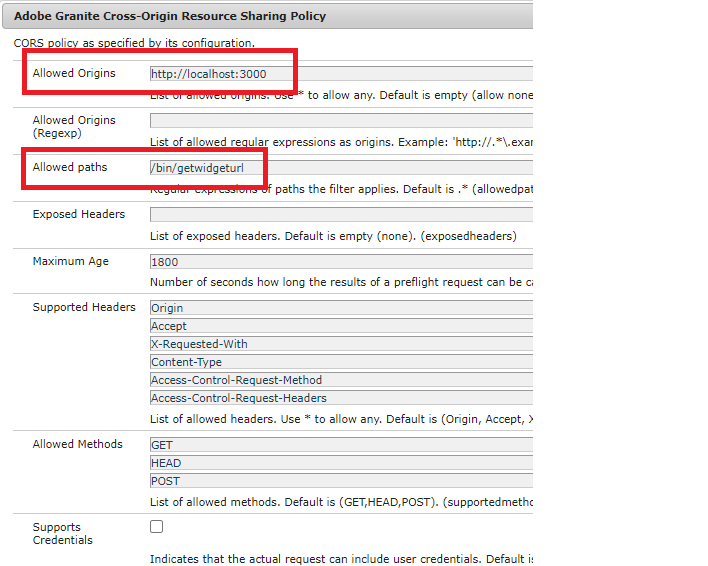

# Déploiement des ressources

Les ressources/configurations suivantes ont été déployées sur un serveur de publication AEM Forms.

* [Groupe de wrapper Adobe Sign](assets/AcrobatSign.core-1.0.0-SNAPSHOT.jar)

* [Exemple de modèle de communication interactive](assets/waiver-interactive-communication.zip)
* [Déploiement du lot DevelopingWithServiceUser](https://experienceleague.adobe.com/docs/experience-manager-learn/assets/developingwithserviceuser.zip)
* Ajoutez l’entrée suivante dans le service Apache Sling Service User Mapper à l’aide de la configurationMgr OSGi.
   **DevelopingWithServiceUser.core:getformsresourceresolver=fd-service**
* [Vous pouvez télécharger un exemple de code d’application React ici](assets/src.zip)


L’exemple d’application de réaction doit être déployé sur votre environnement local.

Vous devrez modifier l’URL du point de terminaison pour qu’elle corresponde à votre environnement. Ouvrez le fichier EmergencyContact.js et modifiez l’URL dans la méthode de récupération .

```javascript
 const getWebForm=async()=>
     {
        setSpinner(true)
        console.log("inside widgetURL function emergency contact");
        // NOTE: replace the `aemforms.azure.com:4503` with your AEM FORM server
        let res = await fetch("http://aemforms.azure.com:4503/bin/getwidgeturl",
          {
            method: "POST",
            body: JSON.stringify({"icTemplate":"/content/forms/af/waiver/waiver/channels/print","waiver":formData})
                     
         })
 
```

Pour activer l’envoi d’appels POST vers le point de terminaison AEM à partir de votre application REACT, vous devez spécifier les entrées appropriées dans le champ Origines autorisées dans la configuration de la stratégie de partage des ressources cross-origin Adobe Granite




