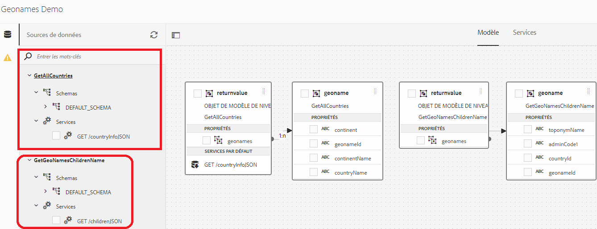
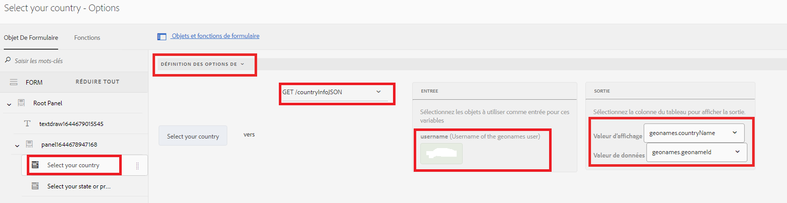
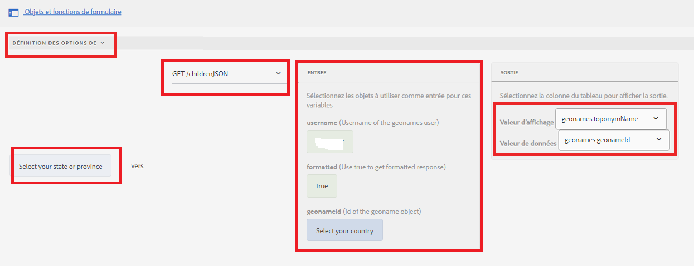

# Listes déroulantes en cascade

Une liste déroulante en cascade est une série de contrôles DropDownList dépendants dans laquelle un contrôle DropDownList dépend des contrôles DropList parent ou précédent. Les éléments du contrôle DropDownList sont renseignés en fonction d’un élément sélectionné par l’utilisateur à partir d’un autre contrôle DropDownList.

## Démonstration du cas pratique

>[!VIDEO](https://video.tv.adobe.com/v/340344?quality=12&learn=on)

Pour les besoins de ce tutoriel, j’ai utilisé [API REST Geonames](http://api.geonames.org/) pour démontrer cette capacité.
Un certain nombre d’entreprises proposent ce type de service et tant qu’elles disposent d’API REST bien documentées, vous pouvez facilement intégrer AEM Forms à l’aide de la fonctionnalité d’intégration des données.

Les étapes suivantes ont été suivies pour mettre en oeuvre des listes déroulantes en cascade dans AEM Forms

## Créer un compte de développeur

Création d’un compte développeur avec [Geonames](https://www.geonames.org/login). Notez le nom d’utilisateur. Ce nom d’utilisateur est nécessaire pour appeler les API REST de geonames.org.

## Création d’un fichier Swagger/OpenAPI

OpenAPI Specification (anciennement Swagger Specification) est un format de description d’API pour les API REST. Un fichier OpenAPI vous permet de décrire l’ensemble de votre API, notamment :

* Points de terminaison disponibles (/users) et opérations sur chaque point de terminaison (GET /users, POST /users)
* Paramètres d’opération Entrée et sortie pour chaque opération Méthodes d’authentification
* Coordonnées, licences, conditions d’utilisation et autres informations.
* Les spécifications d’API peuvent être écrites dans YAML ou JSON. Ce format est facile à apprendre et à lire pour les humains comme pour les machines.

Pour créer votre premier fichier swagger/OpenAPI, suivez la procédure décrite à la rubrique [Documentation OpenAPI](https://swagger.io/docs/specification/2-0/basic-structure/)

>[!NOTE]
> AEM Forms prend en charge la spécification OpenAPI version 2.0 (FKA Swagger).

Utilisez la variable [éditeur de swagger](https://editor.swagger.io/) pour créer votre fichier swagger afin de décrire les opérations qui récupèrent tous les pays et éléments enfants du pays ou de l’état. Le fichier swagger peut être créé au format JSON ou YAML. Le fichier swagger terminé peut être téléchargé à partir de [here](assets/swagger-files.zip)
Les fichiers swagger décrivent l’API REST suivante :
* [Obtenir tous les pays](http://api.geonames.org/countryInfoJSON?username=yourusername)
* [Obtention des enfants de l’objet Geoname](http://api.geonames.org/childrenJSON?formatted=true&amp;geonameId=6252001&amp;username=yourusername)

## Création de sources de données

Pour intégrer AEM/AEM Forms à des applications tierces, nous devons [création d’une source de données](https://experienceleague.adobe.com/docs/experience-manager-learn/forms/ic-web-channel-tutorial/parttwo.html) dans la configuration des services cloud. Veuillez utiliser la variable [fichiers swagger](assets/swagger-files.zip) pour créer vos sources de données.
Vous devez créer 2 sources de données (l’une pour récupérer tous les pays et l’autre pour obtenir des éléments enfants).

## Création d’un modèle de données de formulaire

L’intégration de données AEM Forms offre une interface utilisateur intuitive pour créer et utiliser des [modèles de données de formulaire](https://experienceleague.adobe.com/docs/experience-manager-65/forms/form-data-model/create-form-data-models.html?lang=fr). Basez le modèle de données de formulaire sur les sources de données créées à l’étape précédente. Modèle de données de formulaire avec 2 sources de données

## Créer un formulaire adaptatif

Intégrez les GET d’appel du modèle de données de formulaire à votre formulaire adaptatif pour remplir les listes déroulantes.
Créez un formulaire adaptatif avec 2 listes déroulantes. Un pour répertorier les pays, et un autre pour répertorier les états/provinces en fonction du pays sélectionné.

### Liste déroulante Renseigner les pays

La liste des pays est renseignée lors de la première initialisation du formulaire. La capture d’écran suivante montre l’éditeur de règles configuré pour renseigner les options de la liste déroulante des pays. Pour que cela fonctionne, vous devrez fournir votre nom d’utilisateur avec le compte geonames.

#### Remplissage de la liste déroulante État/Province

Nous devons remplir la liste déroulante Etat/Province en fonction du pays sélectionné. La capture d’écran suivante présente la configuration de l’éditeur de règles

### Exercice

Ajoutez 2 listes déroulantes appelées villes et départements dans le formulaire pour répertorier les départements et villes en fonction du pays et de l&#39;état/province sélectionnés.

