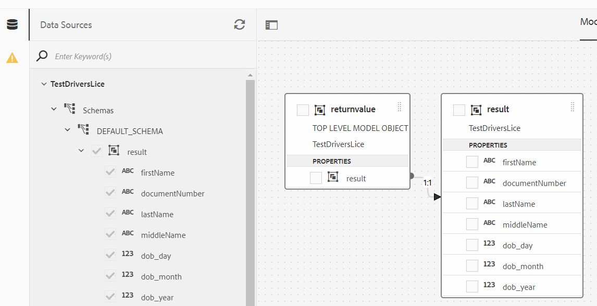

# Extraction des données OCR

Extrayez automatiquement les données d’un large éventail de documents émis par l’administration pour remplir vos formulaires adaptatifs.

Un certain nombre d’organisations fournissent ce service et tant qu’elles disposent d’API REST bien documentées, vous pouvez facilement l’intégrer à AEM Forms à l’aide de la fonctionnalité d’intégration de données. Dans ce tutoriel, j’ai utilisé [ID Analyzer](https://www.idanalyzer.com/) pour décrire l’extraction des données OCR des documents chargés.

Les étapes suivantes ont été suivies pour mettre en œuvre l’extraction des données OCR avec AEM Forms à l’aide du service ID Analyzer.

## Créer un compte de développement

Créer un compte de développement avec [ID Analyzer](https://portal.idanalyzer.com/signin.html). Notez la clé API. Cette clé est nécessaire pour appeler les API REST du service ID Analyzer.

## Créer un fichier Swagger/OpenAPI

La spécification OpenAPI (anciennement spécification Swagger) est un format de description d’API pour les API REST. Un fichier OpenAPI vous permet de décrire l’ensemble de votre API, notamment :

* les points d’entrée (/users) et les opérations disponibles sur chaque point d’entrée (GET/users, POST /users) ;
* les paramètres d’opération d’entrée et de sortie pour chaque opération.
Méthodes d’authentification
* Coordonnées, licences, conditions d’utilisation et autres informations.
* Les spécifications d’API peuvent être écrites en YAML ou JSON. Ce format est facile à apprendre et à lire pour les humains comme pour les machines.

Pour créer votre premier fichier Swagger/OpenAPI, suivez la procédure décrite dans la [documentation OpenAPI](https://swagger.io/docs/specification/2-0/basic-structure/).

>[!NOTE]
> AEM Forms prend en charge la spécification OpenAPI version 2.0 (fka Swagger).

Utilisez l’[éditeur de Swagger](https://editor.swagger.io/) pour créer votre fichier Swagger pour décrire les opérations qui envoient et vérifient le code OTP envoyé à l’aide d’un SMS. Le fichier Swagger peut être créé au format JSON ou YAML. Le fichier Swagger terminé peut être téléchargé [ici](assets/drivers-license-swagger.zip).

## Considérations relatives à la définition du fichier Swagger

* Les définitions sont obligatoires.
* $ref doit être utilisé pour les définitions de méthode.
* Préférez la définition de sections pour consommer et produire.
* Ne définissez pas de paramètres de corps de la requête ou de réponse intégrés. Essayez de modulariser autant que possible. Par exemple, la définition suivante n’est pas prise en charge :

```json
 "name": "body",
            "in": "body",
            "required": false,
            "schema": {
              "type": "object",
              "properties": {
                "Rollnum": {
                  "type": "string",
                  "description": "Rollnum"
                }
              }
            }
```

Les éléments suivants sont pris en charge avec une référence à la définition du corps de la requête.

```json
 "name": "requestBody",
            "in": "body",
            "required": false,
            "schema": {
              "$ref": "#/definitions/requestBody"
            }
```

* [Exemple de fichier Swagger pour votre référence.](assets/sample-swagger.json)

## Créer une source de données

Pour intégrer AEM/AEM Forms à des applications tierces, nous devons [créer une source de données](https://experienceleague.adobe.com/docs/experience-manager-learn/forms/ic-web-channel-tutorial/parttwo.html?lang=fr) dans la configuration des services cloud. Veuillez utiliser le [fichier Swagger](assets/drivers-license-swagger.zip) pour créer votre source de données.

## Créer un modèle de données de formulaire

L’intégration de données d’AEM Forms fournit une interface utilisateur intuitive permettant de créer et d’utiliser des [modèles de données de formulaire](https://experienceleague.adobe.com/docs/experience-manager-65/forms/form-data-model/create-form-data-models.html?lang=fr). Basez le modèle de données de formulaire sur la source de données créée à l’étape précédente.



## Créer une bibliothèque cliente

Nous devons obtenir la chaîne codée en base64 du document chargé. Cette chaîne codée en base64 est ensuite transmise comme l’un des paramètres de notre appel REST.
La bibliothèque cliente peut être téléchargée [ici.](assets/drivers-license-client-lib.zip)

## Créer un formulaire adaptatif

Intégrez les appels POST du modèle de données de formulaire à votre formulaire adaptatif pour extraire les données du document téléchargé par l’utilisateur ou l’utilisatrice dans le formulaire. Vous êtes libre de créer votre propre formulaire adaptatif et d’utiliser l’appel POST du modèle de données de formulaire pour envoyer la chaîne codée en base64 du document chargé.

## Déployer sur votre serveur

Si vous souhaitez utiliser les exemples de ressources avec votre clé API, veuillez procéder comme suit :

* [Téléchargez la source de données](assets/drivers-license-source.zip) et importez-la dans AEM à l’aide du [gestionnaire de packages](http://localhost:4502/crx/packmgr/index.jsp).
* [Téléchargez le modèle de données de formulaire](assets/drivers-license-fdm.zip) et importez-le dans AEM à l’aide du [gestionnaire de packages](http://localhost:4502/crx/packmgr/index.jsp).
* [Télécharger la bibliothèque cliente](assets/drivers-license-client-lib.zip)
* L’exemple de formulaire adaptatif peut être [téléchargé ici](assets/adaptive-form-dl.zip). Cet exemple de formulaire utilise les appels de service du modèle de données de formulaire fourni dans le cadre de cet article.
* Importez le formulaire dans AEM à partir de l’[interface utilisateur des formulaires et des documents](http://localhost:4502/aem/forms.html/content/dam/formsanddocuments).
* Ouvrez le formulaire en [mode d’édition.](http://localhost:4502/editor.html/content/forms/af/driverslicenseandpassport.html)
* Spécifiez votre clé API comme valeur par défaut dans le champ apikey et enregistrez vos modifications.
* Ouvrez l’éditeur de règles pour le champ Chaîne en base 64. Notez l’appel du service lorsque la valeur de ce champ est modifiée.
* Enregistrez le formulaire.
* [Obtenez un aperçu du formulaire](http://localhost:4502/content/dam/formsanddocuments/driverslicenseandpassport/jcr:content?wcmmode=disabled) et téléchargez la face avant de votre permis de conduire.
