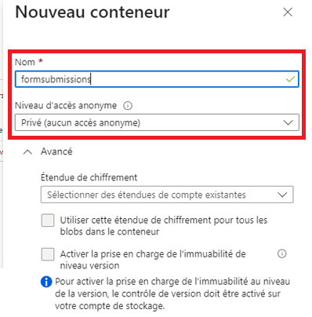
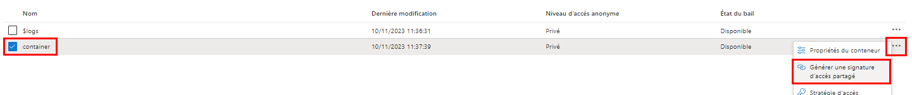
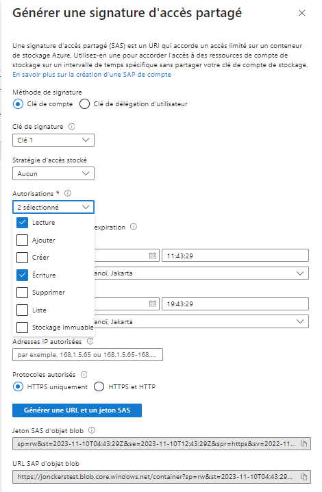
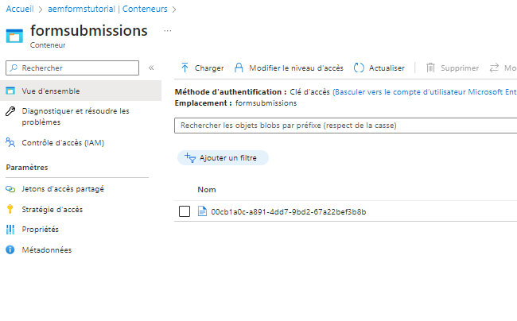

# Stocker les envois de formulaire dans le stockage Azure

Cet article vous explique comment effectuer des appels REST pour stocker les données AEM Forms envoyées dans le stockage Azure.
Pour pouvoir stocker les données de formulaire envoyées dans le stockage Azure, les étapes ci-dessous doivent être suivies.

## Créer un compte de stockage Azure

[Connectez-vous à votre compte de portaile Azure et créez un compte de stockage.](https://learn.microsoft.com/fr-fr/azure/storage/common/storage-account-create?tabs=azure-portal#create-a-storage-account-1). Attribuez un nom significatif à votre compte de stockage, cliquez sur Vérifier, puis sur Créer. Votre compte de stockage est alors créé avec toutes les valeurs par défaut. Pour les besoins de cet article, nous avons nommé notre compte de stockage `aemformstutorial`.


## Créer un conteneur

Nous devons ensuite créer un conteneur pour stocker les données des envois de formulaire.
Sur la page du compte de stockage, cliquez sur l’option de menu Conteneurs située à gauche et créez un conteneur appelé `formssubmissions`. Assurez-vous que le niveau d’accès public est défini sur privé.
.

## Création de SAS sur le conteneur

Nous allons utiliser la méthode d’autorisation par signature d’accès partagé, ou SAS, pour interagir avec le conteneur de stockage Azure.
Accédez au conteneur dans le compte de stockage, cliquez sur les points de suspension et sélectionnez l’option Générer le SAS comme illustré dans la capture d’écran.

Veillez à spécifier les autorisations appropriées et la date de fin appropriée, comme indiqué dans la capture d’écran ci-dessous, puis cliquez sur Générer un jeton SAS et une URL. Copiez le jeton Blob SAS et l’URL Blob SAS. Nous utiliserons ces deux valeurs pour effectuer nos appels HTTP



## Fournir le jeton Blob SAS et l’URI de stockage

Pour rendre le code plus générique, les deux propriétés peuvent être configurées à l’aide de la configuration OSGi, comme illustré ci-dessous. La variable _**aemformstutorial**_ est le nom du compte de stockage, _**formenvois**_ est le conteneur dans lequel les données seront stockées.


## Créer une requête PUT

L’étape suivante consiste à créer une requête PUT pour stocker les données de formulaire envoyées dans le stockage Azure. Chaque envoi de formulaire doit être identifié par un ID d’objet blob unique. L’identifiant d’objet blob unique est généralement créé dans votre code et inséré dans l’URL de la requête PUT.
Voici l’URL partielle de la requête PUT. `aemformstutorial` est le nom du compte de stockage, formsubmissions est le conteneur dans lequel les données seront stockées avec un identifiant d’objet blob unique. Le reste de l’URL reste le même.
https://aemformstutorial.blob.core.windows.net/formsubmissions/blobid/sastoken La fonction suivante est écrite pour stocker les données de formulaire envoyées dans Azure Storage à l’aide d’une demande de PUT. Notez l’utilisation du nom du conteneur et de l’UUID dans l’URL. Vous pouvez créer un service OSGi ou un servlet Sling à l’aide de l’exemple de code répertorié ci-dessous et stocker les envois de formulaire dans le stockage Azure.

```java
 public String saveFormDatainAzure(String formData) {
    log.debug("in SaveFormData!!!!!" + formData);
    String sasToken = azurePortalConfigurationService.getSASToken();
    String storageURI = azurePortalConfigurationService.getStorageURI();
    log.debug("The SAS Token is " + sasToken);
    log.debug("The Storage URL is " + storageURI);
    org.apache.http.impl.client.CloseableHttpClient httpClient = HttpClientBuilder.create().build();
    UUID uuid = UUID.randomUUID();
    String putRequestURL = storageURI + uuid.toString();
    putRequestURL = putRequestURL + sasToken;
    HttpPut httpPut = new HttpPut(putRequestURL);
    httpPut.addHeader("x-ms-blob-type", "BlockBlob");
    httpPut.addHeader("Content-Type", "text/plain");

    try {
        httpPut.setEntity(new StringEntity(formData));

        CloseableHttpResponse response = httpClient.execute(httpPut);
        log.debug("Response code " + response.getStatusLine().getStatusCode());
        if (response.getStatusLine().getStatusCode() == 201) {
            return uuid.toString();
        }
    } catch (IOException e) {
        log.error("Error: " + e.getMessage());
        throw new RuntimeException(e);
    }
    return null;

}
```

## Vérifier les données stockées dans le conteneur



## Tester la solution

* [Déploiement du lot OSGi personnalisé](./assets/SaveAndFetchFromAzure.core-1.0.0-SNAPSHOT.jar)

* [Importez le modèle de formulaire adaptatif personnalisé et le composant de page associé au modèle.](./assets/store-and-fetch-from-azure.zip)

* [Import de l’exemple de formulaire adaptatif](./assets/bank-account-sample-form.zip)

* Spécifiez les valeurs appropriées dans la configuration du portail Azure à l’aide de la console de configuration OSGi.
* [Aperçu et envoi du formulaire BankAccount](http://localhost:4502/content/dam/formsanddocuments/azureportalstorage/bankaccount/jcr:content?wcmmode=disabled)

* Vérifiez que les données sont stockées dans le conteneur de stockage Azure de votre choix. Copiez l’ID de Blob.
* [Aperçu du formulaire BankAccount](http://localhost:4502/content/dam/formsanddocuments/azureportalstorage/bankaccount/jcr:content?wcmmode=disabled&amp;guid=dba8ac0b-8be6-41f2-9929-54f627a649f6) et spécifiez l’ID Blob comme paramètre guid dans l’URL pour que le formulaire soit prérempli avec les données du stockage Azure.

