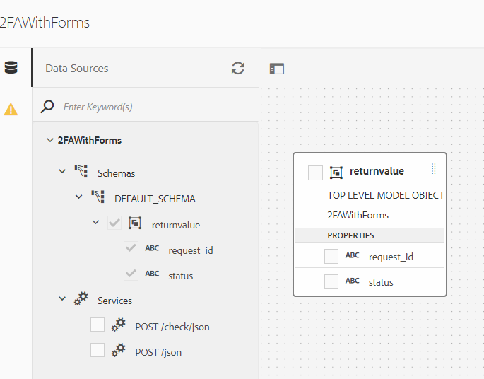

# Vérifier les utilisateurs avec OTP

L’authentification à deux facteurs SMS (authentification à deux facteurs) est une procédure de vérification de sécurité déclenchée par la connexion d’un utilisateur à un site web, un logiciel ou une application. Dans le processus de connexion, l’utilisateur reçoit automatiquement un SMS à son numéro de mobile contenant un code numérique unique.

Un certain nombre d’organisations fournissent ce service. Tant qu’elles disposent d’API REST bien documentées, vous pouvez facilement intégrer AEM Forms à l’aide des fonctionnalités d’intégration des données d’AEM Forms. Pour les besoins de ce tutoriel, j’ai utilisé [Nexmo](https://developer.nexmo.com/verify/overview) pour démontrer le cas d’utilisation de SMS 2FA.

Les étapes suivantes ont été suivies pour mettre en oeuvre le service SMS 2FA avec AEM Forms à l’aide du service de vérification de code.

## Créer un compte de développeur

Création d’un compte développeur avec [Nexmo](https://dashboard.nexmo.com/sign-in). Notez la clé API et la clé secrète de l’API. Ces clés sont nécessaires pour appeler les API REST du service Nexmo.

## Création d’un fichier Swagger/OpenAPI

OpenAPI Specification (anciennement Swagger Specification) est un format de description d’API pour les API REST. Un fichier OpenAPI vous permet de décrire l’ensemble de votre API, notamment :

* Points de terminaison disponibles (/users) et opérations sur chaque point de terminaison (GET /users, POST /users)
* Paramètres d’opération Entrée et sortie pour chaque opération Méthodes d’authentification
* Coordonnées, licences, conditions d’utilisation et autres informations.
* Les spécifications d’API peuvent être écrites dans YAML ou JSON. Ce format est facile à apprendre et à lire pour les humains comme pour les machines.

Pour créer votre premier fichier swagger/OpenAPI, suivez la procédure décrite à la rubrique [Documentation OpenAPI](https://swagger.io/docs/specification/2-0/basic-structure/)

>[!NOTE]
> AEM Forms prend en charge la spécification OpenAPI version 2.0 (fka Swagger).

Utilisez la variable [éditeur de swagger](https://editor.swagger.io/) pour créer votre fichier swagger afin de décrire les opérations qui envoient et vérifient le code OTP envoyé à l’aide de SMS. Le fichier swagger peut être créé au format JSON ou YAML. Le fichier swagger terminé peut être téléchargé à partir de [here](assets/two-factore-authentication-swagger.zip)

## Création d’une source de données

Pour intégrer AEM/AEM Forms à des applications tierces, nous devons [Source de données basée sur REST à l’aide du fichier swagger](https://experienceleague.adobe.com/docs/experience-manager-learn/forms/ic-web-channel-tutorial/parttwo.html) dans la configuration des services cloud. La source de données terminée vous est fournie dans le cadre des ressources de ce cours.

## Création d’un modèle de données de formulaire

L’intégration de données AEM Forms offre une interface utilisateur intuitive pour créer et utiliser des [modèles de données de formulaire](https://experienceleague.adobe.com/docs/experience-manager-65/forms/form-data-model/create-form-data-models.html?lang=fr). Un modèle de données de formulaire repose sur les sources de données pour l’échange de données.
Le modèle de données de formulaire complété peut être [téléchargé ici](assets/sms-2fa-fdm.zip)

