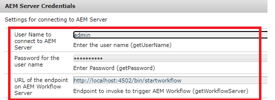
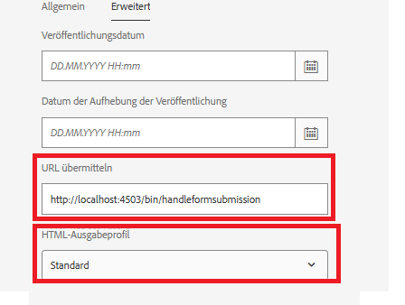

# Application de ce cas d’utilisation sur votre système

>[!NOTE]
>
>Pour que les exemples de ressources fonctionnent sur votre système, il est supposé que vous avez accès à une instance de création et de publication AEM Forms.

Pour que ce cas d’utilisation fonctionne sur votre système local, procédez comme suit :

## Déployez les éléments suivants sur votre instance de création AEM Forms.

* [Installez le lot MobileFormToWorkflow.](assets/MobileFormToWorkflow.core-1.0.0-SNAPSHOT.jar)

* [Déployer le développement avec le lot d’utilisateurs et d’utilisatrices du service](https://experienceleague.adobe.com/docs/experience-manager-learn/assets/developingwithserviceuser.zip?lang=fr)
Ajoutez l’entrée suivante dans le mappage des utilisateurs et utilisatrices de serveur Apache Sling à l’aide du configMgr.

```
DevelopingWithServiceUser.core:getformsresourceresolver=fd-service
```

* Vous pouvez stocker les envois de formulaire dans un autre dossier en spécifiant le nom du dossier dans la configuration des informations d’identification de serveur AEM à l’aide de [configMgr](http://localhost:4502/system/console/configMg). Si vous modifiez le dossier, veillez à créer un lanceur sur le dossier pour déclencher le workflow **ReviewSubmittedPDF**.


* [Importez l’exemple xdp et le package de workflow à l’aide du gestionnaire de packages](assets/xdp-form-and-workflow.zip).


## Déployer les ressources suivantes sur l’instance de publication.

* [Installez le lot MobileFormToWorkflow.](assets/MobileFormToWorkflow.core-1.0.0-SNAPSHOT.jar)

* Indiquez le nom d’utilisateur ou d’utilisatrice/mot de passe de l’instance de création et un **emplacement existant dans votre référentiel AEM** pour stocker les données envoyées dans les informations d’identification de serveur AEM à l’aide de [configMgr](http://localhost:4503/system/console/configMgr). Vous pouvez laisser l’URL du point d’entrée telle quelle sur le serveur de workflow AEM. Il s’agit du point d’entrée qui extrait et stocke les données de l’envoi dans le nœud spécifié.
  

* [Déployer le lot Développer avec un utilisateur ou une utilisatrice de service](https://experienceleague.adobe.com/docs/experience-manager-learn/assets/developingwithserviceuser.zip?lang=fr)
* [Ouvrez la configuration OSGi](http://localhost:4503/system/console/configMgr).
* Recherchez **Filtre référent Apache Sling**. Assurez-vous que la case Autoriser les champs vides est cochée.


## Tester la solution

* Connectez-vous à votre instance de création.
* [Modifiez les propriétés avancées du w9.xdp](http://localhost:4502/libs/fd/fm/gui/content/forms/formmetadataeditor.html/content/dam/formsanddocuments/w9.xdp). Assurez-vous que l’URL d’envoi et le profil de rendu sont correctement définis comme illustré ci-dessous.
  

* Publiez le w9.xdp.
* Connectez-vous à l’instance de publication.
* [Prévisualisez le formulaire w9](http://localhost:4503/content/dam/formsanddocuments/w9.xdp/jcr:content).
* Renseignez certains champs du formulaire et envoyez-le.
* Connectez-vous à l’instance de création AEM en tant que personne administratrice.
* [Consulter la boîte de réception AEM](http://localhost:4502/aem/inbox)
* Vous devez disposer d’un élément de travail pour examiner le PDF envoyé.

>[!NOTE]
>
>Au lieu d’envoyer le PDF au servlet exécuté sur l’instance de publication, certains clientes et clients ont choisi de déployer le servlet dans un conteneur de servlets tel que Tomcat. Chaque client et cliente a ses préférences en matière de topologie. Pour les besoins de ce tutoriel, nous allons utiliser le servlet déployé sur l’instance de publication pour traiter les envois de formulaires.
