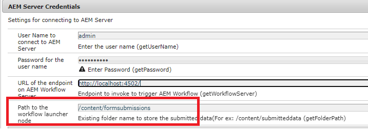

# Appliquer ce cas d’utilisation sur votre système

>[!NOTE]
>
>Pour que les exemples de ressources fonctionnent sur votre système, on suppose que vous avez accès à une instance de création et de publication AEM Forms.

Pour que ce cas d’utilisation fonctionne sur votre système local, procédez comme suit :

## Déployez les éléments suivants sur votre instance d’auteur AEM Forms

* [Installation du lot MobileFormToWorkflow](assets/MobileFormToWorkflow.core-1.0.0-SNAPSHOT.jar)

* [Déploiement du développement avec le lot d’utilisateurs du service](https://experienceleague.adobe.com/docs/experience-manager-learn/assets/developingwithserviceuser.zip?lang=en)
Ajoutez l’entrée suivante dans le service Apache Sling Service User Mapper à l’aide de configMgr

```
DevelopingWithServiceUser.core:getformsresourceresolver=fd-service
```

* Vous pouvez stocker les envois de formulaire dans un autre dossier en spécifiant le nom du dossier dans la configuration des informations d’identification AEM serveur à l’aide de [configMgr](http://localhost:4502/system/console/configMg). Si vous modifiez le dossier, veillez à créer un lanceur sur le dossier pour déclencher le workflow **ReviewSubmittedPDF**


* [Importez l’exemple xdp et le module de processus à l’aide du gestionnaire de modules](assets/xdp-form-and-workflow.zip).


## Déployer les ressources suivantes sur l’instance de publication

* [Installation du lot MobileFormToWorkflow](assets/MobileFormToWorkflow.core-1.0.0-SNAPSHOT.jar)

* Indiquez le nom d’utilisateur/mot de passe de l’instance d’auteur et un emplacement **existant dans votre référentiel AEM** pour stocker les données envoyées dans les informations d’identification AEM serveur à l’aide de [configMgr](http://localhost:4503/system/console/configMgr). Vous pouvez laisser l’URL du point de terminaison tel quel sur AEM Workflow Server. Il s’agit du point de terminaison qui extrait et stocke les données de l’envoi dans le noeud spécifié.
  

* [Déploiement du développement avec le lot d’utilisateurs du service](https://experienceleague.adobe.com/docs/experience-manager-learn/assets/developingwithserviceuser.zip?lang=en)
* [Ouvrez la configuration OSGi](http://localhost:4503/system/console/configMgr).
* Recherchez **Filtre référent Apache Sling**. Assurez-vous que la case Autoriser les champs vides est cochée.


## Tester la solution

* Connexion à votre instance d’auteur
* [Modifiez les propriétés avancées du w9.xdp](http://localhost:4502/libs/fd/fm/gui/content/forms/formmetadataeditor.html/content/dam/formsanddocuments/w9.xdp). Assurez-vous que l’URL d’envoi et le profil de rendu sont correctement définis comme illustré ci-dessous.
  

* Publish du w9.xdp
* Connexion à l’instance de publication
* [Aperçu du formulaire w9](http://localhost:4503/content/dam/formsanddocuments/w9.xdp/jcr:content)
* Renseignez certains champs du formulaire et envoyez-le.
* Connectez-vous à l’instance de création AEM en tant que personne administratrice.
* [Consulter la boîte de réception AEM](http://localhost:4502/aem/inbox)
* Vous devez disposer d’un élément de travail pour examiner le PDF envoyé.

>[!NOTE]
>
>Au lieu d’envoyer le PDF au servlet exécuté sur l’instance de publication, certains clientes et clients ont choisi de déployer le servlet dans un conteneur de servlets tel que Tomcat. Tout dépend de la topologie avec laquelle le client se sent à l’aise. Pour les besoins de ce tutoriel, nous allons utiliser le servlet déployé sur l’instance de publication pour gérer les envois de formulaire.
