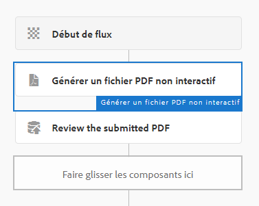
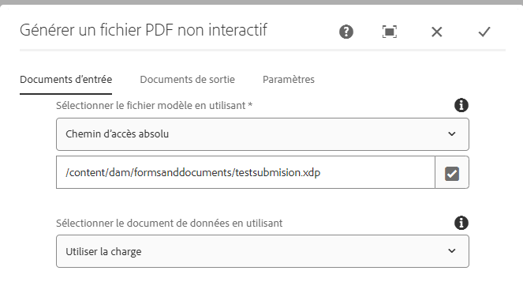
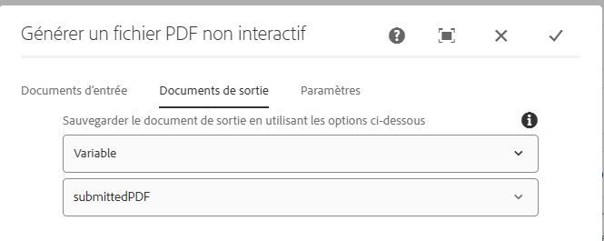
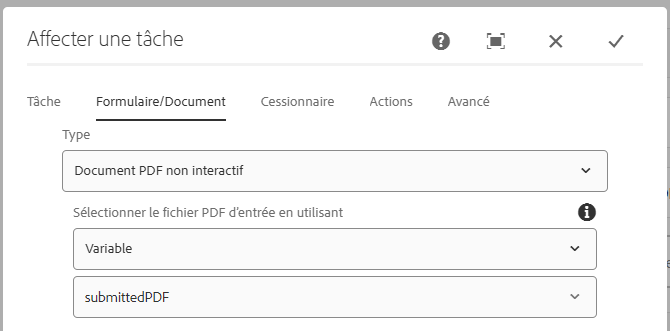

# Workflow de révision et d’approbation du PDF envoyé

La toute dernière étape consiste à créer un workflow AEM qui génère un PDF statique, ou non interactif, à des fins de révision et d’approbation. Le workflow est déclenché par un lanceur AEM configuré sur le nœud `/content/formsubmissions`.

La capture d’écran suivante montre les étapes impliquées dans ce workflow.



## Étape de workflow Générer un PDF non interactif

Le modèle XDP et les données à fusionner avec le modèle sont spécifiés ici. Les données à fusionner sont les données envoyées du PDF. Ces données envoyées sont stockées sous le nœud ```/content/formsubmissions```.



Le PDF généré est affecté à la variable de workflow appelée `submittedPDF`.



### Attribuer le fichier PDF généré à des fins de révision et d’approbation

Le composant de workflow Affecter une tâche est utilisé ici pour affecter le PDF généré à des fins de révision et d’approbation. La variable `submittedPDF` est utilisée dans l’onglet Formulaires et documents du composant de workflow Affecter une tâche.




## Étapes suivantes

[Déploiement des ressources dans votre environnement](./deploy-assets.md)
