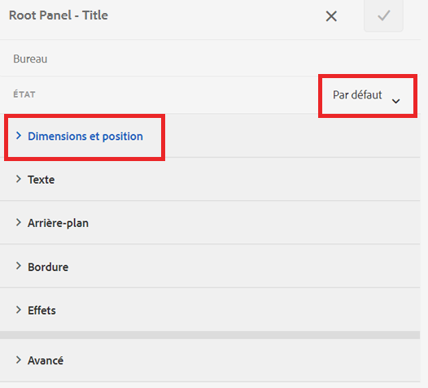
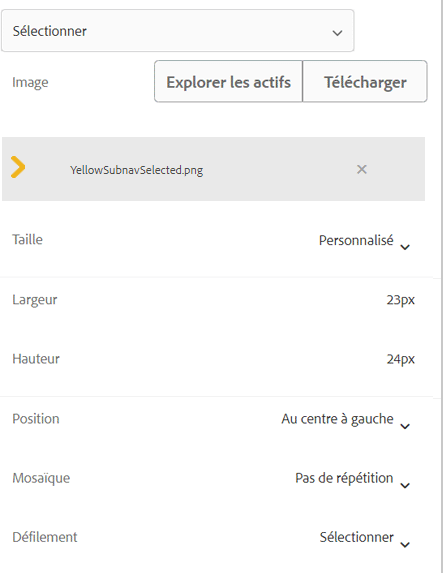
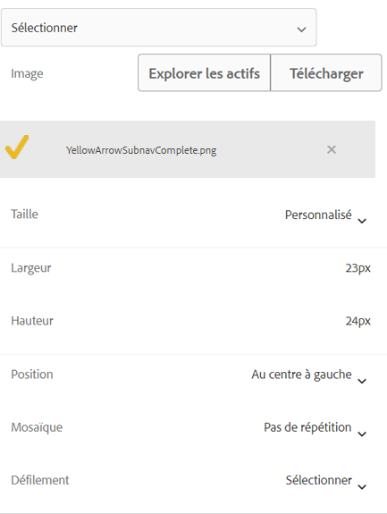

# Ajouter des icônes pour différencier les onglets actifs et terminés

Lorsque vous disposez d’un formulaire adaptatif avec une navigation par onglets à gauche, vous pouvez afficher des icônes pour indiquer le statut de l’onglet. Par exemple, vous pouvez afficher des icônes pour indiquer un onglet principal et un onglet terminé, comme illustré dans la copie d’écran ci-dessous.

## Créer un formulaire adaptatif

Cet exemple de formulaire adaptatif simple repose sur le modèle de base et le thème Canvas 3.0.
Téléchargez les [icônes présentées dans l’article](assets/icons.zip) ici.

## Personnaliser l’état par défaut

Ouvrez le formulaire en mode d’édition.
Dans le calque de style, sélectionnez un onglet (onglet Général, par exemple).
Lors de l’ouverture de l’éditeur de style de l’onglet, vous vous trouvez dans l’état par défaut, comme illustré dans la copie d’écran ci-dessous.

Définissez les propriétés CSS d’état par défaut, comme illustré ci-dessous.
| Catégorie | Nom de la propriété | Valeur de la propriété |
|:—|:—|:—|
| Dimensions et position | Largeur | 50 px |
| Texte | Épaisseur de la police | Gras |
| Texte | Couleur | #FFF |
| Texte | Hauteur de ligne | 3 |
| Texte | Alignement du texte | Gauche |
| Arrière-plan | Couleur | #056dae |

Enregistrez vos modifications.

## Personnaliser l’état actif

Assurez-vous d’être à l’état actif et appliquez un style aux propriétés CSS suivantes.

| Catégorie | Nom de la propriété | Valeur de la propriété |
|:---|:---|:---|
| Dimensions et position | Largeur | 50 px |
| Texte | Épaisseur de la police | Gras |
| Texte | Couleur | #FFF |
| Texte | Hauteur de ligne | 3 |
| Texte | Alignement du texte | Gauche |
| Arrière-plan | Couleur | #056dae |

Personnalisez l’image d’arrière-plan comme illustré dans la copie d’écran ci-dessous.

Enregistrez vos modifications.

## Personnaliser l’état visité

Assurez-vous d’être à l’état visité et personnalisez les propriétés suivantes.

| Catégorie | Nom de la propriété | Valeur de la propriété |
|:---|:---|:---|
| Dimensions et position | Largeur | 50 px |
| Texte | Épaisseur de la police | Gras |
| Texte | Couleur | #FFF |
| Texte | Hauteur de ligne | 3 |
| Texte | Alignement du texte | Gauche |
| Arrière-plan | Couleur | #056dae |

Personnalisez l’image d’arrière-plan comme illustré dans la copie d’écran ci-dessous.

Enregistrez vos modifications.

Prévisualisez le formulaire et vérifiez que les icônes fonctionnent comme prévu.
