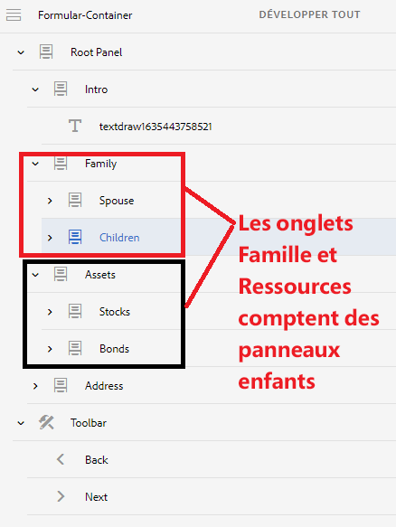

# Onglets de navigation avec plusieurs panneaux

Lorsque votre formulaire comporte des onglets de navigation de gauche et que l’un des onglets comporte plusieurs panneaux, vous pouvez masquer le titre des panneaux enfants tout en naviguant entre les onglets et les panneaux enfants de cet onglet.

## Créer un formulaire adaptatif

Créez un formulaire adaptatif avec la structure suivante. Le panneau racine contient des panneaux enfants qui s’affichent sous forme d’onglets sur la gauche. Certains de ces « **onglets** » possèdent des panneaux enfants supplémentaires. Par exemple, l’onglet Famille comporte deux panneaux enfants appelés Conjoint ou conjointe et Enfants.

Une barre d’outils est également ajoutée sous conteneur de formulaires avec les boutons Précédent et Suivant.




Le comportement par défaut de ce formulaire consiste à afficher tous les panneaux à gauche, puis à naviguer d’un onglet à l’autre en cliquant sur le bouton Suivant.

Pour modifier ce comportement par défaut, procédez comme suit :

>[!VIDEO](https://video.tv.adobe.com/v/338369?quality=12&learn=on)


Ajoutez le code suivant à l’événement clic du bouton **Suivant** à l’aide de l’éditeur de code.

```javascript
window.guideBridge.setFocus(null, 'nextItemDeep', true);
```

Ajoutez le code suivant à l’événement clic du bouton **Précédent** à l’aide de l’éditeur de code.

```javascript
window.guideBridge.setFocus(null, 'prevItemDeep', true);
```

Le code ci-dessus vous aidera à naviguer entre les onglets et les panneaux enfants de chaque onglet.

## Masquer le titre des panneaux enfants

Utilisez l’éditeur de style pour masquer le titre des panneaux enfants des onglets.

>[!VIDEO](https://video.tv.adobe.com/v/338370?quality=12&learn=on)

>[!NOTE]
>
>La fonctionnalité décrite dans cet article ne fonctionne pas dans le dernier onglet. Par exemple, si l’onglet Adresse comporte des panneaux enfants, cette fonctionnalité ne fonctionnera pas.
