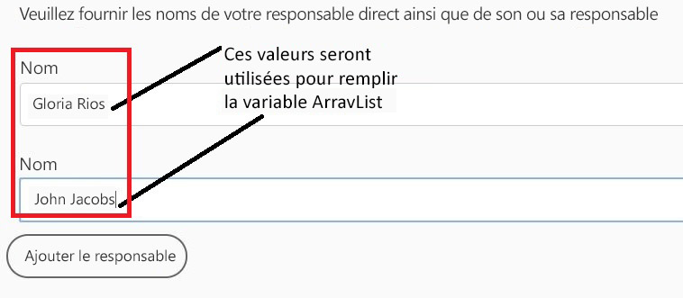
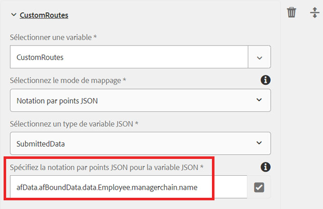

# Variable ArrayList dans le flux de travail AEM

Des variables de type ArrayList ont été introduites dans AEM Forms 6.5. Un cas d&#39;utilisation courant pour l&#39;utilisation de la variable ArrayList consiste à définir des itinéraires personnalisés à utiliser dans AssignTask.

Pour utiliser la variable ArrayList dans un flux de travail AEM, vous devez créer un formulaire adaptatif qui génère des éléments répétitifs dans les données envoyées. Une pratique courante consiste à définir un schéma qui contient un élément de tableau. Aux fins de cet article, j&#39;ai créé un schéma JSON simple contenant des éléments de tableau. Le cas d&#39;utilisation consiste à ce qu&#39;un employé remplisse un état des dépenses. Dans l&#39;état des dépenses, nous capturons le nom du responsable de l&#39;expéditeur et celui du responsable. Les noms du gestionnaire sont stockés dans un tableau appelé managerchain. La capture d&#39;écran ci-dessous montre le formulaire de rapport de dépenses et les données de l&#39;envoi de Forms adaptatif.



Voici les données issues de l’envoi du formulaire adaptatif. Le formulaire adaptatif était basé sur le schéma JSON. Les données liées au schéma sont stockées sous l’élément de données de l’élément afBoundData. La chaîne de gestion est un tableau et nous devons renseigner la liste ArrayList avec l&#39;élément name de l&#39;objet dans le tableau managerchain.

```json
{
    "afData": {
        "afUnboundData": {
            "data": {
                "numericbox_2762582281554154833426": 700
            }
        },
        "afBoundData": {
            "data": {
                "Employee": {
                    "Name": "Conrad Simms",
                    "Department": "IT",
                    "managerchain": [{
                        "name": "Gloria Rios"
                    }, {
                        "name": "John Jacobs"
                    }]
                },
                "expense": [{
                    "description": "Hotel",
                    "amount": 300
                }, {
                    "description": "Air Fare",
                    "amount": 400
                }]
            }
        },
        "afSubmissionInfo": {
            "computedMetaInfo": {},
            "stateOverrides": {},
            "signers": {},
            "afPath": "/content/dam/formsanddocuments/helpx/travelexpensereport",
            "afSubmissionTime": "20190402102953"
            }
        }
}
```

Pour initialiser la variable ArrayList de la chaîne de sous-type, vous pouvez utiliser le mode de mappage JSON Dot Notation ou XPath. La capture d&#39;écran suivante vous montre comment renseigner une variable ArrayList appelée CustomRoutes à l&#39;aide de la notation de point JSON. Assurez-vous de pointer vers un élément d&#39;un objet de tableau comme le montre la capture d&#39;écran ci-dessous. Nous renseignons le tableau CustomRoutes ArrayList avec les noms de l&#39;objet de tableau managerchain.
La liste de tableaux CustomRoutes est ensuite utilisée pour renseigner les itinéraires dans le composant AssignTask

Une fois que la variable CustomRoutes ArrayList est initialisée avec les valeurs des données envoyées, les Routes du composant AssignTask sont ensuite renseignées à l&#39;aide de la variable CustomRoutes. La capture d&#39;écran ci-dessous vous montre les itinéraires personnalisés dans une tâche AssignTask


Pour tester ce processus sur votre système, suivez les étapes ci-après.

* Téléchargez et enregistrez le fichier ArrayListVariable.zip dans votre système de fichiers.
* [Importer le ](assets/arraylistvariable.zip) fichier zip à l’aide de l’AEM Package Manager
* [Ouvrez le formulaire TravelExpenseReport.](http://localhost:4502/content/dam/formsanddocuments/helpx/travelexpensereport/jcr:content?wcmmode=disabled)
* Entrez deux ou trois dépenses et les deux noms du directeur
* Cliquez sur le bouton Envoyer.
* [Ouvrez votre boîte de réception](http://localhost:4502/aem/inbox)
* Vous devriez voir une nouvelle tâche intitulée &quot;Affecter à l&#39;administrateur des dépenses&quot;.
* Ouvrez le formulaire associé à la tâche.
* Vous devriez voir deux itinéraires personnalisés avec les noms du responsable
   [Explorez le processus ReviewExpenseReportWorkflow.](http://localhost:4502/editor.html/conf/global/settings/workflow/models/ReviewExpenseReport.html) Ce processus utilise la variable ArrayList, la variable de type JSON, l’éditeur de règles dans le composant OrSplit.
