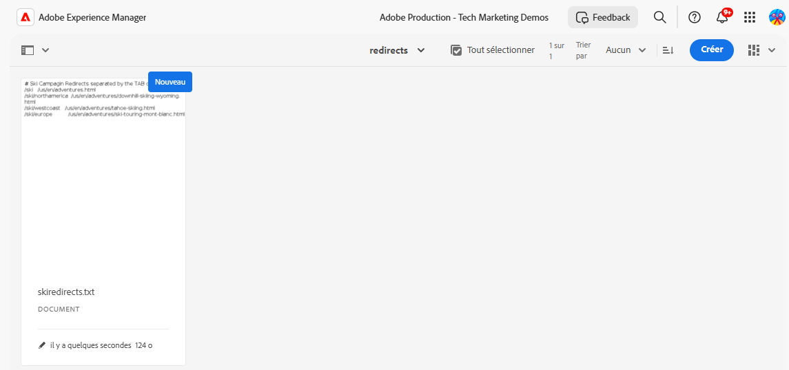
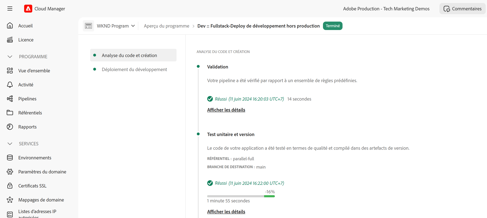

# Mise en œuvre des redirections d’URL sans pipeline

Découvrez comment implémenter les [redirections d’URL sans pipeline](https://experienceleague.adobe.com/fr/docs/experience-manager-cloud-service/content/implementing/content-delivery/pipeline-free-url-redirects) dans AEM as a Cloud Service pour permettre à l’équipe marketing de gérer les redirections sans avoir besoin d’un développeur ou d’une développeuse.

Il existe plusieurs options pour gérer les redirections d’URL dans AEM. Pour plus d’informations, consultez [Redirections d’URL](url-redirection.md).

Le tutoriel porte sur la création de redirections d’URL sous la forme de paires clé-valeur dans un fichier texte comme [Apache RewriteMap](https://httpd.apache.org/docs/2.4/rewrite/rewritemap.html) et utilise une configuration spécifique à AEM as a Cloud Service pour les charger dans le module Apache/Dispatcher.

## Prérequis

Les éléments suivants sont requis afin de terminer ce tutoriel :

- Environnement AEM as a Cloud Service avec version **18311 ou ultérieure**.

- L’exemple de projet [WKND Sites](https://github.com/adobe/aem-guides-wknd) doit être déployé dessus.

## Cas d’utilisation de tutoriel

À des fins de démonstration, supposons que l’équipe marketing de WKND lance une nouvelle campagne de ski. Elle souhaite créer de courtes URL pour les pages Adventure en ski et les gérer elle-même, comme elle le fait pour le contenu. Elle a décidé d’utiliser l’approche [redirections d’URL sans pipeline](https://experienceleague.adobe.com/fr/docs/experience-manager-cloud-service/content/implementing/content-delivery/pipeline-free-url-redirects) pour gérer les redirections d’URL.

En fonction des exigences de l’équipe marketing, vous trouverez ci-dessous les redirections d’URL à créer.

| URL source | URL cible |
|------------|------------|
| /ski | /us/en/adventures.html |
| /ski/northamerica | /us/en/adventures/downhill-skiing-wyoming.html |
| /ski/westcoast | /us/en/adventures/tahoe-skiing.html |
| /ski/europe | /us/en/adventures/ski-touring-mont-blanc.html |

Maintenant, voyons comment gérer ces redirections d’URL et les configurations Dispatcher ponctuelles requises dans l’environnement AEM as a Cloud Service.

## Comment gérer les redirections d’URL{#manage-redirects}

Pour gérer les redirections d’URL, plusieurs options sont disponibles. Explorons-les.

### Fichier texte dans la gestion des ressources numériques

Les redirections d’URL peuvent être gérées sous la forme de paires clé-valeur dans un fichier texte et téléchargées dans la gestion des ressources numériques (DAM) d’AEM.

Par exemple, les redirections d’URL ci-dessus peuvent être enregistrées dans un fichier texte nommé `skicampaign.txt` et téléchargées dans le dossier DAM @ `/content/dam/wknd/redirects`. Après révision et approbation, l’équipe marketing peut publier le fichier texte.

```
# Ski Campaign Redirects separated by the TAB character
/ski      /us/en/adventures.html
/ski/northamerica  /us/en/adventures/downhill-skiing-wyoming.html
/ski/westcoast   /us/en/adventures/tahoe-skiing.html
/ski/europe          /us/en/adventures/ski-touring-mont-blanc.html
```



### ACS Commons : gestionnaire de mappage de redirection

L’élément [ACS Commons : gestionnaire de mappage de redirection](https://adobe-consulting-services.github.io/acs-aem-commons/features/redirect-map-manager/index.html) fournit une interface conviviale pour gérer les redirections d’URL.

Par exemple, l’équipe marketing peut créer une page *Mappages de redirection* nommée `SkiCampaign` et ajouter les redirections d’URL ci-dessus à l’aide de l’onglet **Modifier les entrées**. Les redirections d’URL sont disponibles à l’adresse `/etc/acs-commons/redirect-maps/skicampaign/jcr:content.redirectmap.txt`.


>[!IMPORTANT]
>
>La version ACS Commons **6.7.0 ou une version ultérieure** est requise pour utiliser le gestionnaire de mappage de redirection. Pour plus d’informations, consultez [ ACS Commons : gestionnaire de redirection](https://adobe-consulting-services.github.io/acs-aem-commons/features/redirect-manager/index.html).

### ACS Commons : gestionnaire de redirection

Alternativement, [ACS Commons : gestionnaire de redirection](https://adobe-consulting-services.github.io/acs-aem-commons/features/redirect-manager/index.html) fournit également une interface conviviale pour gérer les redirections d’URL.

Par exemple, l’équipe marketing peut créer une configuration nommée `/conf/wknd` et ajouter les redirections d’URL ci-dessus à l’aide du bouton **+ Configuration de la redirection**. Les redirections d’URL sont disponibles à l’adresse `/conf/wknd/settings/redirects.txt`.


>[!IMPORTANT]
>
>La version ACS Commons **6.10.0 ou ultérieure** est requise pour utiliser le gestionnaire de redirection. Pour plus d’informations, consultez [ACS Commons : gestionnaire de redirection](https://adobe-consulting-services.github.io/acs-aem-commons/features/redirect-manager/subpages/rewritemap.html).

## Comment configurer le Dispatcher

Pour charger les redirections d’URL en tant que RewriteMap et les appliquer aux requêtes entrantes, les configurations Dispatcher suivantes sont requises.

### Activer le module Dispatcher pour le mode flexible

Tout d’abord, vérifiez que le module Dispatcher est activé pour le _mode flexible_. La présence du fichier `USE_SOURCES_DIRECTLY` dans le dossier `dispatcher/src/opt-in` indique que le Dispatcher est en mode flexible.

### Charger les redirections d’URL en tant que RewriteMap

Créez ensuite un nouveau fichier de configuration `managed-rewrite-maps.yaml` dans le dossier `dispatcher/src/opt-in` avec la structure suivante.

```yaml
maps:
- name: <MAPNAME>.map # e.g. skicampaign.map
    path: <ABSOLUTE_PATH_TO_URL_REDIRECTS_FILE> # e.g. /content/dam/wknd/redirects/skicampaign.txt, /etc/acs-commons/redirect-maps/skicampaign/jcr:content.redirectmap.txt, /conf/wknd/settings/redirects.txt
    wait: false # Optional, default is false, when true, the Apache waits for the map to be loaded before starting
    ttl: 300 # Optional, default is 300 seconds, the reload interval for the map
```

Pendant le déploiement, le Dispatcher crée le fichier `<MAPNAME>.map` dans le dossier `/tmp/rewrites`.

>[!IMPORTANT]
>
> Le nom de fichier (`managed-rewrite-maps.yaml`) et l’emplacement (`dispatcher/src/opt-in`) doivent être exactement tels que mentionnés ci-dessus. Considérez-les comme une convention à suivre.

### Appliquer les redirections d’URL aux requêtes entrantes

Enfin, créez ou mettez à jour le fichier de configuration de réécriture Apache pour utiliser le mappage ci-dessus (`<MAPNAME>.map`). Par exemple, utilisons le fichier `rewrite.rules` du dossier `dispatcher/src/conf.d/rewrites` pour appliquer les redirections d’URL.

```
...
# Use the RewriteMap to define the URL redirects
RewriteMap <MAPALIAS> dbm=sdbm:/tmp/rewrites/<MAPNAME>.map

RewriteCond ${<MAPALIAS>:$1} !=""
RewriteRule ^(.*)$ ${<MAPALIAS>:$1|/} [L,R=301]    
...
```

### Exemples de configurations

Examinons les configurations Dispatcher pour chacune des options de gestion de redirection d’URL mentionnées [ci-dessus](#manage-redirects).

>[!BEGINTABS]

>[!TAB Fichier texte dans la gestion des ressources numériques]

Lorsque les redirections d’URL sont gérées comme des paires clé-valeur dans un fichier texte et chargées dans la gestion des ressources numériques, les configurations sont les suivantes.

[!BADGE dispatcher/src/opt-in/managed-rewrite-maps.yaml]{type=Neutral tooltip="Nom de fichier de l’exemple de code ci-dessous."}

```yaml
maps:
- name: skicampaign.map
  path: /content/dam/wknd/redirects/skicampaign.txt
```

[!BADGE dispatcher/src/conf.d/rewrites/rewrite.rules]{type=Neutral tooltip="Nom de fichier de l’exemple de code ci-dessous."}

```
...

# The DAM-managed skicampaign.txt file as skicampaign.map
RewriteMap skicampaign dbm=sdbm:/tmp/rewrites/skicampaign.map

# Apply the RewriteMap for matching request URIs
RewriteCond ${skicampaign:$1} !=""
RewriteRule ^(.*)$ ${skicampaign:$1|/} [L,R=301]

...
```

>[!TAB ACS Commons : gestionnaire de mappage de redirection]

Lorsque les redirections d’URL sont gérées à l’aide d’ACS Commons : gestionnaire de mappage de redirection, les configurations sont les suivantes.

[!BADGE dispatcher/src/opt-in/managed-rewrite-maps.yaml]{type=Neutral tooltip="Nom de fichier de l’exemple de code ci-dessous."}

```yaml
maps:
- name: skicampaign.map
  path: /etc/acs-commons/redirect-maps/skicampaign/jcr:content.redirectmap.txt
```

[!BADGE dispatcher/src/conf.d/rewrites/rewrite.rules]{type=Neutral tooltip="Nom de fichier de l’exemple de code ci-dessous."}

```
...

# The Redirect Map Manager-managed skicampaign.map
RewriteMap skicampaign dbm=sdbm:/tmp/rewrites/skicampaign.map

# Apply the RewriteMap for matching request URIs
RewriteCond ${skicampaign:$1} !=""
RewriteRule ^(.*)$ ${skicampaign:$1|/} [L,R=301]

...
```

>[!TAB ACS Commons : gestionnaire de redirection]

Lorsque les redirections d’URL sont gérées à l’aide d’ACS Commons : gestionnaire de redirection, les configurations sont les suivantes.

[!BADGE dispatcher/src/opt-in/managed-rewrite-maps.yaml]{type=Neutral tooltip="Nom de fichier de l’exemple de code ci-dessous."}

```yaml
maps:
- name: skicampaign.map
  path: /conf/wknd/settings/redirects.txt
```

[!BADGE dispatcher/src/conf.d/rewrites/rewrite.rules]{type=Neutral tooltip="Nom de fichier de l’exemple de code ci-dessous."}

```
...

# The Redirect Manager-managed skicampaign.map
RewriteMap skicampaign dbm=sdbm:/tmp/rewrites/skicampaign.map

# Apply the RewriteMap for matching request URIs
RewriteCond ${skicampaign:$1} !=""
RewriteRule ^(.*)$ ${skicampaign:$1|/} [L,R=301]

...
```

>[!ENDTABS]

## Comment déployer des configurations

>[!IMPORTANT]
>
>Le terme *sans pipeline* est utilisé pour souligner que les configurations ne sont *déployées qu’une seule fois* et que l’équipe marketing peut gérer les redirections d’URL en mettant à jour le fichier texte.

Pour déployer les configurations, utilisez le pipeline [full-stack](https://experienceleague.adobe.com/fr/docs/experience-manager-cloud-service/content/implementing/using-cloud-manager/cicd-pipelines/introduction-ci-cd-pipelines#full-stack-pipeline) ou [configuration de niveau web](https://experienceleague.adobe.com/fr/docs/experience-manager-cloud-service/content/implementing/using-cloud-manager/cicd-pipelines/introduction-ci-cd-pipelines#web-tier-config-pipelines) dans [Cloud Manager](https://my.cloudmanager.adobe.com/).




Une fois le déploiement réussi, les redirections d’URL sont actives et l’équipe marketing peut les gérer sans avoir besoin d’un développeur ou d’une développeuse.

## Comment tester les redirections d’URL

Testons les redirections d’URL à l’aide du navigateur ou de la commande `curl`. Accédez à l’URL `/ski/westcoast` et vérifiez qu’elle redirige vers `/us/en/adventures/tahoe-skiing.html`.

## Résumé

Dans ce tutoriel, vous avez appris à gérer les redirections d’URL à l’aide de configurations sans pipeline dans l’environnement AEM as a Cloud Service.

L’équipe marketing peut gérer les redirections d’URL sous la forme de paires clé-valeur dans un fichier texte et les charger dans la gestion des ressources numériques ou utiliser ACS Commons : gestionnaire de mappage de redirection ou gestionnaire de redirection. Les configurations Dispatcher sont mises à jour pour charger les redirections d’URL en tant que RewriteMap et les appliquer aux requêtes entrantes.

## Ressources supplémentaires

- [Redirections d’URL sans pipeline](https://experienceleague.adobe.com/fr/docs/experience-manager-cloud-service/content/implementing/content-delivery/pipeline-free-url-redirects)
- [Redirections d’URL](url-redirection.md)
