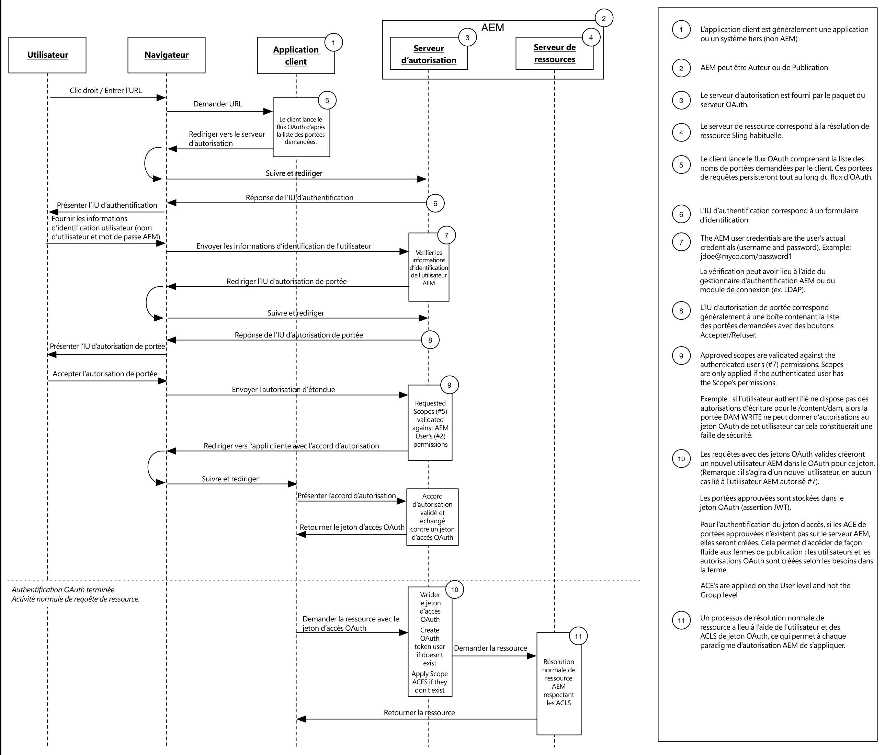

# Développement d’étendues OAuth

L’application d’étendues OAuth extensibles permet d’obtenir du contrôle d&#39;accès pour les ressources provenant d’une application cliente autorisée par un utilisateur final. Le diagramme ci-dessous illustre le flux de requêtes dans le contexte de l&#39;AEM.

AEM fournit trois étendues :

* Profil
* Accès hors connexion
* Répliquer

AEM étendues OAuth extensibles permettent de définir d’autres étendues personnalisées. Par exemple, une portée personnalisée peut être développée et déployée sur AEM qui permet à une application mobile autorisée via OAuth d’être limitée à la lecture, mais pas à l’écriture de ressources.

OAuth est la méthode privilégiée pour autoriser une application cliente, car elle utilise un jeton d&#39;accès au lieu d’exiger que les informations d’identification d’un utilisateur AEM soient fournies à cette application.

* [Vue du code](https://github.com/Adobe-Consulting-Services/acs-aem-samples/blob/legacy/bundle/src/main/java/com/adobe/acs/samples/authentication/oauth/impl/SampleScopeWithPrivileges.java)
