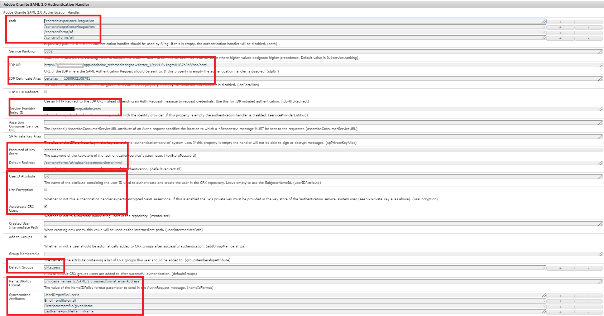

# Authentification sur l’instance de création AEM à l’aide d’OKTA

> Voir [Authentification SAML 2.0](https://experienceleague.adobe.com/docs/experience-manager-learn/cloud-service/authentication/saml-2-0.html?lang=fr) pour obtenir des instructions sur la configuration d’OKTA avec AEM as a Cloud Service.

La première étape consiste à configurer votre application sur le portail OKTA. Une fois votre application approuvée par votre administrateur ou votre administratrice OKTA, vous avez accès au certificat du fournisseur d’identité et à l’URL d’authentification unique. Voici les paramètres généralement utilisés pour enregistrer une nouvelle application.

* **Nom de l’application :** il s’agit du nom de votre application. Veillez à attribuer un nom unique à votre application.
* **Destinataire SAML :** après l’authentification à partir d’OKTA, il s’agit de l’URL qui sera atteinte sur votre instance AEM avec la réponse SAML. Le gestionnaire d’authentification SAML intercepte normalement toutes les URL de avec /saml_login, mais il est préférable de l’ajouter après la racine de votre application.
* **Audience SAML** : il s’agit de l’URL du domaine de votre application. N’utilisez pas de protocole (HTTP ou HTTPS) dans l’URL du domaine.
* **ID de nom SAML :** sélectionnez E-mail dans la liste déroulante.
* **Environnement** : sélectionnez l’environnement approprié.
* **Attributs** : il s’agit des attributs que vous obtenez sur l’utilisateur ou l’utilisatrice dans la réponse SAML. Spécifiez-les selon vos besoins.

## Ajouter le certificat (fournisseur d’identité) OKTA au Trust Store AEM

Puisque les assertions SAML sont chiffrées, nous devons ajouter le certificat de fournisseur d’identité (OKTA) au Trust Store AEM, afin de permettre une communication sécurisée entre OKTA et AEM.
[Initialisez le Trust Store](http://localhost:4502/libs/granite/security/content/truststore.html), si ce n’est pas déjà fait.
Souvenez-vous du mot de passe du Trust Store. Nous devrons utiliser ce mot de passe plus tard dans ce processus.

* Accédez au [Trust Store mondial](http://localhost:4502/libs/granite/security/content/truststore.html).
* Cliquez sur « Ajouter un certificat à partir du fichier CER ». Ajoutez le certificat de fournisseur d’identité fourni par OKTA et cliquez sur Envoyer.

  >[!NOTE]
  >
  >Ne mappez le certificat à aucun utilisateur ou utilisatrice.

Lors de l’ajout du certificat au Trust Store, vous devez obtenir l’alias du certificat, comme illustré dans la capture d’écran ci-dessous. Dans votre cas, le nom d’alias peut être différent.

**Notez l’alias du certificat. Vous en aurez besoin lors des étapes suivantes.**

### Configuration du gestionnaire d’authentification SAML

Accédez à [configMgr](http://localhost:4502/system/console/configMgr).
Recherchez et ouvrez « Gestionnaire d’authentification Adobe Granite SAML 2.0 ».
Indiquez les propriétés suivantes, comme indiqué ci-dessous.
Voici les propriétés clés à spécifier :

* **chemin** : il s’agit du chemin où le gestionnaire d’authentification est déclenché.
* **URL IdP** : il s’agit de votre URL de fournisseur d’identité fournie par OKTA.
* **Alias de certificat IDP** : alias obtenu lorsque vous avez ajouté le certificat de fournisseur d’identité au Trust Store AEM.
* **ID d’entité du fournisseur de services** : il s’agit du nom de votre serveur AEM.
* **Mot de passe du Key Store** : mot de passe du trust store que vous avez utilisé.
* **Redirection par défaut** : URL vers laquelle rediriger une authentification réussie.
* **Attribut UserID** : uid
* **Utiliser le chiffrement** : false
* **Création automatique d’utilisateurs CRX** : true
* **Ajouter aux groupes** : true
* **Groupes par défaut** : oktausers (groupe auquel les utilisateurs et utilisatrices sont ajoutés. Vous pouvez indiquer n’importe quel groupe existant dans AEM)
* **NamedIDPolicy** : spécifie les contraintes sur l’identifiant de nom à utiliser pour représenter l’objet demandé. Copiez et collez la chaîne mise en surbrillance suivante **urn:oasis:names:tc:SAML:2.0:nameidformat:emailAddress**
* **Attributs synchronisés** : il s’agit des attributs stockés à partir de l’assertion SAML dans le profile AEM.

### Configurer le filtre de référent Apache Sling

Accédez à [configMgr](http://localhost:4502/system/console/configMgr).
Recherchez et ouvrez « Filtre de référent Apache Sling ». Définissez les propriétés suivantes comme indiqué ci-dessous :

* **Autoriser vide** : false.
* **Autoriser les hôtes** : nom d’hôte de fournisseur d’identité (différent dans votre cas).
* **Autoriser l’hôte Regexp** : nom d’hôte de fournisseur d’identité (différent dans votre cas).
Copie d’écran des propriétés du filtre de référent Sling.

#### Configurer la journalisation de débogage pour l’intégration OKTA

Lors de la configuration de l’intégration OKTA sur AEM, il peut s’avérer utile de consulter les journaux de débogage pour le gestionnaire d’authentification SAML d’AEM. Pour définir le niveau de journalisation sur le débogage, créez une configuration de journal Sling via la console web OSGi AEM.

N’oubliez pas de supprimer ou de désactiver ce journal dans les environnements d’évaluation et de production pour réduire le bruit de journal.

Lors de la configuration de l’intégration OKTA sur AEM, il peut s’avérer utile de consulter les journaux de débogage pour le gestionnaire d’authentification SAML d’AEM. Pour définir le niveau de journalisation sur le débogage, créez une configuration de journal Sling via la console web OSGi AEM.
**N’oubliez pas de supprimer ou de désactiver ce journal dans les environnements d’évaluation et de production pour réduire le bruit de journal.**
* Accédez à [configMgr](http://localhost:4502/system/console/configMgr).

* Recherchez et ouvrez « Configuration du journal de journalisation Apache Sling ».
* Créez un journal avec la configuration suivante :
   * **Niveau de journalisation** : débogage.
   * **Fichier journal** : logs/saml.log.
   * **Journal** : com.adobe.granite.auth.saml.
* Cliquez sur Enregistrer pour enregistrer vos paramètres.

#### Tester votre configuration OKTA

Déconnectez-vous de votre instance AEM. Essayez d’accéder au lien. Vous devriez voir l’authentification unique OKTA en action.
