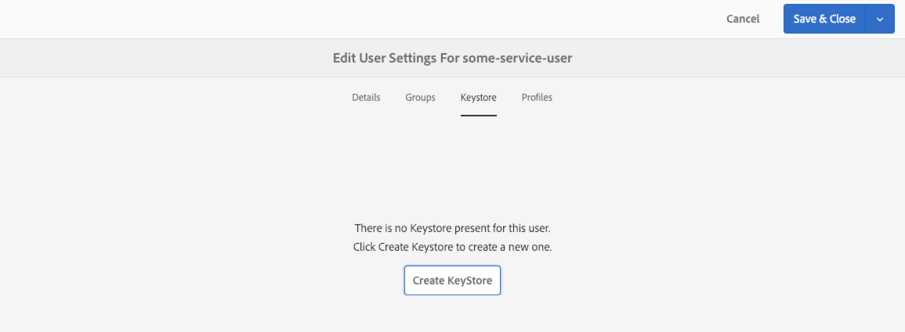

# Configuration de clés publiques et privées à utiliser avec l’Adobe I/O

AEM utilise des paires clé publique/clé privée pour communiquer en toute sécurité avec l’Adobe I/O et d’autres services Web. Ce court didacticiel illustre comment générer des clés et des fichiers de stockage de clés compatibles à l&#39;aide de l&#39;outil de ligne de commande [!DNL openssl] qui fonctionne avec l&#39;AEM et l&#39;Adobe I/O.

>[!CAUTION]
>
>Ce guide crée des clés autosignées utiles pour le développement et l’utilisation dans les environnements inférieurs. Dans les scénarios de production, les clés sont généralement générées et gérées par l’équipe de sécurité informatique d’une entreprise.

## Générer la paire de clés publique/privée {#generate-the-public-private-key-pair}

La [[!DNL openssl]](https://www.openssl.org/docs/man1.0.2/man1/openssl.html) commande [[!DNL req] ](https://www.openssl.org/docs/man1.0.2/man1/req.html) de l&#39;outil de ligne de commande  peut être utilisée pour générer une paire de clés compatible avec Adobe I/O et Adobe Experience Manager.

```shell
$ openssl req -x509 -sha256 -nodes -days 365 -newkey rsa:2048 -keyout private.key -out certificate.crt
```

Pour exécuter la commande [!DNL openssl generate], fournissez les informations relatives au certificat lorsque cela est demandé. L’Adobe I/O et l’AEM se soucient peu de ces valeurs, mais ils doivent s’aligner sur elles et décrire votre clé.

```
Generating a 2048 bit RSA private key
...........................................................+++
...+++
writing new private key to 'private.key'
-----
You are about to be asked to enter information that will be incorporated
into your certificate request.
What you are about to enter is what is called a Distinguished Name or a DN.
There are quite a few fields but you can leave some blank
For some fields there will be a default value,
If you enter '.', the field will be left blank.
-----
Country Name (2 letter code) []:US
State or Province Name (full name) []:CA
Locality Name (eg, city) []:San Jose
Organization Name (eg, company) []:Example Co
Organizational Unit Name (eg, section) []:Digital Marketing
Common Name (eg, fully qualified host name) []:com.example
Email Address []:me@example.com
```

## Ajouter la paire de clés à un nouveau fichier de stockage de clés {#add-key-pair-to-a-new-keystore}

Les paires de clés peuvent être ajoutées à un nouveau fichier de stockage de clés [!DNL PKCS12]. Dans le cadre de la commande [[!DNL openssl]'s [!DNL pcks12] ](https://www.openssl.org/docs/man1.0.2/man1/pkcs12.html), le nom du fichier de stockage de clés (par `-  caname`), le nom de la clé (par `-name`) et le mot de passe du fichier de stockage de clés (par `-  passout`) sont définis.

Ces valeurs sont requises pour charger le fichier de stockage des clés et les clés dans AEM.

```shell
$ openssl pkcs12 -export -caname my-keystore -in certificate.crt -name my-key -inkey private.key -out keystore.p12 -passout pass:my-password
```

La sortie de cette commande est un fichier `keystore.p12`.

>[!NOTE]
>
>Les valeurs de paramètre **[!DNL my-keystore]**, **[!DNL my-key]** et **[!DNL my-password]** doivent être remplacées par vos propres valeurs.

## Vérification du contenu du fichier de stockage des clés {#verify-the-keystore-contents}

L&#39;outil de ligne de commande Java [[!DNL keytool] ](https://docs.oracle.com/middleware/1213/wls/SECMG/keytool-summary-appx.htm#SECMG818) permet de visualiser les clés d&#39;un fichier de stockage de clés pour s&#39;assurer qu&#39;elles sont correctement chargées dans le fichier de stockage de clés ([!DNL keystore.p12]).

```shell
$ keytool -keystore keystore.p12 -list

Enter keystore password: my-password

Keystore type: jks
Keystore provider: SUN

Your keystore contains 1 entry

my-key, Feb 5, 2019, PrivateKeyEntry,
Certificate fingerprint (SHA1): 7C:6C:25:BD:52:D3:3B:29:83:FD:A2:93:A8:53:91:6A:25:1F:2D:52
```


## Ajouter le fichier de stockage des clés à AEM {#adding-the-keystore-to-aem}

AEM utilise la **clé privée** générée pour communiquer en toute sécurité avec l’Adobe I/O et d’autres services Web. Pour que la clé privée soit accessible à AEM, elle doit être installée dans le fichier de stockage des clés d’un utilisateur AEM.

Accédez à **AEM > [!UICONTROL Outils] > [!UICONTROL Sécurité] > [!UICONTROL Utilisateurs]** et **modifier l&#39;utilisateur** auquel la clé privée doit être associée.

### Création d’un fichier de stockage de clés AEM {#create-an-aem-keystore}


*AEMAEM >  [!UICONTROL Outils]  >  [!UICONTROL Sécurité]  >  [!UICONTROL Utilisateurs]  > Modifier l’utilisateur*

Si vous êtes invité à créer un fichier de stockage de clés, faites-le. Ce fichier de stockage de clés n&#39;existera qu&#39;en AEM et n&#39;est PAS le fichier de stockage de clés créé par openssl. Le mot de passe peut être n&#39;importe quoi et ne doit pas être identique au mot de passe utilisé dans la commande [!DNL openssl].

### Installez la clé privée via le fichier de stockage des clés {#install-the-private-key-via-the-keystore}.


*[!UICONTROL AEMUser] >  [!UICONTROL Keystore] >  [!UICONTROL Ajouter la clé privée à partir du keystore]*

Dans la console de stockage des clés de l’utilisateur, cliquez sur **[!UICONTROL Ajouter la clé privée à partir du fichier KeyStore]** et ajoutez les informations suivantes :

* **[!UICONTROL Nouvel alias]** : l’alias de la clé en AEM. Il peut s’agir de n’importe quoi et ne doit pas nécessairement correspondre au nom du fichier de stockage de clés créé avec la commande openssl.
* **[!UICONTROL Fichier]** KeyStore : sortie de la commande openssl pkcs12 (keystore.p12)
* **[!UICONTROL KeyStore File Password]** : Mot de passe défini dans la commande openssl pkcs12 par  `-passout` argument.
* **[!UICONTROL Alias]** de clé privée : Valeur fournie à l&#39; `-name` argument dans la commande openssl pkcs12 ci-dessus (c.-à-d.  `my-key`).
* **[!UICONTROL Mot de passe]** de clé privée : Mot de passe défini dans la commande openssl pkcs12 par  `-passout` argument.

>[!CAUTION]
>
>Le mot de passe du fichier KeyStore et le mot de passe de la clé privée sont identiques pour les deux entrées. La saisie d’un mot de passe non concordant entraîne l’importation de la clé.

### Vérifiez que la clé privée est chargée dans le fichier de stockage des clés AEM {#verify-the-private-key-is-loaded-into-the-aem-keystore}


*[!UICONTROL AEMUser] >  [!UICONTROL Keystore]*

Une fois que la clé privée a été chargée à partir du fichier de stockage de clés fourni dans le fichier de stockage de clés AEM, les métadonnées de la clé privée s’affichent dans la console de stockage de clés de l’utilisateur.

## Ajouter la clé publique à l&#39;Adobe I/O {#adding-the-public-key-to-adobe-i-o}

La clé publique correspondante doit être téléchargée sur l’Adobe I/O pour permettre à l’utilisateur du service AEM, qui dispose de la clé publique privée correspondante pour communiquer en toute sécurité.

### Créer un Adobe I/O de nouvelle intégration {#create-a-adobe-i-o-new-integration}


*[[!UICONTROL Créer une intégration]](https://console.adobe.io/)  d&#39;Adobe I/O>  [!UICONTROL Nouvelle intégration]*

La création d’une nouvelle intégration dans l’Adobe I/O nécessite le transfert d’un certificat public. Téléchargez le **certificat.crt** généré par la commande `openssl req`.

### Vérifiez que les clés publiques sont chargées dans l&#39;Adobe I/O {#verify-the-public-keys-are-loaded-in-adobe-i-o}


Les clés publiques installées et leurs dates d&#39;expiration sont répertoriées dans la console [!UICONTROL Intégrations] de l&#39;Adobe I/O. Vous pouvez ajouter plusieurs clés publiques par le biais du bouton **[!UICONTROL Ajouter une clé publique]**.

Désormais, AEM détient la clé privée et l&#39;intégration de l&#39;Adobe I/O détient la clé publique correspondante, ce qui permet aux AEM de communiquer en toute sécurité avec l&#39;Adobe I/O.
