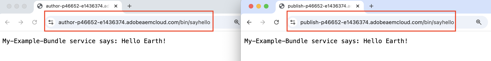

# Installer des artefacts tiers - non disponibles dans le référentiel Maven public

Découvrez comment installer des artefacts tiers *non disponibles dans le référentiel Maven public* lors de la création et du déploiement d’un projet AEM.

Les **artefacts tiers** peuvent se présenter sous les formes suivantes :

- [Lot OSGi](https://www.osgi.org/resources/architecture/) : un lot OSGi est un fichier d’archive Java™ qui contient des classes et des ressources Java et un manifeste qui décrit le lot et ses dépendances.
- [Java jar](https://docs.oracle.com/javase/tutorial/deployment/jar/basicsindex.html) : fichier d’archive Java™ contenant des classes et des ressources Java.
- [Package](https://experienceleague.adobe.com/fr/docs/experience-manager-65/content/sites/administering/contentmanagement/package-manager#what-are-packages) : un package est un fichier ZIP qui contient le contenu du référentiel sous la forme d’un système de fichiers sérialisé.

## Scénario standard

En règle générale, vous installez le lot tiers, un package *disponible* dans le référentiel Maven public, en tant que dépendance dans le fichier `pom.xml` de votre projet AEM.

Par exemple :

- Le **lot** [AEM WCM Core Components](https://github.com/adobe/aem-core-wcm-components) est ajouté en tant que dépendance dans le fichier `pom.xml` du [projet WKND](https://github.com/adobe/aem-guides-wknd/blob/main/pom.xml#L747-L753). Ici, la portée `provided` est utilisée tandis que le lot AEM WCM Core Components est fourni par l’environnement d’exécution AEM. Si le lot n’est pas fourni par l’environnement d’exécution AEM, utilisez alors la portée `compile`, qui est la portée par défaut.

- Le **package** [WKND Shared](https://github.com/adobe/aem-guides-wknd-shared) est ajouté en tant que dépendance dans le fichier `pom.xml` du [projet WKND](https://github.com/adobe/aem-guides-wknd/blob/main/pom.xml#L767-L773).


## Scénario rare

Lors de la création et du déploiement d’un projet AEM, vous devrez parfois installer un lot tiers ou un jar ou un package **qui n’est pas disponible** dans le [ référentiel central Maven](https://mvnrepository.com/) ou le [référentiel public Adobe](https://repo.adobe.com/index.html).

Cela peut être dû aux raisons suivantes :

- Le lot ou le package est fourni par une équipe interne ou un fournisseur tiers et _n’est pas disponible dans le référentiel Maven public_.

- Le fichier jar Java™ _n’est pas un lot OSGi_ et peut être disponible ou non dans le référentiel Maven public.

- Vous avez besoin d’une fonctionnalité qui n’est pas encore publiée dans la dernière version du package tiers disponible dans le référentiel Maven public. Vous avez décidé d’installer la version locale RELEASE ou SNAPSHOT.

## Conditions préalables

Les éléments suivants sont requis afin de réaliser ce tutoriel :

- Une configuration d’[environnement de développement d’AEM local](https://experienceleague.adobe.com/fr/docs/experience-manager-learn/cloud-service/local-development-environment-set-up/overview) ou d’[environnement de développement rapide (RDE)](https://experienceleague.adobe.com/fr/docs/experience-manager-learn/cloud-service/developing/rde/overview).

- Le projet [AEM WKND](https://github.com/adobe/aem-guides-wknd) _pour ajouter le lot ou jar ou package tiers_ et vérifier les modifications.

## Configuration

- Configurez l’environnement de développement local ou l’environnement RDE AEM 6.X ou AEM as a Cloud Service (AEMCS).

- Clonez et déployez le projet AEM WKND.

  ```
  $ git clone git@github.com:adobe/aem-guides-wknd.git
  $ cd aem-guides-wknd
  $ mvn clean install -PautoInstallPackage 
  ```

  Vérifiez que le rendu des pages du site WKND est correct.

## Installer un lot tiers dans un projet AEM{#install-third-party-bundle}

Installons et utilisons une démonstration OSGi [my-example-bundle](./assets/install-third-party-articafcts/my-example-bundle.zip) qui _n’est pas disponible dans le référentiel Maven public_ dans le projet AEM WKND.

Le lot **my-example-bundle** exporte le service OSCi `HelloWorldService`, sa méthode `sayHello()` renvoie un message `Hello Earth!`.

Pour plus d’informations, reportez-vous au fichier README.md dans le fichier [my-example-bundle.zip](./assets/install-third-party-articafcts/my-example-bundle.zip).

### Ajouter le lot au module `all`

La première étape consiste à ajouter le lot `my-example-bundle` au module `all` du projet WKND AEM.

- Téléchargez et extrayez le fichier [my-example-bundle.zip](./assets/install-third-party-articafcts/my-example-bundle.zip).

- Dans le module `all` du projet WKND AEM, créez la structure de répertoires `all/src/main/content/jcr_root/apps/wknd-vendor-packages/container/install`. Le répertoire `/all/src/main/content` existe, il suffit de créer les répertoires `jcr_root/apps/wknd-vendor-packages/container/install`.

- Copiez le fichier `my-example-bundle-1.0-SNAPSHOT.jar` du répertoire `target` extrait dans le répertoire `all/src/main/content/jcr_root/apps/wknd-vendor-packages/container/install` ci-dessus.

  

### Utiliser le service du lot

Utilisons le service OSGi `HelloWorldService` du lot `my-example-bundle` dans le projet WKND AEM.

- Dans le module `core` du projet WKND AEM, créez le `SayHello.java` servlet Sling @ `core/src/main/java/com/adobe/aem/guides/wknd/core/servlet`.

  ```java
  package com.adobe.aem.guides.wknd.core.servlet;
  
  import java.io.IOException;
  
  import javax.servlet.Servlet;
  import javax.servlet.ServletException;
  
  import org.apache.sling.api.SlingHttpServletRequest;
  import org.apache.sling.api.SlingHttpServletResponse;
  import org.apache.sling.api.servlets.HttpConstants;
  import org.apache.sling.api.servlets.ServletResolverConstants;
  import org.apache.sling.api.servlets.SlingSafeMethodsServlet;
  import org.osgi.service.component.annotations.Component;
  import org.osgi.service.component.annotations.Reference;
  import com.example.services.HelloWorldService;
  
  @Component(service = Servlet.class, property = {
      ServletResolverConstants.SLING_SERVLET_PATHS + "=/bin/sayhello",
      ServletResolverConstants.SLING_SERVLET_METHODS + "=" + HttpConstants.METHOD_GET
  })
  public class SayHello extends SlingSafeMethodsServlet {
  
          private static final long serialVersionUID = 1L;
  
          // Injecting the HelloWorldService from the `my-example-bundle` bundle
          @Reference
          private HelloWorldService helloWorldService;
  
          @Override
          protected void doGet(SlingHttpServletRequest request, SlingHttpServletResponse response) throws ServletException, IOException {
              // Invoking the HelloWorldService's `sayHello` method
              response.getWriter().write("My-Example-Bundle service says: " + helloWorldService.sayHello());
          }
  }
  ```

- Dans le fichier `pom.xml` racine du projet WKND AEM, ajoutez le lot `my-example-bundle` en tant que dépendance.

  ```xml
  ...
  <!-- My Example Bundle -->
  <dependency>
      <groupId>com.example</groupId>
      <artifactId>my-example-bundle</artifactId>
      <version>1.0-SNAPSHOT</version>
      <scope>system</scope>
      <systemPath>${maven.multiModuleProjectDirectory}/all/src/main/content/jcr_root/apps/wknd-vendor-packages/container/install/my-example-bundle-1.0-SNAPSHOT.jar</systemPath>
  </dependency>
  ...
  ```

  Ici :
   - La portée `system` indique que la dépendance ne doit pas être recherchée dans le référentiel Maven public.
   - `systemPath` est le chemin d’accès au fichier `my-example-bundle` dans le module `all` du projet WKND AEM.
   - `${maven.multiModuleProjectDirectory}` est une propriété Maven qui pointe vers le répertoire racine du projet multi-module.

- Dans le fichier `core/pom.xml` du module `core` du projet WKND AEM, ajoutez le lot `my-example-bundle` en tant que dépendance.

  ```xml
  ...
  <!-- My Example Bundle -->
  <dependency>
      <groupId>com.example</groupId>
      <artifactId>my-example-bundle</artifactId>
  </dependency>
  ...
  ```

- Créez et déployez le projet WKND AEM à l’aide de la commande suivante :

  ```
  $ mvn clean install -PautoInstallPackage
  ```

- Vérifiez que le servlet `SayHello` fonctionne comme prévu en accédant à l’URL `http://localhost:4502/bin/sayhello` dans le navigateur.

- Validez les modifications ci-dessus dans le référentiel du projet WKND AEM. Vérifiez ensuite les modifications dans l’environnement RDE ou AEM en exécutant le pipeline Cloud Manager.

  

La branche [tutoriel/install-3rd-party-bundle](https://github.com/adobe/aem-guides-wknd/compare/main...tutorial/install-3rd-party-bundle) du projet WKND AEM comporte les modifications ci-dessus à titre de référence.

### Apprentissages clés{#key-learnings-bundle}

Les lots OSGi qui ne sont pas disponibles dans le référentiel Maven public peuvent être installés dans un projet AEM en procédant comme suit :

- Copiez le lot OSGi dans le répertoire `jcr_root/apps/<PROJECT-NAME>-vendor-packages/container/install` du module `all`. Cette étape est nécessaire pour mettre en package et déployer le lot vers l’instance AEM.

- Mettez à jour les fichiers `pom.xml` du module racine et principal pour ajouter le lot OSGi en tant que dépendance avec la portée `system` et `systemPath` pointant vers le fichier de lot. Cette étape est nécessaire pour compiler le projet.

## Installer un fichier jar tiers dans un projet AEM

Dans cet exemple, `my-example-jar` n’est pas un lot OSGi, mais un fichier jar Java.

Installons et utilisons une démonstration [my-example-jar](./assets/install-third-party-articafcts/my-example-jar.zip) qui _n’est pas disponible dans le référentiel Maven public_ au projet WKND AEM.

**my-example-jar** est un fichier jar Java qui contient une classe `MyHelloWorldService` avec une méthode `sayHello()` qui renvoie un message `Hello World!`.

Pour plus d’informations, reportez-vous au fichier README.md dans le fichier [my-example-jar.zip](./assets/install-third-party-articafcts/my-example-jar.zip) .

### Ajouter le fichier jar au module `all`

La première étape consiste à ajouter le fichier `my-example-jar` au module `all` du projet WKND AEM.

- Téléchargez et extrayez le fichier [my-example-jar.zip](./assets/install-third-party-articafcts/my-example-jar.zip).

- Dans le module `all` du projet WKND AEM, créez la structure de répertoires `all/resource/jar`.

- Copiez le fichier `my-example-jar-1.0-SNAPSHOT.jar` du répertoire `target` extrait dans le répertoire `all/resource/jar` ci-dessus.

  

### Utiliser le service du fichier jar

Utilisons le service `MyHelloWorldService` du fichier `my-example-jar` dans le projet WKND AEM.

- Dans le module `core` du projet WKND AEM, créez le `SayHello.java` servlet Sling @ `core/src/main/java/com/adobe/aem/guides/wknd/core/servlet`.

  ```java
  package com.adobe.aem.guides.wknd.core.servlet;
  
  import java.io.IOException;
  
  import javax.servlet.Servlet;
  import javax.servlet.ServletException;
  
  import org.apache.sling.api.SlingHttpServletRequest;
  import org.apache.sling.api.SlingHttpServletResponse;
  import org.apache.sling.api.servlets.HttpConstants;
  import org.apache.sling.api.servlets.ServletResolverConstants;
  import org.apache.sling.api.servlets.SlingSafeMethodsServlet;
  import org.osgi.service.component.annotations.Component;
  
  import com.my.example.MyHelloWorldService;
  
  @Component(service = Servlet.class, property = {
          ServletResolverConstants.SLING_SERVLET_PATHS + "=/bin/sayhello",
          ServletResolverConstants.SLING_SERVLET_METHODS + "=" + HttpConstants.METHOD_GET
  })
  public class SayHello extends SlingSafeMethodsServlet {
  
      private static final long serialVersionUID = 1L;
  
      @Override
      protected void doGet(SlingHttpServletRequest request, SlingHttpServletResponse response)
              throws ServletException, IOException {
  
          // Creating an instance of MyHelloWorldService
          MyHelloWorldService myHelloWorldService = new MyHelloWorldService();
  
          // Invoking the MyHelloWorldService's `sayHello` method
          response.getWriter().write("My-Example-JAR service says: " + myHelloWorldService.sayHello());
      }
  }    
  ```

- Dans le fichier `pom.xml` racine du projet WKND AEM, ajoutez le lot `my-example-jar` en tant que dépendance.

  ```xml
  ...
  <!-- My Example JAR -->
  <dependency>
      <groupId>com.my.example</groupId>
      <artifactId>my-example-jar</artifactId>
      <version>1.0-SNAPSHOT</version>
      <scope>system</scope>
      <systemPath>${maven.multiModuleProjectDirectory}/all/resource/jar/my-example-jar-1.0-SNAPSHOT.jar</systemPath>
  </dependency>            
  ...
  ```

  Ici :
   - La portée `system` indique que la dépendance ne doit pas être recherchée dans le référentiel Maven public.
   - `systemPath` est le chemin d’accès au fichier `my-example-jar` dans le module `all` du projet WKND AEM.
   - `${maven.multiModuleProjectDirectory}` est une propriété Maven qui pointe vers le répertoire racine du projet multi-module.

- Dans le fichier `core/pom.xml` du module `core` du projet WKND AEM, effectuez deux modifications :

   - Ajoutez le fichier `my-example-jar` en tant que dépendance.

     ```xml
     ...
     <!-- My Example JAR -->
     <dependency>
         <groupId>com.my.example</groupId>
         <artifactId>my-example-jar</artifactId>
     </dependency>
     ...
     ```

   - Mettez à jour la configuration `bnd-maven-plugin` pour inclure le fichier `my-example-jar` dans le lot OSGi (aem-guides-wknd.core) en cours de création.

     ```xml
     ...
     <plugin>
         <groupId>biz.aQute.bnd</groupId>
         <artifactId>bnd-maven-plugin</artifactId>
         <executions>
             <execution>
                 <id>bnd-process</id>
                 <goals>
                     <goal>bnd-process</goal>
                 </goals>
                 <configuration>
                     <bnd><![CDATA[
                 Import-Package: javax.annotation;version=0.0.0,*
                 <!-- Include the 3rd party jar as inline resource-->
                 -includeresource: \
                 lib/my-example-jar.jar=my-example-jar-1.0-SNAPSHOT.jar;lib:=true
                         ]]></bnd>
                 </configuration>
             </execution>
         </executions>
     </plugin>        
     ...
     ```

- Créez et déployez le projet WKND AEM à l’aide de la commande suivante :

  ```
  $ mvn clean install -PautoInstallPackage
  ```

- Vérifiez que le servlet `SayHello` fonctionne comme prévu en accédant à l’URL `http://localhost:4502/bin/sayhello` dans le navigateur.

- Validez les modifications ci-dessus dans le référentiel du projet WKND AEM. Vérifiez ensuite les modifications dans l’environnement RDE ou AEM en exécutant le pipeline Cloud Manager.

  

La branche [tutorial/install-3rd-party-jar](https://github.com/adobe/aem-guides-wknd/compare/main...tutorial/install-3rd-party-jar) du projet WKND AEM comporte les modifications ci-dessus à titre de référence.

Dans les scénarios où le fichier jar Java _est disponible dans le référentiel Maven public, mais n’est PAS un lot OSGi_, vous pouvez suivre les étapes ci-dessus, à l’exception de la portée `system` de `<dependency>` et où les éléments `systemPath` ne sont pas requis.

### Apprentissages clés{#key-learnings-jar}

Les fichiers jar Java qui ne sont pas des lots OSGi et qui peuvent être ou non disponibles dans le référentiel Maven public peuvent être installés dans un projet AEM en procédant comme suit :

- Mettez à jour la configuration `bnd-maven-plugin` dans le fichier `pom.xml` du module principal pour inclure le fichier jar Java en tant que ressource en ligne dans le lot OSGi en cours de création.

Les étapes suivantes ne sont nécessaires que si le fichier jar Java n’est pas disponible dans le référentiel Maven public :

- Copiez le fichier jar Java dans le répertoire `resource/jar` du module `all`.

- Mettez à jour les fichiers `pom.xml` du module racine et principal pour ajouter le fichier jar Java en tant que dépendance avec la portée `system` et `systemPath` pointant vers le fichier jar.

## Installer un package tiers dans un projet AEM

Installons la version [ACS AEM Commons](https://adobe-consulting-services.github.io/acs-aem-commons/) _SNAPSHOT_ créée localement à partir de la branche principale.

Il s’agit uniquement de démontrer les étapes d’installation d’un package AEM qui n’est pas disponible dans le référentiel Maven public.

Le package ACS AEM Commons est disponible dans le référentiel Maven public. Reportez-vous à la section [Ajouter ACS AEM Commons à votre projet Maven AEM](https://adobe-consulting-services.github.io/acs-aem-commons/pages/maven.html) pour l’ajouter à votre projet AEM.

### Ajouter le package au module `all`

La première étape consiste à ajouter le package au module `all` du projet WKND AEM.

- Commentez ou supprimez la dépendance de version ACS AEM Commons du fichier POM. Pour identifier la dépendance, reportez-vous à la section [Ajouter ACS AEM Commons à votre projet Maven AEM](https://adobe-consulting-services.github.io/acs-aem-commons/pages/maven.html).

- Clonez la branche `master` du [référentiel ACS AEM Commons](https://github.com/Adobe-Consulting-Services/acs-aem-commons) sur votre ordinateur local.

- Créez la version ACS AEM Commons SNAPSHOT à l’aide de la commande suivante :

  ```
  $mvn clean install
  ```

- Le package créé localement est situé sur @ `all/target`. Il existe deux fichiers .zip : l’un se terminant par `-cloud` est destiné à AEM as a Cloud Service et l’autre à AEM 6.X.

- Dans le module `all` du projet WKND AEM, créez la structure de répertoires `all/src/main/content/jcr_root/apps/wknd-vendor-packages/container/install`. Le répertoire `/all/src/main/content` existe, il suffit de créer les répertoires `jcr_root/apps/wknd-vendor-packages/container/install`.

- Copiez le fichier de package (.zip) créé localement dans le répertoire `/all/src/main/content/jcr_root/apps/mysite-vendor-packages/container/install`.

- Créez et déployez le projet WKND AEM à l’aide de la commande suivante :

  ```
  $ mvn clean install -PautoInstallPackage
  ```

- Vérifiez le package ACS AEM Commons installé :

   - Gestionnaire de packages @ `http://localhost:4502/crx/packmgr/index.jsp`

     

   - La console OSGi @ `http://localhost:4502/system/console/bundles`

     

- Validez les modifications ci-dessus dans le référentiel du projet WKND AEM. Vérifiez ensuite les modifications dans l’environnement RDE ou AEM en exécutant le pipeline Cloud Manager.

### Apprentissages clés{#key-learnings-package}

Les packages AEM qui ne sont pas disponibles dans le référentiel Maven public peuvent être installés dans un projet AEM en procédant comme suit :

- Copiez le package dans le répertoire `jcr_root/apps/<PROJECT-NAME>-vendor-packages/container/install` du module `all`. Cette étape est nécessaire pour empaqueter et déployer le package sur l’instance AEM.


## Résumé

Dans ce tutoriel, vous avez appris à installer des artefacts tiers (lot, fichier jar Java et package) qui ne sont pas disponibles dans le référentiel Maven public lors de la création et du déploiement d’un projet AEM.
