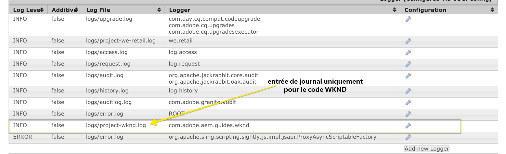
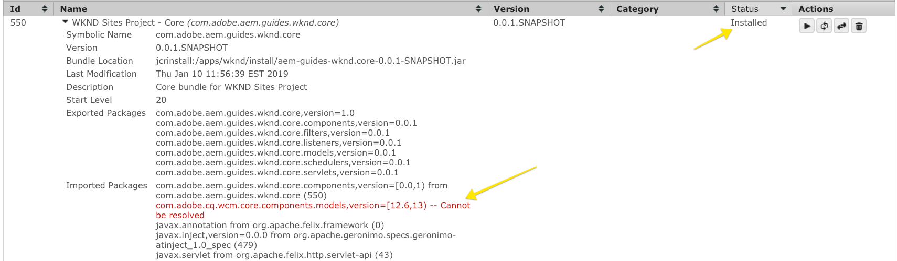
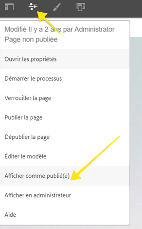
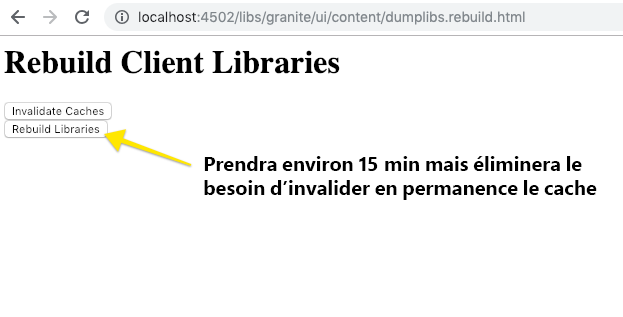

# Configuration d’un Environnement de développement AEM local

Guide de configuration d&#39;un développement local pour Adobe Experience Manager, AEM. Couvre les principaux sujets de l&#39;installation locale, Apache Maven, les environnements de développement intégré et le débogage/dépannage. On discute du développement avec **[!DNL Eclipse IDE], [!DNL CRXDE Lite], [!DNL Visual Studio Code] et[!DNL IntelliJ]**.

## Présentation

La mise en place d&#39;un environnement de développement local est la première étape du développement pour Adobe Experience Manager ou AEM. Prenez le temps de configurer un environnement de développement de la qualité pour augmenter votre productivité et écrivez un meilleur code, plus rapidement. Nous pouvons diviser un environnement de développement local AEM en 4 domaines :

* Instances d’AEM locales
* [!DNL Apache Maven] project
* Environnements de développement intégré (IDE)
* Dépannage

## Installation des instances d’AEM locales

Lorsque nous faisons référence à une instance d’AEM locale, nous parlons d’une copie de Adobe Experience Manager exécutée sur la machine personnelle d’un développeur. ***Le développement de*** AllAEM doit être début en écrivant et en exécutant du code par rapport à une instance d’AEM locale.

Si vous êtes novice en AEM, deux modes d’exécution de base peuvent être installés : ***Auteur*** et ***Publier***. L’***auteur*** [runmode](https://helpx.adobe.com/fr/experience-manager/6-5/sites/deploying/using/configure-runmodes.html) est l’environnement que les spécialistes du marketing numérique utiliseront pour créer et gérer le contenu. Lorsque vous développez **la plupart du temps**, vous déployez du code sur une instance d’auteur. Vous pouvez ainsi créer de nouvelles pages, ajouter et configurer des composants. AEM Sites est un CMS de création WYSIWYG et la plupart des CSS et JavaScript peuvent donc être testés par rapport à une instance de création.

Il s’agit également du *code de test critique* par rapport à une instance locale ***Publier***. L’instance ***Publier*** est l’environnement AEM avec lequel les visiteurs de votre site Web interagiront. Bien que l’instance ***Publier*** soit la même pile technologique que l’instance ***Auteur***, il existe certaines différences majeures avec les configurations et les autorisations. Le code doit *toujours* être testé par rapport à une instance locale ***Publier*** avant d’être promu à des environnements de niveau supérieur.

### Étapes

1. Vérifiez que [Java](https://downloads.experiencecloud.adobe.com/content/software-distribution/en/general.html) est installé.
   * Préférer [JDK Java 11](https://experience.adobe.com/#/downloads/content/software-distribution/en/general.html?1_group.propertyvalues.property=.%2Fjcr%3Acontent%2Fmetadata%2Fdc%3AsoftwareType&amp;1_group.propertyvalues.operation=equals&amp;1_group.propertyvalues.0_values=software-type%3Atooling&amp;orderby=%40jcr%3Acontent%2Fjcr%3AlastModified&amp;orderby.sort=desc&amp;layout liste&amp;p.offset=0&amp;p.limit=14) pour AEM 6.5+
   * [Java JDK 8](https://www.oracle.com/technetwork/java/javase/downloads/index.html#JDK8) pour AEM versions antérieures à AEM 6.5
2. Obtenez une copie du fichier Jar [AEM QuickStart et a [!DNL license.properties]](https://helpx.adobe.com/experience-manager/6-5/sites/deploying/using/deploy.html#GettingtheSoftware).
3. Créez une structure de dossiers sur votre ordinateur comme suit :

   ```plain
   ~/aem-sdk
       /author
       /publish
   ```

4. Renommez [!DNL QuickStart] JAR en ***aem-author-p4502.jar*** et placez-le sous le répertoire `/author`. Ajoutez le fichier ***[!DNL license.properties]*** sous le répertoire `/author`.
5. Effectuez une copie du fichier JAR [!DNL QuickStart], renommez-le en ***aem-publish-p4503.jar*** et placez-le sous le répertoire `/publish`. Ajoutez une copie du fichier ***[!DNL license.properties]*** situé sous le répertoire `/publish`.

   ```plain
   ~/aem-sdk
       /author
           + aem-author-p4502.jar
           + license.properties
       /publish
           + aem-publish-p4503.jar
           + license.properties
   ```

6. Cliquez avec le doublon sur le fichier ***aem-author-p4502.jar*** pour installer l’instance **Auteur**. L’instance d’auteur est ainsi début, s’exécutant sur le port **4502** de l’ordinateur local.

   Cliquez avec le doublon sur le fichier ***aem-publish-p4503.jar*** pour installer l’instance **Publier**. L’instance de publication est alors début et s’exécute sur le port **4503** de l’ordinateur local.

   >[!NOTE]
   >
   >Selon le matériel de votre machine de développement, il peut être difficile d’exécuter simultanément une instance **Auteur et Publier**. Il est rare que vous deviez exécuter les deux simultanément sur une configuration locale.

   Pour plus d’informations, voir [Déploiement et gestion d’une instance AEM](https://helpx.adobe.com/experience-manager/6-5/sites/deploying/using/deploy.html).

## Installer Apache Maven

***[!DNL Apache Maven]*** est un outil permettant de gérer la procédure de création et de déploiement pour les projets basés sur Java. aem est une plateforme basée sur Java et [!DNL Maven] est la méthode standard de gestion du code pour un projet AEM. Lorsque nous disons ***AEM Maven Project*** ou simplement votre ***AEM Project***, nous faisons référence à un projet Maven qui inclut tout le code *personnalisé* de votre site.

Tous les projets AEM doivent être construits à partir de la dernière version du **[!DNL AEM Project Archetype]** : [https://github.com/Adobe-Marketing-Cloud/aem-project-archetype](https://github.com/Adobe-Marketing-Cloud/aem-project-archetype). [!DNL AEM Project Archetype] va créer une amorce d&#39;un projet AEM avec un exemple de code et de contenu. [!DNL AEM Project Archetype] inclut également **[!DNL AEM WCM Core Components]** configuré pour être utilisé sur votre projet.

>[!CAUTION]
>
>Lors du démarrage d&#39;un nouveau projet, il est recommandé d&#39;utiliser la dernière version de l&#39;archétype. Gardez à l’esprit qu’il existe plusieurs versions de l’archétype et que toutes les versions ne sont pas compatibles avec les versions antérieures de l’AEM.

### Étapes

1. Télécharger [Apache Maven](https://maven.apache.org/download.cgi)
2. Installez [Apache Maven](https://maven.apache.org/install.html) et assurez-vous que l&#39;installation a été ajoutée à votre ligne de commande `PATH`.
   * [!DNL macOS] les utilisateurs peuvent installer Maven à l’aide de  [Homebrew](https://brew.sh/)
3. Vérifiez que **[!DNL Maven]** est installé en ouvrant un nouveau terminal de ligne de commande et en exécutant les opérations suivantes :

   ```shell
   $ mvn --version
   Apache Maven 3.3.9
   Maven home: /Library/apache-maven-3.3.9
   Java version: 1.8.0_111, vendor: Oracle Corporation
   Java home: /Library/Java/JavaVirtualMachines/jdk1.8.0_111.jdk/Contents/Home/jre
   Default locale: en_US, platform encoding: UTF-8
   ```

4. Ajoutez le profil **[!DNL adobe-public]** dans votre fichier [!DNL Maven] [settings.xml](https://maven.apache.org/settings.html) afin d’ajouter automatiquement **[!DNL repo.adobe.com]** au processus de création de l’expert.

5. Créez un fichier nommé `settings.xml` à `~/.m2/settings.xml` s&#39;il n&#39;existe pas déjà.

6. Ajoutez le profil **[!DNL adobe-public]** dans le fichier `settings.xml` en fonction de [les instructions ici](https://repo.adobe.com/).

   Un exemple `settings.xml` est répertorié ci-dessous. *Notez que la convention d’affectation de nom  `settings.xml` et l’emplacement sous le  `.m2` répertoire de l’utilisateur sont importants.*

   ```xml
   <settings xmlns="https://maven.apache.org/SETTINGS/1.0.0"
     xmlns:xsi="https://www.w3.org/2001/XMLSchema-instance"
     xsi:schemaLocation="https://maven.apache.org/SETTINGS/1.0.0
                         https://maven.apache.org/xsd/settings-1.0.0.xsd">
   <profiles>
    <!-- ====================================================== -->
    <!-- A D O B E   P U B L I C   P R O F I L E                -->
    <!-- ====================================================== -->
        <profile>
            <id>adobe-public</id>
            <activation>
                <activeByDefault>true</activeByDefault>
            </activation>
            <properties>
                <releaseRepository-Id>adobe-public-releases</releaseRepository-Id>
                <releaseRepository-Name>Adobe Public Releases</releaseRepository-Name>
                <releaseRepository-URL>https://repo.adobe.com/nexus/content/groups/public</releaseRepository-URL>
            </properties>
            <repositories>
                <repository>
                    <id>adobe-public-releases</id>
                    <name>Adobe Public Repository</name>
                    <url>https://repo.adobe.com/nexus/content/groups/public</url>
                    <releases>
                        <enabled>true</enabled>
                        <updatePolicy>never</updatePolicy>
                    </releases>
                    <snapshots>
                        <enabled>false</enabled>
                    </snapshots>
                </repository>
            </repositories>
            <pluginRepositories>
                <pluginRepository>
                    <id>adobe-public-releases</id>
                    <name>Adobe Public Repository</name>
                    <url>https://repo.adobe.com/nexus/content/groups/public</url>
                    <releases>
                        <enabled>true</enabled>
                        <updatePolicy>never</updatePolicy>
                    </releases>
                    <snapshots>
                        <enabled>false</enabled>
                    </snapshots>
                </pluginRepository>
            </pluginRepositories>
        </profile>
   </profiles>
    <activeProfiles>
        <activeProfile>adobe-public</activeProfile>
    </activeProfiles>
   </settings>
   ```

7. Vérifiez que le profil **adobe-public** est principal en exécutant la commande suivante :

   ```shell
   $ mvn help:effective-settings
   ...
   <activeProfiles>
       <activeProfile>adobe-public</activeProfile>
   </activeProfiles>
   <pluginGroups>
       <pluginGroup>org.apache.maven.plugins</pluginGroup>
       <pluginGroup>org.codehaus.mojo</pluginGroup>
   </pluginGroups>
   </settings>
   [INFO] ------------------------------------------------------------------------
   [INFO] BUILD SUCCESS
   [INFO] ------------------------------------------------------------------------
   [INFO] Total time:  0.856 s
   ```

   Si vous ne voyez pas le **[!DNL adobe-public]**, cela indique que le repo de l&#39;Adobe n&#39;est pas référencé correctement dans votre fichier `~/.m2/settings.xml`. Veuillez revoir les étapes précédentes et vérifier que le fichier settings.xml référence le référentiel d&#39;Adobe.

## Configurer un Environnement de développement intégré

Un environnement de développement intégré ou IDE est une application qui combine un éditeur de texte, une prise en charge de la syntaxe et des outils de création. Selon le type de développement que vous effectuez, un IDE peut être préférable à un autre. Quel que soit l&#39;IDE, il sera important de pouvoir périodiquement ***pousser*** le code vers une instance d&#39;AEM locale afin de le tester. Il sera également important d&#39;extraire occasionnellement ***des configurations*** d&#39;une instance d&#39;AEM locale dans votre projet AEM afin de persister dans un système de gestion de contrôle de code source comme Git.

Vous trouverez ci-dessous quelques-uns des IDE les plus utilisés avec le développement AEM avec des vidéos correspondantes qui montrent l&#39;intégration avec une instance AEM locale.

### [!DNL Eclipse] IDE

**[[!DNL Eclipse] IDE](https://www.eclipse.org/ide/)** est l&#39;un des IDE les plus populaires pour le développement de Java, en grande partie parce qu&#39;il est open source et ***gratuit*** ! Adobe fournit un module externe, **[[!DNL AEM Developer Tools]](https://eclipse.adobe.com/aem/dev-tools/)**, pour [!DNL Eclipse] afin de permettre un développement plus facile avec une interface graphique graphique agréable pour synchroniser le code avec une instance d&#39;AEM locale. L&#39;IDE [!DNL Eclipse] est recommandé pour les développeurs qui viennent d&#39;AEM en grande partie en raison de la prise en charge de l&#39;interface utilisateur graphique par [!DNL AEM Developer Tools].

#### Installation et configuration

1. Téléchargez et installez l&#39;IDE [!DNL Eclipse] pour [!DNL Java EE Developers] : [https://www.eclipse.org](https://www.eclipse.org/)
1. Suivez les instructions pour installer le module externe [!DNL AEM Developer Tools] : [https://eclipse.adobe.com/aem/dev-tools/](https://eclipse.adobe.com/aem/dev-tools/)

>[!VIDEO](https://video.tv.adobe.com/v/25906?quality=12&learn=on)

* 00:30 - Importer un projet expert
* 01:24 - Création et déploiement du code source avec Maven
* 04:33 - Changements de code Push avec AEM Developer Tool
* 10:55 - Extraire les modifications du code avec AEM Developer Tool
* 13:12 - Utilisation des outils de débogage intégrés d&#39;Eclipse

### IDÉE IntelliJ

**[IntelliJ IDEA](https://www.jetbrains.com/idea/)** est un IDE puissant pour le développement professionnel de Java. [!DNL IntelliJ IDEA] est disponible en deux versions, une  ****** [!DNL Community] édition libre et une  [!DNL Ultimate] version commerciale (payante). La version [!DNL Community] gratuite de [!DNL IntellIJ IDEA] est suffisante pour un développement plus AEM, mais la [!DNL Ultimate] [étend son ensemble de capacités](https://www.jetbrains.com/idea/download).

#### [!DNL Installation and Setup]

1. Téléchargez et installez [!DNL IntelliJ IDEA] : [https://www.jetbrains.com/idea/download](https://www.jetbrains.com/idea/download)
1. Installer [!DNL Repo] (outil de ligne de commande) : [https://github.com/Adobe-Marketing-Cloud/tools/tree/master/repo](https://github.com/Adobe-Marketing-Cloud/tools/tree/master/repo#installation)

>[!VIDEO](https://video.tv.adobe.com/v/26089/?quality=12&learn=on)

* 00:00 - Importer un projet expert
* 05:47 - Création et déploiement du code source avec Maven
* 08:17 - Apporter les modifications avec Repo
* 14:39 - Extraire les modifications avec Repo
* 17:25 - Utilisation des outils de débogage intégrés d&#39;IntelliJ IDEA

### [!DNL Visual Studio Code]

**[Visual Studio ](https://code.visualstudio.com/)** Codehas est rapidement devenu un outil favori pour les  ***développeurs*** frontaux grâce à la prise en charge améliorée de JavaScript,  [!DNL Intellisense]et la prise en charge du débogage du navigateur. **[!DNL Visual Studio Code]** est open source, gratuit, avec de nombreuses extensions puissantes. [!DNL Visual Studio Code] peut être configuré pour s&#39;intégrer à AEM avec l&#39;aide d&#39;un outil d&#39;Adobe,  **[repo](https://github.com/Adobe-Marketing-Cloud/tools/tree/master/repo#integration-into-visual-studio-code).** Il existe également plusieurs extensions prises en charge par la communauté qui peuvent être installées pour être intégrées à AEM.

[!DNL Visual Studio Code] est un excellent choix pour les développeurs frontaux qui rédigeront principalement du code CSS/LESS et JavaScript pour créer AEM bibliothèques clientes. Cet outil n’est peut-être pas le meilleur choix pour les nouveaux développeurs AEM puisque les définitions de noeud (boîtes de dialogue, composants) devront toutes être modifiées dans du XML brut. Il existe plusieurs extensions Java disponibles pour [!DNL Visual Studio Code], mais si vous préférez développer Java [!DNL Eclipse IDE] ou [!DNL IntelliJ].

#### Liens importants

* [****](https://code.visualstudio.com/Download) **DownloadVisual Studio Code**
* **[repo](https://github.com/Adobe-Marketing-Cloud/tools/tree/master/repo#integration-into-visual-studio-code)**  - Outil de type FTP pour le contenu JCR
* **[aemfed](https://aemfed.io/)**  - Accélérer votre flux de travail AEM frontal
* **[aem Sync](https://marketplace.visualstudio.com/items?itemName=Yinkai15.aemsync)** - Community supported* extension for Visual Studio Code

>[!VIDEO](https://video.tv.adobe.com/v/25907?quality=12&learn=on)

* 00:30 - Importer un projet expert
* 00:53 - Création et déploiement du code source avec Maven
* 04:03 - Changements de code Push avec l&#39;outil de ligne de commande Repo
* 08:29 - Extraire les modifications du code à l&#39;aide de l&#39;outil de ligne de commande Repo
* 10:40 - Modification du code Push avec l’outil AEM
* 14:24 - Dépannage, reconstruction des bibliothèques client

### [!DNL CRXDE Lite]

[CRXDE ](https://helpx.adobe.com/experience-manager/6-4/sites/developing/using/developing-with-crxde-lite.html) Liteest une vue du référentiel AEM basée sur un navigateur. [!DNL CRXDE Lite] est intégrée dans AEM et permet au développeur d’effectuer des tâches de développement standard telles que la modification de fichiers, la définition de composants, de boîtes de dialogue et de modèles. [!DNL CRXDE Lite] n’est  ****** pas un environnement de développement complet, mais est très efficace en tant qu’outil de débogage. [!DNL CRXDE Lite] s’avère utile lors de l’extension ou simplement de la compréhension du code de produit en dehors de votre base de code. [!DNL CRXDE Lite] fournit une vue puissante du référentiel et un moyen de tester et de gérer efficacement les autorisations.

[!DNL CRXDE Lite] doit toujours être utilisé conjointement avec d&#39;autres IDE pour tester et déboguer le code mais jamais comme outil de développement Principal. Il ne prend pas en charge la syntaxe, ne dispose pas de fonctionnalités de saisie semi-automatique et n&#39;est pas intégré aux systèmes de gestion du contrôle de code source.

>[!VIDEO](https://video.tv.adobe.com/v/25917?quality=12&learn=on)

## Dépannage

***Aide!*** Mon code ne fonctionne pas ! Comme pour tout développement, il y aura des fois (probablement plusieurs) où votre code ne fonctionne tout simplement pas comme prévu. aem est une plateforme puissante, mais avec un grand pouvoir... vient une grande complexité. Vous trouverez ci-dessous quelques points de départ de haut niveau concernant la résolution des problèmes et le suivi des problèmes (mais loin d&#39;une liste exhaustive des problèmes qui peuvent se produire) :

### Vérification du déploiement du code

Une première étape intéressante, en cas de problème, consiste à vérifier que le code a été déployé et installé avec succès sur AEM.

1. **Vérifiez  [!UICONTROL Package]** Manager pour vous assurer que le package de code a été téléchargé et installé :  [http://localhost:4502/crx/packmgr/index.jsp](http://localhost:4502/crx/packmgr/index.jsp). Vérifiez l&#39;horodatage pour vérifier que le package a été installé récemment.
1. Si vous effectuez des mises à jour de fichier incrémentielles à l&#39;aide d&#39;un outil tel que [!DNL Repo] ou [!DNL AEM Developer Tools], **vérifiez[!DNL CRXDE Lite]** que le fichier a été envoyé à l&#39;instance d&#39;AEM locale et que le contenu du fichier est mis à jour : [http://localhost:4502/crx/de/index.jsp](http://localhost:4502/crx/de/index.jsp)
1. **Vérifiez que le lot est** chargé si des problèmes liés au code Java se produisent dans un lot OSGi. Ouvrez la [!UICONTROL console Web Adobe Experience Manager] : [http://localhost:4502/system/console/bundles](http://localhost:4502/system/console/bundles) et recherchez votre lot. Assurez-vous que le lot a un état **[!UICONTROL Principal]**. Voir ci-dessous pour plus d’informations sur le dépannage d’un lot dans un état **[!UICONTROL Installé]**.

#### Vérification des journaux

aem est une plate-forme de discussion et consigne de nombreuses informations utiles dans le **error.log**. Le fichier **error.log** se trouve là où AEM a été installé : &lt; `aem-installation-folder>/crx-quickstart/logs/error.log`.

Une technique utile pour effectuer le suivi des problèmes consiste à ajouter des instructions de journal dans votre code Java :

```java
import org.slf4j.Logger;
import org.slf4j.LoggerFactory;
...

public class MyClass {
    private final Logger log = LoggerFactory.getLogger(getClass());

    ...

    String myVariable = "My Variable";

    log.debug("Debug statement of myVariable {}", myVariable);

    log.info("Info statement of myVariable {}", myVariable);
}
```

Par défaut, **error.log** est configuré pour enregistrer les instructions *[!DNL INFO]*. Si vous souhaitez modifier le niveau de journal, vous pouvez le faire en accédant à [!UICONTROL Prise en charge des journaux] : [http://localhost:4502/system/console/slinglog](http://localhost:4502/system/console/slinglog). Vous pouvez également trouver que le **error.log** est trop bavard. Vous pouvez utiliser [!UICONTROL Prise en charge du journal] pour configurer les instructions de journal pour un package Java spécifié uniquement. Il s’agit de la meilleure pratique pour les projets, afin de séparer facilement les problèmes de code personnalisé des problèmes de plateforme AEM prêtes à l’emploi.



#### L&#39;offre groupée est à l&#39;état Installer {#bundle-active}

Tous les lots (à l’exception des fragments) doivent être à l’état **[!UICONTROL Principal]**. Si votre lot de codes apparaît dans un état [!UICONTROL Installé], un problème doit être résolu. La plupart du temps, il s&#39;agit d&#39;un problème de dépendance :



Dans la capture d’écran ci-dessus, [!DNL WKND Core bundle] est un état [!UICONTROL Installé]. Cela est dû au fait que le lot attend une version différente de `com.adobe.cq.wcm.core.components.models` qui est disponible sur l&#39;instance AEM.

L&#39;outil de recherche de dépendances  est un outil utile : [http://localhost:4502/system/console/depfinder](http://localhost:4502/system/console/depfinder). Ajoutez le nom du package Java pour vérifier quelle version est disponible sur l’instance AEM :


En suivant l’exemple ci-dessus, nous constatons que la version installée sur l’instance AEM est **12.2** vs **12.6** que le lot attendait. A partir de là, vous pouvez travailler à l&#39;envers et voir si les dépendances [!DNL Maven] de l&#39;AEM correspondent aux dépendances [!DNL Maven] du projet AEM. Dans l’exemple ci-dessus, [!DNL Core Components] **v2.2.0** est installé sur l’instance AEM mais le lot de code a été créé avec une dépendance sur **v2.2.2**, d’où la raison du problème de dépendance.

#### Vérifier l&#39;enregistrement des modèles Sling {#osgi-component-sling-models}

aem composants doivent toujours être sauvegardés par un [!DNL Sling Model] pour encapsuler toute logique métier et s’assurer que le script de rendu HTML reste propre. Si vous rencontrez des problèmes où le modèle Sling est introuvable, il peut s’avérer utile de vérifier le [!DNL Sling Models] à partir de la console : [http://localhost:4502/system/console/status-slingmodels](http://localhost:4502/system/console/status-slingmodels). Cela vous dira si votre modèle Sling a été enregistré et à quel type de ressource (le chemin du composant) il est lié.


Affiche l&#39;enregistrement d&#39;un [!DNL Sling Model], `BylineImpl` lié à un type de ressource de composant de `wknd/components/content/byline`.

#### Problèmes CSS ou JavaScript

Pour la plupart des problèmes CSS et JavaScript, l’utilisation des outils de développement du navigateur est le moyen le plus efficace de résoudre les problèmes. Pour réduire le problème lors du développement par rapport à une instance d’auteur AEM, il est utile de vue de la page &quot;telle que publiée&quot;.



Ouvrez le menu [!UICONTROL Propriétés de la page] et cliquez sur [!UICONTROL Vue comme Publié]. La page s’ouvre alors sans l’éditeur AEM et avec un paramètre de requête défini sur **wcmmode=disabled**. Cela désactivera efficacement l’interface utilisateur de création d’AEM et facilitera le dépannage/débogage des problèmes frontaux.

Un autre problème fréquemment rencontré lors du développement du code frontal est le chargement de CSS/JS ancien ou obsolète. Dans un premier temps, assurez-vous que l’historique du navigateur a été effacé et, si nécessaire, début d’un navigateur incognito ou d’une nouvelle session.

#### Débogage des bibliothèques clientes

Avec différentes méthodes de catégories et d’incorporation pour inclure plusieurs bibliothèques clientes, il peut s’avérer difficile de résoudre les problèmes. aem expose plusieurs outils pour y remédier. L&#39;un des outils les plus importants est [!UICONTROL Reconstruire les bibliothèques clientes], ce qui obligera AEM à recompiler les fichiers LESS et à générer le fichier CSS.

* [Effacer les bibliothèques](http://localhost:4502/libs/granite/ui/content/dumplibs.html)  : Liste toutes les bibliothèques clientes enregistrées dans l’instance AEM. &lt;host>/libs/granite/ui/content/dumplibs.html
* [Tester la sortie](http://localhost:4502/libs/granite/ui/content/dumplibs.test.html)  : permet à un utilisateur de voir la sortie HTML attendue des inclusions clientlib en fonction de la catégorie. &lt;host>/libs/granite/ui/content/dumplibs.test.html
* [Bibliothèques Validation](http://localhost:4502/libs/granite/ui/content/dumplibs.validate.html)  des dépendances : met en évidence les dépendances ou les catégories incorporées introuvables. &lt;host>/libs/granite/ui/content/dumplibs.validate.html
* [Reconstruire les bibliothèques](http://localhost:4502/libs/granite/ui/content/dumplibs.rebuild.html)  clientes : permet à un utilisateur de forcer l&#39;AEM à recréer toutes les bibliothèques clientes ou d&#39;invalider le cache des bibliothèques clientes. Cet outil est particulièrement efficace lorsque vous développez avec LESS, car cela peut forcer AEM à recompiler le CSS généré. En général, il est plus efficace d’invalider les caches, puis d’actualiser la page plutôt que de recréer toutes les bibliothèques. &lt;host>/libs/granite/ui/content/dumplibs.rebuild.html



>[!NOTE]
>
>Si vous devez constamment invalider le cache à l&#39;aide de l&#39;outil [!UICONTROL Reconstruire les bibliothèques clientes], il peut être utile de reconstruire une seule fois toutes les bibliothèques clientes. Cela peut prendre environ 15 minutes, mais élimine généralement les problèmes de mise en cache à l’avenir.
