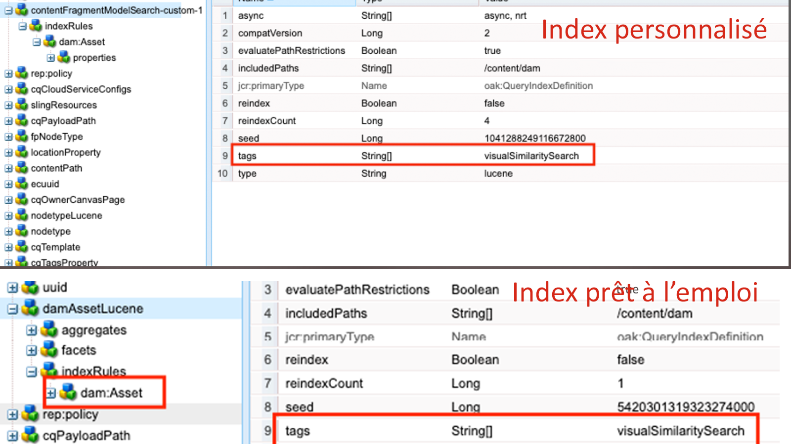
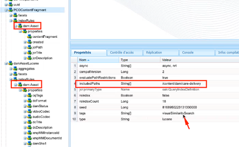
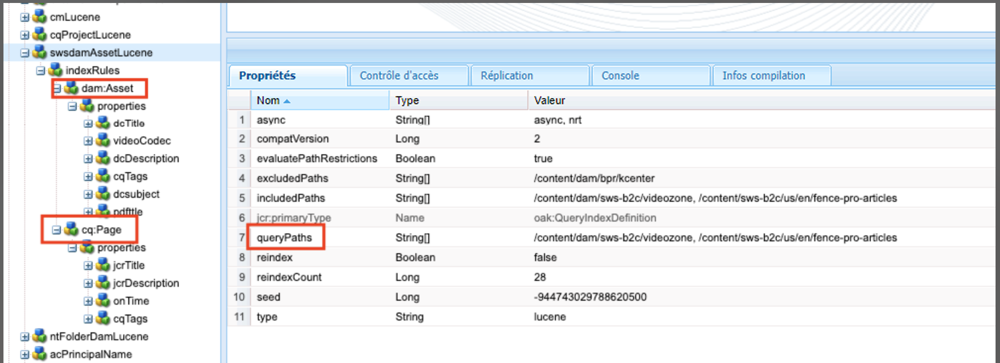
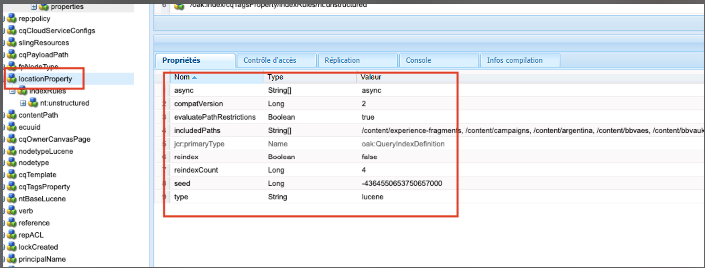

# Bonnes pratiques relatives à l’indexation dans AEM

Découvrez les bonnes pratiques d’indexation dans Adobe Experience Manager (AEM). Apache [Jackrabbit Oak](https://jackrabbit.apache.org/oak/docs/query/query.html) alimente la recherche de contenu dans AEM et les points clés suivants :

- AEM fournit divers index prêts à l’emploi pour prendre en charge la fonctionnalité de recherche et de requête, par exemple `damAssetLucene`, `cqPageLucene` et plus encore.
- Toutes les définitions d’index sont stockées dans le référentiel sous `/oak:index` noeud .
- AEM as a Cloud Service ne prend en charge que les index Oak Lucene.
- La configuration de l’index doit être gérée dans le code de projet AEM et déployée à l’aide des pipelines CI/CD de Cloud Manager.
- Si plusieurs index sont disponibles pour une requête donnée, la variable **l’index avec le coût estimé le plus bas est utilisé.**.
- Si aucun index n’est disponible pour une requête donnée, l’arborescence de contenu est parcourue pour trouver le contenu correspondant. Toutefois, la limite par défaut via `org.apache.jackrabbit.oak.query.QueryEngineSettingsService` est de parcourir seulement 10 000 noeuds.
- Les résultats d’une requête sont les suivants : **enfin filtré** pour s’assurer que l’utilisateur actuel dispose d’un accès en lecture. Cela signifie que les résultats de la requête peuvent être inférieurs au nombre de noeuds indexés.
- La réindexation du référentiel après les modifications de définition d’index nécessite du temps et dépend de la taille du référentiel.

Pour disposer d’une fonctionnalité de recherche efficace et correcte qui n’affecte pas les performances de l’instance AEM, il est important de comprendre les bonnes pratiques d’indexation.

## Index personnalisé ou prêt à l’emploi

Parfois, vous devez créer des index personnalisés pour prendre en charge vos besoins de recherche. Suivez toutefois les instructions ci-dessous avant de créer des index personnalisés :

- Comprendre les exigences de recherche et vérifier si les index prêts à l’emploi peuvent prendre en charge les exigences de recherche. Utilisation **Outil Performances des requêtes**, disponible sur [SDK local](http://localhost:4502/libs/granite/operations/content/diagnosistools/queryPerformance.html) et AEM via Developer Console ou `https://author-pXXXX-eYYYY.adobeaemcloud.com/ui#/aem/libs/granite/operations/content/diagnosistools/queryPerformance.html?appId=aemshell`.

- Définissez une requête optimale, utilisez la variable [optimisation des requêtes](https://experienceleague.adobe.com/docs/experience-manager-cloud-service/content/operations/query-and-indexing-best-practices.html?#optimizing-queries) diagramme de flux et [Aide-mémoire pour les requêtes JCR](https://experienceleague.adobe.com/docs/experience-manager-65/assets/JCR_query_cheatsheet-v1.1.pdf?lang=en) à titre de référence.

- Si les index prêts à l’emploi ne prennent pas en charge les exigences de recherche, vous disposez de deux options. Toutefois, passez en revue les [Conseils pour créer des index efficaces](https://experienceleague.adobe.com/docs/experience-manager-65/content/implementing/deploying/practices/best-practices-for-queries-and-indexing.html?#should-i-create-an-index)
   - Personnaliser l&#39;index en OOTB : option préférée, car il est facile de le gérer et de le mettre à niveau.
   - Index entièrement personnalisé : uniquement si l’option ci-dessus ne fonctionne pas.

### Personnalisation de l’index prêt à l’emploi

- Dans **AEMCS**, lors de la personnalisation de l’index OOTB, utilisez **\&lt;ootbindexname>-\&lt;productversion>-custom-\&lt;customversion>** convention d’affectation des noms. Par exemple : `cqPageLucene-custom-1` ou `damAssetLucene-8-custom-1`. Cela permet de fusionner la définition d’index personnalisée chaque fois que l’index prêt à l’emploi est mis à jour. Voir [Modifications apportées aux index prêts à l’emploi](https://experienceleague.adobe.com/docs/experience-manager-cloud-service/content/operations/indexing.html?#changes-to-out-of-the-box-indexes) pour plus d’informations.

- Dans **AEM 6.X**, le nom ci-dessus _ne fonctionne pas_, mais il vous suffit de mettre à jour l’index OOTB avec des propriétés supplémentaires dans la variable `indexRules` noeud .

- Copiez toujours la dernière définition d’index prête à l’emploi de l’instance AEM à l’aide du gestionnaire de modules CRX DE (/crx/packmgr/), renommez-la et ajoutez des personnalisations dans le fichier XML.

- Stocker la définition d’index dans le projet AEM à l’adresse `ui.apps/src/main/content/jcr_root/_oak_index` et déployez-le à l’aide des pipelines CI/CD de Cloud Manager. Voir [Déploiement de définitions d’index personnalisées](https://experienceleague.adobe.com/docs/experience-manager-cloud-service/content/operations/indexing.html?#deploying-custom-index-definitions) pour plus d’informations.

### Index entièrement personnalisé

La création d’un index entièrement personnalisé doit être votre dernière option et uniquement si l’option ci-dessus ne fonctionne pas.

- Lors de la création d’un index entièrement personnalisé, utilisez **\&lt;prefix>.\&lt;customindexname>-\&lt;version>-custom-\&lt;customversion>** convention d’affectation des noms. Par exemple, `wknd.adventures-1-custom-1`. Cela permet d’éviter les conflits de noms. Ici, `wknd` est le préfixe et `adventures` est le nom d’index personnalisé. Cette convention s’applique à AEM 6.X et AEMCS et permet de préparer une migration future vers AEM CS.

- AEMCS ne prend en charge que les index Lucene. Pour préparer une migration ultérieure vers AEM, vous devez donc toujours utiliser les index Lucene. Voir [Index Lucene par rapport aux index de propriété](https://experienceleague.adobe.com/docs/experience-manager-65/content/implementing/deploying/practices/best-practices-for-queries-and-indexing.html?#lucene-or-property-indexes) pour plus d’informations.

- Évitez de créer un index personnalisé sur le même type de noeud que l’index prêt à l’emploi. À la place, personnalisez l’index prêt à l’emploi avec des propriétés supplémentaires dans le `indexRules` noeud . Par exemple, ne créez pas d’index personnalisé sur la variable `dam:Asset` type de noeud, mais personnalisez l’OOTB. `damAssetLucene` index. _Il s’agit d’une cause courante des problèmes de performances et de fonctionnement._.

- Évitez également d’ajouter plusieurs types de noeuds, par exemple `cq:Page` et `cq:Tag` sous les règles d&#39;indexation (`indexRules`). Créez plutôt des index distincts pour chaque type de noeud.

- Comme mentionné dans la section ci-dessus, stockez la définition d’index dans le projet AEM à l’adresse `ui.apps/src/main/content/jcr_root/_oak_index` et déployez-le à l’aide des pipelines CI/CD de Cloud Manager. Voir [Déploiement de définitions d’index personnalisées](https://experienceleague.adobe.com/docs/experience-manager-cloud-service/content/operations/indexing.html?#deploying-custom-index-definitions) pour plus d’informations.

- Les directives de définition d’index sont les suivantes :
   - Le type de noeud (`jcr:primaryType`) doit `oak:QueryIndexDefinition`
   - Le type d’index (`type`) doit `lucene`
   - La propriété async (`async`) doit `async,nrt`
   - Utilisation `includedPaths` et évitez `excludedPaths` . Toujours définir `queryPaths` à la même valeur que `includedPaths` .
   - Pour appliquer la restriction de chemin, utilisez `evaluatePathRestrictions` et définissez-la sur `true`.
   - Utilisation `tags` pour baliser l’index et, lors de l’interrogation, spécifiez cette valeur de balise pour utiliser l’index. La syntaxe de requête générale est la suivante : `<query> option(index tag <tagName>)`.

  ```xml
  /oak:index/wknd.adventures-1-custom-1
      - jcr:primaryType = "oak:QueryIndexDefinition"
      - type = "lucene"
      - compatVersion = 2
      - async = ["async", "nrt"]
      - includedPaths = ["/content/wknd"]
      - queryPaths = ["/content/wknd"]
      - evaluatePathRestrictions = true
      - tags = ["customAdvSearch"]
  ...
  ```

### Exemples

Pour comprendre les bonnes pratiques, examinons quelques exemples.

#### Utilisation incorrecte de la propriété de balises

L’image ci-dessous présente la définition d’index personnalisée et prête à l’emploi, en surbrillant `tags` , les deux index utilisent le même `visualSimilaritySearch` .



##### Analyse

Il s’agit d’une utilisation incorrecte de la fonction `tags` sur l’index personnalisé. Le moteur de requête Oak sélectionne l’index personnalisé sur la cause de l’index OOTB du coût estimé le plus faible.

La bonne méthode consiste à personnaliser l’index prêt à l’emploi et à ajouter des propriétés supplémentaires dans la variable `indexRules` noeud . Voir [Personnalisation de l’index prêt à l’emploi](#customize-the-ootb-index) pour plus d’informations.

#### Index sur la `dam:Asset` type de noeud

L’image ci-dessous affiche l’index personnalisé pour la variable `dam:Asset` type de noeud avec la propriété `includedPaths` sur un chemin d’accès spécifique.



##### Analyse

Si vous effectuez une omni-recherche sur Assets, elle renvoie des résultats incorrects, car le coût estimé de l’index personnalisé est plus faible.

Ne créez pas d’index personnalisé sur le `dam:Asset` type de noeud, mais personnalisez l’OOTB. `damAssetLucene` avec des propriétés supplémentaires dans l’index `indexRules` noeud .

#### Plusieurs types de noeud sous des règles d’indexation

L’image ci-dessous présente l’index personnalisé avec plusieurs types de noeud sous `indexRules` noeud .



##### Analyse

Il n’est pas recommandé d’ajouter plusieurs types de noeud dans un seul index. Cependant, il est recommandé d’indexer les types de noeud dans le même index si les types de noeud sont étroitement liés, par exemple : `cq:Page` et `cq:PageContent`.

Une solution valide consiste à personnaliser l’OOTB. `cqPageLucene` et `damAssetLucene` index, ajoutez des propriétés supplémentaires sous la propriété `indexRules` noeud .

#### Absence de `queryPaths` property

L’image ci-dessous présente l’index personnalisé (qui ne suit pas non plus la convention d’affectation de nom) sans `queryPaths` .



##### Analyse

Toujours définir `queryPaths` à la même valeur que `includedPaths` . En outre, pour appliquer la restriction de chemin, définissez `evaluatePathRestrictions` de `true`.

#### Requête avec balise d’index

L’image ci-dessous affiche l’index personnalisé avec `tags` et comment l’utiliser lors de l’interrogation.


```
/jcr:root/content/dam//element(*,dam:Asset)[(jcr:content/@contentFragment = 'true' and jcr:contains(., '/content/sitebuilder/test/mysite/live/ja-jp/mypage'))]order by @jcr:created descending option (index tag assetPrefixNodeNameSearch)
```

##### Analyse

Illustre comment définir des règles non conflictuelles et correctes `tags` valeur de propriété sur l’index et utilisez-la lors de l’interrogation. La syntaxe de requête générale est la suivante : `<query> option(index tag <tagName>)`. Voir aussi [Balise d’index d’option de requête](https://jackrabbit.apache.org/oak/docs/query/query-engine.html#query-option-index-tag)

#### Index personnalisé

L’image ci-dessous affiche l’index personnalisé avec `suggestion` pour accéder à la fonctionnalité de recherche avancée.


##### Analyse

Il s’agit d’un cas d’utilisation valide pour créer un index personnalisé pour la variable [recherche avancée](https://jackrabbit.apache.org/oak/docs/query/lucene.html#advanced-search-features) . Cependant, le nom de l’index doit suivre le **\&lt;prefix>.\&lt;customindexname>-\&lt;version>-custom-\&lt;customversion>** convention d’affectation des noms.


## Outils utiles

Examinons quelques outils qui peuvent vous aider à définir, analyser et optimiser les index.

### Outil de création d&#39;index

La variable [Générateur de définitions d’index Oak](https://oakutils.appspot.com/generate/index) aide de l’outil **pour générer la définition d’index** en fonction des requêtes d’entrée. C’est un bon point de départ pour créer un index personnalisé.

### Analyse de l’outil d’index

La variable [Analyseur de définitions d’index](https://oakutils.appspot.com/analyze/index) aide de l’outil **pour analyser la définition de l&#39;index** et fournit des recommandations pour améliorer la définition de l’index.

### Outil de performance des requêtes

L&#39;OOTB _Outil Performances des requêtes_ disponible à [SDK local](http://localhost:4502/libs/granite/operations/content/diagnosistools/queryPerformance.html) et AEM via Developer Console ou `https://author-pXXXX-eYYYY.adobeaemcloud.com/ui#/aem/libs/granite/operations/content/diagnosistools/queryPerformance.html?appId=aemshell` helps **pour analyser les performances de la requête** et [Aide-mémoire pour les requêtes JCR](https://experienceleague.adobe.com/docs/experience-manager-65/assets/JCR_query_cheatsheet-v1.1.pdf?lang=en) pour définir la requête optimale.

### Outils et conseils de dépannage

La plupart des éléments ci-dessous s’appliquent à AEM 6.X et à des fins de dépannage local.

- Gestionnaire d’index disponible à l’adresse `http://host:port/libs/granite/operations/content/diagnosistools/indexManager.html` pour obtenir des informations d’index telles que type, dernière mise à jour, taille.

- Journalisation détaillée des packages Java™ liés à la requête Oak et à l’indexation, comme `org.apache.jackrabbit.oak.plugins.index`, `org.apache.jackrabbit.oak.query`, et `com.day.cq.search` via `http://host:port/system/console/slinglog` pour la résolution des problèmes.

- MBean JMX de _IndexStats_ type disponible à l’adresse `http://host:port/system/console/jmx` pour obtenir des informations d’index telles que l’état, la progression ou les statistiques liées à l’indexation asynchrone. Il fournit également _FailingIndexStats_, s’il n’y a aucun résultat ici, signifie qu’aucun index n’est corrompu. AsyncIndexerService marque tout index qui ne parvient pas à mettre à jour pendant 30 minutes (configurable) comme corrompu et arrête son indexation. Si une requête ne donne pas les résultats attendus, il est utile que les développeurs le vérifient avant de poursuivre la réindexation, car la réindexation est coûteuse en calcul et prend du temps.

- MBean JMX de _LuceneIndex_ type disponible à l’adresse `http://host:port/system/console/jmx` pour les statistiques de l’index Lucene telles que la taille, le nombre de documents par définition d’index.

- MBean JMX de _QueryStat_ type disponible à l’adresse `http://host:port/system/console/jmx` pour Oak Query Statistics, y compris les requêtes lentes et populaires avec des détails comme la requête, le temps d’exécution.

## Ressources supplémentaires

Pour plus d’informations, consultez la documentation suivante :

- [Requêtes et indexation Oak](https://experienceleague.adobe.com/docs/experience-manager-65/content/implementing/deploying/deploying/queries-and-indexing.html)
- [Bonnes pratiques en matière de requête et d’indexation](https://experienceleague.adobe.com/docs/experience-manager-cloud-service/content/operations/query-and-indexing-best-practices.html)
- [Bonnes pratiques relatives aux requêtes et à l’indexation](https://experienceleague.adobe.com/docs/experience-manager-65/content/implementing/deploying/practices/best-practices-for-queries-and-indexing.html)
