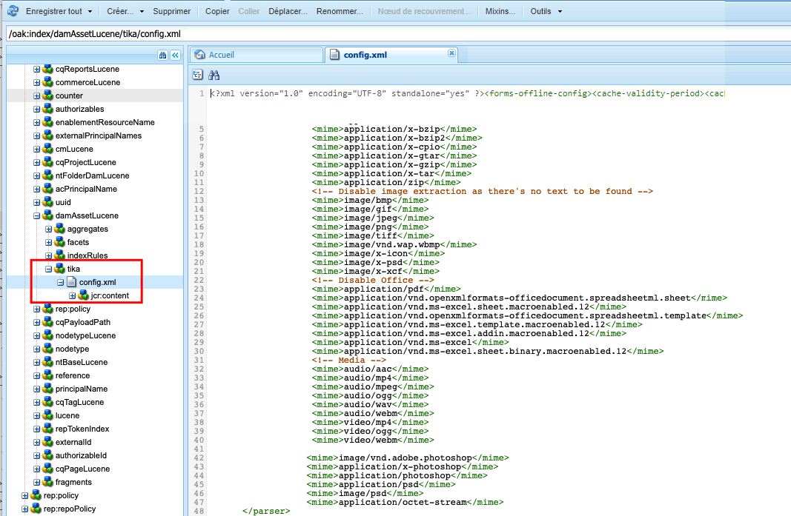
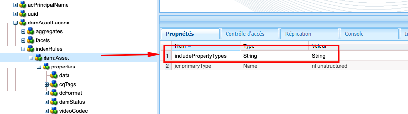
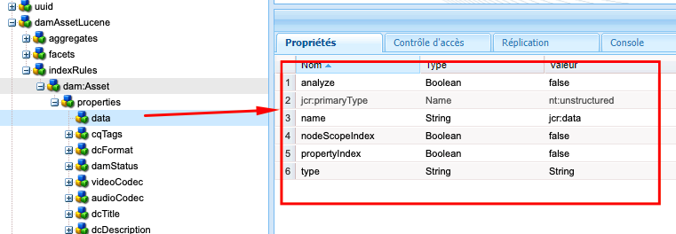

# Bonnes pratiques relatives à l’indexation dans AEM

Découvrez les bonnes pratiques d’indexation dans Adobe Experience Manager (AEM). Apache [Jackrabbit Oak](https://jackrabbit.apache.org/oak/docs/query/query.html) alimente la recherche de contenu dans AEM et les points clés suivants :

- AEM fournit divers index prêts à l’emploi pour prendre en charge la fonctionnalité de recherche et de requête, par exemple `damAssetLucene`, `cqPageLucene` et plus encore.
- Toutes les définitions d’index sont stockées dans le référentiel sous le nœud `/oak:index`.
- AEM as a Cloud Service ne prend en charge que les index Oak Lucene.
- La configuration de l’index doit être gérée dans la base de code de projet AEM et déployée à l’aide des pipelines CI/CD Cloud Manager.
- Si plusieurs index sont disponibles pour une requête donnée, l’**index dont le coût estimé est le plus bas est utilisé**.
- Si aucun index n’est disponible pour une requête donnée, l’arborescence de contenu est parcourue pour trouver le contenu correspondant. Toutefois, la limite par défaut via `org.apache.jackrabbit.oak.query.QueryEngineSettingsService` est de parcourir seulement 10 000 nœuds.
- Les résultats d’une requête sont **filtrés en dernier lieu** pour s’assurer que la personne actuelle dispose d’un accès en lecture. Cela signifie que les résultats de la requête peuvent être inférieurs au nombre de nœuds indexés.
- La réindexation du référentiel après les modifications de définition d’index nécessite du temps et dépend de la taille du référentiel.

Pour disposer d’une fonctionnalité de recherche efficace et correcte qui n’affecte pas les performances de l’instance AEM, il est important de comprendre les bonnes pratiques d’indexation.

## Index personnalisé ou prêt à l’emploi

Parfois, vous devez créer des index personnalisés pour répondre à vos besoins de recherche. Suivez toutefois les instructions ci-dessous avant de créer des index personnalisés :

- Comprenez les exigences de recherche et vérifiez si les index prêts à l’emploi peuvent répondre à vos besoins de recherche. Utilisez l’**outil de performances des requêtes**, disponible sur le [SDK local](http://localhost:4502/libs/granite/operations/content/diagnosistools/queryPerformance.html) et AEMCS via la Developer Console ou `https://author-pXXXX-eYYYY.adobeaemcloud.com/ui#/aem/libs/granite/operations/content/diagnosistools/queryPerformance.html?appId=aemshell`.

- Définissez une requête optimale, utilisez le graphique de flux [optimisation des requêtes](https://experienceleague.adobe.com/fr/docs/experience-manager-cloud-service/content/operations/query-and-indexing-best-practices) et l’[aide-mémoire pour les requêtes JCR](https://experienceleague.adobe.com/docs/experience-manager-65/assets/JCR_query_cheatsheet-v1.1.pdf?lang=fr) à titre de référence.

- Si les index prêts à l’emploi ne répondent pas aux besoins de recherche, vous disposez de deux options. Toutefois, passez en revue les [Conseils pour créer des index efficaces](https://experienceleague.adobe.com/fr/docs/experience-manager-65/content/implementing/deploying/practices/best-practices-for-queries-and-indexing).
   - Personnaliser l’index prêt à l’emploi : option préférée, car il est facile de le gérer et de le mettre à niveau.
   - Index entièrement personnalisé : uniquement si l’option ci-dessus ne fonctionne pas.

### Personnaliser l’index prêt à l’emploi

- Dans **AEMCS**, lors de la personnalisation de l’index prêt à l’emploi, utilisez la convention de nommage **\&lt;OOTBIndexName>-\&lt;productVersion>-custom-\&lt;customVersion>**. Par exemple, `cqPageLucene-custom-1` ou `damAssetLucene-8-custom-1`. Cela permet de fusionner la définition d’index personnalisée chaque fois que l’index prêt à l’emploi est mis à jour. Consultez [Modifications apportées aux index prêts à l’emploi](https://experienceleague.adobe.com/fr/docs/experience-manager-cloud-service/content/operations/indexing) pour plus d’informations.

- Dans **AEM 6.X**, la convention de nommage ci-dessus _ne fonctionne pas_, mais il vous suffit de mettre à jour l’index prêt à l’emploi avec les propriétés nécessaires dans le nœud `indexRules`.

- Copiez toujours la dernière définition d’index prêt à l’emploi de l’instance AEM à l’aide du gestionnaire de packages CRX DE (/crx/packmgr/), renommez-la et ajoutez des personnalisations dans le fichier XML.

- Stockez la définition d’index dans le projet AEM à l’adresse `ui.apps/src/main/content/jcr_root/_oak_index` et déployez-la à l’aide des pipelines CI/CD Cloud Manager. Consultez [Déploiement de définitions d’index personnalisé](https://experienceleague.adobe.com/fr/docs/experience-manager-cloud-service/content/operations/indexing) pour plus d’informations.

### Index entièrement personnalisé

La création d’un index entièrement personnalisé doit être votre dernière option et uniquement si l’option ci-dessus ne fonctionne pas.

- Lors de la création d’un index entièrement personnalisé, utilisez la convention de nommage **\&lt;prefix>.\&lt;customIndexName>-\&lt;version>-custom-\&lt;customVersion>**. Par exemple, `wknd.adventures-1-custom-1`. Cela permet d’éviter les conflits de nommage. Ici, `wknd` est le préfixe et `adventures` est le nom d’index personnalisé. Cette convention s’applique à AEM 6.X et AEMCS et permet de préparer une migration future vers AEMCS.

- AEMCS ne prend en charge que les index Lucene. Pour préparer une migration ultérieure vers AEMCS, utilisez toujours les index Lucene. Consultez [Index Lucene par rapport aux index de propriété](https://experienceleague.adobe.com/fr/docs/experience-manager-65/content/implementing/deploying/practices/best-practices-for-queries-and-indexing) pour plus d’informations.

- Évitez de créer un index personnalisé sur le même type de nœud que l’index prêt à l’emploi. À la place, personnalisez l’index prêt à l’emploi avec des propriétés nécessaires dans le nœud `indexRules`. Par exemple, ne créez pas d’index personnalisé sur le type de nœud `dam:Asset`, mais personnalisez l’index `damAssetLucene` prêt à l’emploi. _Il s’agit d’une cause courante des problèmes de performances et de fonctionnement._.

- Évitez également d’ajouter plusieurs types de nœud, par exemple `cq:Page` et `cq:Tag`, sous le nœud des règles d’indexation (`indexRules`). Créez plutôt des index distincts pour chaque type de nœud.

- Comme mentionné dans la section ci-dessus, stockez la définition d’index dans le projet AEM à l’adresse `ui.apps/src/main/content/jcr_root/_oak_index` et déployez-la à l’aide des pipelines CI/CD Cloud Manager. Consultez [Déploiement de définitions d’index personnalisés](https://experienceleague.adobe.com/fr/docs/experience-manager-cloud-service/content/operations/indexing) pour plus d’informations.

- Les directives de définition d’index sont les suivantes :
   - Le type de nœud (`jcr:primaryType`) doit être `oak:QueryIndexDefinition`.
   - Le type d’index (`type`) doit être `lucene`.
   - La propriété async (`async`) doit être `async,nrt`.
   - Utilisez `includedPaths` et évitez la propriété `excludedPaths`. La valeur `queryPaths` doit toujours être identique à la valeur `includedPaths`.
   - Pour appliquer la restriction de chemin, utilisez la propriété `evaluatePathRestrictions` et définissez-la sur `true`.
   - Utilisez la propriété `tags` pour baliser l’index et, lors de l’interrogation, spécifiez la valeur de ces balises pour utiliser l’index. La syntaxe de requête générale est la suivante : `<query> option(index tag <tagName>)`.

  ```xml
  /oak:index/wknd.adventures-1-custom-1
      - jcr:primaryType = "oak:QueryIndexDefinition"
      - type = "lucene"
      - compatVersion = 2
      - async = ["async", "nrt"]
      - includedPaths = ["/content/wknd"]
      - queryPaths = ["/content/wknd"]
      - evaluatePathRestrictions = true
      - tags = ["customAdvSearch"]
  ...
  ```

### Exemples

Pour comprendre les bonnes pratiques, examinons quelques exemples.

#### Utilisation incorrecte de la propriété de balises

L’image ci-dessous présente la définition d’index personnalisés et prêts à l’emploi, en mettant en surbrillance la propriété `tags`, les deux index utilisent la même valeur `visualSimilaritySearch`.


##### Analyse

Il s’agit d’une utilisation incorrecte de la propriété `tags` sur l’index personnalisé. Le moteur de requête Oak sélectionne l’index personnalisé plutôt que l’index prêt à l’emploi en raison du coût estimé le plus faible.

La bonne méthode consiste à personnaliser l’index prêt à l’emploi et à ajouter des propriétés supplémentaires dans le nœud `indexRules`. Consultez [Personnalisation de l’index prêt à l’emploi](#customize-the-ootb-index) pour plus d’informations.

#### Index sur le type de nœud `dam:Asset`

L’image ci-dessous affiche l’index personnalisé pour le type de nœud `dam:Asset` avec la propriété `includedPaths` définie sur un chemin d’accès spécifique.


##### Analyse

Si vous effectuez une recherche Omnisearch sur Assets, elle renvoie des résultats incorrects, car le coût estimé de l’index personnalisé est plus faible.

Ne créez pas d’index personnalisé sur le type de nœud `dam:Asset`, mais personnalisez l’index `damAssetLucene` prêt à l’emploi avec les propriétés nécessaires dans le nœud `indexRules`.

#### Plusieurs types de nœud sous des règles d’indexation

L’image ci-dessous présente l’index personnalisé avec plusieurs types de nœud sous le nœud `indexRules`.


##### Analyse

Il n’est pas recommandé d’ajouter plusieurs types de nœuds dans un seul index. Cependant, il est recommandé d’indexer les types de nœuds dans le même index si les types de nœuds sont étroitement liés, par exemple : `cq:Page` et `cq:PageContent`.

Une solution valide consiste à personnaliser les index `cqPageLucene` et `damAssetLucene` prêts à l’emploi et à ajouter les propriétés nécessaires sous le nœud `indexRules` existant.

#### Absence de la propriété `queryPaths`

L’image ci-dessous affiche un index personnalisé (qui ne suit pas non plus la convention de nommage) sans la propriété `queryPaths`.


##### Analyse

Définissez toujours la valeur `queryPaths` pour qu’elle soit identique à la valeur `includedPaths`. En outre, pour forcer la restriction de chemin, définissez la propriété `evaluatePathRestrictions` sur `true`.

#### Interroger avec une balise d’index

L’image ci-dessous affiche un index personnalisé avec la propriété `tags` et la manière de l’utiliser lors de l’interrogation.


```
/jcr:root/content/dam//element(*,dam:Asset)[(jcr:content/@contentFragment = 'true' and jcr:contains(., '/content/sitebuilder/test/mysite/live/ja-jp/mypage'))]order by @jcr:created descending option (index tag assetPrefixNodeNameSearch)
```

##### Analyse

Indique comment définir des règles non conflictuelles et une valeur de propriété `tags` correcte pour l’index et comment l’utiliser lors de l’interrogation. La syntaxe de requête générale est la suivante : `<query> option(index tag <tagName>)`. Voir également [Option de requête avec balise d’index](https://jackrabbit.apache.org/oak/docs/query/query-engine.html#query-option-index-tag)

#### Index personnalisé

L’image ci-dessous affiche un index personnalisé avec le nœud `suggestion` pour accéder à la fonctionnalité de recherche avancée.


##### Analyse

Il s’agit d’un cas d’utilisation valide pour créer un index personnalisé pour la fonctionnalité de [recherche avancée](https://jackrabbit.apache.org/oak/docs/query/lucene.html#advanced-search-features). Cependant, le nom de l’index doit respecter la convention de nommage **\&lt;prefix>.&lt;customIndexName>-\&lt;version>-custom-\&lt;customVersion>**.

## Optimisation de l’index en désactivant Apache Tika

AEM utilise [Apache Tika](https://tika.apache.org/) pour _extraire les métadonnées et le contenu de texte à partir de types de fichier_ tels que PDF, Word, Excel, etc. Le contenu extrait est stocké dans le référentiel et indexé par l’index Oak Lucene.

Parfois, il n’est pas nécessaire de rechercher dans le contenu d’un fichier ou d’une ressource. Dans ce cas, vous pouvez améliorer les performances d’indexation en désactivant Apache Tika. Les avantages sont les suivants :

- Indexation plus rapide
- Réduction de la taille de l’index
- Moins d’utilisation matérielle

>[!CAUTION]
>
>Avant de désactiver Apache Tika, assurez-vous que les exigences de recherche ne nécessitent pas de rechercher dans le contenu d’une ressource.


### Désactiver par type MIME

Pour désactiver Apache Tika par type MIME, procédez comme suit :

- Ajoutez le nœud `tika` de type `nt:unstructured` sous la définition d’index personnalisée ou prête à l’emploi. Dans l’exemple suivant, le type MIME du PDF est désactivé pour l’index `damAssetLucene` prêt à l’emploi.

```xml
/oak:index/damAssetLucene
    - jcr:primaryType = "oak:QueryIndexDefinition"
    - type = "lucene"
    ...
    <tika jcr:primaryType="nt:unstructured">
        <config.xml/>
    </tika>
```

- Ajoutez le `config.xml` avec les détails suivants sous le nœud `tika`.

```xml
<properties>
  <parsers>
    <parser class="org.apache.tika.parser.EmptyParser">
      <mime>application/pdf</mime>
      <!-- Add more mime types to disable -->
  </parsers>
</properties>
```

- Pour actualiser l’index stocké, définissez la propriété `refresh` sur `true` dans le nœud de définition d’index. Voir [Propriétés de définition d’index](https://jackrabbit.apache.org/oak/docs/query/lucene.html#index-definition:~:text=Defaults%20to%2010000-,refresh,-Optional%20boolean%20property) pour plus d’informations.

L’image suivante présente l’index `damAssetLucene` prêt à l’emploi avec le nœud `tika` et le fichier `config.xml` qui désactive le PDF et d’autres types MIME.



### Désactiver complètement

Pour désactiver complètement Apache Tika, procédez comme suit :

- Ajoutez une propriété `includePropertyTypes` sur `/oak:index/<INDEX-NAME>/indexRules/<NODE-TYPE>` et définissez sa valeur sur `String`. Par exemple, dans l’image ci-dessous, la propriété `includePropertyTypes` est ajoutée pour le type de nœud `dam:Asset` de l’index `damAssetLucene` prêt à l’emploi.



- Ajoutez `data` avec les propriétés ci-dessous sous le nœud `properties`. Assurez-vous qu’il s’agit du premier nœud au-dessus de la définition de propriété. Par exemple, voir l’image ci-dessous :

```xml
/oak:index/<INDEX-NAME>/indexRules/<NODE-TYPE>/properties/data
    - jcr:primaryType = "nt:unstructured"
    - type = "String"
    - name = "jcr:data"
    - nodeScopeIndex = false
    - propertyIndex = false
    - analyze = false
```



- Réindexez la définition d’index mise à jour en définissant la propriété `reindex` sur `true` sous le nœud de définition d’index.

## Outils pratiques

Examinons quelques outils qui peuvent vous aider à définir, analyser et optimiser les index.

### Outil de création d’index

L’outil [Générateur de définitions d’index Oak](https://oakutils.appspot.com/generate/index) permet de **générer la définition d’index** en fonction des requêtes d’entrée. Il s’agit d’un bon point de départ pour créer un index personnalisé.

### Outil d’analyse d’index

L’outil [Analyseur de définition d’index](https://oakutils.appspot.com/analyze/index) permet d’**analyser la définition de l’index** et fournit des recommandations pour améliorer la définition de l’index.

### Outil de performance des requêtes

L’_Outil de performance des requêtes_ prêt à l’emploi disponible dans le [SDK local](http://localhost:4502/libs/granite/operations/content/diagnosistools/queryPerformance.html) et AEMCS via la Developer Console ou `https://author-pXXXX-eYYYY.adobeaemcloud.com/ui#/aem/libs/granite/operations/content/diagnosistools/queryPerformance.html?appId=aemshell` permet d’**analyser les performances de la requête** et l’[aide-mémoire de requêtes JCR](https://experienceleague.adobe.com/docs/experience-manager-65/assets/JCR_query_cheatsheet-v1.1.pdf?lang=fr) pour définir la requête optimale.

### Outils et conseils de dépannage

La plupart des éléments ci-dessous sont applicables pour AEM 6.X et à des fins de dépannage local.

- Gestionnaire d’index disponible à l’adresse `http://host:port/libs/granite/operations/content/diagnosistools/indexManager.html` pour obtenir des informations d’index telles que le type, la dernière mise à jour, la taille.

- Journalisation détaillée des packages Java™ liés à la requête Oak et à l’indexation, comme `org.apache.jackrabbit.oak.plugins.index`, `org.apache.jackrabbit.oak.query` et `com.day.cq.search` via `http://host:port/system/console/slinglog` pour la résolution des problèmes.

- JMX MBean de type _IndexStats_ disponible à l’adresse `http://host:port/system/console/jmx` pour obtenir des informations d’index telles que le statut, la progression ou les statistiques liées à l’indexation asynchrone. Il fournit également les statistiques _FailingIndexStats_. En cas d’absence de résultat ici, cela signifie qu’aucun index n’est corrompu. AsyncIndexerService désigne comme corrompu tout index qui ne parvient pas à se mettre à jour pendant 30 minutes (configurable) et arrête son indexation. Si une requête ne donne pas les résultats attendus, l’équipe de développement doit la vérifier avant de poursuivre la réindexation, car cette opération est coûteuse en calcul et prend du temps.

- JMX MBean de type _LuceneIndex_ disponible à l’adresse `http://host:port/system/console/jmx` pour les statistiques de l’index Lucene telles que la taille ou le nombre de documents par définition d’index.

- JMX MBean de type _QueryStat_ disponible à l’adresse `http://host:port/system/console/jmx` pour Oak Query Statistics, y compris les requêtes lentes et populaires avec des détails comme la requête ou le temps d’exécution.

## Ressources supplémentaires

Pour plus d’informations, reportez-vous à la documentation suivante :

- [Requêtes et indexation Oak](https://experienceleague.adobe.com/fr/docs/experience-manager-65/content/implementing/deploying/deploying/queries-and-indexing)
- [Bonnes pratiques en matière de requête et d’indexation](https://experienceleague.adobe.com/fr/docs/experience-manager-cloud-service/content/operations/query-and-indexing-best-practices)
- [Bonnes pratiques relatives aux requêtes et à l’indexation](https://experienceleague.adobe.com/fr/docs/experience-manager-65/content/implementing/deploying/practices/best-practices-for-queries-and-indexing)

