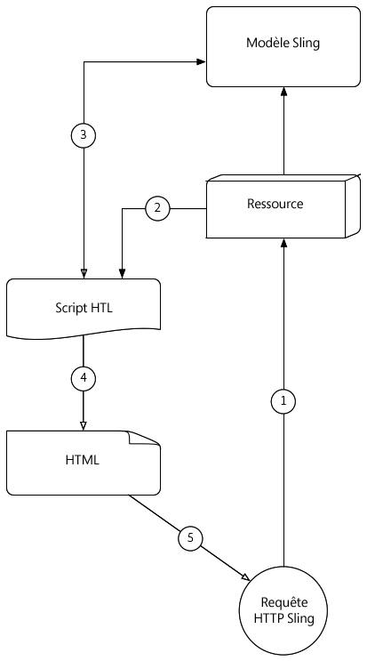
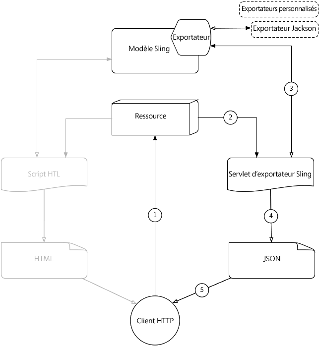

# Comprendre [!DNL Sling Model Exporter]

Apache [!DNL Sling Models] 1.3.0 introduit [!DNL Sling Model Exporter], un moyen élégant d’exporter ou de sérialiser des objets [!DNL Sling Model] dans des abstractions personnalisées. Cet article juxtapose le cas d’utilisation traditionnel de l’utilisation de [!DNL Sling Models] pour renseigner des scripts HTL, en exploitant la structure [!DNL Sling Model Exporter] pour sérialiser un [!DNL Sling Model] dans JSON.

## Flux de requête HTTP de modèle Sling traditionnel

Le cas d&#39;utilisation traditionnel de [!DNL Sling Models] consiste à fournir une abstraction commerciale pour une ressource ou une requête, qui fournit des scripts HTL (ou, précédemment, JSP) une interface pour l&#39;accès aux fonctions métier.

Les modèles courants sont le développement de [!DNL Sling Models] qui représentent AEM Composants ou Pages, et l&#39;utilisation des objets [!DNL Sling Model] pour alimenter les scripts HTL avec des données, avec un résultat final de HTML affiché dans le navigateur.

### Flux de requête HTTP de modèle Sling

1. [!DNL HTTP GET] Une demande est faite pour une ressource en AEM.

   Exemple: `HTTP GET /content/my-resource.html`

1. Selon `sling:resourceType` de la ressource de requête, le script approprié est résolu.

1. Le script adapte la requête ou la ressource à [!DNL Sling Model] souhaité.

1. Le script utilise l’objet [!DNL Sling Model] pour générer le rendu HTML.

1. Le code HTML généré par le script est renvoyé dans la réponse HTTP.

Ce modèle traditionnel fonctionne bien dans le contexte de la génération de code HTML, car [!DNL Sling Model] peut être facilement exploité via HTL. La création de données plus structurées telles que JSON ou XML est une entreprise beaucoup plus fastidieuse car HTL ne se prête pas naturellement à la définition de ces formats.

## [!DNL Sling Model Exporter] Flux de requêtes HTTP

Apache [!DNL Sling Model Exporter] est fourni avec un Sling fourni par Jackson Exporter qui sérialise automatiquement un objet [!DNL Sling Model] &quot;ordinaire&quot; dans JSON. L’exportateur Jackson, bien que configurable, à son coeur inspecte l’objet [!DNL Sling Model] et génère JSON en utilisant toutes les méthodes &quot;getter&quot; comme clés JSON, et les valeurs de retour getter comme valeurs JSON.

La sérialisation directe de [!DNL Sling Models] leur permet de traiter à la fois des requêtes Web normales avec leurs réponses HTML créées à l&#39;aide du flux de requêtes traditionnel [!DNL Sling Model] (voir ci-dessus), mais aussi d&#39;exposer les rendus JSON qui peuvent être utilisés par les services Web ou les applications JavaScript.

*Ce flux décrit le flux utilisant l’exportateur Jackson fourni pour produire la sortie JSON. L&#39;utilisation d&#39;exportateurs personnalisés suit le même flux mais avec leur format de sortie.*

1. GET HTTP La demande est faite pour une ressource en AEM avec le sélecteur et l’extension enregistrés auprès de l’exportateur [!DNL Sling Model].

   Exemple: `HTTP GET /content/my-resource.model.json`

1. Sling résout le `sling:resourceType` de la ressource demandée, le sélecteur et l’extension en un servlet Sling Exporter généré de manière dynamique, qui est mappé à [!DNL Sling Model] avec Exporter.
1. Le servlet Sling Exporter résolu appelle l&#39;[!DNL Sling Model Exporter] par rapport à l&#39;objet [!DNL Sling Model] adapté de la demande ou de la ressource (tel que déterminé par les tables adaptables Sling Models).
1. L’exportateur sérialise l’[!DNL Sling Model] en fonction des annotations de modèle Sling propres à l’exportateur et renvoie le résultat au servlet Sling Exporter.
1. Le servlet Sling Exporter renvoie le rendu JSON de [!DNL Sling Model] dans la réponse HTTP.

>[!NOTE]
>
>Bien que le projet Apache Sling fournisse à Jackson Exporter le numéro de série [!DNL Sling Models] à JSON, la structure Exporter prend également en charge les Exportateurs personnalisés. Par exemple, un projet peut implémenter un Exportateur personnalisé qui sérialise [!DNL Sling Model] dans XML.

>[!NOTE]
>
>Non seulement [!DNL Sling Model Exporter] *sérialise* [!DNL Sling Models], il peut également les exporter en tant qu’objets Java. L’exportation vers d’autres objets Java ne joue pas de rôle dans le flux de requêtes HTTP et n’apparaît donc pas dans le diagramme ci-dessus.

## Documents de support

* [Documentation  [!DNL Sling Model Exporter] d’ApacheFramework](https://sling.apache.org/documentation/bundles/models.html#exporter-framework-since-130)
