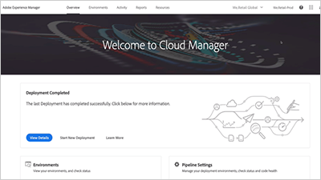

# Présentation {#overview}

Adobe Experience Manager fournit un ensemble commun de fonctionnalités disponibles pour les utilisateurs de AEM Sites, [!DNL Assets] et [!DNL Forms].

## Nouveautés

* **[Utilisation de la gestion du flux de travail dans AEM (vidéo)](./workflow/use-workflow-management.md)**

    
   *aem permet d&#39;obtenir une visibilité sur les workflows en cours d&#39;exécution et facilite la gestion des[!DNL Workflow]définitions.*

* **[Comprendre Cloud Manager pour AEM (Vidéo)](./cloud-manager/understand-cloud-manager-for-aem.md)**\
    

   *Cloud Manager pour AEM permet une gestion, une inspection et un libre-service aisés des environnements AEM.*

* **[Configurer des clés publiques et privées à utiliser avec les E/S d&#39;Adobe (didacticiel)](./authentication/set-up-public-private-keys-for-use-with-aem-and-adobe-io.md)**\
    
   *Découvrez comment les clés et les fichiers de stockage de clés sont générés à l&#39;aide[!DNL openssl]d&#39;un système d&#39;E/S AEM et d&#39;Adobe.*

* **[Utilisation du pipeline Cloud Manager CI/CD (vidéo)](./cloud-manager/use-the-cicd-pipeline-in-cloud-manager-for-aem.md)**\
    

   *Découvrez comment utiliser le pipeline de CI/CD de Cloud Manager pour assurer des déploiements sûrs et cohérents.*

## Sélection du personnel

<table>
<tr>
  <td>
    
    

     <a href="./cloud-manager/understand-cloud-manager-for-aem.md">
    <strong>Comprendre Cloud Manager pour AEM</strong>
    </a>
    

    

    <em>Cloud Manager for AEM offre une solution simple mais robuste qui permet une gestion, une inspection et un libre-service aisés des environnements AEM.</em>
    

  </td>
   <td>
    
     

     <a href="./development/set-up-sling-dynamic-include.md">
    <strong>Configuration de Sling Dynamic Include (SDI)</strong>
    </a>
    

    

    <em>Découvrez comment configurer Sling Dynamic Include (SDI) et permettre aux composants AEM dynamiques de toujours proposer du contenu frais.</em>
    

  </td>
  <td>
    
    

    <a href="./administration/understand-reasons-to-upgrade.md">
    <strong>Comprendre les raisons de la mise à niveau AEM</strong>
    </a>
    

    

    <em>Ventilation de haut niveau des principales fonctionnalités à comprendre, lors de la mise à niveau vers la dernière version de AEM.</em>
    

  </td>
</tr>
</table>

## Ressources supplémentaires

* [Experience League - Explorez AEM](https://experienceleague.adobe.com/#recommended/solutions/experience-manager)
* [aem en tant que Tutorials Cloud Service](/help/cloud-service/overview.md)
* [Vidéos et Tutorials AEM Sites](/help/sites/overview.md)
* [Vidéos et Tutorials AEM Assets](/help/assets/overview.md)
* [Vidéos et Tutorials AEM Forms](/help/forms/overview.md)
