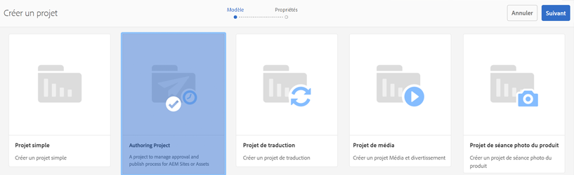
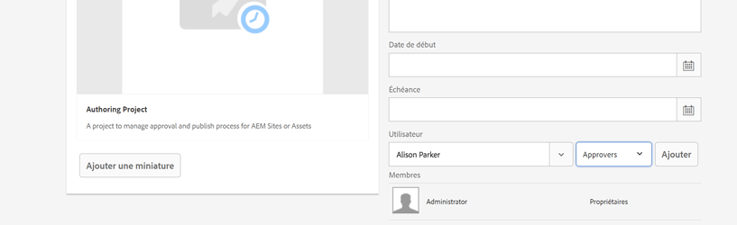
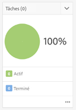
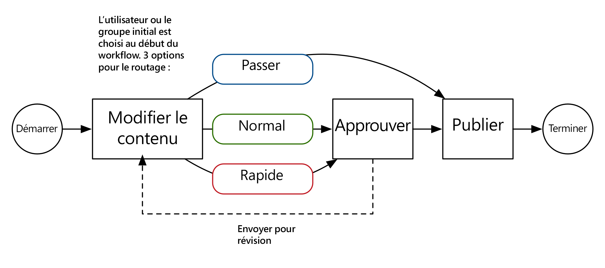
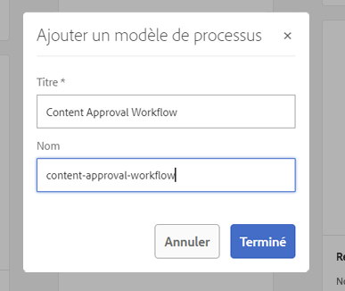
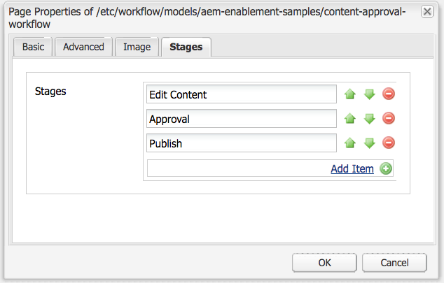

# Développement de projets dans AEM

Il s&#39;agit d&#39;un didacticiel de développement qui illustre comment se développer pour [!DNL AEM Projects].  Dans ce didacticiel, nous allons créer un modèle de projet personnalisé qui peut être utilisé pour créer de nouveaux projets dans AEM pour la gestion des workflows et tâches de création de contenu.

>[!VIDEO](https://video.tv.adobe.com/v/16904/?quality=12&learn=on)

*Cette vidéo présente une brève démonstration du processus terminé, créée dans le didacticiel ci-dessous.*

## Présentation {#introduction}

[[ !Projets AEM DNL]](https://helpx.adobe.com/experience-manager/6-5/sites/authoring/using/projects.html) est une fonctionnalité d’AEM conçue pour faciliter la gestion et le regroupement de tous les workflows et tâches associés à la création de contenu dans le cadre d’une implémentation AEM Sites ou Assets.

aem Projects est fourni avec plusieurs modèles [de projet](https://helpx.adobe.com/experience-manager/6-5/sites/authoring/using/projects.html#ProjectTemplates)prêtes à l&#39;emploi. Lors de la création d’un projet, les auteurs peuvent choisir parmi ces modèles disponibles. Les grandes implémentations AEM répondant à des besoins spécifiques de l&#39;entreprise voudront créer des modèles Project personnalisés, adaptés à leurs besoins. En créant un modèle de projet personnalisé, les développeurs peuvent configurer le tableau de bord du projet, se connecter à des workflows personnalisés et créer des rôles professionnels supplémentaires pour un projet. Nous allons examiner la structure d&#39;un modèle de projet et en créer un exemple.


## Configuration

Ce didacticiel passe en revue le code nécessaire pour créer un modèle de projet personnalisé. Vous pouvez télécharger et installer le package [](./assets/develop-aem-projects/projects-tasks-guide.ui.apps-0.0.1-SNAPSHOT.zip) joint sur un environnement local pour suivre le didacticiel. Vous pouvez également accéder au projet Maven complet hébergé sur [GitHub](https://github.com/Adobe-Marketing-Cloud/aem-guides/tree/feature/projects-tasks-guide).

* [Package de didacticiel terminé](./assets/develop-aem-projects/projects-tasks-guide.ui.apps-0.0.1-SNAPSHOT.zip)
* [Référentiel de code complet sur GitHub](https://github.com/Adobe-Marketing-Cloud/aem-guides/tree/feature/projects-tasks-guide)

Ce tutoriel suppose une connaissance de base des pratiques [de développement](https://helpx.adobe.com/fr/experience-manager/6-5/sites/developing/using/the-basics.html) AEM et une certaine familiarité avec la configuration [du projet](https://helpx.adobe.com/experience-manager/6-5/sites/developing/using/ht-projects-maven.html)AEM Maven. Tout le code mentionné est destiné à être utilisé comme référence et ne doit être déployé que sur une instance [AEM développement](https://helpx.adobe.com/experience-manager/6-5/sites/deploying/using/deploy.html#GettingStarted)local.

## Structure d’un modèle de projet

Les modèles de projet doivent être placés sous le contrôle de code source et doivent résider sous le dossier de votre application sous /apps. Idéalement, ils doivent être placés dans un sous-dossier avec la convention d’affectation de nom de ***/projects/templates/**&lt;mon-modèle>. En suivant cette convention d’affectation de nom, les nouveaux modèles personnalisés deviennent automatiquement disponibles pour les auteurs lors de la création d’un projet. La configuration des modèles de projet disponibles est définie à l&#39;adresse suivante : **/content/projects/jcr:content** node par la propriété **cq:allowedTemplates** . Par défaut, il s’agit d’une expression régulière : **/(apps|libs)/.*/projets/modèles/.***

Le noeud racine d&#39;un modèle de projet aura un **jcr:primaryType** de **cq:Template**. Sous le noeud racine se trouvent 3 noeuds : **gadgets**, **rôles** et **workflows**. Ces noeuds sont tous **non : non structurés**. Sous le noeud racine peut également se trouver un fichier thumbnail.png qui s’affiche lors de la sélection du modèle dans l’assistant de création de projet.

Structure complète des noeuds :

```shell
/apps/<my-app>
    + projects (nt:folder)
         + templates (nt:folder)
              + <project-template-root> (cq:Template)
                   + gadgets (nt:unstructured)
                   + roles (nt:unstructured)
                   + workflows (nt:unstructured)
```

### Racine du modèle de projet

Le noeud racine du modèle de projet sera de type **cq:Template**. Sur ce noeud, vous pouvez configurer les propriétés **jcr:title** et **jcr:description** qui seront affichées dans l’assistant de création de projet. Il existe également une propriété appelée **Assistant** qui pointe vers un formulaire qui renseigne les Propriétés du projet. La valeur par défaut de : **/libs/cq/core/content/projects/wizard/steps/defaultproject.html** doit fonctionner correctement dans la plupart des cas, car il permet à l’utilisateur de renseigner les propriétés de base du projet et d’ajouter des membres au groupe.

**Notez que l’Assistant Créer un projet n’utilise pas la servlet POST Sling. À la place, les valeurs sont publiées sur une servlet personnalisée :**com.adobe.cq.projects.impl.servlet.ProjectServlet**. Il faut en tenir compte lors de l’ajout de champs personnalisés.*

Vous trouverez un exemple d’assistant personnalisé pour le modèle de projet de traduction : **/libs/cq/core/content/projects/wizard/translation/project/defaultproject**.

### Gadgets {#gadgets}

Il n&#39;y a pas de propriétés supplémentaires sur ce noeud, mais les enfants du noeud gadgets contrôlent quels mosaïques de projet renseignent le tableau de bord du projet lorsqu&#39;un nouveau projet est créé. [Les mosaïques](https://helpx.adobe.com/experience-manager/6-5/sites/authoring/using/projects.html#ProjectTiles) du projet (également connues sous le nom de gadgets ou de capsules) sont des cartes simples qui remplissent le lieu de travail d&#39;un projet. Une liste complète de tuiles d&#39;arbres se trouve sous : **/libs/cq/gui/components/projects/admin/pod. **Les propriétaires de projet peuvent toujours ajouter/supprimer des mosaïques après la création d&#39;un projet.

### Rôles {#roles}

Il existe trois rôles [](https://helpx.adobe.com/experience-manager/6-5/sites/authoring/using/projects.html#UserRolesinaProject) par défaut pour chaque projet : **Observateurs**, **rédacteurs** et **propriétaires**. En ajoutant des noeuds enfants sous le noeud rôles, vous pouvez ajouter des rôles de projet spécifiques à l&#39;entreprise supplémentaires pour le modèle. Vous pouvez ensuite lier ces rôles à des workflows spécifiques associés au projet.

### Workflows {#workflows}

L&#39;une des raisons les plus intéressantes de la création d&#39;un modèle de projet personnalisé est qu&#39;il vous permet de configurer les workflows disponibles pour une utilisation avec le projet. Il peut s’agir de workflows OOTB ou de workflows personnalisés. Sous le noeud de **workflows** , il doit y avoir un noeud de **modèles** (également `nt:unstructured`) et des noeuds enfants sous-jacents pour spécifier les modèles de processus disponibles. La propriété **modelId **pointe vers le modèle de flux de travaux sous /etc/workflow et l&#39; **assistant de propriétés** pointe vers la boîte de dialogue utilisée lors du démarrage du flux de travaux. L’un des principaux avantages des projets est la possibilité d’ajouter une boîte de dialogue personnalisée (assistant) pour capturer des métadonnées spécifiques à l’entreprise en début de processus, ce qui peut conduire à d’autres actions dans le processus.

```shell
<projects-template-root> (cq:Template)
    + workflows (nt:unstructured)
         + models (nt:unstructured)
              + <workflow-model> (nt:unstructured)
                   - modelId = points to the workflow model
                   - wizard = dialog used to start the workflow
```

## Creating a project template {#creating-project-template}

Puisque nous allons principalement copier/configurer des noeuds, nous utiliserons le CRXDE Lite. Dans votre instance AEM locale, ouvrez [CRXDE Lite](http://localhost:4502/crx/de/index.jsp).

1. Début en créant un nouveau dossier sous `/apps/&lt;your-app-folder&gt;` nommé `projects`. Créez un autre dossier sous ce nom `templates`.

   ```shell
   /apps/aem-guides/projects-tasks/
                       + projects (nt:folder)
                                + templates (nt:folder)
   ```

1. Pour faciliter les choses, nous allons début notre modèle personnalisé à partir du modèle Projet simple existant.

   1. Copiez et collez le noeud **/libs/cq/core/content/projects/templates/default** sous le dossier *templates* créé à l’étape 1.

   ```shell
   /apps/aem-guides/projects-tasks/
                + templates (nt:folder)
                     + default (cq:Template)
   ```

1. Vous devez désormais disposer d’un chemin tel que **/apps/aem-guides/projects-tâches/projects/templates/authoring-project**.

   1. Modifiez les propriétés **jcr:title** et **jcr:description** du noeud author-project en valeurs de titre et de description personnalisées.

      1. Laissez la propriété **Wizard** pointer vers les propriétés Project par défaut.

   ```shell
   /apps/aem-guides/projects-tasks/projects/
            + templates (nt:folder)
                 + authoring-project (cq:Template)
                      - jcr:title = "Authoring Project"
                      - jcr:description = "A project to manage approval and publish process for AEM Sites or Assets"
                      - wizard = "/libs/cq/core/content/projects/wizard/steps/defaultproject.html"
   ```

1. Pour ce modèle de projet, nous voulons utiliser des Tâches.
   1. ajoutez un nouveau noeud **nt:unstructured** sous authoring-project/gadgets appelé **tâches**.
   1. ajoutez les propriétés String au noeud tâches pour **cardWeight** = &quot;100&quot;, **jcr:title**=&quot;Tâches&quot; et **sling:resourceType**=&quot;cq/gui/components/projects/admin/pod/taskpod&quot;.

   Désormais, la mosaïque [de](https://docs.adobe.com/docs/en/aem/6-3/author/projects.html#Tasks) Tâches s’affiche par défaut lorsqu’un nouveau projet est créé.

   ```shell
   ../projects/templates/authoring-project
       + gadgets (nt:unstructured)
            + team (nt:unstructured)
            + asset (nt:unstructured)
            + work (nt:unstructured)
            + experiences (nt:unstructured)
            + projectinfo (nt:unstructured)
            ..
            + tasks (nt:unstructured)
                 - cardWeight = "100"
                 - jcr:title = "Tasks"
                 - sling:resourceType = "cq/gui/components/projects/admin/pod/taskpod"
   ```

1. Nous ajouterons un rôle d’approbateur personnalisé à notre modèle de projet.

   1. Sous le noeud de modèle de projet (authoring-project), ajoutez un nouveau noeud **nt:unstructured** intitulé **rôles**.
   1. ajoutez un autre noeud **nt:unstructured** intitulé approbateurs en tant qu’enfant du noeud rôles.
   1. ajouter les propriétés de chaîne **jcr:title** = &quot;**Approvers**&quot;, **roleclass** =&quot;**owner&quot;, roleid=&quot;approvers&quot;.**********
      1. Le nom du noeud approbateurs, ainsi que jcr:title et roleid peuvent être n’importe quelle valeur de chaîne (tant que roleid est unique).
      1. **La classe** de rôles régit les autorisations appliquées pour ce rôle en fonction des [3 rôles]OOTB (https://docs.adobe.com/docs/en/aem/6-3/author/projects.html#User Rôles dans un projet) : **propriétaire**, **éditeur** et **observateur**.
      1. En général, si le rôle personnalisé est davantage un rôle de gestion, la classe de rôle peut être **propriétaire ;** s’il s’agit d’un rôle de création plus spécifique comme Photographe ou Designer, l’ **éditeur** roleclass doit suffire. La grande différence entre le **propriétaire** et l’ **éditeur** réside dans le fait que les propriétaires de projet peuvent mettre à jour les propriétés du projet et ajouter de nouveaux utilisateurs au projet.

   ```shell
   ../projects/templates/authoring-project
       + gadgets (nt:unstructured)
       + roles (nt:unstructured)
           + approvers (nt:unstructured)
                - jcr:title = "Approvers"
                - roleclass = "owner"
                - roleid = "approver"
   ```

1. En copiant le modèle Projet simple, vous obtenez 4 workflows prêtes à l&#39;emploi configurés. Chaque noeud sous workflows/modèles pointe vers un processus spécifique et vers un assistant de boîte de dialogue de début pour ce processus. Plus loin dans ce didacticiel, nous allons créer un processus personnalisé pour ce projet. Pour l’instant, supprimez les noeuds situés sous le processus/les modèles :

   ```shell
   ../projects/templates/authoring-project
       + gadgets (nt:unstructured)
       + roles (nt:unstructured)
       + workflows (nt:unstructured)
            + models (nt:unstructured)
               - (remove ootb models)
   ```

1. Afin de faciliter l’identification du modèle de projet par les auteurs de contenu, vous pouvez ajouter une miniature personnalisée. La taille recommandée est de 319 x 319 pixels.
   1. Dans CRXDE Lite, créez un nouveau fichier en tant que frère de gadgets, de rôles et de noeuds de workflows nommés **thumbnail.png**.
   1. Enregistrez, puis accédez au `jcr:content` noeud et doublon cliquez sur la `jcr:data` propriété (évitez de cliquer sur &quot;vue&quot;).
      1. Vous devriez alors ouvrir une boîte de dialogue de modification du `jcr:data` fichier et télécharger une miniature personnalisée.

   ```shell
   ../projects/templates/authoring-project
       + gadgets (nt:unstructured)
       + roles (nt:unstructured)
       + workflows (nt:unstructured)
       + thumbnail.png (nt:file)
   ```

Représentation XML terminée du modèle de projet :

```xml
<?xml version="1.0" encoding="UTF-8"?>
<jcr:root xmlns:sling="http://sling.apache.org/jcr/sling/1.0" xmlns:cq="http://www.day.com/jcr/cq/1.0" xmlns:jcr="http://www.jcp.org/jcr/1.0" xmlns:nt="http://www.jcp.org/jcr/nt/1.0"
    jcr:description="A project to manage approval and publish process for AEM Sites or Assets"
    jcr:primaryType="cq:Template"
    jcr:title="Authoring Project"
    ranking="{Long}1"
    wizard="/libs/cq/core/content/projects/wizard/steps/defaultproject.html">
    <jcr:content
        jcr:primaryType="nt:unstructured"
        detailsHref="/projects/details.html"/>
    <gadgets jcr:primaryType="nt:unstructured">
        <team
            jcr:primaryType="nt:unstructured"
            jcr:title="Team"
            sling:resourceType="cq/gui/components/projects/admin/pod/teampod"
            cardWeight="60"/>
        <tasks
            jcr:primaryType="nt:unstructured"
            jcr:title="Tasks"
            sling:resourceType="cq/gui/components/projects/admin/pod/taskpod"
            cardWeight="100"/>
        <work
            jcr:primaryType="nt:unstructured"
            jcr:title="Workflows"
            sling:resourceType="cq/gui/components/projects/admin/pod/workpod"
            cardWeight="80"/>
        <experiences
            jcr:primaryType="nt:unstructured"
            jcr:title="Experiences"
            sling:resourceType="cq/gui/components/projects/admin/pod/channelpod"
            cardWeight="90"/>
        <projectinfo
            jcr:primaryType="nt:unstructured"
            jcr:title="Project Info"
            sling:resourceType="cq/gui/components/projects/admin/pod/projectinfopod"
            cardWeight="100"/>
    </gadgets>
    <roles jcr:primaryType="nt:unstructured">
        <approvers
            jcr:primaryType="nt:unstructured"
            jcr:title="Approvers"
            roleclass="owner"
            roleid="approvers"/>
    </roles>
    <workflows
        jcr:primaryType="nt:unstructured"
        tags="[]">
        <models jcr:primaryType="nt:unstructured">
        </models>
    </workflows>
</jcr:root>
```

## Test du modèle de projet personnalisé

Nous pouvons maintenant tester notre modèle de projet en créant un nouveau projet.

1. Vous devriez voir le modèle personnalisé comme l’une des options de création de projet.

   

1. Après avoir sélectionné le modèle personnalisé, cliquez sur Suivant et notez que lorsque vous renseignez Project Members, vous pouvez les ajouter en tant que rôle d&#39;approbateur.

   

1. Cliquez sur Créer pour terminer la création du projet à partir du modèle personnalisé. Vous remarquerez sur le Tableau de bord Projet que la mosaïque de Tâches et les autres mosaïques configurées sous gadgets apparaissent automatiquement.

   


## Pourquoi un flux de travail ?

Les workflows traditionnellement AEM qui se concentrent autour d’un processus d’approbation ont utilisé les étapes du processus des participants. aem boîte de réception contient des informations détaillées sur les Tâches et les processus et une intégration améliorée avec AEM Projects. Grâce à ces fonctionnalités, l’utilisation du processus de création de Tâche de projets constitue une option plus attrayante.

### Pourquoi les Tâches ?

L&#39;utilisation d&#39;une étape de création de Tâche par rapport aux étapes traditionnelles du participant offre quelques avantages :

* **Début et date** d&#39;échéance - facilite la gestion de l&#39;heure par les auteurs, la nouvelle fonction Calendrier utilise ces dates.
* **Priorité** : les priorités établies par les priorités Faible, Normale et Élevée permettent aux auteurs de classer les travaux par ordre de priorité.
* **Commentaires** filetés - en tant qu&#39;auteurs travaillant sur une tâche, ils ont la possibilité de laisser des commentaires augmentant la collaboration
* **Visibilité** - Les mosaïques de Tâche et les vues avec des projets permettent aux gestionnaires de vue de la durée de la visite
* **Intégration** de projet - Les Tâches sont déjà intégrées aux rôles et tableaux de bord du projet

Comme les étapes des participants, les Tâches peuvent être attribuées et acheminées de manière dynamique. Les métadonnées de tâche telles que Titre, Priorité peuvent également être définies de manière dynamique en fonction des actions précédentes, comme nous le verrons dans le didacticiel suivant.

Bien que les Tâches aient certains avantages par rapport aux étapes des participants, elles comportent des frais généraux supplémentaires et ne sont pas aussi utiles en dehors d&#39;un projet. En outre, tous les comportements dynamiques des Tâches doivent être codés à l’aide de scripts ecma qui ont leurs propres limites.

## Exemples de cas d’utilisation requis {#goals-tutorial}



Le diagramme ci-dessus décrit les exigences de niveau élevé pour notre processus d’approbation des exemples.

La première étape consiste à créer une Tâche pour terminer la modification d’un élément de contenu. Nous autoriserons l&#39;initiateur du processus à choisir la personne désignée pour cette première tâche.

Une fois la première tâche terminée, la personne désignée dispose de trois options pour le routage du flux de travaux :

**Normal **- Le routage normal crée une tâche attribuée au groupe Approbateur du projet pour révision et approbation. La priorité de la tâche est Normale et la date d’échéance est fixée à 5 jours à compter de sa création.

**Le routage de précipitation** crée également une tâche affectée au groupe Approbateur du projet. La priorité de la tâche est Elevée et la date d&#39;échéance est seulement 1 jour.

**Contourner** : dans cet exemple de flux de travail, le participant initial a la possibilité de contourner le groupe de validation. (oui, cela peut déjouer l&#39;objectif d&#39;un processus d&#39;approbation, mais cela nous permet d&#39;illustrer d&#39;autres capacités de routage)

Le groupe d’approbateurs peut approuver le contenu ou le renvoyer à la personne désignée initialement pour retravailler. Dans le cas d&#39;un renvoi en vue d&#39;un nouveau travail, une nouvelle tâche est créée et étiquetée de manière appropriée &quot;Envoyé en retour pour un nouveau travail&quot;.

La dernière étape du flux de travail utilise l’étape de processus Activer la page/ressource de l’onglet et reproduit la charge utile.

## Création du modèle de processus

1. Dans le menu Début AEM, accédez à Outils -> Workflow -> Modèles. Cliquez sur &quot;Créer&quot; dans le coin supérieur droit pour créer un nouveau modèle de flux de travail.

   Attribuez un titre au nouveau modèle : Processus d’approbation de contenu et nom d’URL : &quot;content-approval-workflow&quot;.

   

   Pour plus d&#39;informations sur la [création de workflows, lisez ici](https://helpx.adobe.com/experience-manager/6-5/sites/developing/using/workflows-models.html).

1. Il est recommandé de regrouper les workflows personnalisés dans leur propre dossier sous /etc/workflow/models. Dans CRXDE Lite, créez un nouveau **&#39;not:folder&#39;** sous /etc/workflow/models nommé **&quot;aem-guides&quot;**. L’Ajoute d’un sous-dossier permet de s’assurer que les workflows personnalisés ne sont pas remplacés par inadvertance lors des mises à niveau ou des installations du Service Pack.

   *Notez qu&#39;il est important de ne jamais placer le dossier ou les workflows personnalisés sous des sous-dossiers d&#39;octets tels que /etc/workflow/models/dam ou /etc/workflow/models/projects, car le sous-dossier entier peut également être remplacé par des mises à niveau ou des Service Packs.

   

   Emplacement du modèle de processus dans la version 6.3

   >[!NOTE]
   >
   >Si vous utilisez AEM 6.4+, l’emplacement du flux de travaux a changé. See [here for more details.](https://helpx.adobe.com/experience-manager/6-5/sites/developing/using/workflows-best-practices.html#LocationsWorkflowModels)

   Si vous utilisez AEM version 6.4+, le modèle de flux de travail est créé sous `/conf/global/settings/workflow/models`. Répétez les étapes ci-dessus avec le répertoire /conf et ajoutez un sous-dossier nommé `aem-guides` et déplacez le `content-approval-workflow` sous-dossier.

   de définition de flux de travail moderne Emplacement du modèle de flux de travail dans la version 6.4+

1. Introduit dans AEM 6.3, il permet d’ajouter des étapes de flux de travail à un flux de travail donné. Les étapes s’affichent pour l’utilisateur à partir de la boîte de réception dans l’onglet Infos de flux de travail. Il montrera à l&#39;utilisateur l&#39;étape actuelle du flux de travail ainsi que les étapes qui le précèdent et la suivent.

   Pour configurer les étapes, ouvrez la boîte de dialogue Propriétés de la page à partir du SideKick. Le quatrième onglet est intitulé &quot;Etapes&quot;. ajoutez les valeurs suivantes pour configurer les trois étapes de ce processus :

   1. Modifier le contenu
   1. Approbation
   1. Publication 

   

   Configurez les étapes du processus dans la boîte de dialogue Propriétés de la page.

   

   Barre de progression du flux de travail telle qu’elle apparaît dans la boîte de réception AEM.

   Vous pouvez éventuellement télécharger une **image** dans les propriétés de la page qui seront utilisées comme miniature de flux de travail lorsque les utilisateurs la sélectionneront. Les dimensions de l’image doivent être de 319 x 319 pixels. L&#39;Ajoute d&#39;une **description** aux propriétés de la page s&#39;affiche également lorsqu&#39;un utilisateur se rend pour sélectionner le flux de travail.

1. Le processus de création de Tâche de projet est conçu pour créer une Tâche en tant qu’étape du processus. Ce n&#39;est qu&#39;après avoir terminé la tâche que le flux de travaux se déplacera. L’étape de création de la Tâche de projet présente un aspect puissant : elle permet de lire les valeurs de métadonnées de processus et de les utiliser pour créer dynamiquement la tâche.

   Commencez par supprimer l’étape du participant qui est créée par défaut. Dans le Sidekick du menu des composants, développez le sous-titre **&quot;Projets&quot;** et faites glisser et déposez le **&quot;Créer une Tâche de projet&quot;** sur le modèle.

   Doublon+Cliquez sur l’étape &quot;Créer une Tâche de projet&quot; pour ouvrir la boîte de dialogue de processus. Configurez les propriétés suivantes :

   Cet onglet est commun à toutes les étapes du processus de workflow et nous définirons le Titre et la Description (ceux-ci ne seront pas visibles par l&#39;utilisateur final). La propriété importante que nous allons définir est l&#39;étape de flux de travail **&quot;Modifier le contenu&quot;** dans le menu déroulant.

   ```shell
   Common Tab
   -----------------
       Title = "Start Task Creation"
       Description = "This the first task in the Workflow"
       Workflow Stage = "Edit Content"
   ```

   Le processus de création de Tâche de projet est conçu pour créer une Tâche en tant qu’étape du processus. L&#39;onglet Tâche nous permet de définir toutes les valeurs de la tâche. Dans notre cas, nous voulons que le cessionnaire soit dynamique, de sorte que nous le laissions vide. Le reste des valeurs de propriété :

   ```shell
   Task Tab
   -----------------
       Name* = "Edit Content"
       Task Priority = "Medium"
       Description = "Edit the content and finalize for approval. Once finished submit for approval."
       Due In - Days = "2"
   ```

   L’onglet routage est une boîte de dialogue facultative qui peut spécifier les actions disponibles pour l’utilisateur qui complète la tâche. Ces actions ne sont que des valeurs de chaîne et seront enregistrées dans les métadonnées du processus. Ces valeurs peuvent être lues par des scripts et/ou des étapes de processus plus tard dans le flux de travaux pour &quot;router&quot; dynamiquement le flux de travaux. En fonction des objectifs [du](#goals-tutorial) flux de travail, trois actions seront ajoutées à cet onglet :

   ```shell
   Routing Tab
   -----------------
       Actions =
           "Normal Approval"
           "Rush Approval"
           "Bypass Approval"
   ```

   Cet onglet nous permet de configurer un script de Tâche précréé où nous pouvons programmer différentes valeurs de la Tâche avant sa création. Nous avons la possibilité de pointer le script vers un fichier externe ou d&#39;incorporer un script court directement dans la boîte de dialogue. Dans notre cas, nous allons pointer le script de Tâche précréation vers un fichier externe. A l&#39;étape 5, nous allons créer ce script.

   ```shell
   Advanced Settings Tab
   -----------------
      Pre-Create Task Script = "/apps/aem-guides/projects/scripts/start-task-config.ecma"
   ```

1. Lors de l’étape précédente, nous avons référencé un script de Tâche précréé. Nous allons créer ce script maintenant dans lequel nous définirons le destinataire de la Tâche en fonction de la valeur d&#39;une valeur de métadonnées de flux de travail &quot;**désigné**&quot;. La **&quot;personne désignée&quot;** sera définie au démarrage du flux de travail. Nous allons également lire les métadonnées de flux de travaux pour choisir de manière dynamique la priorité de la tâche en lisant la valeur &quot;**taskPriority&quot;** des métadonnées du flux de travaux ainsi que la **&quot;taskDueDate&quot; **à définir de manière dynamique lorsque la première tâche est attendue.

   Pour des raisons d’organisation, nous avons créé un dossier situé sous le dossier de l’application, qui contient tous les scripts liés au projet : **/apps/aem-guides/projects-tâches/projects/scripts**. Créez un nouveau fichier sous ce dossier intitulé **&quot;début-tâche-config.ecma&quot;**. *Remarque : assurez-vous que le chemin d’accès à votre fichier début-tâche-config.ecma correspond au chemin d’accès défini dans l’onglet Paramètres avancés de l’étape 4.

   ajoutez les éléments suivants comme contenu du fichier :

   ```
   // start-task-config.ecma
   // Populate the task using values stored as workflow metadata originally posted by the start workflow wizard
   
   // set the assignee based on start workflow wizard
   var assignee = workflowData.getMetaDataMap().get("assignee", Packages.java.lang.String);
   task.setCurrentAssignee(assignee);
   
   //Set the due date for the initial task based on start workflow wizard
   var dueDate = workflowData.getMetaDataMap().get("taskDueDate", Packages.java.util.Date);
   if (dueDate != null) {
       task.setProperty("taskDueDate", dueDate);
   }
   
   //Set the priority based on start workflow wizard
   var taskPriority = workflowData.getMetaDataMap().get("taskPriority", "Medium");
   task.setProperty("taskPriority", taskPriority);
   ```

1. Revenez au processus d’approbation du contenu. Faites glisser et déposez le composant **OU Split** (situé dans le Sidekick sous la catégorie &quot;Workflow&quot;) sous l’étape de Tâche **** Début. Dans la boîte de dialogue commune, sélectionnez le bouton radio correspondant à 3 branches. La division OU lit la valeur de métadonnées de flux de travail **&quot;lastTaskAction&quot;** pour déterminer l&#39;itinéraire du flux de travail. La propriété **&quot;lastTaskAction&quot;** sera définie sur l&#39;une des valeurs de l&#39;onglet Routage configuré à l&#39;étape 4. Pour chacun des onglets Branche, remplissez la zone de texte **Script** avec les valeurs suivantes :

   ```
   function check() {
   var lastAction = workflowData.getMetaDataMap().get("lastTaskAction","");
   
   if(lastAction == "Normal Approval") {
       return true;
   }
   
   return false;
   }
   ```

   ```
   function check() {
   var lastAction = workflowData.getMetaDataMap().get("lastTaskAction","");
   
   if(lastAction == "Rush Approval") {
       return true;
   }
   
   return false;
   }
   ```

   ```
   function check() {
   var lastAction = workflowData.getMetaDataMap().get("lastTaskAction","");
   
   if(lastAction == "Bypass Approval") {
       return true;
   }
   
   return false;
   }
   ```

   *Notez que nous effectuons une correspondance de chaîne directe pour déterminer l&#39;itinéraire. Il est donc important que les valeurs définies dans les scripts de branche correspondent aux valeurs d&#39;itinéraire définies à l&#39;étape 4.

1. Faites glisser et déposez une autre étape &quot;**Créer une Tâche** de projet&quot; vers le modèle à l’extrême gauche (branche 1) sous la division OU. Renseignez la boîte de dialogue avec les propriétés suivantes :

   ```
   Common Tab
   -----------------
       Title = "Approval Task Creation"
       Description = "Create a an approval task for Project Approvers. Priority is Medium."
       Workflow Stage = "Approval"
   
   Task Tab
   ------------
       Name* = "Approve Content for Publish"
       Task Priority = "Medium"
       Description = "Approve this content for publication."
       Days = "5"
   
   Routing Tab - Actions
   ----------------------------
       "Approve and Publish"
       "Send Back for Revision"
   ```

   Dans la mesure où il s’agit de la route d’approbation normale, la priorité de la tâche est définie sur Moyen. De plus, nous donnons au groupe Approbateurs 5 jours pour compléter la Tâche. Le destinataire n’est pas renseigné dans l’onglet Tâche, car nous l’affecterons de manière dynamique dans l’onglet Paramètres avancés. Nous donnons au groupe Approbateurs deux itinéraires possibles lors de la réalisation de cette tâche : **&quot;Approuver et publier&quot;** s’ils approuvent le contenu et qu’il peut être publié et **&quot;Renvoyer pour révision&quot;** s’il existe des problèmes que l’éditeur d’origine doit corriger. L’approbateur peut laisser des commentaires que l’éditeur d’origine verra si le processus lui est renvoyé.

Plus tôt dans ce didacticiel, nous avons créé un modèle de projet qui incluait un rôle Approbateurs. Chaque fois qu&#39;un nouveau projet est créé à partir de ce modèle, un groupe spécifique au projet est créé pour le rôle Approbateurs. Tout comme une étape de participant, une Tâche ne peut être affectée qu’à un utilisateur ou à un groupe. Nous voulons affecter cette tâche au groupe de projets qui correspond au groupe Approbateurs. Tous les workflows lancés à partir d&#39;un projet auront des métadonnées qui mappent les rôles du projet au groupe spécifique du projet.

Copiez+Collez le code suivant dans la zone de texte **Script** de l’onglet **Paramètres avancés **onglet. Ce code lit les métadonnées du flux de travail et affecte la tâche au groupe Approbateurs du projet. S&#39;il ne trouve pas la valeur du groupe d&#39;approbateurs, il revient à affecter la tâche au groupe Administrateurs.

```
var projectApproverGrp = workflowData.getMetaDataMap().get("project.group.approvers","administrators");

task.setCurrentAssignee(projectApproverGrp);
```

1. Faites glisser et déposez une autre étape &quot;**Créer une Tâche** de projet&quot; vers le modèle vers la branche centrale (branche 2) sous la division OU. Renseignez la boîte de dialogue avec les propriétés suivantes :

   ```
   Common Tab
   -----------------
       Title = "Rush Approval Task Creation"
       Description = "Create a an approval task for Project Approvers. Priority is High."
       Workflow Stage = "Approval"
   
   Task Tab
   ------------
       Name* = "Rush Approve Content for Publish"
       Task Priority = "High"
       Description = "Rush approve this content for publication."
       Days = "1"
   
   Routing Tab - Actions
   ----------------------------
       "Approve and Publish"
       "Send Back for Revision"
   ```

   Dans la mesure où il s’agit de l’itinéraire d’approbation précipitée, la priorité de la tâche est définie sur Élevée. En outre, nous ne donnons au groupe Approbateurs qu&#39;un seul jour pour terminer la tâche. Le destinataire n’est pas renseigné dans l’onglet Tâche, car nous l’affecterons de manière dynamique dans l’onglet Paramètres avancés.

   Nous pouvons réutiliser le même extrait de script que l’étape 7 pour remplir la zone de texte **Script** sur l’onglet ** Paramètres avancés **onglet. Copier+Coller le code ci-dessous :

   ```
   var projectApproverGrp = workflowData.getMetaDataMap().get("project.group.approvers","administrators");
   
   task.setCurrentAssignee(projectApproverGrp);
   ```

1. Faites glisser un composant** No Operation** vers la branche d&#39;extrême droite (branche 3). Le composant Aucune opération n’effectue aucune action et progresse immédiatement, ce qui représente le désir de l’éditeur d’origine de contourner l’étape d’approbation. Techniquement, nous pourrions quitter cette branche sans aucune étape de flux de travail, mais en règle générale, nous ajouterons une étape Aucune opération. Cela permet aux autres développeurs de déterminer clairement l&#39;objectif de la branche 3.

   Doublon cliquez sur l’étape de flux de travaux et configurez le titre et la description :

   ```
   Common Tab
   -----------------
       Title = "Bypass Approval"
       Description = "Placeholder step to indicate that the original editor decided to bypass the approver group."
   ```

   

   Le modèle de flux de travail doit ressembler à ceci une fois que les trois branches de la division OU ont été configurées.

1. Puisque le groupe Approbateurs a la possibilité de renvoyer le flux de travail à l&#39;éditeur d&#39;origine pour d&#39;autres révisions, nous nous basons sur l&#39;étape **Goto** pour lire la dernière action entreprise et router le flux de travail au début ou le laisser continuer.

   Faites glisser et déposez le composant Atteindre l’étape (situé dans le Sidekick sous Workflow) sous la division OU où il se rejoint. Cliquez sur doublon et configurez les propriétés suivantes dans la boîte de dialogue :

   ```
   Common Tab
   ----------------
       Title = "Goto Step"
       Description = "Based on the Approver groups action route the workflow to the beginning or continue and publish the payload."
   
   Process Tab
   ---------------
       The step to go to. = "Start Task Creation"
   ```

   Le dernier élément que nous allons configurer est le script dans le cadre de l&#39;étape de processus Goto. La valeur du script peut être incorporée via la boîte de dialogue ou configurée pour pointer vers un fichier externe. Le script Goto doit contenir une **fonction check()** et renvoyer true si le flux de travaux doit passer à l’étape spécifiée. Un retour de faux résultats dans le flux de travaux avance.

   Si le groupe d’approbateurs choisit l’action **&quot;Arrière-plan pour révision&quot;** (configurée aux étapes 7 et 8), nous souhaitons renvoyer le flux de travail à l’étape **&quot;Création de Tâche de Début&quot;** .

   Dans l’onglet Processus, ajoutez le fragment de code suivant à la zone de texte du script :

   ```
   function check() {
   var lastAction = workflowData.getMetaDataMap().get("lastTaskAction","");
   
   if(lastAction == "Send Back for Revision") {
       return true;
   }
   
   return false;
   }
   ```

1. Pour publier la charge utile, nous allons utiliser l’étape **Activer la page/processus de ressource** de l’onglet. Cette étape de processus nécessite peu de configuration et ajoute la charge utile du flux de travail à la file d&#39;attente de réplication pour l&#39;activation. Nous allons ajouter l’étape sous l’étape Goto et, de cette façon, elle ne peut être atteinte que si le groupe Approbateurs a approuvé le contenu pour publication ou si l’éditeur d’origine a choisi la route d’approbation de contournement.

   Faites glisser et déposez l’étape **Activer le processus de page/ressource** (située dans le sidekick sous Processus de gestion de la gestion de la correspondance) sous l’étape Atteindre du modèle.

   

   À quoi doit ressembler le modèle de processus après avoir ajouté l’étape Atteindre et l’étape Activer la page/le fichier.

1. Si le groupe Approbateur renvoie le contenu pour révision, nous voulons le faire savoir à l’éditeur d’origine. Pour ce faire, nous pouvons modifier dynamiquement les propriétés de création de Tâches. Nous allons extraire la valeur de propriété lastActionTaken de **&quot;Send Back for Revision&quot;**. Si cette valeur est présente, nous modifierons le titre et la description pour indiquer que cette tâche est le résultat du contenu renvoyé pour révision. Nous mettrons également à jour la priorité sur **&quot;Élevée&quot;** afin qu&#39;elle soit le premier élément sur lequel travaille l&#39;éditeur. Enfin, nous définirons la date d&#39;échéance de la tâche à un jour à partir du moment où le flux de travail a été renvoyé pour révision.

   Remplacez le script de début `start-task-config.ecma` (créé à l’étape 5) par le script suivant :

   ```
   // start-task-config.ecma
   // Populate the task using values stored as workflow metadata originally posted by the start workflow wizard
   
   // set the assignee based on start workflow wizard
   var assignee = workflowData.getMetaDataMap().get("assignee", Packages.java.lang.String);
   task.setCurrentAssignee(assignee);
   
   //Set the due date for the initial task based on start workflow wizard
   var dueDate = workflowData.getMetaDataMap().get("taskDueDate", Packages.java.util.Date);
   if (dueDate != null) {
       task.setProperty("taskDueDate", dueDate);
   }
   
   //Set the priority based on start workflow wizard
   var taskPriority = workflowData.getMetaDataMap().get("taskPriority", "Medium");
   task.setProperty("taskPriority", taskPriority);
   
   var lastAction = workflowData.getMetaDataMap().get("lastTaskAction","");
   
   //change the title and priority if the approver group sent back the content
   if(lastAction == "Send Back for Revision") {
     var taskName = "Review and Revise Content";
   
     //since the content was rejected we will set the priority to High for the revison task
     task.setProperty("taskPriority", "High"); 
   
     //set the Task name (displayed as the task title in the Inbox) 
     task.setProperty("name", taskName);
     task.setProperty("nameHierarchy", taskName);
   
     //set the due date of this task 1 day from current date
     var calDueDate = Packages.java.util.Calendar.getInstance();
     calDueDate.add(Packages.java.util.Calendar.DATE, 1);
     task.setProperty("taskDueDate", calDueDate.getTime());
   
   }
   ```

## Création de l’assistant &quot;Processus de début&quot; {#start-workflow-wizard}

Lors du démarrage d’un processus à partir d’un projet, vous devez spécifier un assistant pour le début du processus. Assistant par défaut : `/libs/cq/core/content/projects/workflowwizards/default_workflow` permet à l’utilisateur de saisir un titre de flux de travaux, un commentaire de début et un chemin de charge utile pour que le flux de travaux s’exécute. Plusieurs autres exemples sont également présentés ci-dessous : `/libs/cq/core/content/projects/workflowwizards`.

La création d&#39;un assistant personnalisé peut être très puissante car vous pouvez collecter des informations critiques avant les débuts du processus. Les données sont stockées dans le cadre des métadonnées du flux de travail et les processus peuvent les lire et modifier de manière dynamique le comportement en fonction des valeurs saisies. Nous allons créer un assistant personnalisé pour affecter de manière dynamique la première tâche du processus en fonction d&#39;une valeur de l&#39;Assistant début.

1. Dans CRXDE-Lite, nous allons créer un sous-dossier sous `/apps/aem-guides/projects-tasks/projects` le dossier &quot;Assistants&quot;. Copiez l’assistant par défaut de : `/libs/cq/core/content/projects/workflowwizards/default_workflow` sous le dossier des assistants nouvellement créé et renommez-le **content-approval-début**. Le chemin complet doit maintenant être : `/apps/aem-guides/projects-tasks/projects/wizards/content-approval-start`.

   L’assistant par défaut est un assistant à 2 colonnes dont la première colonne affiche le titre, la description et la miniature du modèle de flux de travail sélectionné. La deuxième colonne comprend les champs Titre du flux de travail, Commentaire du Début et Chemin d’accès à la charge. L’assistant est un formulaire d’interface utilisateur tactile standard et utilise les composants [de formulaire d’interface utilisateur](https://docs.adobe.com/docs/en/aem/6-5/develop/ref/granite-ui/api/jcr_root/libs/granite/ui/components/coral/foundation/form/index.html) granite standard pour remplir les champs.

   

1. Nous allons ajouter un champ supplémentaire à l&#39;Assistant qui sera utilisé pour définir la personne désignée de la première tâche du processus (voir [Créer le modèle](#create-workflow-model)de processus : Étape 5).

   Sous `../content-approval-start/jcr:content/items/column2/items` cette page, créez un nouveau noeud de type `nt:unstructured` nommé **&quot;assign&quot;**. Nous utiliserons le composant Sélecteur d&#39;utilisateur de projets (qui est basé sur le composant [Sélecteur d&#39;utilisateur de](https://docs.adobe.com/docs/en/aem/6-5/develop/ref/granite-ui/api/jcr_root/libs/granite/ui/components/coral/foundation/form/userpicker/index.html)granite). Ce champ de formulaire permet de limiter facilement la sélection des utilisateurs et des groupes à ceux appartenant au projet en cours.

   Vous trouverez ci-dessous la représentation XML du noeud **d’affectation** :

   ```xml
   <assign
       granite:class="js-cq-project-user-picker"
       jcr:primaryType="nt:unstructured"
       sling:resourceType="cq/gui/components/projects/admin/userpicker"
       fieldLabel="Assign To"
       hideServiceUsers="{Boolean}true"
       impersonatesOnly="{Boolean}true"
       showOnlyProjectMembers="{Boolean}true"
       name="assignee"
       projectPath="${param.project}"
       required="{Boolean}true"/>
   ```

1. Nous ajouterons également un champ de sélection de priorité qui déterminera la priorité de la première tâche du processus (voir [Créer le modèle](#create-workflow-model)de processus : Étape 5).

   En dessous `/content-approval-start/jcr:content/items/column2/items` créez un nouveau noeud de type `nt:unstructured` nommé **priorité**. Nous utiliserons le composant [Sélection de l&#39;interface utilisateur](https://docs.adobe.com/docs/en/aem/6-2/develop/ref/granite-ui/api/jcr_root/libs/granite/ui/components/coral/foundation/form/select/index.html) Granite pour remplir le champ de formulaire.

   Sous le noeud de **priorité** , nous allons ajouter un noeud **items** de **nt:unstructured**. Sous le noeud **d’éléments** , ajoutez 3 noeuds supplémentaires pour renseigner les options de sélection Élevé, Moyen et Faible. Chaque noeud est de type **nt:unstructured** et doit avoir une propriété **text** et **value** . Le texte et la valeur doivent être identiques :

   1. Élevée
   1. Moyenne
   1. Faible

   Pour le noeud Medium, ajoutez une autre propriété booléenne nommée &quot;**selected&quot;** avec une valeur définie sur **true**. Ainsi, la valeur par défaut du champ de sélection est Moyen.

   Vous trouverez ci-dessous une représentation XML de la structure et des propriétés du noeud :

   ```xml
   <priority
       jcr:primaryType="nt:unstructured"
       sling:resourceType="granite/ui/components/coral/foundation/form/select"
       fieldLabel="Task Priority"
       name="taskPriority">
           <items jcr:primaryType="nt:unstructured">
               <high
                   jcr:primaryType="nt:unstructured"
                   text="High"
                   value="High"/>
               <medium
                   jcr:primaryType="nt:unstructured"
                   selected="{Boolean}true"
                   text="Medium"
                   value="Medium"/>
               <low
                   jcr:primaryType="nt:unstructured"
                   text="Low"
                   value="Low"/>
               </items>
   </priority>
   ```

1. Nous autoriserons l&#39;initiateur du processus à définir la date d&#39;échéance de la tâche initiale. Nous utiliserons le champ de formulaire [Granite UI DatePicker](https://docs.adobe.com/docs/en/aem/6-5/develop/ref/granite-ui/api/jcr_root/libs/granite/ui/components/coral/foundation/form/datepicker/index.html) pour capturer cette entrée. Nous allons également ajouter un champ masqué avec un [TypeHint](https://sling.apache.org/documentation/bundles/manipulating-content-the-slingpostservlet-servlets-post.html#typehint) pour nous assurer que l&#39;entrée est stockée en tant que propriété de type Date dans le JCR.

   ajoutez deux noeuds **nt:unstructured** avec les propriétés suivantes représentées ci-dessous dans le langage XML :

   ```xml
   <duedate
       granite:rel="project-duedate"
       jcr:primaryType="nt:unstructured"
       sling:resourceType="granite/ui/components/coral/foundation/form/datepicker"
       displayedFormat="YYYY-MM-DD HH:mm"
       fieldLabel="Due Date"
       minDate="today"
       name="taskDueDate"
       type="datetime"/>
   <duedatetypehint
       jcr:primaryType="nt:unstructured"
       sling:resourceType="granite/ui/components/coral/foundation/form/hidden"
       name="taskDueDate@TypeHint"
       type="datetime"
       value="Calendar"/>
   ```

1. Vous pouvez vue le code complet de la boîte de dialogue Assistant début [ici](https://github.com/Adobe-Marketing-Cloud/aem-guides/blob/master/projects-tasks-guide/ui.apps/src/main/content/jcr_root/apps/aem-guides/projects-tasks/projects/wizards/content-approval-start/.content.xml).

## Connexion du processus et du modèle de projet {#connecting-workflow-project}

La dernière chose que nous devons faire est de nous assurer que le modèle de flux de travail est disponible pour être lancé à partir de l&#39;un des projets. Pour ce faire, nous devons revoir le modèle de projet que nous avons créé dans la partie 1 de cette série.

La configuration de flux de travail est une zone d&#39;un modèle de projet qui spécifie les workflows disponibles à utiliser avec ce projet. La configuration est également responsable de la spécification de l&#39;Assistant Début de travaux lors du démarrage du processus (que nous avons créé lors des étapes [précédentes)](#start-workflow-wizard). La configuration de flux de travail d’un modèle de projet est &quot;actif&quot;, ce qui signifie que la mise à jour de la configuration de flux de travail aura pour effet les nouveaux projets créés ainsi que les projets existants qui utilisent le modèle.

1. Dans CRXDE-Lite, accédez au modèle de projet de création créé précédemment à `/apps/aem-guides/projects-tasks/projects/templates/authoring-project/workflows/models`.

   Sous le noeud models, ajoutez un nouveau noeud nommé **contentapproval** avec un type de noeud **nt:unstructured**. Ajoutez les propriétés suivantes au nœud  :

   ```xml
   <contentapproval
       jcr:primaryType="nt:unstructured"
       modelId="/etc/workflow/models/aem-guides/content-approval-workflow/jcr:content/model"
       wizard="/apps/aem-guides/projects-tasks/projects/wizards/content-approval-start.html"
   />
   ```

   >[!NOTE]
   >
   >Si vous utilisez AEM 6.4, l’emplacement de Workflow a changé. Pointez la `modelId` propriété sur l’emplacement du modèle de processus d’exécution sous `/var/workflow/models/aem-guides/content-approval-workflow`
   >
   >
   >Voir [ici pour plus d’informations sur la modification de l’emplacement du processus.](https://helpx.adobe.com/experience-manager/6-5/sites/developing/using/workflows-best-practices.html#LocationsWorkflowModels)

   ```xml
   <contentapproval
       jcr:primaryType="nt:unstructured"
       modelId="/var/workflow/models/aem-guides/content-approval-workflow"
       wizard="/apps/aem-guides/projects-tasks/projects/wizards/content-approval-start.html"
   />
   ```

1. Une fois que le processus d’approbation de contenu a été ajouté au modèle de projet, il doit être disponible pour démarrer à partir de la mosaïque de flux de travail du projet. Allez-y et lancez et jouez avec les différents routages que nous avons créés.

## Documents de support

* [Télécharger le package de didacticiel terminé](./assets/develop-aem-projects/projects-tasks-guide.ui.apps-0.0.1-SNAPSHOT.zip)
* [Référentiel de code complet sur GitHub](https://github.com/Adobe-Marketing-Cloud/aem-guides/tree/feature/projects-tasks-guide)
* [Documentation des projets AEM](https://helpx.adobe.com/experience-manager/6-5/sites/authoring/using/projects.html)
