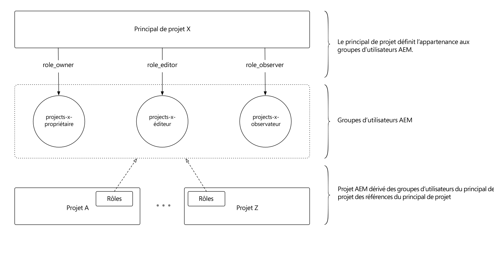

# Utiliser des Principal de projet

Les Principal de projet simplifient considérablement la gestion des utilisateurs et des équipes avec [!DNL AEM Projects].

>[!VIDEO](https://video.tv.adobe.com/v/17740/?quality=12&learn=on)

Les administrateurs peuvent désormais créer un **[!DNL Master Project]** et affecter des utilisateurs à des rôles/autorisations dans le cadre d&#39;une équipe de projet. Les projets peuvent être créés à partir d&#39;un projet Principal et héritent automatiquement de l&#39;appartenance à l&#39;équipe. Cette offre présente plusieurs avantages :

* Réutilisation des équipes existantes sur plusieurs projets
* Accélère la création de projet car les équipes n&#39;ont pas à être recréées à la main
* Gérer l&#39;appartenance à l&#39;équipe à partir d&#39;un emplacement central et les mises à jour apportées aux équipes sont automatiquement héritées par les projets
* évite la création de listes ACL de duplicata, ce qui peut entraîner des problèmes de performances

[!DNL Master Projects] peut être créé sous le dossier   maîtres sous Projets AEM. Une fois un projet Principal créé, il s’affiche en tant qu’option en regard des modèles disponibles dans l’assistant lors de la création de nouveaux projets.

[!DNL Project Masters] URL (instance locale d’auteur AEM) :  [http://localhost:4502/projects.html/content/projects/masters](http://localhost:4502/projects.html/content/projects/masters)

## Supprimer [!DNL Project Masters]

La suppression d’un projet maître entraîne l’exécution de projets dérivés inutilisables.

Avant de supprimer un projet maître, assurez-vous que tous les projets dérivés sont terminés et supprimés des AEM. Veillez à enregistrer les données de projet requises avant de supprimer les projets dérivés. Une fois tous les projets dérivés supprimés de l&#39;AEM, le projet maître peut être supprimé en toute sécurité.

## Marquer [!DNL Project Masters] comme Inactif

En remplaçant l&#39;état du projet maître par inactif dans les propriétés du projet, les projets maîtres inactifs disparaissent de la liste des projets maîtres.

Pour afficher les projets maîtres inactifs, activez le bouton de filtre &quot;Afficher principal&quot; dans la barre supérieure (en regard de la bascule d’affichage de la liste). Pour que le projet inactif soit à nouveau principal, il vous suffit de sélectionner le projet maître inactif, de modifier les propriétés du projet et de le redéfinir sur principal.

## Comprendre [!DNL Project Masters]

[!DNL Project Masters] en définissant un ensemble de groupes d’utilisateurs AEM (propriétaires, éditeurs et observateurs) et en permettant aux projets dérivés de référencer et de réutiliser ces groupes d’utilisateurs définis de manière centralisée.

Cela réduit le nombre total de groupes d’utilisateurs requis dans AEM. Avant [!DNL Project Masters], chaque projet créait 3 groupes d&#39;utilisateurs avec les ACE d&#39;accompagnement pour appliquer l&#39;autorisation, de sorte que 100 projets ont généré 300 groupes d&#39;utilisateurs. Les Principal de projet permettent à un certain nombre de projets de réutiliser les trois mêmes groupes, en supposant que l’appartenance partagée s’aligne sur les besoins de l’entreprise dans l’ensemble du projet.
