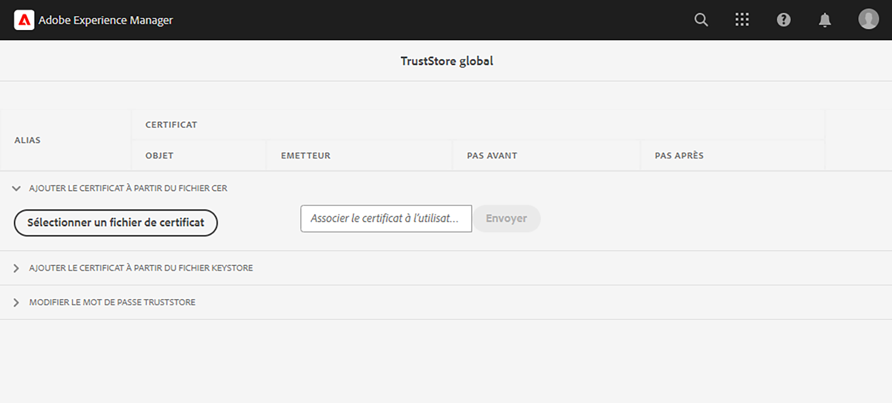

# Appeler des API internes avec des certificats privés

Découvrez comment effectuer des appels HTTPS d’AEM aux API web à l’aide de certificats privés ou auto-signés.

>[!VIDEO](https://video.tv.adobe.com/v/3424853?quality=12&learn=on)

Par défaut, lorsque vous tentez d’établir une connexion HTTPS à une API web qui utilise un certificat auto-signé, la connexion échoue avec l’erreur :

```
PKIX path building failed: sun.security.provider.certpath.SunCertPathBuilderException: unable to find valid certification path to requested target
```

Ce problème survient généralement lorsque le **certificat SSL de l’API n’est pas émis par une autorité de certification reconnue** et l’application Java™ ne peut pas valider le certificat SSL/TLS.

Découvrez comment appeler avec succès des API qui possèdent des certificats privés ou auto-signés à l’aide d’[Apache HttpClient](https://hc.apache.org/httpcomponents-client-4.5.x/index.html) et du **TrustStore global d’AEM**.


## Prototype du code d’appel d’API à l’aide de HttpClient

Le code suivant établit une connexion HTTPS à une API web :

```java
...
String API_ENDPOINT = "https://example.com";

// Create HttpClientBuilder
HttpClientBuilder httpClientBuilder = HttpClientBuilder.create();

// Create HttpClient
CloseableHttpClient httpClient = httpClientBuilder.build();

// Invoke API
CloseableHttpResponse closeableHttpResponse = httpClient.execute(new HttpGet(API_ENDPOINT));

// Code that reads response code and body from the 'closeableHttpResponse' object
...
```

Le code utilise les classes de bibliothèque et les méthodes [HttpClient](https://hc.apache.org/httpcomponents-client-4.5.x/index.html) d’[Apache HttpComponent](https://hc.apache.org/).


## HttpClient et charger le matériel TrustStore d’AEM

Pour appeler un point d’entrée d’API qui possède un _certificat privé ou auto-signé_, le `SSLContextBuilder` de [HttpClient](https://hc.apache.org/httpcomponents-client-4.5.x/index.html) doit être chargé avec le TrustStore d’AEM et utilisé pour faciliter la connexion.

Suivez les étapes ci-dessous :

1. Connectez-vous à votre **instance de création AEM** en tant qu’**administrateur ou administratrice**.
1. Accédez à **Instance de création AEM > Outils > Sécurité > TrustStore**, puis ouvrez **TrustStore global**. Si vous y accédez pour la première fois, définissez un mot de passe pour le TrustStore global.

   

1. Pour importer un certificat privé, cliquez sur **Sélectionner le fichier de certificat** et sélectionnez le fichier de certificat souhaité avec l’extension `.cer`. Importez-le en cliquant sur le bouton **Envoyer**.

1. Mettez à jour le code Java™ comme ci-dessous. Notez que pour utiliser `@Reference` pour obtenir le `KeyStoreService` d’AEM, le code d’appel doit être un composant/service OSGi ou un modèle Sling (et `@OsgiService` doit être utilisé).

   ```java
   ...
   
   // Get AEM's KeyStoreService reference
   @Reference
   private com.adobe.granite.keystore.KeyStoreService keyStoreService;
   
   ...
   
   // Get AEM TrustStore using KeyStoreService
   KeyStore aemTrustStore = getAEMTrustStore(keyStoreService, resourceResolver);
   
   if (aemTrustStore != null) {
   
       // Create SSL Context
       SSLContextBuilder sslbuilder = new SSLContextBuilder();
   
       // Load AEM TrustStore material into above SSL Context
       sslbuilder.loadTrustMaterial(aemTrustStore, null);
   
       // Create SSL Connection Socket using above SSL Context
       SSLConnectionSocketFactory sslsf = new SSLConnectionSocketFactory(
               sslbuilder.build(), NoopHostnameVerifier.INSTANCE);
   
       // Create HttpClientBuilder
       HttpClientBuilder httpClientBuilder = HttpClientBuilder.create();
       httpClientBuilder.setSSLSocketFactory(sslsf);
   
       // Create HttpClient
       CloseableHttpClient httpClient = httpClientBuilder.build();
   
       // Invoke API
       closeableHttpResponse = httpClient.execute(new HttpGet(API_ENDPOINT));
   
       // Code that reads response code and body from the 'closeableHttpResponse' object
       ...
   } 
   
   /**
    * 
    * Returns the global AEM TrustStore
    * 
    * @param keyStoreService OOTB OSGi service that makes AEM based KeyStore
    *                         operations easy.
    * @param resourceResolver
    * @return
    */
   private KeyStore getAEMTrustStore(KeyStoreService keyStoreService, ResourceResolver resourceResolver) {
   
       // get AEM TrustStore from the KeyStoreService and ResourceResolver
       KeyStore aemTrustStore = keyStoreService.getTrustStore(resourceResolver);
   
       return aemTrustStore;
   }
   
   ...
   ```

   * Injectez le service OSGi `com.adobe.granite.keystore.KeyStoreService` prêt à l’emploi dans votre composant OSGi.
   * Procurez-vous le TrustStore global d’AEM à l’aide de `KeyStoreService` et `ResourceResolver`. C’est ce que fait la méthode `getAEMTrustStore(...)`.
   * Créez un objet de `SSLContextBuilder`, voir [Détails de l’API](https://javadoc.io/static/org.apache.httpcomponents/httpcore/4.4.8/index.html?org/apache/http/ssl/SSLContextBuilder.html) Java™.
   * Chargez le TrustStore global d’AEM dans `SSLContextBuilder` avec la méthode `loadTrustMaterial(KeyStore truststore,TrustStrategy trustStrategy)`.
   * Transmettez `null` pour `TrustStrategy` dans la méthode ci-dessus, cela garantit que seuls les certificats approuvés par AEM seront acceptés lors de l’exécution de l’API.


>[!CAUTION]
>
>Les appels d’API avec des certificats valides délivrés par une autorité de certification échouent lors de l’exécution de l’approche mentionnée. Seuls les appels d’API avec des certificats approuvés par AEM sont autorisés en suivant cette méthode.
>
>Utilisez l’[approche standard](#prototypical-api-invocation-code-using-httpclient) pour exécuter des appels d’API de certificats valides délivrés par une autorité de certification, ce qui signifie que seules les API associées à des certificats privés doivent être exécutées à l’aide de la méthode mentionnée précédemment.

## Éviter les modifications du KeyStore JVM

Pour appeler efficacement les API internes avec des certificats privés, une approche conventionnelle consiste à modifier le KeyStore JVM. Pour ce faire, vous devez importer les certificats privés à l’aide de la commande [keytool](https://docs.oracle.com/en/java/javase/11/tools/keytool.html#GUID-5990A2E4-78E3-47B7-AE75-6D1826259549) de Java™.

Toutefois, cette méthode n’est pas alignée sur les bonnes pratiques en matière de sécurité et AEM offre une option supérieure grâce à l’utilisation du **TrustStore global** et de [KeyStoreService](https://javadoc.io/doc/com.adobe.aem/aem-sdk-api/latest/com/adobe/granite/keystore/KeyStoreService.html).


## Package de solution

L’exemple de projet Node.js illustré dans la vidéo peut être téléchargé [ici](assets/internal-api-call/REST-APIs.zip).

Le code du servlet AEM est disponible dans la branche `tutorial/web-api-invocation` de projet de sites WKND, [voir ici](https://github.com/adobe/aem-guides-wknd/tree/tutorial/web-api-invocation/core/src/main/java/com/adobe/aem/guides/wknd/core/servlets).
