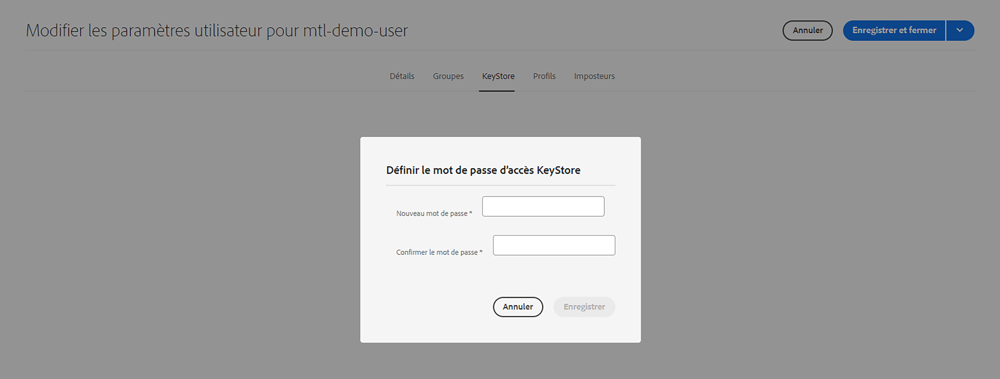
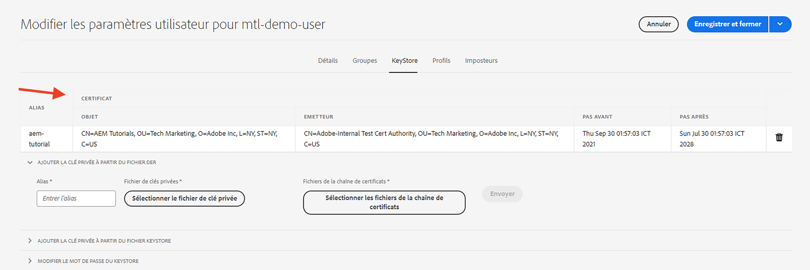

# Authentification Mutual Transport Layer Security (mTLS) à partir d’AEM

Découvrez comment effectuer des appels HTTPS d’AEM aux API web qui nécessitent une authentification Mutual Transport Layer Security (mTLS).

L’authentification TLS mTLS ou TLS bidirectionnelle renforce la sécurité du protocole TLS en exigeant **client et serveur pour s’authentifier l’un l’autre**. Cette authentification est effectuée à l’aide de certificats numériques. Elle est généralement utilisée dans les cas où une sécurité renforcée et une vérification de l’identité sont essentielles.

Par défaut, lorsque vous tentez d’établir une connexion HTTPS à une API web nécessitant une authentification mTLS, la connexion échoue avec l’erreur :

```
javax.net.ssl.SSLHandshakeException: Received fatal alert: certificate_required
```

Ce problème se produit lorsque le client ne présente pas de certificat pour s’authentifier.

Découvrez comment appeler avec succès des API qui nécessitent une authentification mTLS à l’aide de [Apache HttpClient](https://hc.apache.org/httpcomponents-client-4.5.x/index.html) et **AEM KeyStore et TrustStore**.


## HttpClient et charger AEM matériel KeyStore

À un niveau élevé, les étapes suivantes sont requises pour appeler une API protégée mTLS à partir d’AEM.

### Génération de certificats AEM

Demandez le certificat AEM en vous associant à l’équipe de sécurité de votre entreprise. L’équipe de sécurité fournit ou demande les informations relatives au certificat, telles que la clé, la demande de signature de certificat (CSR), et l’utilisation de la CSR pour l’émission du certificat.

À des fins de démonstration, générez les détails liés au certificat, tels que la clé, la demande de signature de certificat (CSR). Dans l’exemple ci-dessous, une autorité de certification auto-signée est utilisée pour émettre le certificat.

- Tout d’abord, générez le certificat de l’autorité de certification interne (CA).

  ```shell
  # Create an internal Certification Authority (CA) certificate
  openssl req -new -x509 -days 9999 -keyout internal-ca-key.pem -out internal-ca-cert.pem
  ```

- Générez le certificat AEM.

  ```shell
  # Generate Key
  openssl genrsa -out client-key.pem
  
  # Generate CSR
  openssl req -new -key client-key.pem -out client-csr.pem
  
  # Generate certificate and sign with internal Certification Authority (CA)
  openssl x509 -req -days 9999 -in client-csr.pem -CA internal-ca-cert.pem -CAkey internal-ca-key.pem -CAcreateserial -out client-cert.pem
  
  # Verify certificate
  openssl verify -CAfile internal-ca-cert.pem client-cert.pem
  ```

- Convertissez la clé privée AEM au format DER. AEM KeyStore nécessite la clé privée au format DER.

  ```shell
  openssl pkcs8 -topk8 -inform PEM -outform DER -in client-key.pem -out client-key.der -nocrypt
  ```

>[!TIP]
>
>Les certificats d’autorité de certification auto-signés sont utilisés à des fins de développement uniquement. Pour la production, utilisez une autorité de certification approuvée pour émettre le certificat.


### Échange de certificats

Si vous utilisez une autorité de certification autosignée pour le certificat AEM, comme ci-dessus, envoyez le certificat ou le certificat de l’autorité de certification interne (autorité de certification) au fournisseur d’API.

En outre, si le fournisseur d’API utilise un certificat d’autorité de certification autosigné, recevez le certificat ou le certificat de l’autorité de certification interne du fournisseur d’API.

### Importation de certificat

Pour importer AEM certificat, procédez comme suit :

1. Connexion à **Auteur AEM** as a **administrator**.

1. Accédez à **AEM Auteur > Outils > Sécurité > Utilisateurs > Créer ou sélectionner un utilisateur existant**.

   

   À des fins de démonstration, un nouvel utilisateur nommé `mtl-demo-user` est créée.

1. Pour ouvrir la **Propriétés de l’utilisateur**, cliquez sur le nom de l’utilisateur.

1. Cliquez sur **Keystore** puis cliquez sur **Créer un KeyStore** bouton . Ensuite, dans le **Définition du mot de passe d’accès KeyStore** , définissez un mot de passe pour le fichier de stockage des clés de cet utilisateur, puis cliquez sur Enregistrer.

   

1. Dans le nouvel écran, sous le **AJOUT D’UNE CLÉ PRIVÉE À PARTIR DU FICHIER DER** , procédez comme suit :

   1. Entrer l&#39;alias

   1. Importez la clé privée AEM au format DER, générée ci-dessus.

   1. Importez les fichiers de chaîne de certificats, générés ci-dessus.

   1. Cliquez sur Envoyer

      

1. Vérifiez que le certificat a bien été importé.

   

Si le fournisseur d’API utilise un certificat d’autorité de certification auto-signé, importez le certificat reçu dans AEM TrustStore, suivez les étapes de la section [here](https://experienceleague.adobe.com/docs/experience-manager-learn/foundation/security/call-internal-apis-having-private-certificate.html#httpclient-and-load-aem-truststore-material).

De même, si AEM utilise un certificat d’autorité de certification autosigné, demandez au fournisseur d’API de l’importer.

### Prototype du code d’appel de l’API mTLS à l’aide de HttpClient

Mettez à jour le code Java™ comme ci-dessous. Pour utiliser `@Reference` annotation pour obtenir AEM `KeyStoreService` le service que le code d’appel doit être un composant/service OSGi ou un modèle Sling (et `@OsgiService` y est utilisé).


```java
...

// Get AEM's KeyStoreService reference
@Reference
private com.adobe.granite.keystore.KeyStoreService keyStoreService;

...

// Get AEM KeyStore using KeyStoreService
KeyStore aemKeyStore = getAEMKeyStore(keyStoreService, resourceResolver);

if (aemKeyStore != null) {

    // Create SSL Context
    SSLContextBuilder sslbuilder = new SSLContextBuilder();

    // Load AEM KeyStore material into above SSL Context with keystore password
    // Ideally password should be encrypted and stored in OSGi config
    sslbuilder.loadKeyMaterial(aemKeyStore, "admin".toCharArray());

    // If API provider cert is self-signed, load AEM TrustStore material into above SSL Context
    // Get AEM TrustStore
    KeyStore aemTrustStore = getAEMTrustStore(keyStoreService, resourceResolver);
    sslbuilder.loadTrustMaterial(aemTrustStore, null);

    // Create SSL Connection Socket using above SSL Context
    SSLConnectionSocketFactory sslsf = new SSLConnectionSocketFactory(
            sslbuilder.build(), NoopHostnameVerifier.INSTANCE);

    // Create HttpClientBuilder
    HttpClientBuilder httpClientBuilder = HttpClientBuilder.create();
    httpClientBuilder.setSSLSocketFactory(sslsf);

    // Create HttpClient
    CloseableHttpClient httpClient = httpClientBuilder.build();

    // Invoke API
    closeableHttpResponse = httpClient.execute(new HttpGet(MTLS_API_ENDPOINT));

    // Code that reads response code and body from the 'closeableHttpResponse' object
    ...
} 

/**
 * Returns the AEM KeyStore of a user. In this example we are using the
 * 'mtl-demo-user' user.
 * 
 * @param keyStoreService
 * @param resourceResolver
 * @return AEM KeyStore
 */
private KeyStore getAEMKeyStore(KeyStoreService keyStoreService, ResourceResolver resourceResolver) {

    // get AEM KeyStore of 'mtl-demo-user' user, you can create a user or use an existing one. 
    // Then create keystore and upload key, certificate files.
    KeyStore aemKeyStore = keyStoreService.getKeyStore(resourceResolver, "mtl-demo-user");

    return aemKeyStore;
}

/**
 * 
 * Returns the global AEM TrustStore
 * 
 * @param keyStoreService OOTB OSGi service that makes AEM based KeyStore
 *                         operations easy.
 * @param resourceResolver
 * @return
 */
private KeyStore getAEMTrustStore(KeyStoreService keyStoreService, ResourceResolver resourceResolver) {

    // get AEM TrustStore from the KeyStoreService and ResourceResolver
    KeyStore aemTrustStore = keyStoreService.getTrustStore(resourceResolver);

    return aemTrustStore;
}

...
```

- Injection de la OOTB `com.adobe.granite.keystore.KeyStoreService` Service OSGi dans votre composant OSGi.
- Procurez-vous le KeyStore AEM de l’utilisateur à l’aide de `KeyStoreService` et `ResourceResolver`, la variable `getAEMKeyStore(...)` fait cela.
- Si le fournisseur d’API utilise un certificat d’autorité de certification autosigné, obtenez l’AEM TrustStore globale, la variable `getAEMTrustStore(...)` fait cela.
- Créez un objet de `SSLContextBuilder`, voir Java™ [Détails de l’API](https://javadoc.io/static/org.apache.httpcomponents/httpcore/4.4.8/index.html?org/apache/http/ssl/SSLContextBuilder.html).
- Chargez le KeyStore AEM de l’utilisateur dans `SSLContextBuilder` using `loadKeyMaterial(final KeyStore keystore,final char[] keyPassword)` .
- Le mot de passe du KeyStore est le mot de passe qui a été défini lors de la création du KeyStore. Il doit être stocké dans la configuration OSGi. Voir [Valeurs de configuration secrètes](https://experienceleague.adobe.com/docs/experience-manager-cloud-service/content/implementing/deploying/configuring-osgi.html#secret-configuration-values).

## Éviter les modifications du KeyStore JVM

Pour appeler efficacement les API mTLS avec des certificats privés, une approche conventionnelle consiste à modifier le KeyStore JVM. Pour ce faire, vous devez importer les certificats privés à l’aide de Java™ [keytool](https://docs.oracle.com/en/java/javase/11/tools/keytool.html#GUID-5990A2E4-78E3-47B7-AE75-6D1826259549) .

Toutefois, cette méthode n’est pas alignée sur les bonnes pratiques en matière de sécurité et AEM offre une option supérieure grâce à l’utilisation de la variable **KeyStores spécifiques à l’utilisateur et TrustStore global** et [KeyStoreService](https://javadoc.io/doc/com.adobe.aem/aem-sdk-api/latest/com/adobe/granite/keystore/KeyStoreService.html).