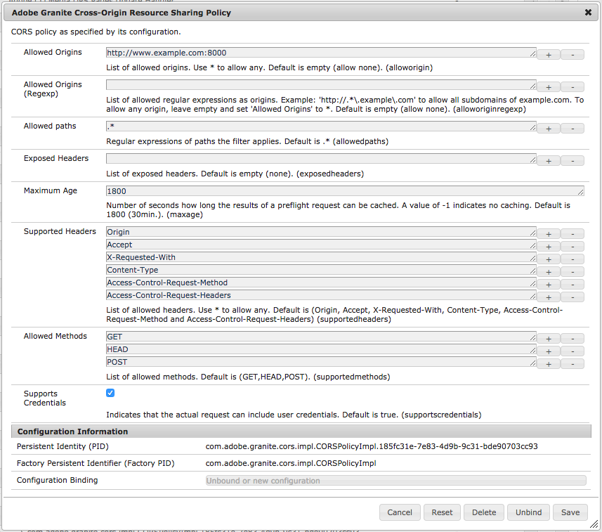

# Comprendre le partage de ressources entre origines multiples ([!DNL CORS])

Le partage de ressources entre origines multiples d’Adobe Experience Manager ([!DNL CORS]) aide les propriétés web autres qu’AEM à effectuer des appels côté client vers AEM, authentifiés ou non, pour récupérer du contenu ou interagir directement avec AEM.

## Configuration OSGi de la stratégie de partage de ressources entre origines multiples Adobe Granite

Les configurations CORS sont gérées comme des usines de configuration OSGi dans AEM, chaque stratégie étant représentée comme une instance de l’usine.

* `http://<host>:<port>/system/console/configMgr > Adobe Granite Cross Origin Resource Sharing Policy`



[!DNL Adobe Granite Cross-Origin Resource Sharing Policy] (`com.adobe.granite.cors.impl.CORSPolicyImpl`)

### Sélection de la stratégie

Une stratégie est sélectionnée en comparant l’

* `Allowed Origin` avec l’en-tête de requête `Origin`
* et `Allowed Paths` avec le chemin d’accès de la requête.

La première stratégie correspondant à ces valeurs est utilisée. Si aucune n’est trouvée, toutes les requêtes [!DNL CORS] sont refusées.

Si aucune politique n’est configurée, les requêtes [!DNL CORS] ne recevront pas de réponse non plus car le gestionnaire est désactivé et donc refusé, tant qu’aucun autre module du serveur ne répond à [!DNL CORS].

### Propriétés de stratégie

#### [!UICONTROL Origines autorisées]

* `"alloworigin" <origin> | *`
* Liste des paramètres `origin` spécifiant les URI pouvant accéder à la ressource. Pour les demandes sans informations d’identification, le serveur peut spécifier &#42; comme caractère générique, permettant ainsi à toute origine d’accéder à la ressource. *Il n’est absolument pas recommandé d’utiliser la commande `Allow-Origin: *` en production puisqu’elle permet à chaque site web étranger (c’est-à-dire à un attaquant) d’effectuer des requêtes qui, sans CORS, sont strictement interdites par les navigateurs.*

#### [!UICONTROL Origines autorisées (Regexp)]

* `"alloworiginregexp" <regexp>`
* Liste des expressions régulières `regexp` spécifiant des URI pouvant accéder à la ressource. *Les expressions régulières peuvent générer des correspondances inattendues si elles ne sont pas soigneusement créées, ce qui permet à un attaquant d’utiliser un nom de domaine personnalisé qui correspondrait également à la stratégie.* Il est généralement recommandé de disposer de stratégies distinctes pour chaque nom d’hôte d’origine spécifique, en utilisant `alloworigin`, même si cela signifie une configuration répétée des autres propriétés de stratégie. Les différentes origines ont tendance à avoir des cycles de vie et des exigences différents, ce qui rend une séparation nette bénéfique.

#### [!UICONTROL Chemins d’accès autorisés]

* `"allowedpaths" <regexp>`
* Liste des expressions régulières `regexp` spécifiant les chemins d’accès aux ressources pour lesquels la stratégie s’applique.

#### [!UICONTROL En-têtes exposés]

* `"exposedheaders" <header>`
* Liste des paramètres d’en-tête indiquant les en-têtes de requête auxquels les navigateurs sont autorisés à accéder.

#### [!UICONTROL Âge maximum]

* `"maxage" <seconds>`
* Un paramètre `seconds` indiquant la durée pendant laquelle les résultats d’une requête de contrôle en amont peuvent être mis en cache.

#### [!UICONTROL En-têtes pris en charge]

* `"supportedheaders" <header>`
* Liste des paramètres `header` indiquant quels en-têtes HTTP peuvent être utilisés lors de la requête réelle.

#### [!UICONTROL Méthodes autorisées]

* `"supportedmethods"`
* Liste des paramètres de méthode indiquant les méthodes HTTP pouvant être utilisées lors de l’exécution de la requête réelle.

#### [!UICONTROL Prend en charge les informations d’identification]

* `"supportscredentials" <boolean>`
* Un `boolean` indiquant si la réponse à la requête peut être exposée au navigateur. Utilisé comme partie d’une réponse à une requête de contrôle en amont, il indique si la requête réelle peut ou non être effectuée à l’aide d’informations d’identification.

### Exemples de configurations

Le site 1 est un scénario de base, accessible anonymement et en lecture seule où le contenu est utilisé par des requêtes [!DNL GET] :

```json
{
  "supportscredentials":false,
  "exposedheaders":[
    ""
  ],
  "supportedmethods":[
    "GET",
    "HEAD",
    "OPTIONS"
  ],
  "alloworigin":[
    "http://127.0.0.1:3000",
    "https://site1.com"
    
  ],
  "maxage:Integer": 1800,
  "alloworiginregexp":[
    "http://localhost:.*"
    "https://.*\.site1\.com"
  ],
  "allowedpaths":[
    "/content/_cq_graphql/site1/endpoint.json",
    "/graphql/execute.json.*",
    "/content/site1/.*"
  ],
  "supportedheaders":[
    "Origin",
    "Accept",
    "X-Requested-With",
    "Content-Type",
    "Access-Control-Request-Method",
    "Access-Control-Request-Headers",
  ]
}
```

Le site 2 est plus complexe et nécessite des requêtes autorisées et de mutation (POST, PUT, DELETE) :

```json
{
  "supportscredentials":true,
  "exposedheaders":[
    ""
  ],
  "supportedmethods":[
    "GET",
    "HEAD"
    "POST",
    "DELETE",
    "OPTIONS",
    "PUT"
  ],
  "alloworigin":[
    "http://127.0.0.1:3000",
    "https://site2.com"
    
  ],
  "maxage:Integer": 1800,
  "alloworiginregexp":[
    "http://localhost:.*"
    "https://.*\.site2\.com"
  ],
  "allowedpaths":[
    "/content/site2/.*",
    "/libs/granite/csrf/token.json",
  ],
  "supportedheaders":[
    "Origin",
    "Accept",
    "X-Requested-With",
    "Content-Type",
    "Access-Control-Request-Method",
    "Access-Control-Request-Headers",
    "Authorization",
    "CSRF-Token"
  ]
}
```

## Problèmes de mise en cache et configuration du Dispatcher {#dispatcher-caching-concerns-and-configuration}

À partir de la version 4.1.1+ du Dispatcher, les en-têtes de réponse peuvent être mis en cache. Cela permet de mettre en cache les en-têtes [!DNL CORS] avec les ressources [!DNL CORS] demandées, tant que la requête est anonyme.

Généralement, les mêmes éléments à prendre en compte pour la mise en cache du contenu au niveau du Dispatcher peuvent être appliqués à la mise en cache des en-têtes de réponse CORS au niveau du Dispatcher. Le tableau suivant indique les cas où les en-têtes [!DNL CORS] (et donc les requêtes [!DNL CORS]) peuvent être mis en cache.

| Mise en cache | Environnement | Statut d’authentification | Explication |
|-----------|-------------|-----------------------|-------------|
| Non | Publication AEM | Authentifié | La mise en cache du Dispatcher sur l’instance de création AEM est limitée aux ressources statiques non créées. Il est ainsi difficile et peu pratique de mettre en cache la plupart des ressources sur l’instance de création AEM, y compris les en-têtes de réponse HTTP. |
| Non | Publication AEM | Authentifié | Évitez de mettre en cache les en-têtes CORS sur les requêtes authentifiées. Cela correspond à la recommandation commune de ne pas mettre en cache les requêtes authentifiées, car il est difficile de déterminer comment le statut d’authentification ou d’autorisation de la personne utilisatrice à l’origine de la requête affectera la ressource diffusée. |
| Oui | Publication AEM | Anonyme | Les en-têtes de réponse des requêtes anonymes pouvant être mises en cache dans le Dispatcher peuvent également être mis en cache, les futures requêtes CORS pourront donc accéder au contenu mis en cache. Toute modification de configuration CORS sur l’instance de publication AEM **doit** être suivie d’une invalidation des ressources mises en cache affectées. Les bonnes pratiques imposent de purger le cache du Dispatcher lors des déploiements de code ou de configuration, car il est difficile de déterminer quel contenu mis en cache peut être affecté. |

Pour autoriser la mise en cache des en-têtes CORS, ajoutez la configuration suivante à tous les fichiers porteurs dispatcher.any de l’instance de publication AEM.

```
/myfarm { 
  ...
  /headers {
      "Origin"
      "Access-Control-Allow-Origin"
      "Access-Control-Expose-Headers"
      "Access-Control-Max-Age"
      "Access-Control-Allow-Credentials"
      "Access-Control-Allow-Methods"
      "Access-Control-Allow-Headers"
  }
  ...
}
```

N’oubliez pas de **redémarrer l’application du serveur web** après avoir modifié le fichier `dispatcher.any`.

Il est probable que l’effacement complet du cache soit nécessaire pour que les en-têtes soient correctement mis en cache dans la requête suivante après une mise à jour de la configuration `/cache/headers`.

## Dépanner CORS

La connexion est disponible sous `com.adobe.granite.cors` :

* Activez `DEBUG` pour voir les détails sur la raison pour laquelle une requête [!DNL CORS] a été refusée.
* Activez `TRACE` pour voir les détails de toutes les requêtes qui passent par le gestionnaire CORS.

### Conseils :

* Recréez manuellement les requêtes XHR avec curl, mais veillez à copier tous les en-têtes et détails, car chacun d’eux peut faire la différence ; certaines consoles de navigateur permettent de copier la commande curl.
* Vérifiez si la requête a été refusée par le gestionnaire CORS et non par l’authentification, le filtre de jeton CSRF, les filtres du Dispatcher ou d’autres couches de sécurité.
   * Si le gestionnaire CORS répond par 200, mais que l’en-tête `Access-Control-Allow-Origin` est absent de la réponse, passez en revue les journaux pour les refus sous [!DNL DEBUG] dans `com.adobe.granite.cors`.
* Si la mise en cache du Dispatcher des requêtes [!DNL CORS] est activée,
   * assurez-vous que la configuration `/cache/headers` s’applique à `dispatcher.any` et que le serveur web redémarre avec succès,
   * et assurez-vous que le cache a été effacé correctement après toute modification de la configuration OSGi ou dispatcher.any.
* Si nécessaire, vérifiez la présence des informations d’identification d’authentification sur la requête.

## Documents annexes

* [Configuration d’usine d’AEM OSGi pour les stratégies de partage de ressources entre origines multiples](http://localhost:4502/system/console/configMgr/com.adobe.granite.cors.impl.CORSPolicyImpl)
* [Partage de ressources entre origines multiples (W3C)](https://www.w3.org/TR/cors/)
* [Contrôle d’accès HTTP (Mozilla MDN)](https://developer.mozilla.org/fr/docs/Web/HTTP/CORS)
