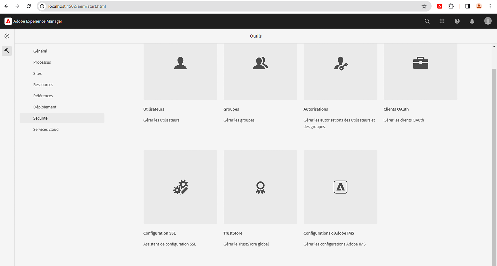
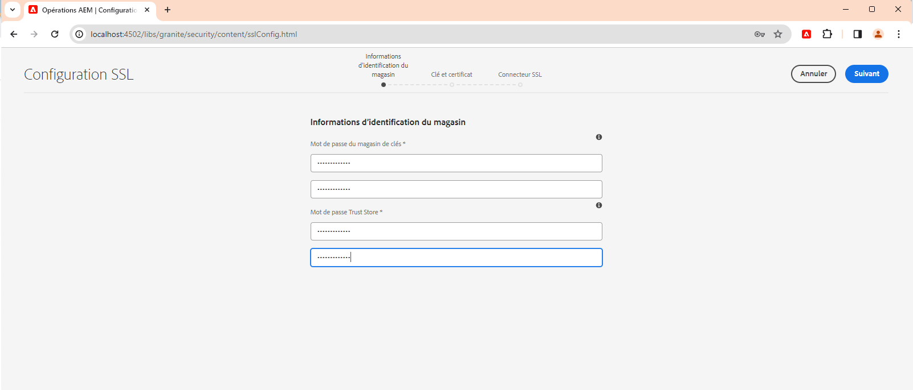
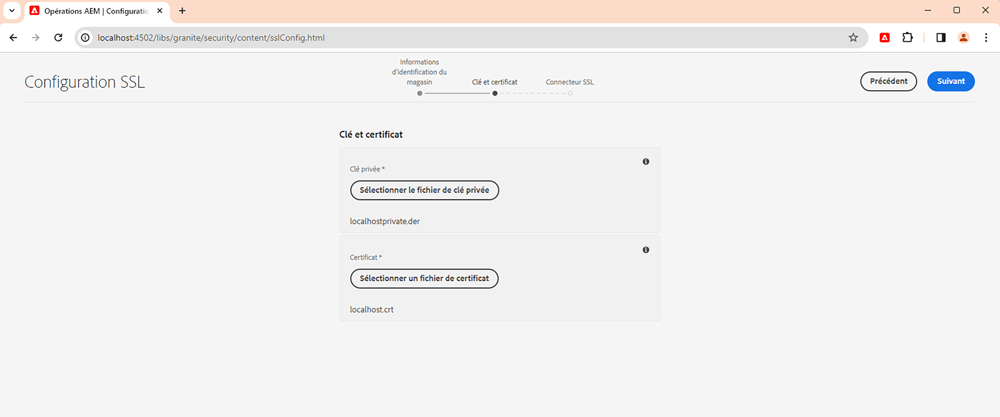
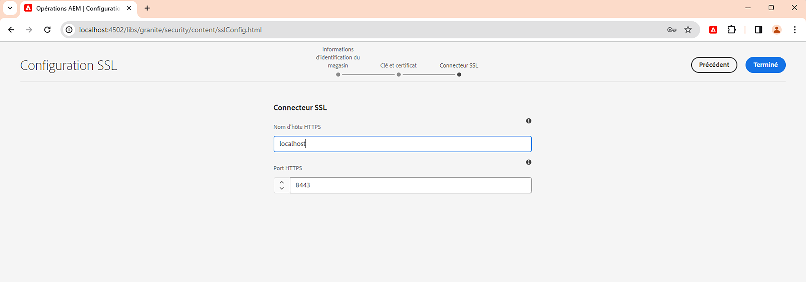
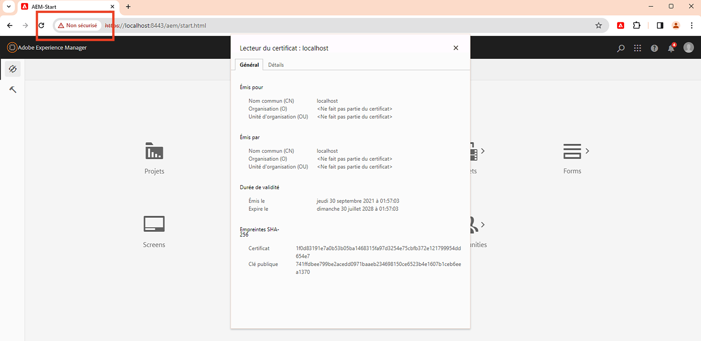

# Utiliser l’assistant SSL dans AEM

Découvrez comment configurer SSL dans Adobe Experience Manager pour qu’il s’exécute via HTTPS à l’aide de l’assistant SSL intégré.

>[!VIDEO](https://video.tv.adobe.com/v/17993?quality=12&learn=on)


>[!NOTE]
>
>Pour les environnements gérés, il est préférable que le service informatique fournisse des certificats et des clés approuvés par une autorité de certification.
>
>Les certificats auto-signés doivent uniquement être utilisés à des fins de développement.

## Utiliser l’assistant de configuration SSL

Accédez à __Instance de création AEM > Outils > Sécurité > Configuration SSL__, puis ouvrez l’__Assistant de configuration SSL__.



### Créer des informations d’identification de boutique

Pour créer un _KeyStore_ associé à l’utilisateur ou l’utilisatrice système `ssl-service` et un _TrustStore_ global, utilisez l’étape __Informations d’identification de boutique__ de l’assistant.

1. Saisissez le mot de passe et confirmez le mot de passe pour le __KeyStore__ associé à l’utilisateur ou l’utilisatrice système `ssl-service`.
1. Saisissez le mot de passe et confirmez le mot de passe pour le __TrustStore__. Notez qu’il s’agit d’un TrustStore à l’échelle du système et, s’il est déjà créé, le mot de passe saisi est ignoré.

   

### Charger une clé privée et un certificat

Pour charger la _clé privée_ et le _certificat SSL_, utilisez l’étape __Clé et certificat__ de l’assistant.

En règle générale, votre service informatique fournit le certificat et la clé approuvés par l’autorité de certification, mais le certificat auto-signé peut être utilisé à des fins de __développement__ et de __test__.

Pour créer ou télécharger le certificat auto-signé, voir [Clé privée et certificat auto-signé](#self-signed-private-key-and-certificate).

1. Téléchargez la __clé privée__ au format DER (Distinguished Encoding Rules). Contrairement à PEM, les fichiers codés DER ne contiennent pas d’instructions de texte brut telles que `-----BEGIN CERTIFICATE-----`.
1. Chargez le __Certificat SSL__ au format `.crt`.

   

### Mettre à jour des détails du connecteur SSL

Pour mettre à jour le _nom d’hôte_ et le _port_, utilisez l’étape __Connecteur SSL__ de l’assistant.

1. Mettez à jour ou vérifiez la valeur du __Nom d’hôte HTTPS__, elle doit correspondre au `Common Name (CN)` du certificat.
1. Mettez à jour ou vérifiez la valeur __Port HTTPS__.

   

### Vérifier la configuration SSL

1. Pour vérifier le protocole SSL, cliquez sur le bouton __Accéder à l’URL HTTPS__.
1. Si vous utilisez un certificat auto-signé, vous voyez l’erreur `Your connection is not private`.

   

## Clé privée et certificat auto-signé

Le fichier zip suivant contient les fichiers [!DNL DER] et [!DNL CRT] requis pour la configuration locale SSL d’AEM et destinés uniquement à des fins de développement local.

Les fichiers [!DNL DER] et [!DNL CERT] sont fournis pour des raisons de commodité et sont générés en suivant les étapes décrites dans la section Générer une clé privée et un certificat auto-signé ci-dessous.

Si nécessaire, le mot de passe du certificat est **admin**.

Ce localhost : fichier .zip de clé privée et de certificat autosigné (expire en juillet 2028)

[Télécharger le fichier de certificat](assets/use-the-ssl-wizard/certificate.zip)

### Génération de la clé privée et du certificat auto-signé

La vidéo ci-dessus illustre la configuration SSL sur une instance de création AEM à l’aide de certificats auto-signés. Les commandes ci-dessous utilisant [[!DNL OpenSSL]](https://www.openssl.org/) peuvent générer une clé privée et un certificat à utiliser à l’étape 2 de l’assistant.

```shell
### Create Private Key
$ openssl genrsa -aes256 -out localhostprivate.key 4096

### Generate Certificate Signing Request using private key
$ openssl req -sha256 -new -key localhostprivate.key -out localhost.csr -subj '/CN=localhost'

### Generate the SSL certificate and sign with the private key, will expire one year from now
$ openssl x509 -req -extfile <(printf "subjectAltName=DNS:localhost") -days 365 -in localhost.csr -signkey localhostprivate.key -out localhost.crt

### Convert Private Key to DER format - SSL wizard requires key to be in DER format
$ openssl pkcs8 -topk8 -inform PEM -outform DER -in localhostprivate.key -out localhostprivate.der -nocrypt
```
