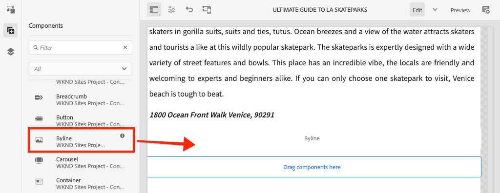

# Composant personnalisé {#custom-component}

Ce didacticiel porte sur la création de bout en bout d’un composant de ligne d’AEM personnalisé qui affiche le contenu créé dans une boîte de dialogue et explore le développement d’un modèle Sling pour encapsuler la logique métier qui renseigne le code HTML du composant.

## Conditions préalables {#prerequisites}

Examinez les outils et les instructions nécessaires pour configurer un [environnement de développement local](overview.md#local-dev-environment).

### Projet de démarrage

>[!NOTE]
>
> Si vous avez terminé avec succès le chapitre précédent, vous pouvez réutiliser le projet et ignorer les étapes permettant d&#39;extraire le projet de démarrage.

Consultez le code de ligne de base sur lequel le didacticiel s&#39;appuie :

1. Consultez la branche `tutorial/custom-component-start` de [GitHub](https://github.com/adobe/aem-guides-wknd).

   ```shell
   $ cd aem-guides-wknd
   $ git checkout tutorial/custom-component-start
   ```

1. Déployez la base de code sur une instance AEM locale en utilisant vos compétences Maven :

   ```shell
   $ mvn clean install -PautoInstallSinglePackage
   ```

   >[!NOTE]
   >
   > Si vous utilisez AEM 6.5 ou 6.4, ajoutez le profil `classic` aux commandes Maven.

   ```shell
   $ mvn clean install -PautoInstallSinglePackage -Pclassic
   ```

Vous pouvez toujours vue le code terminé sur [GitHub](https://github.com/adobe/aem-guides-wknd/tree/tutorial/custom-component-solution) ou vérifier le code localement en passant à la branche `tutorial/custom-component-solution`.

## Intention

1. Comprendre comment créer un composant AEM personnalisé
1. Découvrez comment encapsuler la logique métier avec les modèles Sling
1. Comprendre comment utiliser un modèle Sling dans un script HTML

## Ce que vous allez créer {#byline-component}

Dans cette partie du didacticiel WKND, un composant Byline est créé qui sera utilisé pour afficher les informations créées sur le contributeur d’un article.


*Composant Signature*

L’implémentation du composant Signature comprend une boîte de dialogue qui collecte le contenu de la signature et un modèle Sling personnalisé qui récupère les éléments suivants :

* Nom
* Image
* Professions

## Créer un composant Byline {#create-byline-component}

Tout d’abord, créez la structure de noeud Composant de signature et définissez une boîte de dialogue. Il représente le composant dans AEM et définit implicitement le type de ressource du composant en fonction de son emplacement dans le JCR.

La boîte de dialogue expose l’interface avec laquelle les auteurs de contenu peuvent fournir. Pour cette implémentation, le composant principal de la gestion de contenu Web **Image** du composant principal de la gestion des ressources sera utilisé pour gérer la création et le rendu de l&#39;image de la signature, de sorte qu&#39;elle sera définie comme `sling:resourceSuperType` de notre composant.

### Créer une définition de composant {#create-component-definition}

1. Dans le module **ui.apps**, accédez à `/apps/wknd/components` et créez un nouveau dossier nommé `byline`.
1. Sous le dossier `byline`, ajoutez un nouveau fichier nommé `.content.xml`.

   

1. Renseignez le fichier `.content.xml` avec ce qui suit :

   ```xml
   <?xml version="1.0" encoding="UTF-8"?>
       <jcr:root xmlns:sling="http://sling.apache.org/jcr/sling/1.0" xmlns:cq="http://www.day.com/jcr/cq/1.0" xmlns:jcr="http://www.jcp.org/jcr/1.0"
       jcr:primaryType="cq:Component"
       jcr:title="Byline"
       jcr:description="Displays a contributor's byline."
       componentGroup="WKND Sites Project - Content"
       sling:resourceSuperType="core/wcm/components/image/v2/image"/>
   ```

   Le fichier XML ci-dessus fournit la définition du composant, y compris le titre, la description et le groupe. `sling:resourceSuperType` pointe vers `core/wcm/components/image/v2/image`, qui est le [composant image de base](https://experienceleague.adobe.com/docs/experience-manager-core-components/using/components/image.html).

### Créez le script HTL {#create-the-htl-script}

1. Sous le dossier `byline`, ajoutez un nouveau fichier `byline.html`, qui est responsable de la présentation HTML du composant. Il est important de nommer le fichier de la même manière que le dossier, car il devient le script par défaut utilisé par Sling pour générer ce type de ressource.

1. Ajoutez le code suivant sur `byline.html`.

   ```html
   <!--/* byline.html */-->
   <div data-sly-use.placeholderTemplate="core/wcm/components/commons/v1/templates.html">
   </div>
   <sly data-sly-call="${placeholderTemplate.placeholder @ isEmpty=true}"></sly>
   ```

`byline.html` est  [revisité ultérieurement](#byline-htl), une fois le modèle Sling créé. L’état actuel du fichier HTML permet au composant de s’afficher dans un état vide, dans l’éditeur de pages des sites AEM, lorsqu’il est glissé-déposé sur la page.

### Créer une définition de boîte de dialogue {#create-the-dialog-definition}

Ensuite, définissez une boîte de dialogue pour le composant Signature avec les champs suivants :

* **Nom** : champ de texte du nom du contributeur.
* **Image** : une référence à la biographie du contributeur.
* **Professions** : une liste de professions attribuées au contributeur. Les professions doivent être triées par ordre alphabétique croissant (a à z).

1. Sous le dossier `byline`, créez un nouveau dossier nommé `_cq_dialog`.
1. Sous `byline/_cq_dialog`, ajoutez un nouveau fichier nommé `.content.xml`. Il s’agit de la définition XML de la boîte de dialogue. Ajoutez le code XML suivant :

   ```xml
   <?xml version="1.0" encoding="UTF-8"?>
   <jcr:root xmlns:sling="http://sling.apache.org/jcr/sling/1.0" xmlns:cq="http://www.day.com/jcr/cq/1.0" xmlns:jcr="http://www.jcp.org/jcr/1.0" xmlns:nt="http://www.jcp.org/jcr/nt/1.0"
           jcr:primaryType="nt:unstructured"
           jcr:title="Byline"
           sling:resourceType="cq/gui/components/authoring/dialog">
       <content
               jcr:primaryType="nt:unstructured"
               sling:resourceType="granite/ui/components/coral/foundation/container">
           <items jcr:primaryType="nt:unstructured">
               <tabs
                       jcr:primaryType="nt:unstructured"
                       sling:resourceType="granite/ui/components/coral/foundation/tabs"
                       maximized="{Boolean}false">
                   <items jcr:primaryType="nt:unstructured">
                       <asset
                               jcr:primaryType="nt:unstructured"
                               sling:hideResource="{Boolean}false"/>
                       <metadata
                               jcr:primaryType="nt:unstructured"
                               sling:hideResource="{Boolean}true"/>
                       <properties
                               jcr:primaryType="nt:unstructured"
                               jcr:title="Properties"
                               sling:resourceType="granite/ui/components/coral/foundation/container"
                               margin="{Boolean}true">
                           <items jcr:primaryType="nt:unstructured">
                               <columns
                                       jcr:primaryType="nt:unstructured"
                                       sling:resourceType="granite/ui/components/coral/foundation/fixedcolumns"
                                       margin="{Boolean}true">
                                   <items jcr:primaryType="nt:unstructured">
                                       <column
                                               jcr:primaryType="nt:unstructured"
                                               sling:resourceType="granite/ui/components/coral/foundation/container">
                                           <items jcr:primaryType="nt:unstructured">
                                               <name
                                                       jcr:primaryType="nt:unstructured"
                                                       sling:resourceType="granite/ui/components/coral/foundation/form/textfield"
                                                       emptyText="Enter the contributor's name to display."
                                                       fieldDescription="The contributor's name to display."
                                                       fieldLabel="Name"
                                                       name="./name"
                                                       required="{Boolean}true"/>
                                               <occupations
                                                       jcr:primaryType="nt:unstructured"
                                                       sling:resourceType="granite/ui/components/coral/foundation/form/multifield"
                                                       fieldDescription="A list of the contributor's occupations."
                                                       fieldLabel="Occupations"
                                                       required="{Boolean}false">
                                                   <field
                                                           jcr:primaryType="nt:unstructured"
                                                           sling:resourceType="granite/ui/components/coral/foundation/form/textfield"
                                                           emptyText="Enter an occupation"
                                                           name="./occupations"/>
                                               </occupations>
                                           </items>
                                       </column>
                                   </items>
                               </columns>
                           </items>
                       </properties>
                   </items>
               </tabs>
           </items>
       </content>
   </jcr:root>
   ```

   Ces définitions de noeud de boîte de dialogue utilisent la fusion de ressources [Sling](https://sling.apache.org/documentation/bundles/resource-merger.html) pour contrôler quels onglets de boîte de dialogue sont hérités du composant `sling:resourceSuperType`, dans ce cas le composant Image des composants de base ****.

   

### Créer la boîte de dialogue Stratégie {#create-the-policy-dialog}

Suivant la même approche que lors de la création de la boîte de dialogue, créez une boîte de dialogue Stratégie (anciennement appelée boîte de dialogue de conception) pour masquer les champs indésirables dans la configuration Stratégie héritée du composant Image des composants principaux.

1. Sous le dossier `byline`, créez un nouveau dossier nommé `_cq_design_dialog`.
1. Sous `byline/_cq_design_dialog`, créez un nouveau fichier nommé `.content.xml`. Mettez à jour le fichier avec ce qui suit : avec le code XML suivant. Il est plus facile d&#39;ouvrir le `.content.xml` et de copier/coller le XML ci-dessous dans celui-ci.

   ```xml
   <?xml version="1.0" encoding="UTF-8"?>
   <jcr:root xmlns:sling="http://sling.apache.org/jcr/sling/1.0" xmlns:granite="http://www.adobe.com/jcr/granite/1.0" xmlns:cq="http://www.day.com/jcr/cq/1.0" xmlns:jcr="http://www.jcp.org/jcr/1.0" xmlns:nt="http://www.jcp.org/jcr/nt/1.0"
       jcr:primaryType="nt:unstructured"
       jcr:title="Byline"
       sling:resourceType="cq/gui/components/authoring/dialog">
       <content
               jcr:primaryType="nt:unstructured">
           <items jcr:primaryType="nt:unstructured">
               <tabs
                       jcr:primaryType="nt:unstructured">
                   <items jcr:primaryType="nt:unstructured">
                       <properties
                               jcr:primaryType="nt:unstructured">
                           <items jcr:primaryType="nt:unstructured">
                               <content
                                       jcr:primaryType="nt:unstructured">
                                   <items jcr:primaryType="nt:unstructured">
                                       <decorative
                                               jcr:primaryType="nt:unstructured"
                                               sling:hideResource="{Boolean}true"/>
                                       <altValueFromDAM
                                               jcr:primaryType="nt:unstructured"
                                               sling:hideResource="{Boolean}true"/>
                                       <titleValueFromDAM
                                               jcr:primaryType="nt:unstructured"
                                               sling:hideResource="{Boolean}true"/>
                                       <displayCaptionPopup
                                               jcr:primaryType="nt:unstructured"
                                               sling:hideResource="{Boolean}true"/>
                                       <disableUuidTracking
                                               jcr:primaryType="nt:unstructured"
                                               sling:hideResource="{Boolean}true"/>
                                   </items>
                               </content>
                           </items>
                       </properties>
                       <features
                               jcr:primaryType="nt:unstructured">
                           <items jcr:primaryType="nt:unstructured">
                               <content
                                       jcr:primaryType="nt:unstructured">
                                   <items jcr:primaryType="nt:unstructured">
                                       <accordion
                                               jcr:primaryType="nt:unstructured">
                                           <items jcr:primaryType="nt:unstructured">
                                               <orientation
                                                       jcr:primaryType="nt:unstructured"
                                                       sling:hideResource="{Boolean}true"/>
                                               <crop
                                                       jcr:primaryType="nt:unstructured"
                                                       sling:hideResource="{Boolean}true"/>
                                           </items>
                                       </accordion>
                                   </items>
                               </content>
                           </items>
                       </features>
                   </items>
               </tabs>
           </items>
       </content>
   </jcr:root>
   ```

   La base de la boîte de dialogue de stratégie **XML précédente** a été obtenue à partir du [composant Image des composants principaux](https://github.com/adobe/aem-core-wcm-components/blob/master/content/src/content/jcr_root/apps/core/wcm/components/image/v2/image/_cq_design_dialog/.content.xml).

   Comme dans la configuration de la boîte de dialogue, [la fusion de ressources Sling](https://sling.apache.org/documentation/bundles/resource-merger.html) est utilisée pour masquer les champs non pertinents qui sont par ailleurs hérités de `sling:resourceSuperType`, comme le montrent les définitions de noeud avec la propriété `sling:hideResource="{Boolean}true"`.

### Déployer le code {#deploy-the-code}

1. Déployez la base de code mise à jour sur une instance AEM locale à l’aide de vos compétences Maven :

   ```shell
   $ cd aem-guides-wknd
   $ mvn clean install -PautoInstallSinglePackage
   ```

## Ajouter le composant à une page {#add-the-component-to-a-page}

Pour simplifier les choses et se concentrer sur le développement des composants AEM, nous allons ajouter le composant Signature dans son état actuel à une page d&#39;article afin de vérifier que la définition de noeud `cq:Component` est déployée et correcte, AEM reconnaît la nouvelle définition de composant et la boîte de dialogue du composant fonctionne pour la création.

### Ajouter une image au AEM Assets

Tout d’abord, téléchargez un exemple de capture de tête vers AEM Assets pour l’utiliser pour remplir l’image dans le composant Signature.

1. Accédez au dossier LA Skateparks en AEM Assets : [http://localhost:4502/assets.html/content/dam/wknd/en/magazine/la-skateparks](http://localhost:4502/assets.html/content/dam/wknd/en/magazine/la-skateparks).

1. Téléchargez la prise de vue de **[stacey-roswells.jpg](assets/custom-component/stacey-roswells.jpg)** dans le dossier.

   

### Auteur du composant {#author-the-component}

Ensuite, ajoutez le composant Signature à une page dans AEM. Comme nous avons ajouté le composant Byline au **projet de sites WKND - groupe de composants Contenu**, par la définition `ui.apps/src/main/content/jcr_root/apps/wknd/components/byline/.content.xml`, il est automatiquement disponible pour tout **Conteneur** dont la **stratégie** permet le **groupe de composants Sites WKND - Contenu**, que le Conteneur de mise en page de l&#39;article est.

1. Accédez à l&#39;article LA Skatepark à l&#39;adresse : [http://localhost:4502/editor.html/content/wknd/us/en/magazine/guide-la-skateparks.html](http://localhost:4502/editor.html/content/wknd/us/en/magazine/guide-la-skateparks.html)

1. Dans la barre latérale gauche, faites glisser un **composant de signature** sur **bottom** du Conteneur de mise en page de la page d’article ouverte.

   

1. Assurez-vous que la barre latérale **gauche est ouverte** et visible et que l&#39;outil de recherche de ressources **** est sélectionné.

   

1. Sélectionnez l&#39;espace réservé **composant de signature**, qui à son tour affiche la barre d&#39;action et appuie sur l&#39;icône **clé à molette** pour ouvrir la boîte de dialogue.

   

1. La boîte de dialogue s’ouvre et le premier onglet (Fichier) principal, ouvrez la barre latérale gauche, puis faites glisser une image dans la zone de dépôt Image à partir de l’outil de recherche de ressources. Recherchez &quot;stacey&quot; pour trouver la photo biographique de Stacey Roswells fournie dans le paquet ui.content de WKND.

   

1. Après avoir ajouté une image, cliquez sur l&#39;onglet **Propriétés** pour entrer **Nom** et **Occupations**.

   Lorsque vous entrez dans une profession, entrez-les dans l&#39;ordre **alphabétique inverse** afin que la logique d&#39;ordre alphabétique que nous mettrons en oeuvre dans le modèle Sling soit facilement visible.

   Appuyez sur le bouton **Terminé** en bas à droite pour enregistrer les modifications.

   

   Les auteurs AEM configurent et créent des composants au moyen des boîtes de dialogue. À ce stade du développement du composant Signature, les boîtes de dialogue sont incluses pour la collecte des données, mais la logique de rendu du contenu créé n’a pas encore été ajoutée. Par conséquent, seul l’espace réservé s’affiche.

1. Après avoir enregistré la boîte de dialogue, accédez à [CRXDE Lite](http://localhost:4502/crx/de/index.jsp#/content/wknd/us/en/magazine/guide-la-skateparks/jcr%3Acontent/root/container/container/byline) et passez en revue la manière dont le contenu du composant est stocké sur le noeud de contenu du composant de ligne latérale sous la page AEM.

   Recherchez le noeud de contenu du composant Byline sous la page LA Skate Parks, c.-à-d. `/content/wknd/us/en/magazine/guide-la-skateparks/jcr:content/root/container/container/byline`.

   Remarquez que les noms de propriété `name`, `occupations` et `fileReference` sont stockés sur le **noeud de ligne d&#39;octets**.

   Notez également que la valeur `sling:resourceType` du noeud est définie sur `wknd/components/content/byline`, ce qui lie ce noeud de contenu à l’implémentation du composant Signature.

   

## Créer un modèle Sling de signature {#create-sling-model}

Ensuite, nous allons créer un modèle Sling pour agir comme modèle de données et héberger la logique métier du composant Signature.

Les modèles Sling sont des &quot;POJO&quot; Java pilotés par les annotations (objets Java ordinaires) qui facilitent la mise en correspondance des données du JCR avec les variables Java et fournissent un certain nombre d&#39;autres subtilités lors du développement dans le contexte de l&#39;AEM.

### Vérifier les dépendances Maven {#maven-dependency}

Le modèle Byline Sling repose sur plusieurs API Java fournies par AEM. Ces API sont accessibles via le `dependencies` répertorié dans le fichier POM du module `core`. Le projet utilisé pour ce tutoriel a été conçu pour AEM en tant que Cloud Service. Toutefois, il est unique en ce qu&#39;il est compatible avec AEM 6.5/6.4. Par conséquent, les deux dépendances pour Cloud Service et AEM 6.x sont incluses.

1. Ouvrez le fichier `pom.xml` sous `<src>/aem-guides-wknd/core/pom.xml`.
1. Recherchez la dépendance pour `aem-sdk-api` - **AEM en tant que Cloud Service uniquement**

   ```xml
   <dependency>
       <groupId>com.adobe.aem</groupId>
       <artifactId>aem-sdk-api</artifactId>
   </dependency>
   ```

   [aem-sdk-api](https://experienceleague.adobe.com/docs/experience-manager-cloud-service/implementing/developing/aem-as-a-cloud-service-sdk.html?lang=en#building-for-the-sdk) contient toutes les API Java publiques exposées par AEM. `aem-sdk-api` est utilisé par défaut lors de la création de ce projet. La version est conservée dans le pom du réacteur parent situé à la racine du projet à `aem-guides-wknd/pom.xml`.

1. Recherchez la dépendance pour l’AEM `uber-jar` - **6.5/6.4 Only**.

   ```xml
   ...
       <dependency>
           <groupId>com.adobe.aem</groupId>
           <artifactId>uber-jar</artifactId>
           <classifier>apis</classifier>
       </dependency>
   ...
   ```

   Le `uber-jar` n&#39;est inclus que lorsque le profil `classic` est appelé, c&#39;est-à-dire `mvn clean install -PautoInstallSinglePackage -Pclassic`. Encore une fois, c&#39;est unique à ce projet. Dans un projet réel, généré à partir de l&#39;archétype de projet AEM, `uber-jar` sera la valeur par défaut si la version d&#39;AEM spécifiée est 6.5 ou 6.4.

   [uber-jar](https://docs.adobe.com/content/help/en/experience-manager-65/developing/devtools/ht-projects-maven.html#experience-manager-api-dependencies) contient toutes les API Java publiques exposées par AEM 6.x. La version est conservée dans le pom du réacteur parent situé à la racine du projet `aem-guides-wknd/pom.xml`.

1. Recherchez la dépendance pour `core.wcm.components.core` :

   ```xml
    <!-- Core Component Dependency -->
       <dependency>
           <groupId>com.adobe.cq</groupId>
           <artifactId>core.wcm.components.core</artifactId>
       </dependency>
   ```

   Il s’agit de l’ensemble des API Java publiques exposées par AEM Core Components. aem Core Components est un projet géré en dehors de AEM et qui a donc un cycle de publication distinct. Pour cette raison, il s’agit d’une dépendance qui doit être incluse séparément et qui n’est **pas** incluse avec `uber-jar` ou `aem-sdk-api`.

   Tout comme l&#39;uber-jar, la version de cette dépendance est conservée dans le fichier Pom du réacteur parent situé à `aem-guides-wknd/pom.xml`.

   Plus loin dans ce didacticiel, nous utiliserons la classe Image du composant principal pour afficher l&#39;image dans le composant Signature. Il est nécessaire d&#39;avoir la dépendance du composant principal pour construire et compiler notre modèle Sling.

### Interface de signature {#byline-interface}

Créez une interface Java publique pour la signature. `Byline.java` définit les méthodes publiques nécessaires pour piloter le script  `byline.html` HTL.

1. Dans le module `aem-guides-wknd.core` situé sous `core/src/main/java/com/adobe/aem/guides/wknd/core/models`, créez un nouveau fichier nommé `Byline.java`.

   

1. Mettez à jour `Byline.java` avec les méthodes suivantes :

   ```java
   package com.adobe.aem.guides.wknd.core.models;
   
   import java.util.List;
   
   /**
   * Represents the Byline AEM Component for the WKND Site project.
   **/
   public interface Byline {
       /***
       * @return a string to display as the name.
       */
       String getName();
   
       /***
       * Occupations are to be sorted alphabetically in a descending order.
       *
       * @return a list of occupations.
       */
       List<String> getOccupations();
   
       /***
       * @return a boolean if the component has enough content to display.
       */
       boolean isEmpty();
   }
   ```

   Les deux premières méthodes exposent les valeurs des **name** et **occupations** pour le composant Byline.

   La méthode `isEmpty()` est utilisée pour déterminer si le composant a un contenu à rendre ou s&#39;il attend d&#39;être configuré.

   Notez qu’il n’existe aucune méthode pour l’image ; [nous allons examiner pourquoi cela se produit plus tard](#tackling-the-image-problem).

### Implémentation de signature {#byline-implementation}

`BylineImpl.java` est l’implémentation du modèle Sling qui implémente l’ `Byline.java` interface définie précédemment. Le code complet de `BylineImpl.java` se trouve au bas de cette section.

1. Créez un nouveau dossier nommé `impl` sous `core/src/main/java/com/adobe/aem/guides/core/models`.
1. Dans le dossier `impl`, créez un nouveau fichier `BylineImpl.java`.

   

1. Ouvrez `BylineImpl.java`. Spécifiez qu’il implémente l’interface `Byline`. Utilisez les fonctionnalités de saisie semi-automatique de l&#39;IDE ou mettez manuellement à jour le fichier pour inclure les méthodes nécessaires à l&#39;implémentation de l&#39;interface `Byline` :

   ```java
   package com.adobe.aem.guides.wknd.core.models.impl;
   import java.util.List;
   import com.adobe.aem.guides.wknd.core.models.Byline;
   
   public class BylineImpl implements Byline {
   
       @Override
       public String getName() {
           // TODO Auto-generated method stub
           return null;
       }
   
       @Override
       public List<String> getOccupations() {
           // TODO Auto-generated method stub
           return null;
       }
   
       @Override
       public boolean isEmpty() {
           // TODO Auto-generated method stub
           return false;
       }
   }
   ```

1. Ajoutez les annotations du modèle Sling en mettant à jour `BylineImpl.java` avec les annotations de niveau classe suivantes. Cette `@Model(..)`annotation est ce qui transforme la classe en modèle Sling.

   ```java
   import org.apache.sling.api.SlingHttpServletRequest;
   import org.apache.sling.models.annotations.Model;
   import org.apache.sling.models.annotations.DefaultInjectionStrategy;
   ...
   @Model(
           adaptables = {SlingHttpServletRequest.class},
           adapters = {Byline.class},
           resourceType = {BylineImpl.RESOURCE_TYPE},
           defaultInjectionStrategy = DefaultInjectionStrategy.OPTIONAL
   )
   public class BylineImpl implements Byline {
       protected static final String RESOURCE_TYPE = "wknd/components/content/byline";
       ...
   }
   ```

   Examinons cette annotation et ses paramètres :

   * L&#39;annotation `@Model` enregistre BylineImpl en tant que modèle Sling lorsqu&#39;elle est déployée sur AEM.
   * Le paramètre `adaptables` spécifie que ce modèle peut être adapté par la demande.
   * Le paramètre `adapters` permet à la classe d&#39;implémentation d&#39;être enregistrée dans l&#39;interface Byline. Cela permet au script HTL d&#39;appeler le modèle Sling via l&#39;interface (au lieu de l&#39;impl directement). [Vous trouverez plus de détails sur les adaptateurs ici](https://sling.apache.org/documentation/bundles/models.html#specifying-an-alternate-adapter-class-since-110).
   * `resourceType` pointe vers le type de ressource de composant Byline (créé précédemment) et aide à résoudre le modèle correct en cas d&#39;implémentations multiples. [Vous trouverez plus de détails sur l&#39;association d&#39;une classe de modèle à un type de ressource ici](https://sling.apache.org/documentation/bundles/models.html#associating-a-model-class-with-a-resource-type-since-130).

### Implémentation des méthodes du modèle Sling {#implementing-the-sling-model-methods}

#### getName() {#implementing-get-name}

La première méthode que nous allons aborder est `getName()` qui renvoie simplement la valeur stockée au noeud de contenu JCR de la signature sous la propriété `name`.

Pour ce faire, l&#39;annotation de modèle Sling `@ValueMapValue` est utilisée pour injecter la valeur dans un champ Java à l&#39;aide de la ValueMap de la ressource Request.


```java
import org.apache.sling.models.annotations.injectorspecific.ValueMapValue;

public class BylineImpl implements Byline {
    ...
    @ValueMapValue
    private String name;

    ...
    @Override
    public String getName() {
        return name;
    }
    ...
}
```

Dans la mesure où la propriété JCR partage le même nom que le champ Java (tous deux sont &quot;name&quot;), `@ValueMapValue` résout automatiquement cette association et injecte la valeur de la propriété dans le champ Java.

#### getOccupations() {#implementing-get-occupations}

La méthode suivante à implémenter est `getOccupations()`. Cette méthode collecte toutes les occupations stockées dans la propriété JCR `occupations` et renvoie une collection triée (alphabétique).

En utilisant la même technique explorée dans `getName()`, la valeur de propriété peut être injectée dans le champ du modèle Sling.

Une fois que les valeurs de propriété JCR sont disponibles dans le modèle Sling via le champ Java injecté `occupations`, la logique métier de tri peut être appliquée dans la méthode `getOccupations()`.


```java
import java.util.ArrayList;
import java.util.Collections;
  ...

public class BylineImpl implements Byline {
    ...
    @ValueMapValue
    private List<String> occupations;
    ...
    @Override
    public List<String> getOccupations() {
        if (occupations != null) {
            Collections.sort(occupations);
            return new ArrayList<String>(occupations);
        } else {
            return Collections.emptyList();
        }
    }
    ...
}
  ...
```


#### isEmpty() {#implementing-is-empty}

La dernière méthode publique est `isEmpty()` qui détermine quand le composant doit se considérer comme &quot;suffisamment créé&quot; pour être rendu.

Pour ce composant, nous avons des exigences commerciales stipulant que les trois champs, nom, image et professions doivent être remplis *avant que* le composant puisse être rendu.


```java
import org.apache.commons.lang3.StringUtils;
  ...
public class BylineImpl implements Byline {
    ...
    @Override
    public boolean isEmpty() {
        if (StringUtils.isBlank(name)) {
            // Name is missing, but required
            return true;
        } else if (occupations == null || occupations.isEmpty()) {
            // At least one occupation is required
            return true;
        } else if (/* image is not null, logic to be determined */) {
            // A valid image is required
            return true;
        } else {
            // Everything is populated, so this component is not considered empty
            return false;
        }
    }
    ...
}
```


#### Traitement du &quot;problème de l&#39;image&quot; {#tackling-the-image-problem}

La vérification des conditions de nom et d&#39;occupation est triviale (et la classe Apache Commons Lang3 fournit la classe [StringUtils](https://commons.apache.org/proper/commons-lang/apidocs/org/apache/commons/lang3/StringUtils.html) toujours pratique), cependant, il n&#39;est pas clair comment la **présence de l&#39;image** peut être validée puisque le composant Image des composants principaux est utilisé pour faire surface de l&#39;image.

Il existe deux façons de s&#39;attaquer à ce problème :

Vérifiez si la propriété JCR `fileReference` correspond à une ressource. ** ORConversez cette ressource en modèle Sling d&#39;image de composant principal et assurez-vous que la  `getSrc()` méthode n&#39;est pas vide.

Nous opterons pour l&#39;approche **seconde**. La première approche est probablement suffisante, mais dans ce tutoriel, celle-ci sera utilisée pour nous permettre d&#39;explorer d&#39;autres caractéristiques des modèles Sling.

1. Créez une méthode privée qui obtient l’image. Cette méthode est laissée privée, car il n’est pas nécessaire d’exposer l’objet Image dans le fichier HTML lui-même, et elle est utilisée uniquement pour piloter `isEmpty().`

   Méthode privée suivante pour `getImage()` :

   ```java
   import com.adobe.cq.wcm.core.components.models.Image;
   ...
   private Image getImage() {
       Image image = null;
       // Figure out how to populate the image variable!
       return image;
   }
   ```

   Comme nous l&#39;avons mentionné plus haut, il existe deux autres méthodes pour obtenir le **modèle de sling d&#39;image** :

   Le premier utilise l&#39;annotation `@Self` pour adapter automatiquement la demande actuelle à la `Image.class` du composant principal.

   ```java
   @Self
   private Image image;
   ```

   Le second utilise le service [Apache Sling ModelFactory](https://sling.apache.org/apidocs/sling10/org/apache/sling/models/factory/ModelFactory.html) OSGi, qui est un service très pratique, et nous aide à créer des modèles Sling d&#39;autres types dans le code Java.

   Nous allons opter pour la deuxième approche.

   >[!NOTE]
   >
   >Dans une mise en oeuvre concrète, il est préférable d&#39;utiliser `@Self` comme solution plus simple et plus élégante. Dans ce tutoriel, nous utiliserons la deuxième approche, car elle nous demande d&#39;explorer plus de facettes de modèles Sling qui sont extrêmement utiles sont des composants plus complexes !

   Comme les modèles Sling sont des modèles Java POJO et non des services OSGi, les annotations d&#39;injection OSGi habituelles `@Reference` **ne peuvent pas être utilisées, les modèles Sling fournissent plutôt une annotation spéciale**[@OSGiService](https://sling.apache.org/documentation/bundles/models.html#injector-specific-annotations)**qui fournit des fonctionnalités similaires.**

1. Mettez à jour `BylineImpl.java` pour inclure l&#39;annotation `OSGiService` afin d&#39;injecter `ModelFactory` :

   ```java
   import org.apache.sling.models.factory.ModelFactory;
   import org.apache.sling.models.annotations.injectorspecific.OSGiService;
   ...
   public class BylineImpl implements Byline {
       ...
       @OSGiService
       private ModelFactory modelFactory;
   }
   ```

   Avec `ModelFactory` disponible, un modèle Sling d&#39;image de composant principal peut être créé à l&#39;aide de :

   ```java
   modelFactory.getModelFromWrappedRequest(SlingHttpServletRequest request, Resource resource, java.lang.Class<T> targetClass)
   ```

   Cependant, cette méthode requiert à la fois une requête et une ressource, qui n&#39;ont pas encore été disponibles dans le modèle Sling. Pour les obtenir, davantage d&#39;annotations de modèle Sling sont utilisées !

   Pour obtenir la demande actuelle, l&#39;annotation **[@Self](https://sling.apache.org/documentation/bundles/models.html#injector-specific-annotations)** peut être utilisée pour injecter l&#39;élément `adaptable` (défini dans `@Model(..)` comme `SlingHttpServletRequest.class`, dans un champ de classe Java.

1. Ajoutez l&#39;annotation **@Self** pour obtenir la demande **SlingHttpServletRequest** :

   ```java
   import org.apache.sling.models.annotations.injectorspecific.Self;
   ...
   @Self
   private SlingHttpServletRequest request;
   ```

   N&#39;oubliez pas que l&#39;utilisation de `@Self Image image` pour injecter le modèle Sling d&#39;image du composant principal était une option ci-dessus. L&#39;annotation `@Self` tente d&#39;injecter l&#39;objet adaptable (dans notre cas, SlingHttpServletRequest) et de s&#39;adapter au type de champ d&#39;annotation. Puisque le modèle Sling d’image du composant principal est adaptable à partir des objets SlingHttpServletRequest, cela aurait fonctionné et est moins de code que notre approche plus exploratoire.

   Nous avons maintenant injecté les variables nécessaires pour instancier notre modèle d&#39;image via l&#39;API ModelFactory. Nous utiliserons l&#39;annotation **[@PostConstruct](https://sling.apache.org/documentation/bundles/models.html#postconstruct-methods)** de Sling Model pour obtenir cet objet après l&#39;instanciation du modèle Sling.

   `@PostConstruct` est incroyablement utile et agit dans une capacité similaire à un constructeur, cependant, il est appelé après l&#39;instanciation de la classe et tous les champs Java annotés sont injectés. Alors que d&#39;autres annotations de modèle Sling annotent des champs de classe Java (variables), `@PostConstruct` annote une méthode de paramètre void, zero, généralement nommée `init()` (mais peut être nommée n&#39;importe quoi).

1. Ajoutez la méthode **@PostConstruct** :

   ```java
   import javax.annotation.PostConstruct;
   ...
   public class BylineImpl implements Byline {
       ...
       private Image image;
   
       @PostConstruct
       private void init() {
           image = modelFactory.getModelFromWrappedRequest(request,
                                                           request.getResource(),
                                                           Image.class);
       }
       ...
   }
   ```

   N’oubliez pas que les modèles Sling sont **NON** services OSGi, il est donc sûr de conserver l’état de classe. Souvent, `@PostConstruct` crée et définit l&#39;état de classe du modèle Sling pour une utilisation ultérieure, comme le fait un constructeur brut.

   Notez que si la méthode `@PostConstruct` renvoie une exception, le modèle Sling n’est pas instancié (il sera nul).

1. **getImage()** peut désormais être mis à jour pour renvoyer simplement l’objet image.

   ```java
   /**
       * @return the Image Sling Model of this resource, or null if the resource cannot create a valid Image Sling Model.
   */
   private Image getImage() {
       return image;
   }
   ```

1. Retournons à `isEmpty()` et terminons la mise en oeuvre :

   ```java
   @Override
   public boolean isEmpty() {
      final Image componentImage = getImage();
   
       if (StringUtils.isBlank(name)) {
           // Name is missing, but required
           return true;
       } else if (occupations == null || occupations.isEmpty()) {
           // At least one occupation is required
           return true;
       } else if (componentImage == null || StringUtils.isBlank(componentImage.getSrc())) {
           // A valid image is required
           return true;
       } else {
           // Everything is populated, so this component is not considered empty
           return false;
       }
   }
   ```

   Notez que plusieurs appels à `getImage()` ne posent pas de problème car renvoie la variable de classe `image` initialisée et n&#39;appelle pas `modelFactory.getModelFromWrappedRequest(...)` ce qui n&#39;est pas trop coûteux, mais qui vaut la peine d&#39;éviter d&#39;appeler inutilement.

1. Le `BylineImpl.java` final doit se présenter comme suit :


   ```java
   package com.adobe.aem.guides.wknd.core.models.impl;
   
   import java.util.ArrayList;
   import java.util.Collections;
   import java.util.List;
   import javax.annotation.PostConstruct;
   import org.apache.commons.lang3.StringUtils;
   import org.apache.sling.api.SlingHttpServletRequest;
   import org.apache.sling.models.annotations.DefaultInjectionStrategy;
   import org.apache.sling.models.annotations.Model;
   import org.apache.sling.models.annotations.injectorspecific.OSGiService;
   import org.apache.sling.models.annotations.injectorspecific.Self;
   import org.apache.sling.models.annotations.injectorspecific.ValueMapValue;
   import org.apache.sling.models.factory.ModelFactory;
   import com.adobe.aem.guides.wknd.core.models.Byline;
   import com.adobe.cq.wcm.core.components.models.Image;
   
   @Model(
           adaptables = {SlingHttpServletRequest.class},
           adapters = {Byline.class},
           resourceType = {BylineImpl.RESOURCE_TYPE},
           defaultInjectionStrategy = DefaultInjectionStrategy.OPTIONAL
   )
   public class BylineImpl implements Byline {
       protected static final String RESOURCE_TYPE = "wknd/components/content/byline";
   
       @Self
       private SlingHttpServletRequest request;
   
       @OSGiService
       private ModelFactory modelFactory;
   
       @ValueMapValue
       private String name;
   
       @ValueMapValue
       private List<String> occupations;
   
       private Image image;
   
       @PostConstruct
       private void init() {
           image = modelFactory.getModelFromWrappedRequest(request, request.getResource(), Image.class);
       }
   
       @Override
       public String getName() {
           return name;
       }
   
       @Override
       public List<String> getOccupations() {
           if (occupations != null) {
               Collections.sort(occupations);
               return new ArrayList<String>(occupations);
           } else {
               return Collections.emptyList();
           }
       }
   
       @Override
       public boolean isEmpty() {
           final Image componentImage = getImage();
   
           if (StringUtils.isBlank(name)) {
               // Name is missing, but required
               return true;
           } else if (occupations == null || occupations.isEmpty()) {
               // At least one occupation is required
               return true;
           } else if (componentImage == null || StringUtils.isBlank(componentImage.getSrc())) {
               // A valid image is required
               return true;
           } else {
               // Everything is populated, so this component is not considered empty
               return false;
           }
       }
   
       /**
       * @return the Image Sling Model of this resource, or null if the resource cannot create a valid Image Sling Model.
       */
       private Image getImage() {
           return image;
       }
   }
   ```


## Signature HTL {#byline-htl}

Dans le module `ui.apps`, ouvrez `/apps/wknd/components/byline/byline.html` que nous avons créé dans la configuration précédente du composant AEM.

```html
<div data-sly-use.placeholderTemplate="core/wcm/components/commons/v1/templates.html">
</div>
<sly data-sly-call="${placeholderTemplate.placeholder @ isEmpty=false}"></sly>
```

Examinons ce que ce script HTML fait jusqu’à présent :

* `placeholderTemplate` pointe vers l&#39;espace réservé des composants principaux, qui s&#39;affiche lorsque le composant n&#39;est pas entièrement configuré. Cette opération effectue le rendu dans l’éditeur de page AEM Sites sous la forme d’une zone avec le titre du composant, comme défini ci-dessus dans la propriété `cq:Component` `jcr:title` de .

* `data-sly-call="${placeholderTemplate.placeholder @ isEmpty=false}` charge le `placeholderTemplate` défini ci-dessus et transmet une valeur booléenne (actuellement codée en dur sur `false`) dans le modèle d’espace réservé. Si `isEmpty` a la valeur true, le modèle d’espace réservé effectue le rendu de la zone grise, sinon il ne rend rien.

### Mettre à jour la signature HTL

1. Mettez à jour **byline.html** avec la structure HTML squelettique suivante :

   ```html
   <div data-sly-use.placeholderTemplate="core/wcm/components/commons/v1/templates.html"
       class="cmp-byline">
           <div class="cmp-byline__image">
               <!-- Include the Core Components Image Component -->
           </div>
           <h2 class="cmp-byline__name"><!-- Include the name --></h2>
           <p class="cmp-byline__occupations"><!-- Include the occupations --></p>
   </div>
   <sly data-sly-call="${placeholderTemplate.placeholder @ isEmpty=true}"></sly>
   ```

   Notez que les classes CSS respectent la convention d’affectation de nom [BEM](https://getbem.com/naming/). Bien que l’utilisation des conventions BEM ne soit pas obligatoire, BEM est recommandé car il est utilisé dans les classes CSS des composants principaux et donne généralement lieu à des règles CSS propres et lisibles.

### Instanciation des objets Modèle Sling dans HTL {#instantiating-sling-model-objects-in-htl}

L&#39;instruction de bloc [Utiliser ](https://github.com/adobe/htl-spec/blob/master/SPECIFICATION.md#221-use) est utilisée pour instancier des objets Modèle Sling dans le script HTL et les affecter à une variable HTL.

`data-sly-use.byline="com.adobe.aem.guides.wknd.models.Byline"` utilise l’interface Byline (com.adobe.aem.guides.wknd.models.Byline) implémentée par BylineImpl et y adapte la SlingHttpServletRequest actuelle, et le résultat est stocké dans une variable HTL nom par ligne (  `data-sly-use.<variable-name>`).

1. Mettez à jour l&#39;extérieur `div` pour référencer le modèle Sling **Byline** par son interface publique :

   ```xml
   <div data-sly-use.byline="com.adobe.aem.guides.wknd.core.models.Byline"
       data-sly-use.placeholderTemplate="core/wcm/components/commons/v1/templates.html"
       class="cmp-byline">
       ...
   </div>
   ```

### Accès aux méthodes du modèle Sling {#accessing-sling-model-methods}

HTL emprunte à partir de JSTL et utilise le même raccourcissement des noms de méthodes d’accesseur Java getter.

Par exemple, l’appel de la méthode `getName()` du modèle Sling de signature peut être raccourci à `byline.name`, de la même façon que `byline.isEmpty`, ce qui peut être raccourci à `byline.empty`. L&#39;utilisation de noms de méthode complets, `byline.getName` ou `byline.isEmpty`, fonctionne également. Notez que `()` ne sont jamais utilisés pour appeler des méthodes dans HTL (comme JSTL).

Les méthodes Java nécessitant un paramètre **ne peuvent pas** être utilisées dans HTL. C&#39;est par conception pour garder la logique dans HTL simple.

1. Le nom de la signature peut être ajouté au composant en appelant la méthode `getName()` sur le modèle de signature ou dans le fichier HTML : `${byline.name}`.

   Mettez à jour la balise `h2` :

   ```xml
   <h2 class="cmp-byline__name">${byline.name}</h2>
   ```

### Utilisation des options d&#39;Expression HTML {#using-htl-expression-options}

[Les Expressions HTML ](https://github.com/adobe/htl-spec/blob/master/SPECIFICATION.md#12-available-expression-options) agissent comme modificateurs sur le contenu HTML et vont de la mise en forme des dates à la traduction i18n. Les Expressions peuvent également être utilisées pour joindre des listes ou des tableaux de valeurs, ce qui est nécessaire pour afficher les professions dans un format délimité par des virgules.

Les Expressions sont ajoutées via l&#39;opérateur `@` dans l&#39;expression HTL.

1. Pour joindre la liste des professions avec &quot;, &quot;, le code suivant est utilisé :

   ```html
   <p class="cmp-byline__occupations">${byline.occupations @ join=', '}</p>
   ```

### Affichage conditionnel de l’espace réservé {#conditionally-displaying-the-placeholder}

La plupart des scripts HTL pour les composants AEM utilisent le paradigme **espace réservé** pour fournir une indication visuelle aux auteurs **indiquant qu’un composant est mal créé et ne s’affichera pas dans AEM Publish**. La convention qui motive cette décision est de mettre en oeuvre une méthode sur le modèle Sling de support du composant, dans notre cas : `Byline.isEmpty()`.

`isEmpty()` est appelé sur le modèle de signature Sling et le résultat (ou plutôt négatif, via l’ `!` opérateur) est enregistré dans une variable HTL nommée  `hasContent`:

1. Mettez à jour l&#39;extérieur `div` pour enregistrer une variable HTL nommée `hasContent` :

   ```html
    <div data-sly-use.byline="com.adobe.aem.guides.wknd.core.models.Byline"
         data-sly-use.placeholderTemplate="core/wcm/components/commons/v1/templates.html"
         data-sly-test.hasContent="${!byline.empty}"
         class="cmp-byline">
         ...
   </div>
   ```

   Notez l&#39;utilisation de `data-sly-test`, le bloc HTL `test` est intéressant dans la mesure où il définit à la fois une variable HTL ET rend/ne rend pas l&#39;élément HTML sur lequel il est basé, selon si le résultat de l&#39;expression HTL est véridique ou non. Si &quot;true&quot;, l’élément HTML est rendu, sinon il n’est pas rendu.

   Cette variable HTL `hasContent` peut désormais être réutilisée pour afficher/masquer de manière conditionnelle l&#39;espace réservé.

1. Mettez à jour l’appel conditionnel vers `placeholderTemplate` au bas du fichier avec ce qui suit :

   ```html
   <sly data-sly-call="${placeholderTemplate.placeholder @ isEmpty=!hasContent}"></sly>
   ```

### Affichage de l’image à l’aide des composants principaux {#using-the-core-components-image}

Le script HTL pour `byline.html` est maintenant presque terminé et ne manque que l&#39;image.

Puisque nous utilisons `sling:resourceSuperType` le composant Image des composants principaux pour créer l&#39;image, nous pouvons également utiliser le composant Image du composant principal pour rendre l&#39;image !

Pour ce faire, nous devons inclure la ressource actuelle de ligne d&#39;entrée, mais forcer le type de ressource du composant Image des composants principaux, en utilisant le type de ressource `core/wcm/components/image/v2/image`. C&#39;est un modèle puissant pour la réutilisation des composants. Pour cela, le bloc `data-sly-resource` HTL est utilisé.

1. Remplacez `div` par une classe `cmp-byline__image` par la classe suivante :

   ```html
   <div class="cmp-byline__image"
       data-sly-resource="${ '.' @ resourceType = 'core/wcm/components/image/v2/image' }"></div>
   ```

   Ce `data-sly-resource`, incluait la ressource actuelle via le chemin relatif `'.'`, et force l&#39;inclusion de la ressource actuelle (ou de la ressource de contenu de la signature) avec le type de ressource `core/wcm/components/image/v2/image`.

   Le type de ressource Composant principal est utilisé directement, et non par le biais d&#39;un proxy, parce qu&#39;il s&#39;agit d&#39;une utilisation en script, et qu&#39;il n&#39;est jamais conservé dans notre contenu.

2. Terminé `byline.html` ci-dessous :

   ```html
   <!--/* byline.html */-->
   <div data-sly-use.byline="com.adobe.aem.guides.wknd.core.models.Byline" 
       data-sly-use.placeholderTemplate="core/wcm/components/commons/v1/templates.html"
       data-sly-test.hasContent="${!byline.empty}"
       class="cmp-byline">
       <div class="cmp-byline__image"
           data-sly-resource="${ '.' @ resourceType = 'core/wcm/components/image/v2/image' }">
       </div>
       <h2 class="cmp-byline__name">${byline.name}</h2>
       <p class="cmp-byline__occupations">${byline.occupations @ join=', '}</p>
   </div>
   <sly data-sly-call="${placeholderTemplate.placeholder @ isEmpty=!hasContent}"></sly>
   ```

3. Déployez la base de code sur une instance AEM locale. Comme des modifications majeures ont été apportées aux fichiers POM, effectuez une compilation Maven complète à partir du répertoire racine du projet.

   ```shell
   $ cd aem-guides-wknd/
   $ mvn clean install -PautoInstallSinglePackage
   ```

   Si vous effectuez un déploiement vers AEM 6.5/6.4, appelez le profil `classic` :

   ```shell
   $ mvn clean install -PautoInstallSinglePackage -Pclassic
   ```

### Vérification du composant Byline non stylisé {#reviewing-the-unstyled-byline-component}

1. Après avoir déployé la mise à jour, accédez à la page [Guide Ultimate pour la page LA Skateparks ](http://localhost:4502/editor.html/content/wknd/us/en/magazine/guide-la-skateparks.html) ou à l&#39;endroit où vous avez ajouté le composant Byline plus haut dans le chapitre.

1. L&#39;image **image**, **name** et **occupations** apparaît désormais et nous disposons d&#39;un composant Byline non stylisé, mais fonctionnel.

   

### Examen de l&#39;enregistrement du modèle Sling {#reviewing-the-sling-model-registration}

La [vue d&#39;état des modèles Sling de la console Web AEM ](http://localhost:4502/system/console/status-slingmodels) affiche tous les modèles Sling enregistrés dans AEM. Le modèle Sling de signature peut être validé comme étant installé et reconnu en examinant cette liste.

Si **BylineImpl** n’est pas affiché dans cette liste, il y a probablement un problème avec les annotations du modèle Sling ou si le modèle Sling n’a pas été ajouté au package de modèles Sling enregistrés (com.adobe.aem.guides.wknd.core.models) dans le projet principal.


*http://localhost:4502/system/console/status-slingmodels*

## Styles de signature {#byline-styles}

Le composant Signature doit être mis en forme pour correspondre à la conception créative du composant Signature. Pour ce faire, il utilisera le SCSS, qui AEM fournit une assistance via le sous-projet **ui.frontend** Maven.

### Ajouter un style par défaut

Ajoutez les styles par défaut pour le composant Signature. Dans le projet **ui.frontend** sous `/src/main/webpack/components` :

1. Créez un nouveau fichier nommé `_byline.scss`.

   

1. Ajoutez le CSS d’implémentation par signature (écrit en tant que SCSS) dans le fichier `default.scss` :

   ```scss
   .cmp-byline {
       $imageSize: 60px;
   
       .cmp-byline__image {
           float: left;
   
       /* This class targets a Core Component Image CSS class */
       .cmp-image__image {
           width: $imageSize;
           height: $imageSize;
           border-radius: $imageSize / 2;
           object-fit: cover;
           }
       }
   
       .cmp-byline__name {
           font-size: $font-size-medium;
           font-family: $font-family-serif;
           padding-top: 0.5rem;
           margin-left: $imageSize + 25px;
           margin-bottom: .25rem;
           margin-top:0rem;
       }
   
       .cmp-byline__occupations {
           margin-left: $imageSize + 25px;
           color: $gray;
           font-size: $font-size-xsmall;
           text-transform: uppercase;
       }
   }
   ```

1. Consultez `main.scss` à `ui.frontend/src/main/webpack/site/main.scss` :

   ```scss
   @import 'variables';
   @import 'wkndicons';
   @import 'base';
   @import '../components/**/*.scss';
   @import './styles/*.scss';
   ```

   `main.scss` est le point d&#39;entrée principal pour les styles inclus par le  `ui.frontend` module. L&#39;expression régulière `'../components/**/*.scss'` inclura tous les fichiers contenus dans le dossier `components/`.

1. Créez et déployez le projet complet pour AEM :

   ```shell
   $ cd aem-guides-wknd/
   $ mvn clean install -PautoInstallSinglePackage
   ```

   Si vous utilisez AEM 6.4/6.5, ajoutez le profil `-Pclassic`.

   >[!TIP]
   >
   >Vous devrez peut-être vider le cache du navigateur pour vous assurer que le CSS obsolète n’est pas diffusé et actualiser la page avec le composant Signature pour obtenir le style complet.

## Ensemble {#putting-it-together}

Vous trouverez ci-dessous ce à quoi doit ressembler le composant Signature entièrement créé et stylisé sur la page AEM.


## Félicitations! {#congratulations}

Félicitations, vous venez de créer un composant personnalisé à partir de zéro en utilisant Adobe Experience Manager !

### Étapes suivantes {#next-steps}

Continuez à en savoir plus sur le développement de composants AEM en explorant comment écrire des tests JUnit pour le code Java Byline pour vous assurer que tout est développé correctement et que la logique métier implémentée est correcte et complète.

* [Ecriture de tests unitaires ou de composants AEM](unit-testing.md)

Vue le code terminé sur [GitHub](https://github.com/adobe/aem-guides-wknd) ou passez en revue et déployez le code localement sur la brach Git `tutorial/custom-component-solution`.

1. Cloner le référentiel [github.com/adobe/aem-guides-wknd](https://github.com/adobe/aem-guides-wknd).
1. Consultez la branche `tutorial/custom-component-solution`
