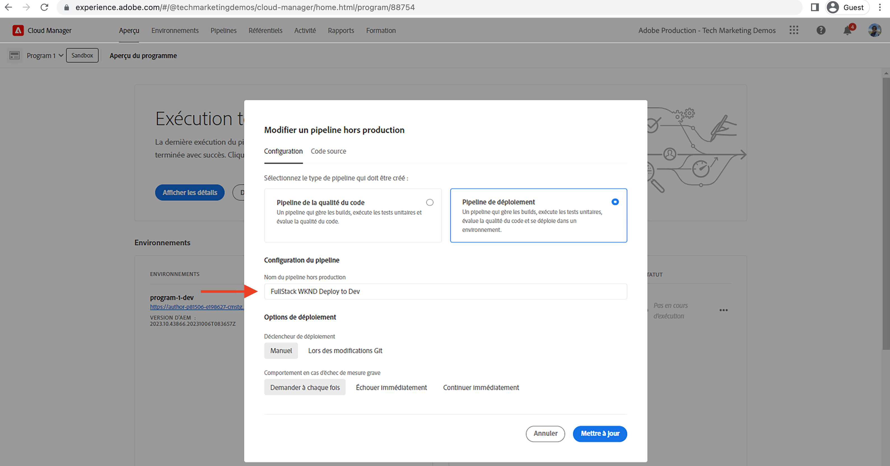
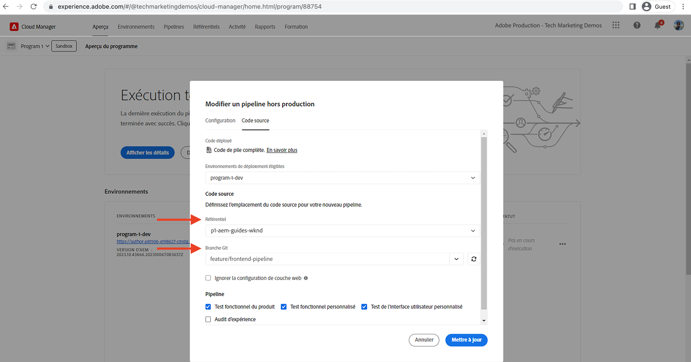
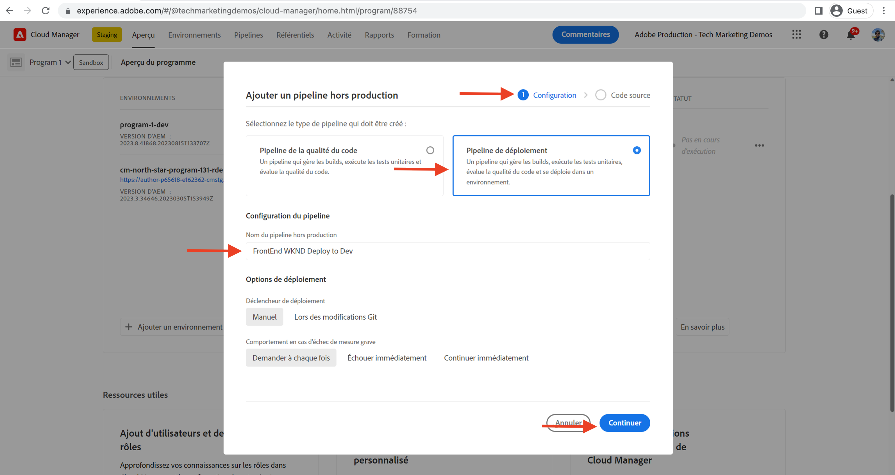

# Déployer à l’aide du pipeline front-end

Dans ce chapitre, nous allons créer et exécuter un pipeline front-end dans Adobe Cloud Manager. Cette opération crée uniquement les fichiers à partir du module `ui.frontend` et les déploie sur le réseau CDN intégré dans AEM as a Cloud Service. Cette opération s’éloigne ainsi de la diffusion front-end des ressources basée sur `/etc.clientlibs`.

## Objectifs {#objectives}

* Créer et exécuter un pipeline front-end.
* Vérifier que les ressources front-end ne sont PAS diffusées à partir de `/etc.clientlibs` mais à partir d’un nouveau nom d’hôte commençant par `https://static-`.

## Utiliser le pipeline front-end

>[!VIDEO](https://video.tv.adobe.com/v/3409420?quality=12&learn=on)

## Prérequis {#prerequisites}

Ce tutoriel en plusieurs parties suppose que les étapes décrites dans la section [Mettre à jour le projet AEM standard](./update-project.md) ont été terminées.

Vérifiez que vous avez les [autorisations de création et de déploiement de pipelines dans Cloud Manager](https://experienceleague.adobe.com/docs/experience-manager-cloud-manager/content/requirements/users-and-roles.html?lang=fr#role-definitions) et l’[accès à un environnement AEM as a Cloud Service](https://experienceleague.adobe.com/docs/experience-manager-cloud-service/content/implementing/using-cloud-manager/manage-environments.html?lang=fr).

## Renommer le pipeline existant

Renommez le pipeline existant en remplaçant __Déployer vers l’environnement de développement__ par __Déployer WKND FullStack vers l’environnement de développement__ en accédant au champ __Nom du pipeline hors production__ de l’onglet __Configuration__. Vous indiquez ainsi clairement si un pipeline est full-stack ou front-end en examinant simplement son nom.

Toujours dans l’onglet __Code source__, assurez-vous que les valeurs des champs Référentiel et Branche Git sont correctes et que la branche comporte vos modifications du contrat de pipeline front-end.

## Créer un pipeline front-end

Afin de créer et déployer les ressources front-end __UNIQUEMENT__ à partir du module `ui.frontend`, effectuez les étapes suivantes :

1. Dans l’interface utilisateur de Cloud Manager, dans la section __Pipelines__, cliquez sur le bouton __Ajouter__, puis sélectionnez __Ajouter un pipeline hors production__ (ou __Ajouter un pipeline de production__) en fonction de l’environnement AEM as a Cloud Service sur lequel vous souhaitez effectuer le déploiement.

1. Dans la boîte de dialogue __Ajouter un pipeline hors production__, dans le cadre des étapes de __configuration__, sélectionnez l’option __Pipeline de déploiement__, donnez-lui le nom __Déployer WKND FrontEnd vers l’environnement de développement__, puis cliquez sur __Continuer__.

1. Dans le cadre des étapes du __code source__, sélectionnez l’option __Code front-end__ et sélectionnez l’environnement à partir d’__Environnements de déploiement éligibles__. Dans la section __Code source__, assurez-vous que les valeurs des champs Référentiel et Branche Git sont correctes et que la branche comporte vos modifications du contrat de pipeline front-end.
Vérifiez __surtout__ que la valeur du champ __Emplacement du code__ est `/ui.frontend`. Enfin, cliquez sur __Enregistrer__.

## Séquence de déploiement

* Exécutez d’abord le pipeline __Déployer WKND FullStack vers l’environnement de développement__ dont vous avez changé le nom, afin de supprimer les fichiers clientlib WKND du référentiel AEM. Et surtout, préparez AEM pour le contrat de pipeline front-end en ajoutant les fichiers de __Configuration Sling__ (`SiteConfig`, `HtmlPageItemsConfig`).

>[!WARNING]
>
>Après avoir terminé le pipeline __Déployer WKND FullStack vers l’environnement de développement__, vous obtenez un site WKND __sans style__, dont la présentation peut sembler incorrecte. Planifiez une coupure ou un déploiement pendant les heures creuses. Cette interruption unique à prévoir permettra de changer le pipeline full-stack en pipeline front-end.

* Enfin, exécutez le pipeline __Déployer WKND FrontEnd vers l’environnement de développement__, afin de ne créer que le module `ui.frontend` et de déployer les ressources front-end directement sur le réseau CDN.

>[!IMPORTANT]
>
>Notez que le site WKND __sans style__ est revenu à la normale. Cette fois, l’exécution du pipeline __front-end__ est beaucoup plus rapide que celle du pipeline full-stack.

## Vérifier les changements de style et le nouveau paradigme de diffusion

* Ouvrez n’importe quelle page du site WKND. La couleur du texte est __rouge Adobe__ et les fichiers de ressources front-end (CSS, JS) sont diffusés à partir du réseau CDN. Le nom d’hôte de la requête de ressource commence par `https://static-pXX-eYY.p123-e456.adobeaemcloud.com/$HASH_VALUE$/theme/site.css`, de même que le site.js ou toute autre ressource statique référencée dans le fichier `HtmlPageItemsConfig`.

>[!TIP]
>
>La `$HASH_VALUE$` est ici identique à ce que vous voyez dans le pipeline __Déployer WKND FrontEnd vers l’environnement de développement__, dans le champ __HACHAGE DU CONTENU__. AEM est informé de l’URL de réseau CDN de la ressource front-end et la valeur est stockée dans `/conf/wknd/sling:configs/com.adobe.cq.wcm.core.components.config.HtmlPageItemsConfig/jcr:content`, sous la propriété __prefixPath__.

## Félicitations. {#congratulations}

Félicitations, vous avez créé, exécuté et vérifié le pipeline front-end qui crée et déploie uniquement le module « ui.frontend » du projet Sites WKND. Désormais, votre équipe front-end peut rapidement itérer sur la conception du site et son comportement front-end, en dehors du cycle de vie complet du projet AEM.

## Étapes suivantes {#next-steps}

Le chapitre suivant, [Considérations](considerations.md), examine l’impact sur le processus de développement front-end et back-end.
